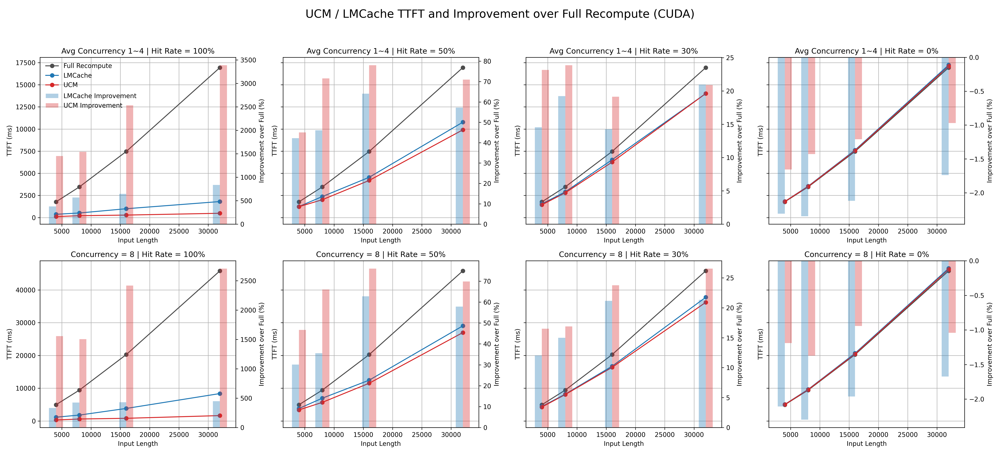
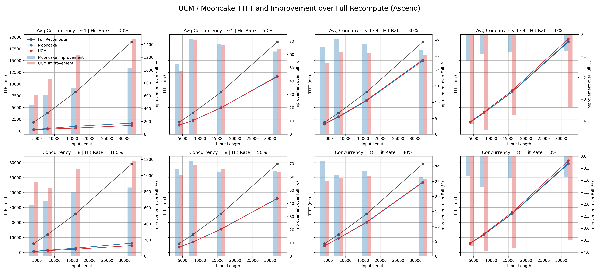

# UCM (Unified Cache Management) vs LMCache/KV Cache Pool：多层级KV-Cache卸载方案全面对比评测

Prefix Caching（前缀缓存） 是当下大模型推理优化的核心技术，其本质是对重复计算的记忆与复用。在自回归生成过程中，模型会将已处理token的Key-Value（KV）状态缓存在GPU显存中。当新请求包含与历史请求相同的前缀（如多轮对话的上下文、RAG检索返回的文档、代码仓库的多文件分析）时，系统可直接复用缓存的KV状态，跳过冗余的Prefill计算，将首token响应时间（TTFT）从秒级降至毫秒级。

然而，这一技术在实践中面临两大根本性挑战：
- 容量陷阱：以QwQ-32B模型为例，单张H20 GPU仅能提供约20万token的KV-Cache空间。当并发用户增多或上下文长度增加时，显存迅速耗尽，缓存命中率从100%断崖式跌至0%，TTFT反弹回冷启动水平，用户体验剧烈抖动。
- 持久化能力缺失：GPU显存作为缓存层缺乏持久性。服务重启、节点故障、新请求抢占都会导致精心构建的缓存被瞬间清空，引发周期性的"冷启动风暴"。

正是这些痛点催生了多层级KV-Cache卸载的架构革命——将缓存从昂贵的GPU显存（L1）扩展至CPU内存（L2）、本地SSD（L3）乃至远端存储（L4），实现存储与计算的解耦。本文将通过三大实测场景，系统对比原生HBM、KV Cache Pool与UCM/LMCache中心化架构在容量、性能、扩展性与成本维度的优劣，揭示为何UCM是当前唯一能同时满足CUDA/昇腾双平台、本地/分布式双场景的统一缓存管理方案。

## 0. 复现实验脚本用法

本文中的长文档 Prefix Caching 测试使用脚本 `benchmarks/long_doc_pc_completion.py` 完成。脚本通过 OpenAI-compatible `completions` 接口向推理服务发起请求，自动执行两轮 warmup、写入阶段、等待缓存持久化以及命中查询阶段，并将结果写入 CSV 文件。

### 0.1 前置条件

- 先启动待测推理服务，并确认服务暴露 `http://localhost:<port>/v1/completions` 接口。
- `--model` 需要与服务端可识别的模型名或模型路径一致。
- 建议在 `benchmarks` 目录下执行脚本，便于统一收集输出文件。
- 依赖安装：

```bash
python3 -m pip install openai
```

### 0.2 基线测试：完全重算

`no-pc` 模式用于获取裸推基线 TTFT：

```bash
cd benchmarks
python3 long_doc_pc_completion.py \
  --test-mode no-pc \
  --doc-len-list 4000 8000 16000 32000 \
  --concurrency-list 1 2 4 8 \
  --port 18081 \
  --model /home/models/QwQ-32B \
  --repeat 1
```

### 0.3 Prefix Caching 测试

`pc` 模式会先写入缓存，再按指定命中率发起查询请求。以下命令给出 50% 命中率示例：

```bash
cd benchmarks
python3 long_doc_pc_completion.py \
  --test-mode pc \
  --doc-len-list 4000 8000 16000 32000 \
  --concurrency-list 1 2 4 8 \
  --hit-ratio 0.5 \
  --port 18082 \
  --model /home/models/QwQ-32B \
  --repeat 1
```

如果需要复现文中的多组命中率对比，可分别将 `--hit-ratio` 设为 `1.0`、`0.5`、`0.3` 和 `0.0`。

### 0.4 输出结果

- `benchmark.log`：记录每轮 warmup 和每组参数组合的执行日志。
- `prefix_cache_benchmark.csv`：记录每组参数的平均 TTFT。
- `no-pc` 模式输出完全重算 TTFT。
- `pc` 模式输出写入阶段 TTFT 和命中查询阶段 TTFT。

快速上手命令与参数说明也可参考同目录下的 `README.md`。

## 1. 场景1：原生HBM Prefix Caching的容量陷阱

### 1.1 测试环境
- **硬件**：H20(96GB)×2
- **模型配置**：QwQ-32B tp=2, GPU utilization=0.87
- **软件框架**：vLLM v0.11.0
- **配置**：tp=2, GPU utilization=0.87

### 1.2 HBM容量观测
根据vLLM启动日志，GPU侧仅能提供 **≈400k tokens** 的KV-Cache空间：
```
Available KV cache memory: 48.65 GiB / 49.18 GiB
GPU KV cache size: 398,464 tokens / 402,816 tokens
Maximum concurrency for 38,000 tokens: 10.48x / 10.60x
```
这意味着在36k token长度的请求下，**理论并发上限仅约11个**。

### 1.3 驱逐现象验证
采用 **"冷启动→热复用→新请求抢占→原请求回退"** 四段式压测：

| 阶段 | 请求内容 | 预期命中率 | 实际TTFT |
|---|---|---|---|
| ① 首次写入 | 文档集A×11 | 0% | **12,439.95 ms** |
| ② 原地复用 | 文档集A×11（与①重复） | 100% | **104.09 ms** (↓99%) |
| ③ 新请求抢占 | 文档集B×11 | 0% | **11,781.80 ms** |
| ④ 原请求回退 | 文档集A×11（与①重复） | **0% (已驱逐)** | **11,777.59 ms** |

**说明**：
- **文档集A/B**：分别由不同的随机种子生成的36k token文档集合，**每个集合含11条独立请求**
- 阶段①持续发送11条请求将GPU KV-Cache完全占满
- 阶段④的TTFT回到阶段①水平，证明缓存已被**完全驱逐**，容量瓶颈生效

**结论**：当并发数>11时，GPU KV-Cache开始触顶，系统持续驱逐最久未使用的缓存，命中率从100%逐渐下降。当新请求完全占满缓存空间后，原有请求的KV-Cache被完全驱逐，命中率最终归零，TTFT回归冷启动水平。在多用户长文档问答、多轮对话等真实场景中，**用户体验将断崖式下跌**。

---

## 2. 现有解决方案架构分析

### 2.1 KV Cache Pool方案（以Mooncake为代表）

KV Cache Pool通过在多个计算节点中共享**池化DRAM**来扩展KV-Cache容量，相比原生HBM容量有明显提升，同时保持了较高的kv cache读写速度，但仍存在根本性问题：

- **容量天花板**：计算与存储紧耦合，受限于单节点/集群的DRAM总量，无法独立扩展存储层。
- **持久化缺失**：在vLLM Ascend生态中，KV Cache Pool仅支持DRAM池化，不支持SSD持久化存储，而纯DRAM方案不具备生产级系统所需的可靠性。服务重启、节点故障会导致缓存丢失，冷启动风暴频发。

### 2.2 中心化存储架构（LMCache & UCM）

LMCache与UCM采用**分层缓存设计**：在每个节点上使用DRAM作为缓存层，将持久化的本地盘SSD作为主存储层，具有以下特点：

- **存储计算解耦**：KV-Cache作为独立对象存储于文件系统（SSD/NFS/3FS），计算节点通过高速连接器访问，两者可独立扩缩容。
- **原生持久化**：缓存对象即文件，天然继承存储系统的可靠性、快照、跨可用区复制等能力。
- **生态支持**：LMCache聚焦CUDA生态，UCM在此基础上扩展**Ascend官方支持**。特别地，相比LMCache，UCM通过原生支持DeepSeek 3FS等分布式文件系统，可将KV-Cache容量大幅度扩展。

### 2.3 架构对比总结

| 特性 | KV Cache Pool | LMCache  | **UCM** |
|---|---|---|---|
| **存储介质** | DRAM池 | SSD/NFS | SSD/NFS/**3FS** |
| **扩展性** | 与算力绑定 | **存储独立扩展** | **存储独立扩展** |
| **持久化** | 不支持 | **支持**  | **支持** |
| **平台支持** | Ascend官方方案，无SSD支持 | CUDA官方方案 | **Ascend官方方案+CUDA支持** |

---

## 3. 场景2：CUDA平台UCM vs LMCache

### 3.1 测试方案设计
选取 **4k/8k/16k/32k** 四档请求长度，**100%/50%/30%/0%**以及**1~4 / 8** 的低并发和高并发场景，系统性评估 KV-Cache 复用机制在不同负载条件下对首 Token 延迟（TTFT）的影响。

**存储后端说明**：UCM与LMCache均配置为本地SSD后端
### 3.2 测试环境
- **硬件**：H20(96GB)×2，7TB NVMe SSD×1
- **模型配置**：QwQ-32B tp=2, GPU utilization=0.87
- **软件框架**：vLLM v0.11.0 + UCM v0.2.0rc1/LMCache v0.3.12


### 3.3 测试结果（UCM/LMCache VS 完全重算）


**图 1**：CUDA 平台下 UCM 与 LMCache 在不同输入长度（4k / 8k / 16k / 32k）、
不同并发（1~4 / 8）及不同缓存命中率（100% / 50% / 30% / 0%）条件下的
TTFT 表现与相对裸推性能提升。

### 3.4 结果分析（CUDA 平台，UCM vs LMCache）

基于 CUDA 平台在不同输入长度（4k–32k）、并发规模（1–4 / 8）以及缓存命中率
（100% / 50% / 30% / 0%）下的实测结果，
本文对 UCM 与 LMCache 在 TTFT（Time To First Token）维度上的性能差异进行系统分析。

需要说明的是，本文中的命中率用于刻画 KV Cache 的读写比例：
其中 100% 表示纯 KV Cache 读取路径，
0% 表示纯 KV Cache 写入路径，
而 50% 与 30% 分别对应高复用和中低复用的混合负载场景。

---
####  1. 性能分析
从不同输入长度（4k–32k）、并发规模（1–4 / 8）以及 KV Cache 命中率
（100% / 50% / 30% / 0%）的整体测试结果来看，
UCM 在 CUDA 平台上相较 LMCache 展现出稳定且一致的性能优势。

在 100% 命中率（纯 KV Cache 读取）条件下，
UCM 在所有输入长度与并发配置中均显著优于 LMCache。
无论在低并发还是高并发场景中，
UCM 的 TTFT 均明显低于 LMCache，
且该优势随着上下文长度的增加呈现持续放大趋势。
从相对裸推的改善幅度来看，
LMCache 在该场景下可实现约 **300%–800%** 的 TTFT 提升，
而 UCM 在长上下文（16k / 32k）条件下可进一步提升至 **1500%–3400%**，
表明 UCM 在 CUDA 平台上的 KV Cache 索引、调度与数据读取路径
具备更高的执行效率，
尤其适用于长上下文、高复用率的推理负载。

当命中率降低至 50%（高复用混合负载）时，
UCM 依然在大多数测试配置中保持领先。
在 1–4 并发场景下，
UCM 相较 LMCache 的 TTFT 优势通常维持在 **5%–15%** 区间；
在并发为 8 的情况下，两者性能差距有所收敛，
但 UCM 仍保持稳定的正向收益。
这表明在读写混合但仍以读取为主的负载条件下，
UCM 能够有效平衡缓存复用收益与写入开销，
其性能优势具有良好的稳定性。

在 30% 命中率（中低复用混合负载）条件下，
UCM 与 LMCache 的 TTFT 曲线进一步接近，
整体性能差异明显缩小。
尽管如此，UCM 在大多数输入长度与并发配置中仍保持轻微领先，
整体改善幅度通常高出 LMCache **3%–8%**。
这一结果表明，当缓存复用比例进一步降低时，
系统整体性能逐步由计算与调度路径主导，
缓存系统之间的差异被部分削弱，但并未完全消失。

在 0% 命中率（纯 KV Cache 写入）这一极端场景下，
UCM 与 LMCache 的 TTFT 表现均与裸推非常接近，
相较裸推存在约 **1%–2%** 的轻微负向波动。
从整体趋势可以观察到，
UCM 在多数测试配置中的写入路径延迟略低于 LMCache，
表明其 KV Cache 写入机制并未引入额外显著开销，
写性能整体优于 LMCache。

综合来看，
UCM 在 CUDA 平台上的性能优势主要体现在
纯读取与高复用混合负载场景，
并在长上下文和中高并发条件下进一步放大。
随着命中率降低，两者性能差距逐步收敛，
但在所有测试配置下，
UCM 均能展现出优于 LMCache 的 TTFT 表现，
这一趋势与其在纯读取与纯写入场景中的测试结果保持一致，
即 UCM 在 KV Cache 的读写路径上均具备更高的整体效率。

---

####  2. 架构价值与工程意义

除了性能层面的优势外，
UCM 的另一核心竞争力在于其**对分布式存储后端的针对性优化支持**，
包括 3FS/A800 等高性能分布式存储系统。
该设计为企业级部署提供了百 TB 级的水平扩展能力，
突破了 LMCache 主要依赖本地存储所带来的容量与弹性限制。

**总体而言**，UCM 不仅在 CUDA 平台上在多种负载条件下展现出稳定且可观的性能优势，
同时也在系统架构层面为大规模、高并发的大模型推理场景提供了更具扩展性的解决方案。


---

## 4. 场景3：Ascend平台UCM vs Mooncake Store

### 4.1 测试方案设计
在 **Atlas 910B3×2** 上，采用与CUDA平台完全相同的测试矩阵：**4k/8k/16k/32k** 上下文长度 × **1/2/4/8** 并发，对比两种方案在不同命中率压力下的表现。

**存储后端说明**：UCM采用本地SSD后端，Mooncake采用池化dram后端。

### 4.2 测试环境
- **硬件**：Atlas 910B3(80GB)×2，7TB NVMe SSD×1
- **模型配置**：QwQ-32B tp=2, GPU utilization=0.87
- **软件框架**：vLLM 0.12.0 + vLLM Ascend 0.12.0rc1 + UCM v0.2.0rc1/Mooncake v0.3.7.post2

### 4.3 性能对比（UCM / Mooncake Store VS 完全重算）


**图 2**：ASCEND 平台下 UCM 与 Mooncake 在不同输入长度（4k / 8k / 16k / 32k）、
不同并发（1~4 / 8）及不同缓存命中率（100% / 50% / 30% / 0%）条件下的
TTFT 表现与相对裸推性能提升。


---

### 4.4 结果分析

Ascend 平台的实测数据反映了 UCM 与基于 DRAM 池化方案（如 Mooncake）在存储介质选择与工程侧重点上的差异：

#### 1. 性能分析

从 TTFT 的整体趋势来看，
UCM 与 Mooncake 在 Ascend 平台上的性能表现呈现出明显的分层特征。

在 **100% 命中率（纯 KV Cache 读取）** 场景下，
UCM 在所有输入长度与并发配置中均显著优于 Mooncake，
且该优势随着上下文长度的增加进一步放大。
这表明 UCM 在 Ascend 平台上的 KV Cache 读取路径
具备更高的执行效率，
并未因采用 SSD 或分布式存储后端而引入性能瓶颈。

在 **50% 与 30% 命中率** 的混合负载场景中，
UCM 与 Mooncake 的 TTFT 表现整体处于同一数量级，
两者差距明显收敛。
在部分测试点上，UCM 的性能略低于 Mooncake，
但整体波动较小，未观察到系统性的性能退化。

在 **0% 命中率（纯 KV Cache 写入）** 场景下，
两种方案的 TTFT 均与裸推结果高度接近，
整体表现主要由计算与调度路径主导。
在该极端写入负载下，
UCM 的 TTFT 相比 Mooncake 存在小幅劣势，
这一差异主要来源于底层存储介质差异及写入路径的额外工程开销，
但幅度整体可控，未对系统稳定性造成实质影响。

综合来看，
UCM 在 Ascend 平台上的性能特征可概括为：
**纯读取场景明显占优，混合负载场景整体持平，
纯写入场景略逊于基于 DRAM 的方案。**

---
#### 2. UCM 的工程化优势

Mooncake 方案基于 DRAM 池化，虽然具备内存级的读写速度，
但在大规模生产环境中存在明显的物理与工程限制；
UCM 则通过不同的架构选型系统性地解决了这些问题：

* **原生持久化能力**：
    * **Mooncake**：纯 DRAM 方案，服务重启后缓存即清空，需要重新进行昂贵的预热过程。
    * **UCM**：基于 SSD / NFS 的持久化存储设计，服务升级或异常重启后缓存数据可直接复用，显著提升系统可用性与业务连续性。

* **突破容量天花板**：
    * **Mooncake**：受限于单节点 DRAM 容量（通常 < 2TB），难以支撑超大规模 KV Cache 需求。
    * **UCM**：可通过扩展 SSD 或分布式存储（如 3FS）轻松支持 **100TB+** 级别的缓存规模，是超长上下文与大规模 RAG 场景的可行技术路径。

* **显著的成本优势**：
    * 在相同存储容量条件下，SSD 的单位成本通常仅为 DRAM 的约 **1/10**，
      使 UCM 在支撑大规模业务时具备数量级上的成本优势。

**总体而言**：
在 Ascend 场景下，
UCM 在 **纯 KV Cache 读取路径上展现出明确的性能优势**，
在混合负载条件下与 DRAM 方案整体持平。
结合其在容量扩展性、持久化能力与成本控制方面的显著工程优势，
UCM 更适合作为面向大规模生产部署和超长上下文推理场景的工程化 KV Cache 解决方案。

---

## 5. 综合结论

基于 CUDA 与 Ascend 两个平台在不同上下文长度、并发规模及 KV Cache 命中率条件下的系统性测试结果，可以得出如下综合结论。

**在性能层面**，UCM 在两大平台上的表现具有高度一致性：  
在 CUDA 平台，UCM 在纯读取、高复用及中低复用等所有场景下均稳定优于 LMCache；  
在 Ascend 平台，UCM 在纯 KV Cache 读取场景下明显领先，在混合负载场景下整体持平，在纯写入场景下存在小幅性能劣势，但影响可控。

**在工程与架构层面**，UCM 通过对 SSD 与分布式存储后端（如 3FS）的原生支持，突破了传统 DRAM 缓存方案在容量、持久化与成本方面的系统性限制，使 KV Cache 具备百 TB 级扩展能力，并显著降低大规模部署成本。

**在跨平台一致性方面**，UCM 是目前少数能够在 CUDA 与 Ascend 平台上维持统一架构与一致语义的 Prefix Caching 方案，避免了多平台环境中维护多套缓存系统所带来的工程复杂度与技术债务。

**综上所述**，UCM 在性能、扩展性、成本与运维复杂度之间实现了更优的整体平衡，对于需要支撑长上下文高并发、关注规模化部署成本、追求跨平台一致性的企业级用户，UCM是当前无可争议的首选。
