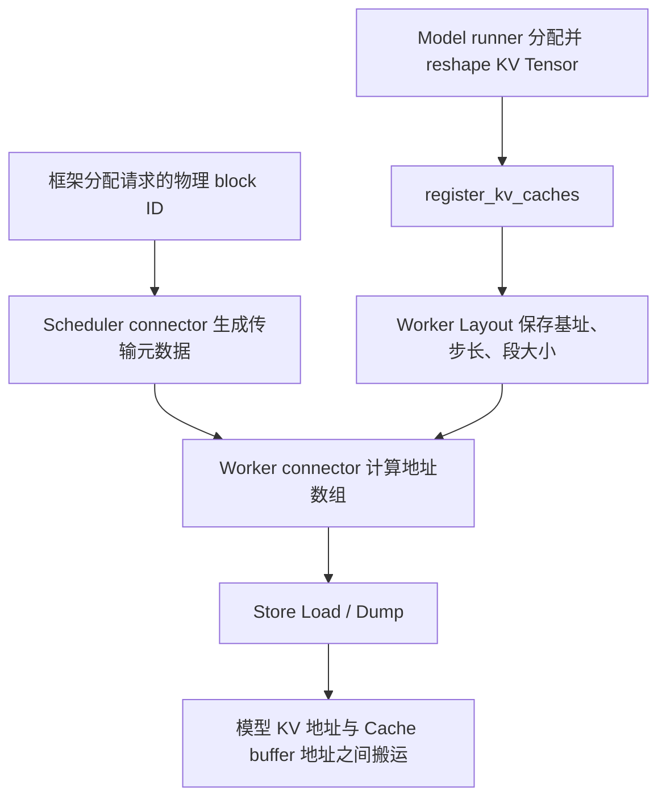

# UCM Connector：Device KV 地址来源与模型、平台布局

基于本地 `lzx/feature-a5@3bf8dec4`，参考本地 `vllm-0.23.0/`、`vllm-ascend-0.23.0/` 源码。本文是静态代码梳理，没有进行 GPU/NPU 运行验证。分支包含较新版本的模型适配；这些适配以分支代码为准，不表示 0.23.0 原生包含所有模型。

## 1. 内存归属与职责

模型 KV 的 device 内存由推理框架分配。UCM connector 接收已分配的 Tensor，解析布局，结合请求的物理 block ID 计算本次搬运地址。CacheStore 接收这些地址，并分配、查找自己的缓存槽位，执行搬运。

| 对象 | 谁提供/管理 | 用途 |
|---|---|---|
| 模型 KV Tensor 的 GPU/NPU allocation | vLLM / vLLM Ascend model runner | attention 计算使用的 KV/state 内存 |
| 请求使用的物理 block ID | 框架 KV cache manager，经 scheduler 元数据传递 | 选择 Tensor 中的页 |
| UCM 内容 block ID/hash | connector 的请求 hash 逻辑 | 查找外部缓存内容，不是 device 地址 |
| 本次传输的 device 地址数组 | worker connector 的 Layout | 指向模型 KV 页中的各个连续字节段 |
| CacheStore buffer 槽位 | CacheStore Buffer/DataStrategy | 承载缓存内容与后端传输 |

“分配 KV 池”和“给请求分配 block”是两个阶段：初始化先建大块 Tensor，运行时再分配池里的页编号。通常不会为每个请求重新分配整块 device Tensor。



## 2. 初始化与每次传输的调用链

### 初始化

vLLM GPU runner 的 `_allocate_kv_cache_tensors()` 用 `torch.zeros(..., dtype=int8, device=self.device)` 分配原始缓冲区；`_reshape_kv_cache_tensors()` 根据 backend、KVCacheSpec、dtype、stride order 构造实际视图，再调用 `register_kv_caches(kv_caches)`。

Ascend runner 也经过 allocation、reshape、register；它对 K/V、MLA、量化 scale、混合缓存有自己的切片和布局逻辑。因此不能仅根据模型名或 `get_kv_cache_shape()` 的返回值判断最终传给 connector 的对象，必须看 runner 最后生成的 Tensor/tuple。

普通 connector 的注册过程：

```text
UCMConnector.register_kv_caches()
  -> 实际 connector.register_kv_caches()
  -> 选择 KVCacheLayout / SharedIndexerKVCacheLayout / MiniMaxM3KVCacheLayout
  -> 保存 base_ptrs、block_stride_lists、tensor_size_lists、buffer_sizes
  -> 创建 Store，配置 tensor_size_list、shard_size、block_size、device_id
```

HLA、FAWA connector 分别有自己的注册与 layout 构造过程。

普通路径还向 Store 配置 `gpu_kv_buffer_addrs/sizes`，用于描述完整 device buffer 范围；它们与每次请求传入的 block 地址数组是两个层次。字段名包含 `gpu`，不代表只适用于 CUDA。不要据此推断 Cache2 一定使用这些注册信息；Cache2 的搬运直接消费 task 地址。

### 每次传输

普通 scheduler connector 的 `build_connector_meta()` 从 `SchedulerOutput` 取得请求的 block IDs，生成：

```text
load_block_ids = (ucm_content_hashes, vllm_physical_block_ids)
dump_block_ids = (ucm_content_hashes, vllm_physical_block_ids)
```

worker 的 `extract_block_addrs()` 将物理 block IDs 转为地址；经过 `RankConsistencyManager.submit_load/submit_dump` 调用 Store 的 Python 接口：

```text
load_data(block_ids, shard_index, dst_addr)
dump_data(block_ids, shard_index, src_addr, prerequisite_handle)
  -> pipeline/connector.py
  -> pipeline_store.py.cc::MakeTaskDesc()
  -> Shard { owner = 内容 hash, index = shard index, addrs = device 地址数组 }
  -> Store::Load / Dump
```

这里 `Shard.owner` 是内容 ID，不是分配 DRAM 的 rank；不能将它与 Cache2 数据区的内存 owner 混为一谈。

## 3. 地址公式与 Store 的契约

对一个连续传输段 j：

```text
device_addr(b, j) = base_ptr[j] + physical_block_id[b] * block_stride[j]
copy_bytes(j)     = tensor_size_list[j]
```

必须区分：

- `block_stride`：在 device 内存中，从这页的段起点走到下一页同段起点的距离。
- `copy_size`：本次真正复制的连续字节数。
- `shard_size`：Store 给一个 shard 的存储空间，可能包含对齐或语义占位。

三者不必相等。Store 的 `addrs[j] + tensor_size_list[j]` 描述的是连续字节段；Store 不接收 Tensor shape/stride，也不会自动遍历任意非连续 Tensor。

普通 `KVCacheLayout` 按 `prod(shape[1:]) * element_size` 计算每页字节数，并令 block stride 等于该值，依赖页紧密排列的布局假设。它不是任意 strided Tensor 的通用适配器。HMA 的 group layout 则明确读取 `t.stride(0) * element_size`。

举例，K/V 分开存储，每段每页 4096 字节，要保存物理 block 7：

```text
device addrs = [K_base + 7*4096, V_base + 7*4096]
sizes        = [4096, 4096]
cache slot   = [该页 K 的 4096B][该页 V 的 4096B]
```

以后相同内容恢复到物理 block 23，UCM hash 可以相同，地址则改为 `K_base + 23*4096` 和 `V_base + 23*4096`。

## 4. 模型与平台布局

下面的 shape 表示已注册给 connector 的典型对象。具体后端、版本、量化设置仍需核对实际 shape/stride。

| 布局类型 | CUDA / vLLM | NPU / vLLM Ascend | UCM 的处理 |
|---|---|---|---|
| 普通 MHA/GQA，例如常规 Llama/Qwen attention | 旧式 K/V-first `[2,N,...]`，或 block-first `[N,2,...]` | 常见 `(K,V)`，每个分量 block-first | `KVCacheLayout`：前者拆 K/V，block-first 完整页作为一段，tuple 逐分量处理 |
| MLA，例如 DeepSeek MLA 类布局 | 常见 `[N,B,D]` 的压缩 KV 页；可包含打包内容 | 可用多个 block-first 分量表示 latent KV、RoPE 等 | 通用 layout 复制注册的真实分量；不能机械理解为完整 K 和 V |
| checkpoint 共享 indexer | attention 与独立 indexer 条目；部分层无独立 indexer | SFA 分量，加 BF16/C8 indexer，可另有 scale | `SharedIndexerKVCacheLayout` 按语义角色组装固定列数的层矩阵 |
| MiniMax M3 | attention 为一块 block-first 页；indexer 独立 | attention 为 `(K,V)`，indexer 可为单元素 tuple | `MiniMaxM3KVCacheLayout`：CUDA attention 一段，Ascend 两段；按需加 indexer |
| full attention + 线性注意力状态，例如符合该分支 HLA 条件的 Qwen 混合布局 | 同一 raw allocation 的每个物理页连续 | shared raw allocation 可能按 component-major 存储 | `HybridLinearAttentionLayout` 按实际 raw tensor row 建布局 |
| FA + WA 多 KV group，包括代码中的压缩 MLA 场景 | 每组可以有独立 block 大小和 Tensor 布局 | 同样按组处理，可能存在逻辑 token 数与物理存储 token 数比例 | `KVCacheGroupLayout` + `UCMFAWAConnector` 按组、页内 offset 计算地址 |

### 普通 KV：K/V-first 与 block-first

```text
K/V-first: [K0 K1 K2 ...][V0 V1 V2 ...]
block-first: [K0 V0][K1 V1][K2 V2]...
```

第一种一个 block 通常要两个地址；第二种若页内连续，可以一个地址复制整页。相同模型、相同 token block 大小，在两个后端上也可能产生不同的地址列数。

### 共享 indexer 与量化

`SharedIndexerKVCacheLayout.supports()` 检查 layerwise 模式、平台以及配置的 `indexer_types` 中是否存在 `shared`。

缺失独立 indexer 的层使用 ghost segment：

```text
base_ptr = 0
block_stride = 0
copy_size = 同列真实 indexer 的大小
buffer_size = 0
```

这不会创建新的 device allocation。所有 block 的该列地址始终为零，copy stream 跳过复制，但仍推进缓存槽位中的段 offset，保持每层 schema 一致。

Ascend 还兼容两种注册方式：旧版把 indexer/scale 接在 attention tuple 后，新版以独立 indexer 条目注册。它按角色排序，避免依赖字典插入顺序。

混合 BF16/C8 indexer 是 `copy_size != block_stride` 的直接例子：BF16 页可拆成两个 C8 大小的传输段，两个段都按完整 BF16 页大小前进。C8 层的第二个数据段为空，占位后再放 scale。这是字节分段，不是在 Store 中做量化转换。

MiniMax M3 单独适配：dense 层没有 indexer，layerwise 用 ghost 占位；direct 只展开真实段。其模型适配明确假设暴露的页紧密排列，不负责其他混合模型的 padded page。

### HLA：raw allocation 共享比“每层 K/V”更重要

选择条件涉及同一 `kv_cache_tensor.shared_by` 中同时出现 FullAttentionSpec 和 `mamba_cache_mode=align` 的 MambaSpec，而不是硬编码某个模型名。

CUDA 路径将一个 raw page 作为一个段：`page_size = raw_tensor.size / num_blocks`。

Ascend 混合路径按三个物理区段描述：

```text
[所有 block 的 conv/padding]
[所有 block 的 K/SSM]
[所有 block 的 V/padding]
```

每个区段的基址、单 block 大小不同，因此一个 block 需要三个地址。Layout 用 raw tensor 的 `shared_by` 把多个逻辑 layer 映射到同一个 row，layerwise 调度也按 row 处理。不能总将一个 store shard 等同于一个逻辑模型 layer。

### FAWA：group 与页内 token offset

group layout 保存每个分量的真实 block stride、token stride、物理 token block 大小。其公式是：

```text
physical_offset = logical_offset * tensor_block_size // group_token_block_size
addr = base + block_id * block_stride + physical_offset * token_stride
```

FA 保存可复用前缀块；WA 保存前缀边界所需的尾部窗口状态，load 时恢复最终命中边界所需的状态。不能简单地将所有 group 共用一份物理 block ID 列表，或认为一个 UCM 内容块总对应一个框架页。

## 5. Direct、Layerwise 与并行 rank

- 普通 Direct：把各层真实段展开成一个地址向量，单次传整个逻辑内容块，shard index 通常为 0。
- 普通 Layerwise：保留 `[layer, block, segment]` 组织，逐层提交，shard index 使用 layer ID。
- HLA Layerwise：传输单位是 raw allocation row，通过 layer 到 row 的映射调度。
- FAWA：按 KV group 和边界语义组织两个 store，不能套普通逐层矩阵。

每个 worker/rank 注册自己的 Tensor，地址只在对应进程和 device 上解释。TP 的内容可能分片；普通非 MLA 路径会对非零 TP rank 的 store key 再做 rank 相关 hash。MLA 有共享内容和分担 dump 的策略，但这不表示各 rank 的 HBM 指针相同。

PP 的普通路径使用 layerwise；CP 还有自己的 block/chunk 映射。分析具体运行时应同时查看 parallel config、选中的 connector 类型及实际 KVCacheConfig。

## 6. Cache2 接收地址以后做什么

Cache2 `Store::Load/Dump` 将 TaskDesc 交给 TransManager。队列拿到 Cache buffer handle 后：

```text
Dump: device addrs[] --Gather--> cache slot 连续分段内容
Load: cache slot 连续分段内容 --Scatter--> device addrs[]
```

`CopyStream` 按 `tensorSizes_` 逐段搬运，段的 host offset 为前面所有 size 的累加。nullptr 段不复制，但依然占据相应 offset。Store 无需识别该段是 K、V、indexer、scale 或 SSM state。

A5 的特别之处：

- `DataStrategy` 使用 HAL 分配 `MEM_HOST_SIDE` 内存，由 Cache2 管理。
- 当前 rank 自有槽位 `HostAccessible()==true`，`Data()` 返回主机可访问地址，走 H2D/D2H。
- 导入的其他 rank 槽位 `HostAccessible()==false`，`DeviceData()` 返回该进程的 device 可访问映射，走 D2D gather/scatter。
- 因此 D2D 的一端仍可能是 DRAM 缓存映射；只有 task 的 `shard.addrs` 是 connector 提供的模型 KV 地址。

编译边界：此分支 `ucm/store/cache/CMakeLists.txt` 在 `ascend-a5` 选择 `cache/v2`，普通 CUDA/Ascend runtime 使用 `cache/cc`。上面的 connector 布局接口跨平台，但不能把所有平台的 CacheStore 实现都当成 Cache2。

## 7. 地址正确之外，还需要正确的时序

Dump 的地址必须指向已写完的 KV。Connector 获取计算流 event handle，随 dump 的 `prerequisite_handle` 传入；Cache2 DumpQueue 在搬运前 WaitEvent。不使用 event 同步时 connector 会先 synchronize。

Load 必须在 attention 消费目标 KV 前完成：direct 路径等待 load，layerwise 路径通过 `wait_for_layer_load()` 在相应层前等待。异步路径还需配合完成通知维护 block 生命周期。

因此模型适配有两条线：布局解析，以及计算 hook 的接入。分支里的 Kimi-K3、MiniMax M3、Ascend SFA 补丁分别处理自定义 forward 路径中的 wait/save 时机。仅能拿到地址并不意味着该模型的 layerwise 链路已经完整接通。

## 8. 源码阅读入口

以下行号对应上述提交，后续修改后可能漂移。UCM 路径相对于 `unified-cache-management/`。

| 入口 | 位置 |
|---|---|
| GPU 原始内存分配与注册 | `vllm-0.23.0/vllm/v1/worker/gpu_model_runner.py:6999,7340` |
| NPU 注册与分配 | `vllm-ascend-0.23.0/vllm_ascend/worker/model_runner_v1.py:3825,4023` |
| 普通 Tensor 解析 | `ucm/integration/vllm/ucm_connector.py:371` |
| 普通地址计算 | 同文件 `:506` |
| Shared indexer | 同文件 `:554` |
| MiniMax M3 | 同文件 `:994` |
| 注册与选择 layout | 同文件 `:1649` |
| Scheduler 元数据 | 同文件 `:1973` |
| Direct load 提交 | 同文件 `:2102` |
| Layerwise dump 提交 | 同文件 `:2518` |
| Connector 类型选择 | 同文件 `:3236` |
| HLA 物理布局 | `ucm/integration/vllm/hla_connector.py:415` |
| FAWA group 地址计算 | `ucm/integration/vllm/hma_connector.py:50,205` |
| Python Store 传输接口 | `ucm/store/pipeline/connector.py:153` |
| TaskDesc 构造 | `ucm/store/pipeline/cpy/pipeline_store.py.cc:120` |
| Cache2 Load scatter | `ucm/store/cache/v2/load_queue.h:299` |
| Cache2 Dump gather | `ucm/store/cache/v2/dump_queue.h:175` |
| 段复制与 nullptr 处理 | `ucm/store/cache/v2/copy_stream.h:68` 起 |
| 本地/peer DRAM 地址 | `ucm/store/cache/v2/data_strategy.cc:289` |
| 已有布局单测示例 | `test/suites/Unit/test_kv_cache_layout.py` |

排查具体模型时，先确认实际 connector 类型，再记录 `kv_caches` 每个条目的 name、shape、stride、dtype，以及 Layout 产出的 base/stride/copy size。最终核对同一地址向量与 Store 的 `tensor_size_list` 是否逐项一致。
