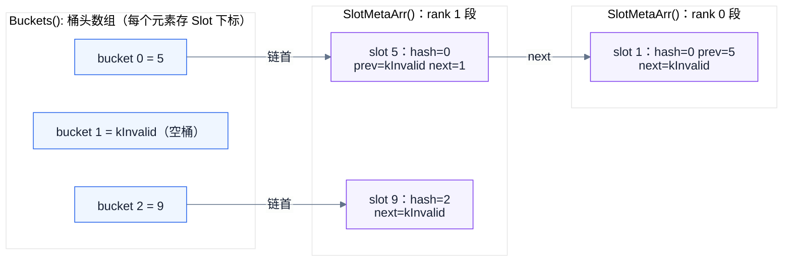

# A5 Cache2 控制区布局：Bucket 与 SlotMeta

本文说明 `feature_a5` 上 `ucm/store/cache/v2/` 控制区的内存布局，重点是 `Buckets()` 头数组与 `SlotMeta` 数组如何构成拉链哈希结构，以及 SlotMeta 如何挂到 Bucket 上。

**范围**：控制区的字节级布局、`SlotMeta` 字段与 cache line 划分、挂链 / 摘链、查找路径、初始化时序。

**不在范围**：数据区（`DataStrategy`）、Load / Dump 队列、CLOCK 淘汰策略、Bucket 条带锁的并发协议 —— 见 [A5 Cache2 控制面设计与验证说明](a5-cache2-control-review-walkthrough.md)。

> 与既有笔记的差异：控制面走查那篇基于 `codex/a5-cache-control`，代码路径为 `ucm/store/cache2/cc/`；`feature_a5` 上同一份实现已移动到 `ucm/store/cache/v2/`。本文链接固定到 `feature_a5@3bf8dec4`。

| 代码位置 | 职责 |
|---|---|
| [`ucm/store/cache/v2/ctrl_layout.h`](https://github.com/NaganooMei/unified-cache-management/blob/3bf8dec488663f4975ca7134a610ed58444569ce/ucm/store/cache/v2/ctrl_layout.h) | 定义控制区字节布局与 `SlotMeta`；提供 `Buckets()`、`LockOf()`、`SlotMetaArr()` 访问接口 |
| [`ucm/store/cache/v2/cache_buffer.h`](https://github.com/NaganooMei/unified-cache-management/blob/3bf8dec488663f4975ca7134a610ed58444569ce/ucm/store/cache/v2/cache_buffer.h) | 在共享布局上实现哈希定位、挂链 / 摘链、分配与淘汰 |
| [`ucm/store/cache/v2/ctrl_strategy.h`](https://github.com/NaganooMei/unified-cache-management/blob/3bf8dec488663f4975ca7134a610ed58444569ce/ucm/store/cache/v2/ctrl_strategy.h) | 创建 / 加入控制区，计算并校验布局参数 |

## 1. 控制区整体布局

控制区是单块连续内存（`ctrlMem_.Create("ucm_cache2_ctrl", totalSize)`，按 64B 对齐），从低地址到高地址依次是 Header、Bucket 头数组、Bucket 锁条带、SlotMeta 数组：

```text
                       CtrlStrategy::ctrlMem_  (memfd "ucm_cache2_ctrl")  64B 对齐
base_ ──► ┌───────────────────────────────────────────────────────────────────────────┐
          │ Header                                                                    │
          │   magic(u32)                                                              │
          │   rankCount / slotsPerRank / slotSize / bucketCount / lockStripeCount      │
          │   rankDescs[kMaxRanks = 128]   每个 rank 的数据区句柄（atomic<size_t>）      │
          │   clockHands[kMaxRanks = 128]  每个 rank 的 CLOCK 指针（atomic<size_t>）    │
          ├───────────────────────────────────────────────────────────────────────────┤
          │ Buckets():  atomic<size_t>[bucketCount]        ← 桶头数组，存 Slot 下标     │
          │             8 × bucketCount 字节                                           │
          ├───────────────────────────────────────────────────────────────────────────┤
          │ Locks():    BucketLock[lockStripeCount]        ← 桶锁条带（跨进程互斥）      │
          │             sizeof(pthread_mutex_t) × lockStripeCount 字节                 │
          ├───────────────────────────────────────────────────────────────────────────┤
          │ SlotMetaArr(): SlotMeta[slotCount]             ← 槽元数据（同时是链表节点）  │
          │             slotCount = rankCount × slotsPerRank                           │
          │   ┌────────────────┬────────────────┬───────────┬────────────────────┐    │
          │   │ rank 0 段       │ rank 1 段       │    ...    │ rank N-1 段         │    │
          │   │ slot [0, k)    │ slot [k, 2k)   │           │ slot [.., N*k)     │    │
          │   └────────────────┴────────────────┴───────────┴────────────────────┘    │
          └───────────────────────────────────────────────────────────────────────────┘
                                                                          ← TotalSize()
```

各段偏移由三个静态函数算出（`AlignUp` 向上取整到指定对齐）：

```text
BucketsOffset()        = AlignUp(sizeof(Header), 64)
LocksOffset(b)         = AlignUp(BucketsOffset() + sizeof(atomic<size_t>)*b, alignof(BucketLock))
SlotMetaOffset(b, l)   = AlignUp(LocksOffset(b)   + sizeof(BucketLock)*l,   alignof(SlotMeta))
TotalSize(b, l, s)     = SlotMetaOffset(b, l) + sizeof(SlotMeta)*s          (s = 槽总数)
```

要点：

- 四段之间只有对齐填充，没有指针字段，**全部用"数组基址 + 下标"寻址**。因此同一个 memfd 映射到不同进程的不同虚拟地址也能正常工作。
- `bucketCount` 由 `RecommendBucketCount(slotCount)` 取 `slotCount / 2` 向上取整到 2 的幂，且落在 `[2^10, 2^24]`；`lockStripeCount = min(bucketCount, 2^16)`。
- `SlotMeta` 自身 `alignof` 为 64，所以 `SlotMetaArr()` 的起始地址一定落在 64B 边界上，每个槽也不会跨 cache line 与相邻槽共享。

## 2. Bucket 头数组：存的是 Slot 下标

`Buckets()` 语义上就是拉链哈希表的桶目录，但元素类型是 `atomic<size_t>` 而非指针：

| 项 | 说明 |
|---|---|
| 元素含义 | 该桶链表的**第一个 SlotMeta 的数组下标** |
| 空桶 | `kInvalid`（`SIZE_MAX`）；`InitHeader()` 把 `bucketCount` 个元素全部初始化为 `kInvalid` |
| 定位方式 | `iBucket = hasher(blockId) & (bucketCount - 1)`，桶数保证是 2 的幂，所以是位与而非取模 |
| 锁映射 | `LockOf(iBucket) = Locks()[iBucket & (lockStripeCount - 1)]`，多个桶共享一把锁 |
| 越界 | `LockOf(iBucket >= bucketCount)` 返回 `nullptr` |

注意 `SlotMeta` 里的 `hash` 字段（所属桶下标）**不参与定位**，只在 `MatchBlock()` 里做校验：确认该槽确实属于当前桶，防止读到正在迁移或已被复用的槽。

## 3. SlotMeta：数组元素即链表节点

`SlotMeta` 数组每个元素自带链表指针，属于**侵入式双向链表** —— 没有独立的节点结构，挂链不会额外分配内存。

```text
SlotMeta   (alignof = 64，三个 alignas(64) 字段各占一条独立 cache line)
┌─ cache line 0 ───────────────────────────────────────────────────────────┐
│ alignas(64) atomic<size_t> reference   pin 计数；kSlotClaimed 表示被独占   │
│            atomic<size_t> key[0]        BlockId 低 64 位                   │
│            atomic<size_t> key[1]        BlockId 高 64 位（BlockId 共 16B）  │
│            atomic<size_t> key[2]        offset                            │
│            atomic<size_t> hash          所属 bucket；kInvalid = 未挂链      │
│            atomic<size_t> prev          桶内前驱下标；kInvalid = 链首        │
│            atomic<size_t> next          桶内后继下标；kInvalid = 链尾        │
├─ cache line 1 ───────────────────────────────────────────────────────────┤
│ alignas(64) atomic<State> state        Loading / Ready / Failed           │
├─ cache line 2 ───────────────────────────────────────────────────────────┤
│ alignas(64) atomic<uint8_t> accessed   CLOCK 第二次机会位（淘汰用）         │
└──────────────────────────────────────────────────────────────────────────┘
```

字段职责划分：

| 字段 | 参与 | 不参与 |
|---|---|---|
| `key[0..2]` | 桶内 key 比对（`MatchKey`） | 定位（定位只靠 `hash` 选桶 + 沿链遍历） |
| `hash` | 归属校验、判断"是否挂在链上" | 数组寻址 |
| `prev` / `next` | 链表结构维护 | 查找匹配 |
| `reference` | pin 生命周期、owner 选举 | — |
| `state` | Loading / Ready / Failed 状态机 | — |
| `accessed` | CLOCK 淘汰候选筛选 | — |

把 `reference`、`state`、`accessed` 分到三条独立 cache line 上，是为了让高并发的 pin CAS、状态发布和 CLOCK 扫描彼此不产生伪共享（false sharing）。

### 3.1 链表示例（含跨 rank 段）

假设 `slotsPerRank = 4`、`rankCount = 2`，因此 rank 0 段是 slot `[0,4)`、rank 1 段是 slot `[4,8)`，槽 1 属于 rank 0，槽 5 / 9 属于 rank 1：



图中 bucket 0 的链是 `5 → 1`，横跨 rank 1 段与 rank 0 段 —— **分配受 rank 分区限制，但链本身可以跨分区**，这正是多个 rank 共享同一份缓存目录的基础。bucket 1 为空，bucket 2 只有槽 9。

## 4. 挂链与摘链

### 4.1 挂链：`MoveTo`（头插）

新槽总是插到桶头（LIFO），发布顺序为"先填内容、再发布链接"：

```cpp
auto& head = layout.Buckets()[iBucket];
auto next  = head.load(relaxed);
meta->next.store(next, relaxed);
meta->prev.store(kInvalid, relaxed);
if (next != kInvalid) SlotMetaArr()[next].prev.store(iNode, relaxed);
meta->hash.store(iBucket, release);   // ① 先声明归属
head.store(iNode, release);           // ② 再发布链首
```

写入 key、state 由调用方 `Alloc()` 先行完成。`hash` 和桶头都用 `release` 存储，读者用 `acquire` 读取桶头或 `next` 时，就能看到该节点已经写好的 key 与状态。

### 4.2 摘链：`Remove`

按 `prev` / `next` 把节点从链中摘除：改前驱的 `next`、后继的 `prev`；若该节点正是链首，则把桶头改成 `next`；最后把 `prev` / `next` 置回 `kInvalid`、`hash` 用 `release` 置回 `kInvalid`（表示已不归属任何桶）。

### 4.3 何时挂链：`Alloc()`

1. `FetchNode()` 用本 rank 的 CLOCK 指针取候选槽，`accessed != 0` 的槽先清零并跳过（第二次机会）；
2. `reference` 从 0 CAS 到 `kSlotClaimed` 抢占该槽，失败就换下一个候选；
3. 读取 `meta->hash` 得到旧桶：
   - 旧桶 ≠ 目标桶（该槽此前属于别的 key 或桶数变过）：先在旧桶执行 `Remove()`，跨锁条带时还需持有旧桶锁，然后写 key、`state = Loading`，再 `MoveTo()` 挂到新桶；
   - 旧桶 == 目标桶：只覆盖 key 与状态，**保持原有链上位置不动**；
4. 最后把 `reference` 置为初始 pin 值返回。

## 5. 查找路径：第一次靠桶头数组，之后靠 next

```
key(BlockId)
  │  hasher(blockId) & (bucketCount - 1)        只决定"哪个桶"
  ▼
Buckets()[iBucket] ──存 Slot 下标──► SlotMetaArr()[iNode]     第 1 个节点：O(1) 下标寻址
                                          │ MatchKey 不匹配
                                          ▼
                              meta->next ──► SlotMetaArr()[next]   第 2..n 个：沿链
```

需要强调的是：**每一跳都是"拿下标去 `SlotMetaArr()` 取元素"**，机制只有一种（下标寻址）；区别仅在下标来源 —— 第一跳来自桶头数组（无需遍历），后续跳来自前驱的 `next`。不存在独立的哨兵头节点。

遍历时有两条防护：`iNode < SlotCount()` 防止脏下标，`walked++ < SlotCount()` 防止链成环。`MatchKey()` 会同时校验 `hash`、`key[0..1]` 和 `key[2]`。

命中判定分两条路径（详见控制面走查第 3 节）：

- **乐观路径**：`LookupOptimistic()`（`acquire` 读）在无锁情况下沿链找候选，再交给 `PinHit()` 做 `reference` CAS 上 pin；CAS 成功后**再校验一次** `MatchKey`。这次二次校验是必要的 —— 节点可能刚被并发地从旧桶摘走并复用给别的 key。
- **加锁路径**：乐观失败后取桶锁条带，锁内用 `Lookup()`（`relaxed` 读）重新查找，未命中才 `Alloc()`。

## 6. 初始化时序：谁初始化哪一段

| 阶段 | 执行者 | 动作 |
|---|---|---|
| 建区 | Creator（`CtrlStrategy::SetupCreator`） | `Create()` → `Bind()` → `InitHeader()`：构造 Header、把桶头全部置 `kInvalid`、逐把初始化锁条带 → `MarkReady()`（`release` 写 magic） |
| 加入 | Joiner（`SetupJoiner`） | `WaitReady()`（`acquire` 读 magic）→ 校验 `rankCount / slotsPerRank / slotSize / bucketCount / lockStripeCount` 与本地配置一致 → `Remap()` → `Bind()` |
| 槽初始化 | **每个 worker 自己** | `Buffer::Setup()` 算出 `myRank_ = deviceId % rankCount_`，调用 `InitSlotRange(myRank_)` |

`InitSlotRange(rank)` 只处理自己那一段 `[rank*slotsPerRank, (rank+1)*slotsPerRank)`，对每个元素 placement new 后调用 `SlotMeta::Init()`（`reference=0`、`key[0..2]=0`、`hash = prev = next = kInvalid`、`state = Loading`、`accessed = 0`）。因此 SlotMeta 数组的初始化天然按 rank 分片，各 worker 之间没有竞争。

`SlotMeta` 数组本身不由 Creator 初始化 —— 这是与 Header / Buckets / Locks 的重要区别。

## 7. 不变量小结

| 不变量 | 含义 |
|---|---|
| `hash == kInvalid` ⟺ 不在任何桶链上 | 判断"是否已挂链"的唯一依据 |
| 链首 `prev == kInvalid`，链尾 `next == kInvalid` | 双向链表边界 |
| `Buckets()[i] == kInvalid` ⟺ 桶 `i` 为空 | 桶目录语义 |
| 链表节点存的是**全局 slot 下标** | 一条链上的节点可以来自不同 rank 段：分配受 rank 分区限制，但链本身跨分区 |
| `hash` 与 `key` 必须在同一次桶锁临界区内一并更新 | 保证乐观读者二次校验能识破"刚被复用"的槽 |
| HEAD 发布顺序：内容 → `hash` → 桶头 | 全部 `release` / `acquire` 配对，读者不会看到"字段半写"的节点 |

对应的单元测试（`ucm/store/test/case/cache/v2/ctrl_layout_test.cc`、`cache_buffer_test.cc`）覆盖了：各段对齐偏移、桶到锁条带的映射、指定 rank 的槽区间初始化、`kInvalid` 初值、CLOCK 不越出 rank 分区，以及进程内并发下的 owner 选举。跨进程 memfd 传递、多 rank 隔离与完整淘汰过程仍需专项测试。
