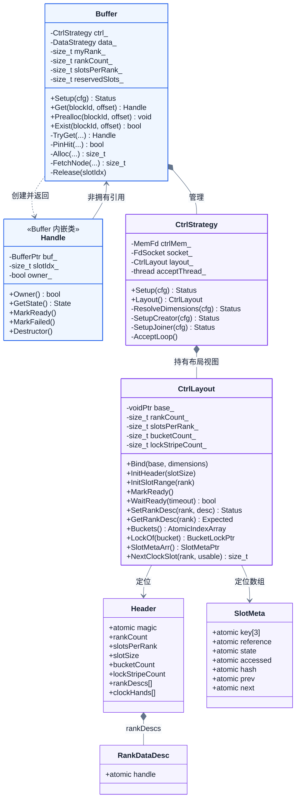
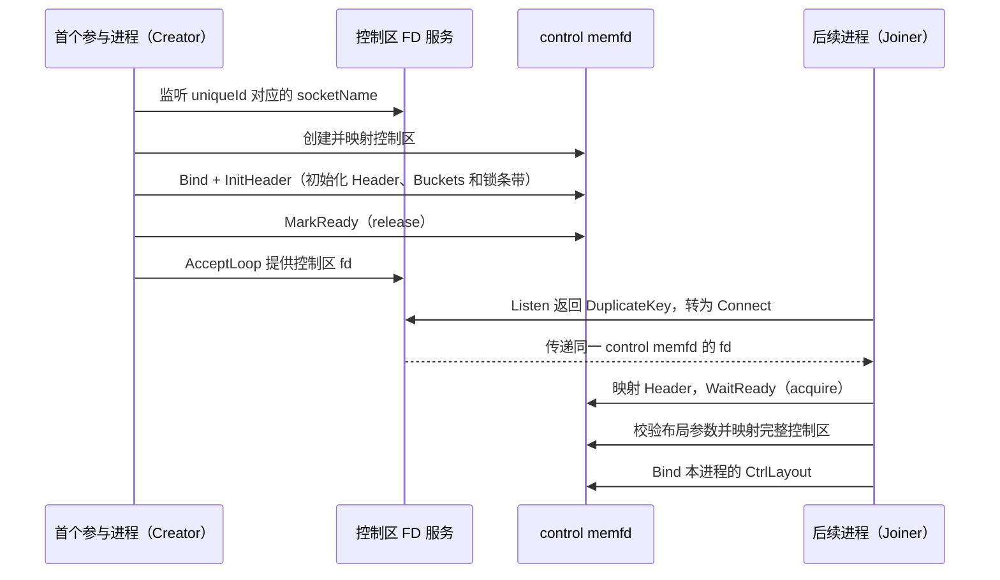
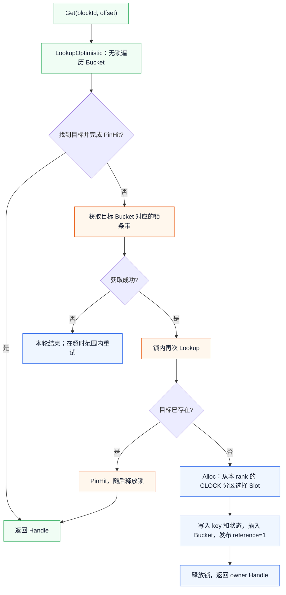
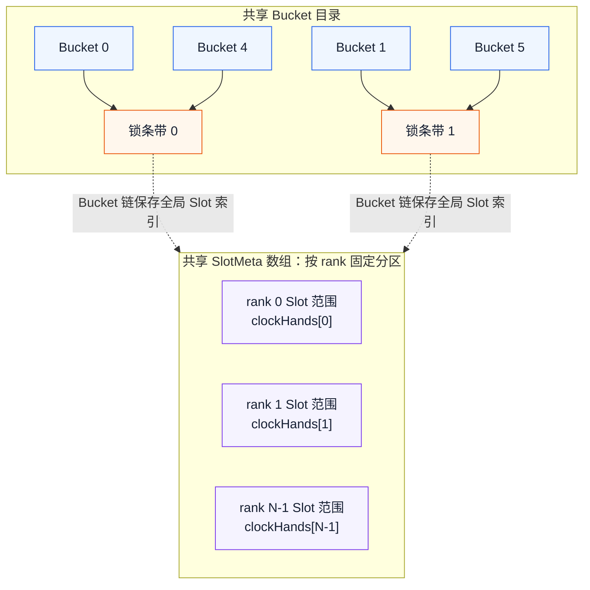

# A5 Cache2 控制面设计与验证说明

本文基于 `codex/a5-cache-control@80345397`，说明 A5 Cache2 控制面的设计与当前验证情况。评审范围包括 `Cache2::Buffer`、`Cache2::CtrlStrategy`、`Cache2::CtrlLayout`，以及 Connector 对 `local_rank_size` 的配置。数据区实现、BufferManager、Load/Dump 队列及端到端数据传输不在本文范围内。

## 1. 类及职责



| 类 | 主要职责 | 关键内容 |
|---|---|---|
| [`CtrlStrategy`](https://github.com/NaganooMei/unified-cache-management/blob/80345397c6217a00b3678faf38f625231206aeae/ucm/store/cache2/cc/ctrl_strategy.h) | 创建或加入共享控制区，管理控制区 memfd 及 FD 传递 | `Setup()`、`SetupCreator()`、`SetupJoiner()`、`AcceptLoop()` |
| [`CtrlLayout`](https://github.com/NaganooMei/unified-cache-management/blob/80345397c6217a00b3678faf38f625231206aeae/ucm/store/cache2/cc/ctrl_layout.h) | 定义共享控制区的内存布局，并提供各类共享元数据的访问接口 | `InitHeader()`、`InitSlotRange()`、`LockOf()`、`NextClockSlot()` |
| [`Buffer`](https://github.com/NaganooMei/unified-cache-management/blob/80345397c6217a00b3678faf38f625231206aeae/ucm/store/cache2/cc/cache_buffer.h) | 在共享元数据上完成 Block 查找、owner 选举、Slot 分配和淘汰 | `Setup()`、`Get()`、`PinHit()`、`Alloc()`、`FetchNode()` |

`Handle` 是 `Buffer` 返回的 Slot 访问凭证，内部记录 `Buffer` 的非拥有引用、Slot 索引和 owner 标记。Handle 不拥有 Buffer，也不负责数据区内存的生命周期；其析构负责释放当前 Slot 的引用。若 owner 在 Slot 仍处于 `Loading` 状态时退出，析构过程会将该 Slot 标记为 `Failed`，使后续请求能够重新发起填充。

## 2. 控制区创建与跨进程共享

控制区和数据区采用独立的内存管理方式。控制区由一个 control memfd 承载，其中依次保存 Header、Bucket 数组、Bucket 锁条带和 SlotMeta 数组。Scheduler 和所有 Worker 分别创建本地的 `CtrlStrategy`、`CtrlLayout` 对象，但这些对象最终映射并访问同一个 control memfd。



Creator 由启动顺序决定。`CtrlStrategy::Setup()` 首先尝试监听由 `uniqueId` 派生的 socket；监听成功的进程负责创建和初始化控制区，收到 `DuplicateKey` 的进程则作为 Joiner 连接已有控制区。因此，该流程不要求 Scheduler 必须先于 Worker 启动。

跨进程共享的是 control memfd 对应的物理内存，而不是 C++ 对象或虚拟地址。各进程中的 `CtrlLayout::base_` 可以不同，但均指向同一份控制数据。共享结构之间使用 Slot 索引建立关联，不保存其他进程的虚拟指针。

Creator 根据缓存容量、`shardSize` 和 `localRankSize` 计算 `slotsPerRank`、`bucketCount` 和 `lockStripeCount`，并将结果写入 Header。Joiner 在完成 Header 映射后读取并校验这些参数；本地配置与共享布局不一致时，加入过程失败。`MarkReady()` 和 `WaitReady()` 只表示控制区布局已完成初始化，不代表所有 Worker 的数据区均已就绪。

三个 Connector 入口均将 `local_rank_size` 设置为 `tp_size`：

- [UCM Connector](https://github.com/NaganooMei/unified-cache-management/blob/80345397c6217a00b3678faf38f625231206aeae/ucm/integration/vllm/ucm_connector.py)
- [HLA Connector](https://github.com/NaganooMei/unified-cache-management/blob/80345397c6217a00b3678faf38f625231206aeae/ucm/integration/vllm/hla_connector.py)
- [HMA Connector](https://github.com/NaganooMei/unified-cache-management/blob/80345397c6217a00b3678faf38f625231206aeae/ucm/integration/vllm/hma_connector.py)

以 TP8 为例，Scheduler 使用 `device_id = -1`，8 个 Worker 分别使用 `device_id = 0...7`，控制区按 8 个 rank partition 建立。该规则同时适用于 GQA 和 MLA，避免不同 Connector 或不同模型类型对控制区维度作出不同解释。

## 3. `Buffer::Get`、乐观访问与 owner 选举



命中路径首先无锁遍历 Bucket。找到候选 Slot 后，`PinHit()` 通过 `reference` 的 CAS 增加引用，再次核对 key 和状态；若 Slot 正在被重配置，校验失败并撤销本次引用。该机制属于 Slot 级乐观 pin 和 key 重校验，不是为每个 rank 设置一把乐观锁。

未命中或乐观访问失败时，请求进入 Bucket 锁路径。获得锁后必须再次查找，避免其他线程在两次查找之间已经插入相同 key。第二次查找仍未命中时，`Alloc()` 从当前 `myRank_` 对应的 CLOCK 分区分配 Slot，并将新 Slot 插入 Bucket 链表。

新分配 Slot 对应的 Handle 为 owner，负责填充数据并发布最终状态。对于 `Prealloc()` 创建的 `reference = 0、state = Loading` 占位 Slot，第一个成功将引用从 0 增加到 1 的 `Get()` 成为 owner，其他访问者只持有普通 Handle。owner 表示当前 Handle 承担填充和状态发布责任，不表示永久拥有该 Block。

填充成功后由 owner 调用 `MarkReady()`；填充失败时调用 `MarkFailed()`。若 owner 在 `Loading` 状态下直接析构，同样会将 Slot 转为 `Failed`。Handle 析构通过 `Release()` 释放引用，引用不为 0 的 Slot 不能进入淘汰重配置过程。

## 4. 分区 CLOCK 与 Bucket 条带锁



### 4.1 按 rank 分区的定长 CLOCK

SlotMeta 数组按照 rank 划分固定范围。rank `r` 的可用范围为：

```text
[r * slotsPerRank, (r + 1) * slotsPerRank)
```

每个 rank 在 Header 中维护独立的 `clockHands[rank]`。`Buffer::FetchNode()` 调用 `NextClockSlot(myRank_, usableSlots)` 获取候选 Slot，因此分配和淘汰均限制在当前 Worker 对应的分区内，不会从其他 rank 借用 Slot。

扫描过程中，`accessed = 1` 的 Slot 先被清零并获得一次保留机会；只有引用计数能够从 0 CAS 为独占标记的 Slot 才允许重配置。单次扫描范围不超过当前分区容量，因此 CLOCK 的容量和扫描范围固定。外层 `Get()` 仍可能在超时范围内重试，定长并不表示每次请求具有固定时延。

### 4.2 Bucket 分片条带锁

Bucket 与锁条带的映射关系为：

```cpp
lockStripeCount = min(bucketCount, 65536);
lock = LockArr()[iBucket & (lockStripeCount - 1)];
```

多个 Bucket 可以映射到同一把锁，限制锁对象数量。Bucket 链表的插入、删除和迁移由条带锁保护；命中快路径优先执行 Slot 级乐观 pin，不需要预先获取 Bucket 锁。

Slot 从旧 Bucket 迁移到新 Bucket 时，同一锁条带只加锁一次；若涉及两个不同条带且无法获得旧 Bucket 的锁，本次抢占将被放弃并重新尝试。该策略避免在淘汰路径中长期等待多把锁。

两类并发机制的职责相互独立：Slot 级乐观 pin 保证访问期间的 Slot 生命周期，Bucket 条带锁保证链表结构修改的一致性，rank CLOCK hand 负责在本分区内选择淘汰候选。

## 5. 测试范围与验证结论

| 测试 | 现有用例覆盖 | 尚未覆盖 |
|---|---|---|
| [`CtrlLayoutTest`](https://github.com/NaganooMei/unified-cache-management/blob/80345397c6217a00b3678faf38f625231206aeae/ucm/store/test/case/cache2/ctrl_layout_test.cc)，5 个用例 | 控制区布局与对齐；Bucket 到锁条带的映射；指定 rank 的 Slot 初始化；Ready/RankDesc 的基本发布与读取；CLOCK 索引不越过 rank 分区 | 真实 memfd FD 传递；Creator/Joiner 跨进程共享；多进程锁竞争；数据区访问 |
| [`Cache2BufferTest`](https://github.com/NaganooMei/unified-cache-management/blob/80345397c6217a00b3678faf38f625231206aeae/ucm/store/test/case/cache2/cache_buffer_test.cc)，4 个用例 | Prealloc 不提前取得 owner；16 线程并发访问时只有一个 owner；`Exist()` 不参与 owner 选举；owner 放弃后状态转为 Failed 且后续请求可以重试 | 多进程行为；多 rank 分区隔离；完整 CLOCK 淘汰过程；进程崩溃恢复；端到端 Load/Dump |

现有测试通过 `operator new`、`CtrlLayout::Bind()` 和 `InitHeader()` 在进程内直接构造控制区，未执行 `CtrlStrategy::Setup()` 和 `Buffer::Setup()`。这些用例针对控制区布局、索引计算和 Buffer 的进程内并发协议；不能作为跨进程 IPC 与完整运行链路已验证的依据。本次文档修订未重新运行测试。

Linux 构建环境可执行以下用例：

```bash
cmake -B build -DCMAKE_BUILD_TYPE=Debug -DBUILD_UCM_SPARSE=OFF \
  -DBUILD_UNIT_TESTS=ON -DRUNTIME_ENVIRONMENT=simu
cmake --build build -j
ctest --test-dir build --output-on-failure -R 'CtrlLayoutTest|Cache2BufferTest'
```

后续专项验证应覆盖以下场景：

1. 两个进程分别以 Creator 和 Joiner 身份加入同一控制区，能够观察相同的 Bucket 和 SlotMeta；布局配置不一致时 Joiner 被拒绝。
2. 两个 rank 同时执行 `Buffer::Get()`，分配结果始终位于各自的 Slot 范围内。
3. 在小容量分区内触发 CLOCK 淘汰，验证 second-chance 行为以及被 pin 的 Slot 不会被重配置。

## 结论

`CtrlStrategy` 负责建立跨进程共享的控制区，`CtrlLayout` 负责定义并访问其中的共享元数据，`Buffer` 在该布局之上实现 Slot 级乐观访问、owner 选举、按 rank 隔离的定长 CLOCK 以及 Bucket 分片条带锁。现有单元测试已覆盖布局计算和进程内并发协议；跨进程共享、多 rank 隔离和完整淘汰行为仍需通过专项测试验证。
