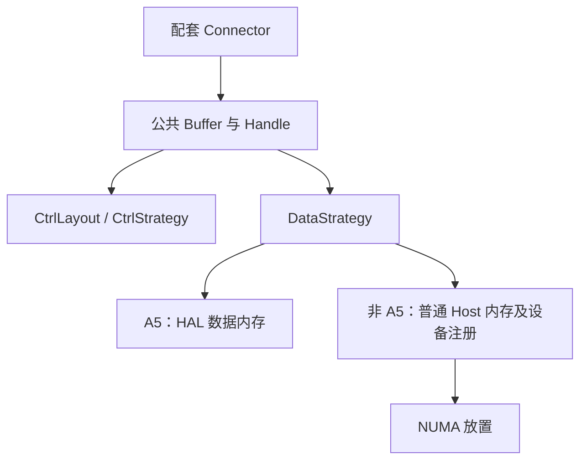

# 基于稳定 A5 分支迁移 Develop Cache 的方案

更新日期：2026-09-23。

状态：方向已确认，等待 A5 分支稳定可用；当前不启动实现。本文替代此前从 develop 分批重新组织 Cache 重构的讨论稿。

## 1. 背景与目标

Atlas A5 无法使用 aclrtHostRegister 注册普通 Host 内存，需要在 DataStrategy 中通过 HAL 接口申请适合该平台的数据内存。借适配 A5 的机会，feature_a5 重写了 Cache2：分离 Buffer 的控制区和数据区，并引入乐观无锁查找快路径。

Develop 也需要这套结构及 NUMA 放置能力。后续以稳定可用的 A5 Cache 和配套 connector 为唯一迁移基线，复用已经验证的实现，补齐非 A5 数据内存支持及商用兼容性。避免长期维护两套查找、owner 选举和淘汰算法。

当前关注三个工作项：

1. 直接迁移稳定的 A5 Cache，补充非 A5 DataStrategy。
2. 同步迁移 A5 connector 的配套变化，重点是 unique ID 和 MLA dump 按模均匀分工。
3. 单独设计数据内存 NUMA 放置，再接入数据区创建流程。

本文中的 HAL 和 dump 分工是迁移目标，不代表本次已经核实其最终实现或硬件验证结果。

## 2. 迁移 Cache：公共控制协议，按平台实现数据区

复用 A5 的 Buffer、Handle、CtrlLayout、CtrlStrategy，以及查找、pin、owner、分配和淘汰协议。数据区由 DataStrategy 隔离平台差异。

非 A5 DataStrategy 的职责包括普通内存分配、跨进程共享与映射、设备注册、Host/Device 地址获取及正确释放。设计上应集中在数据区，不再次重写缓存核心。

迁移前需要确认统一接口能够表达两类内存：

- 数据内存是否可由 CPU 直接读写，后端是否能直接写入 Host 地址。
- 本地创建和跨进程导入的方式，以及导出描述符的生命周期。
- Host 地址和设备访问地址是否不同。
- 注册、解除注册、解除映射及释放的顺序。

如果 A5 内存不支持现有后端需要的访问方式，仍需补相应数据传输适配；不能仅替换分配函数就认定全部路径可用。

乐观无锁查找指读快路径不取桶锁；修改和回退仍可使用锁，不要求整个 Cache 算法都 lock-free。

## 3. 迁移 Connector：共享域和写入分工一起对齐

Connector 与 Cache 按稳定 A5 版本配套迁移。实施时先核对哪些变化已进入 develop，只迁移缺失部分，不覆盖后续修复。

### 3.1 Unique ID

Unique ID 决定哪些参与者连接同一控制区。此前检查的 feature_a5@05c96593 使用完整 engine_id 作为基础 ID，FA/WA 再分别拼接 _fawa_fa 和 _fawa_wa。

稳定版本迁移时重新确认 DP、PP、节点及 FA/WA 的实际共享边界，同时保证同一域内 scheduler 与 worker 使用一致 ID。不要把旧 rank-partition 分支中 MLA 跨 DP 共享的策略直接带入。

### 3.2 MLA dump 均匀分工

采用稳定 A5 connector 的 MLA dump 按模分散逻辑。取模应基于对应共享域内的逻辑 rank 和参与者数量，明确每个数据单元由谁负责写入，以及布局一致性要求。

需要分别验证两个结果：

- dump 工作是否均匀分配给参与 worker。
- slot 分配是否使数据实际均匀落在各数据段。

两者不是天然等价；第二项取决于 Buffer 的分配策略。具体取模对象和算法以稳定 A5 实现为准，本文不提前指定。

### 3.3 Device ID 与 Buffer rank

设备 ordinal 负责设备操作；buffer rank 负责共享控制区内的分区索引。两者不能默认相同。

例如同机 DP2×TP8、按 DP 隔离时，两组 buffer rank 均可为 0..7，但 device ID 可能分别为 0..7 和 8..15。迁移前必须核实稳定 A5 版本是否已经处理这种差异；若未处理，作为必要兼容适配补齐。

## 4. NUMA：后续独立设计

先确定共享域、数据段数量及创建者，再设计 NUMA 放置。它主要属于非 A5 Host 数据区创建过程，不应耦合进查找和 SlotMeta 协议。

预期顺序：

`探测设备与 NUMA 关系 → 校验允许内存节点 → 分配/映射 → 绑定 → 首次触页 → 设备注册 → 发布数据段可用`

只有数据段创建者执行初始放置；其他进程导入该段时不重新初始化数据。

后续设计需要明确：

- 设备亲和放置与多节点带宽分散如何选择，尤其 MLA 数据可能被多个设备读取。
- 容器允许节点、拓扑不可获取及绑定权限不足时的处理。
- 自动放置是否允许降级，显式绑定失败是否报错。
- 容量是每 worker、每共享域还是节点总量，避免 NUMA 分段改变总内存预算。
- 如何抽样验证物理页位置，并记录实际放置和降级原因。

NUMA 绑定成功不等于性能提高，需要在相同容量、stream 数和 IO 模式下做独立 A/B。A5 的 HAL 内存是否有对应放置能力留待该平台实现确认，不假设普通内存的 mbind 方案可以直接套用。

## 5. rank-partition 分支的定位

codex/cache-rank-partition 退出迁移主线。无需继续逐提交梳理、rebase 或整体移植，也不以其结构作为新实现的约束。

保留分支作为历史实验与回归参考。迁移验收时仅按需提取已暴露的问题和有效测试，例如：

- Prealloc 与正式 Get 的 owner 选举，Exist 不抢填充权。
- Get 超时、buffer 耗尽和失败 owner 的处理。
- 后端写入或设备拷贝完成前不得释放 slot。
- 并发查找、复用与淘汰的正确性。
- NUMA 权限限制及拓扑缺失场景。

这些经验用于检查稳定 A5 实现是否覆盖，不要求迁移旧分支代码。历史性能数字也不能直接作为新版本验收证据。

## 6. 商用兼容性检查

稳定 A5 是实现基线，develop 已有行为是兼容性基线。迁移前做一次定向差异审查，发现必要差异再补适配：

| 检查项 | 需要确认的契约 |
|---|---|
| 私有/共享缓存 | 旧 share_buffer_enable 配置及 scheduler lookup 语义是否保持 |
| 容量 | 默认值、作用范围、FA/WA 拆分和保留 slot 是否一致 |
| 并行部署 | DP/TP/PP、跨节点部署及域内 rank 映射 |
| Connector | Direct、layerwise、FAWA/HLA 及已支持的其他集成 |
| 数据传输 | 已支持平台的普通拷贝、SDMA Direct、IO aggregation/GDR 等适用路径 |
| 生命周期 | 初始化次序、布局不匹配、失败清理、退出和有界等待 |
| 配置与接口 | Store API、pipeline、默认参数及外部 KV 格式 |

不因内部统一而附带改变 stream 默认值、预取行为或后端调度。涉及共享协议版本切换时，需要明确整组重启和回退边界，不能让同一域内不同进程自行选择不兼容实现。

## 7. 执行顺序与验证

1. 等待 A5 Cache、数据区和配套 connector 稳定可用，并记录验证过的提交。
2. 以该提交对照当时最新 develop，形成缺失改动及必要兼容适配清单。
3. 在专用 feature worktree 中迁移 Cache 和 connector，补非 A5 DataStrategy。
4. 完成基本正确性与兼容性验证。
5. 独立完成 NUMA 设计、实现和性能验证，再确定默认策略。

本地做静态检查、主机模拟和协议测试；设备注册、HAL、真实数据传输、NUMA 性能及端到端验证在 GPU/NPU 服务器完成。至少覆盖私有/共享模式、TP1/TP8、DP2TP8、已支持的 PP/多机配置，以及 Cache 冷/热命中和后端命中。

当前只记录方案，不开始迁移、不调整已有实现、不宣称硬件已验证。下一步是等待 A5 稳定，随后重新设计 NUMA 并对稳定提交做迁移差异审查。
