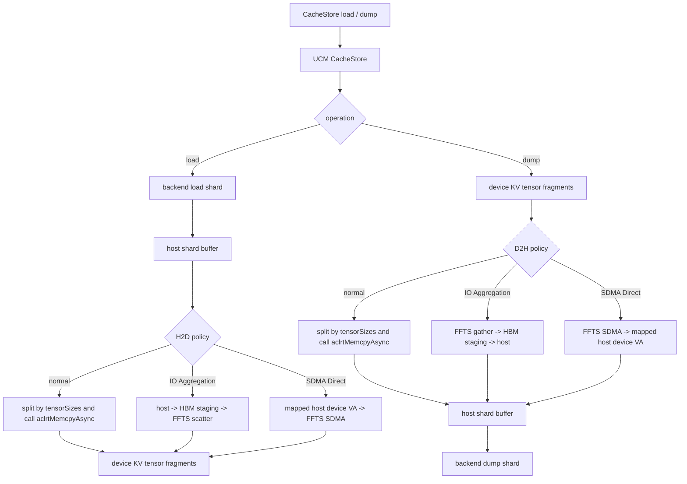
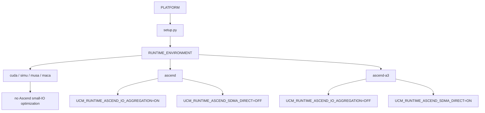
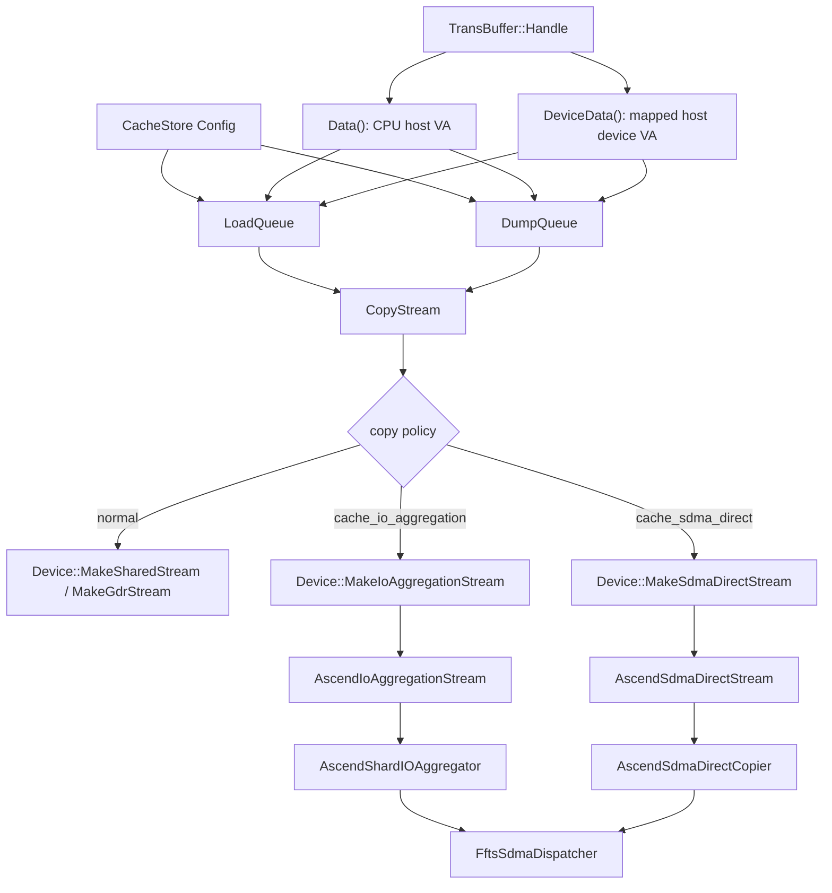
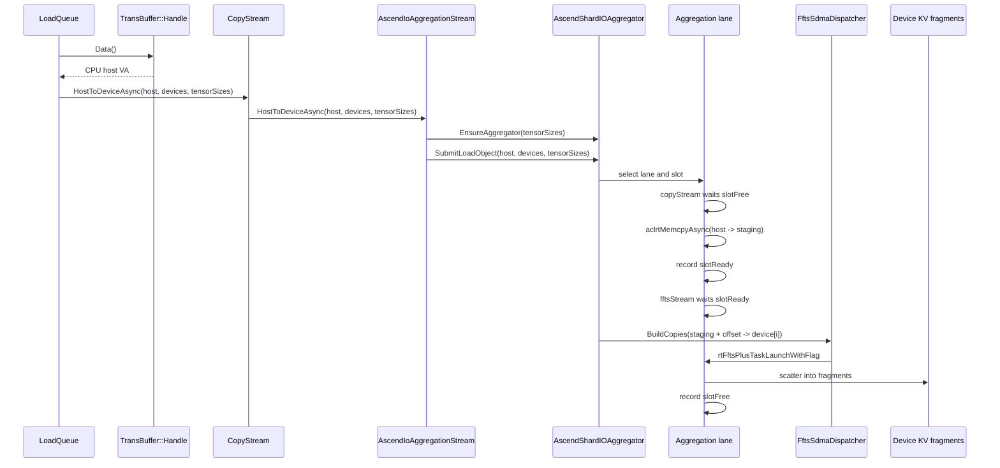
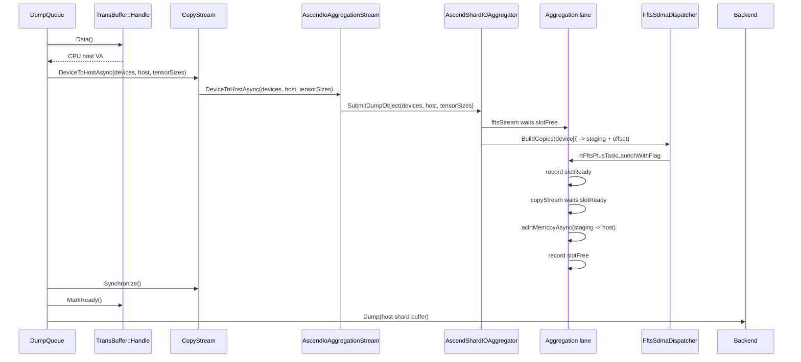
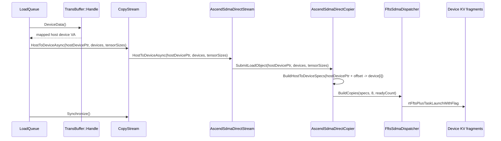
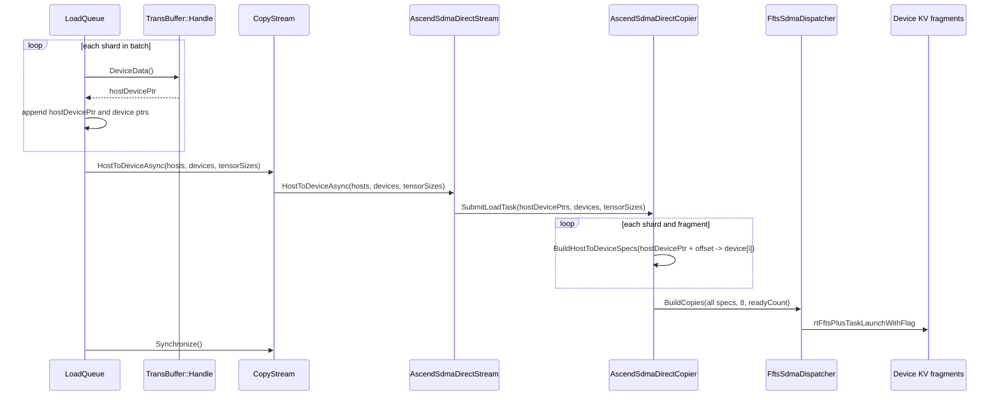
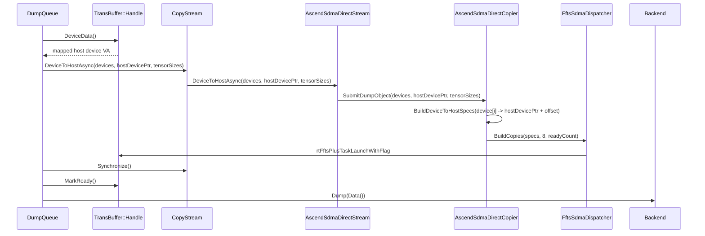

# Ascend CacheStore 小 IO 拷贝优化设计文档

## 1. 文档范围与当前状态

本文描述 UCM CacheStore 在 Ascend 场景下针对小粒度 KV cache H2D/D2H 拷贝的最新实现设计。文档以 2026-06-26 的 `develop` 分支为基线：`#1039` 的 Ascend A3 SDMA Direct 已经合入，`#1057` 已经补充 SDMA Direct launch 粒度选择逻辑，`#1038` 的 IO Aggregation 按照合入到当前 `develop` 后的代码形态描述。

当前实现包含两条互斥的 Ascend 专用优化路径：

- IO Aggregation：面向 `RUNTIME_ENVIRONMENT=ascend`，默认由编译期开关 `UCM_RUNTIME_ASCEND_IO_AGGREGATION` 打开。它把一个 CacheStore shard 作为一个连续 IO object，先在 host 和 HBM staging buffer 之间做连续拷贝，再通过 FFTS SDMA 在 device 侧 scatter/gather 到多个 KV tensor fragments。
- SDMA Direct：面向 `RUNTIME_ENVIRONMENT=ascend-a3`，默认由编译期开关 `UCM_RUNTIME_ASCEND_SDMA_DIRECT` 打开。它不使用 HBM staging buffer，而是使用 device-visible mapped host pointer，直接构造 host buffer 与 device tensor fragments 之间的 FFTS SDMA copy descriptors。

旧文档中以下内容已经过时：

- IO Aggregation 不再把 lane 数、pipeline depth、max ready lanes 作为 CacheStore 配置项传入；最终实现中这些是内部默认值。
- SDMA Direct 不再暴露 max ready lanes 配置；ready-lane 上限固定在 copier 内部。
- SDMA Direct 的 `Config` 默认 launch 粒度是 `shard`；vLLM connector 在用户未显式配置时会按 connector 模式注入，layerwise 为 `task`，非 layerwise 为 `shard`。
- `#1039` 已合入，公共 FFTS SDMA dispatcher 已经进入 `develop`；`#1038` 合入后复用同一个 dispatcher。

## 2. 背景与问题

在大模型推理中，KV cache 复用可以减少重复 prefill 计算并降低 TTFT。UCM CacheStore 负责把命中的外部 KV cache 读入 host shard buffer，再恢复到 vLLM 已分配的 device KV cache；dump 时则把 device KV cache 回写到 host shard buffer，再交给后端存储。

典型链路如下：

```text
vLLM / UCMConnector
  -> UCM CacheStore
  -> host shard buffer
  -> H2D / D2H copy
  -> device KV tensor fragments
```

在 vLLM Ascend 场景下，KV cache 通常按 paged block 管理。一个 CacheStore shard 在 device 侧会对应多个 layer、K/V tensor 或 MLA 相关 tensor slice，不能直接作为一个连续 device buffer 恢复。因此普通路径需要把连续 host shard buffer 按 `tensorSizes` 拆成多个 offset，对每个 device tensor fragment 调用一次 `aclrtMemcpyAsync`。

当单次 fragment size 较小时，Runtime API 调用、任务构造、driver 交互和 DMA 下发的固定开销会超过真实数据搬运耗时，性能表现更接近 IOPS 瓶颈，而不是链路带宽瓶颈。MiniMax、DeepSeek-V4 等模型会出现 256B、2KB、16KB、32KB、128KB 等不同粒度的小 IO，普通逐 fragment copy 很难打满 PCIe/HCCS 带宽。

## 3. 总体数据流

CacheStore 的数据链路可以抽象为：

```text
storage backend <-> host shard buffer <-> device KV tensor fragments
```

load 时，后端先把 shard 读到连续 host buffer，然后恢复到多个 device fragments。dump 时方向相反，先从多个 device fragments 聚合到 host shard buffer，再写回后端。



三条路径的核心差异如下：

| 维度 | 普通 copy | IO Aggregation | SDMA Direct |
| --- | --- | --- | --- |
| 适用 runtime | 默认路径 | `ascend` | `ascend-a3` |
| H2D host 入参 | CPU host VA | CPU host VA | mapped host device VA |
| D2H host 入参 | CPU host VA | CPU host VA | mapped host device VA |
| 中间 buffer | 无 | HBM staging buffer | 无 |
| device 侧分发 | Runtime 逐 fragment copy | FFTS SDMA scatter/gather | FFTS SDMA direct copy |
| CacheStore stream 形态 | 多个普通 stream | 一个特殊 stream，内部固定多 lane | 一个特殊 stream，内部固定单 lane |
| H2D 提交粒度 | shard | shard | `shard` 或 `task` |
| D2H 提交粒度 | shard | shard | shard |

## 4. 构建与运行时隔离

IO Aggregation 和 SDMA Direct 都是编译期能力，不允许在同一个标准 runtime 中同时默认启用。



| 构建入口 | CMake runtime | 编译能力 | 默认 CacheStore 行为 |
| --- | --- | --- | --- |
| `PLATFORM=ascend` | `RUNTIME_ENVIRONMENT=ascend` | IO Aggregation | `cache_io_aggregation=true` |
| `PLATFORM=ascend-a3` | `RUNTIME_ENVIRONMENT=ascend-a3` | SDMA Direct | `cache_sdma_direct=true` |
| `PLATFORM=cuda` | `RUNTIME_ENVIRONMENT=cuda` | 无 | 普通 copy 或 GDR |
| 未设置或其他平台 | `simu` / 对应平台 | 无 | 普通 copy |

CacheStore 初始化时会做配置校验：

- 当前 binary 未编译 IO Aggregation 时，如果配置 `cache_io_aggregation=true`，初始化失败。
- 当前 binary 未编译 SDMA Direct 时，如果配置 `cache_sdma_direct=true`，初始化失败。
- `cache_io_aggregation` 和 `cache_sdma_direct` 不能同时为 true。
- `cache_sdma_direct_launch_granularity` 只能是 `shard` 或 `task`。
- IO Aggregation 和 SDMA Direct 都不支持与 `use_gdr=true` 组合；对应 `CopyStream` setup 会直接报错。

## 5. Connector 默认配置策略

CacheStore 的 C++ 默认值来自编译期宏：

```text
cacheIOAggregation = UCM_RUNTIME_ASCEND_IO_AGGREGATION
cacheSdmaDirect = UCM_RUNTIME_ASCEND_SDMA_DIRECT
sdmaDirectLaunchGranularity = "shard"
```

vLLM connector 会在创建 store 前补充少量策略：

- `UCMDirectConnector` 中，如果 `use_layerwise=true`，会强制 `cache_io_aggregation=false`，避免 layerwise 小 object 进入 staging/FFTS 流水后收益被额外开销抵消。
- `UCMDirectConnector` 中，如果用户没有显式写 `cache_sdma_direct_launch_granularity`，会按 `use_layerwise` 注入：layerwise 为 `task`，非 layerwise 为 `shard`。
- 用户显式写了 `cache_sdma_direct_launch_granularity` 时，connector 保留用户值，交给 CacheStore 校验。
- FAWA/HMA 场景下，FA store 继承 runtime 默认策略；WA store 会设置 `cache_io_aggregation=false`。

常规用户通常不需要显式配置底层开关，只需要用正确平台重新安装：

```bash
export PLATFORM=ascend
pip install .
```

```bash
export PLATFORM=ascend-a3
pip install .
```

最小 YAML 示例：

```yaml
use_layerwise: false
ucm_connectors:
  - ucm_connector_name: UcmPipelineStore
    ucm_connector_config:
      store_pipeline: Cache|Posix
      storage_backends: /mnt/cache
```

如果要覆盖 SDMA Direct load 提交粒度，可以显式配置：

```yaml
ucm_connectors:
  - ucm_connector_name: UcmPipelineStore
    ucm_connector_config:
      store_pipeline: Cache|Posix
      storage_backends: /mnt/cache
      cache_sdma_direct_launch_granularity: task
```

## 6. 代码模块

合入后的模块布局如下：

```text
ucm/shared/trans/ascend/
  ffts/
    ffts_sdma_dispatcher.h
    ffts_sdma_dispatcher.cc
  io_aggregation/
    ascend_io_aggregation_stream.h
    ascend_io_aggregation_stream.cc
    ascend_shard_io_aggregator.h
    ascend_shard_io_aggregator.cc
  sdma_direct/
    ascend_sdma_direct_stream.h
    ascend_sdma_direct_stream.cc
    ascend_sdma_direct_copier.h
    ascend_sdma_direct_copier.cc
```

| 模块 | 代码位置 | 职责 |
| --- | --- | --- |
| `CacheStore::Config` | `@ucm/store/cache/cc/global_config.h` | 保存 runtime 默认开关、SDMA launch 粒度和传输配置 |
| `CacheStore::CheckConfig` | `@ucm/store/cache/cc/cache_store.cc` | 校验 runtime 能力、互斥关系、launch 粒度 |
| `CopyStream` | `@ucm/store/cache/cc/copy_stream.h` | 根据 CacheStore 配置创建普通 stream、IO Aggregation stream 或 SDMA Direct stream |
| `LoadQueue` | `@ucm/store/cache/cc/load_queue.cc` | load 侧等待 backend、选择 host pointer、按 shard 或 task 提交 H2D |
| `DumpQueue` | `@ucm/store/cache/cc/dump_queue.cc` | dump 侧等待前置 event、提交 D2H、同步后回写 backend |
| `TransBuffer` | `@ucm/store/cache/cc/trans_buffer.cc` | 管理 host shard buffer 和 mapped host device VA |
| `AscendIoAggregationStream` | `@ucm/shared/trans/ascend/io_aggregation/ascend_io_aggregation_stream.cc` | CacheStore 专用 IO 聚合 stream 适配层 |
| `AscendShardIOAggregator` | `@ucm/shared/trans/ascend/io_aggregation/ascend_shard_io_aggregator.cc` | 管理 staging buffer、copy stream、FFTS stream、pipeline slot |
| `AscendSdmaDirectStream` | `@ucm/shared/trans/ascend/sdma_direct/ascend_sdma_direct_stream.cc` | CacheStore 专用 SDMA Direct stream 适配层 |
| `AscendSdmaDirectCopier` | `@ucm/shared/trans/ascend/sdma_direct/ascend_sdma_direct_copier.cc` | 构造 direct H2D/D2H specs，管理 in-flight descriptors |
| `FftsSdmaDispatcher` | `@ucm/shared/trans/ascend/ffts/ffts_sdma_dispatcher.cc` | 将 copy specs 转为 FFTS SDMA contexts 并调用 `rtFftsPlusTaskLaunchWithFlag` |

## 7. 模块关系



## 8. 普通 copy 路径

普通路径是所有 runtime 的基线行为。`LoadQueue` 在 backend load ready 后取 `handle.Data()`，将连续 host shard buffer 按 `tensorSizes` 拆分为多个 offset，并调用 `Stream::HostToDeviceAsync(host, devices, tensorSizes)`。默认实现会循环 `sizes`，逐 fragment 调用 `HostToDeviceAsync(host + offset, device[i], size[i])`。

dump 方向相同，`DumpQueue` 取 `handle.Data()`，调用 `Stream::DeviceToHostAsync(devices, host, tensorSizes)`，逐 fragment 从 device 拷回 host shard buffer。所有 shard 的 D2H 提交完成后，`DumpQueue` 调用 `stream.Synchronize()`，再 `MarkReady()` 并提交 backend dump。

## 9. IO Aggregation 设计

### 9.1 入口与默认参数

当 `cache_io_aggregation=true` 时，`LoadQueue` 和 `DumpQueue` 都通过 `CopyStream::SetupIoAggregation` 创建一个 `AscendIoAggregationStream`。这个 stream 外层只有一个对象，内部固定参数如下：

| 参数 | 当前值 | 说明 |
| --- | ---: | --- |
| lane number | 4 | 内部 aggregation lane 数，不读取 `cache_stream_number` |
| pipeline depth | 2 | 每个 lane 两个 staging slot，形成双 buffer 流水 |
| max ready lanes | 8 | 构造 FFTS dependency 时的 ready context 上限 |

`AscendIoAggregationStream::Setup()` 只清理状态，不立即分配 staging buffer。第一次收到 `HostToDeviceAsync(host, devices, sizes)` 或 `DeviceToHostAsync(devices, host, sizes)` 时，`EnsureAggregator(sizes)` 根据 `sizes` 懒创建 `AscendShardIOAggregator`：

- `objectBytes = sum(sizes)`，表示一个 CacheStore shard 的有效传输大小。
- `maxFragments = sizes.size()`，表示一个 shard 内的 tensor fragment 数。
- 每个 lane 分配 `pipelineDepth` 个 HBM staging buffer，每个 buffer 大小为 `objectBytes`。
- 若 aggregator 创建前已经收到 `WaitEvent(event)`，event 会先缓存在 `pendingEvents_`，aggregator 创建后补充等待。

### 9.2 H2D 时序

IO Aggregation H2D 将一个 shard 的传输拆为两段：

1. `copyStream` 把连续 host shard buffer 拷贝到 HBM staging buffer。
2. `fftsStream` 通过 FFTS SDMA 将 staging buffer scatter 到多个 device tensor fragments。



双 buffer 的关键是 slot 级事件依赖。`copyStream` 可以在 slot 1 上提交下一个 shard 的 host -> staging，而 `fftsStream` 同时在 slot 0 上执行 scatter。两条 stream 只围绕同一个 slot 的 `slotReady` / `slotFree` 建立依赖。

### 9.3 D2H 时序

dump 方向与 H2D 对称：

1. `fftsStream` 从多个 device fragments gather 到 HBM staging buffer。
2. `copyStream` 将 staging buffer 连续拷回 host shard buffer。



### 9.4 约束

- IO Aggregation 只支持 CacheStore shard-level vector sizes 接口，不支持单段 copy 接口。
- `AppendCallback` 当前不支持；如果 dump prerequisite event 之后需要 callback 记录时间，IO Aggregation 会返回 unsupported，调用方会降级为不记录 callback 时间。
- IO Aggregation 不依赖 mapped host pointer，只使用 `Data()` 返回的 CPU host VA。
- IO Aggregation 使用 HBM staging buffer，额外 HBM 占用约为 `4 * 2 * sum(tensorSizes)`。

## 10. SDMA Direct 设计

### 10.1 入口与默认参数

当 `cache_sdma_direct=true` 时，`LoadQueue` 和 `DumpQueue` 通过 `CopyStream::SetupSdmaDirect` 创建一个 `AscendSdmaDirectStream`。内部 `AscendSdmaDirectCopier` 当前固定：

| 参数 | 当前值 | 说明 |
| --- | ---: | --- |
| lane number | 1 | 一个 FFTS stream |
| max ready lanes | 8 | 构造 FFTS dependency 时的 ready context 上限 |
| HBM staging buffer | 0 | 不使用 staging buffer |

SDMA Direct 的关键是 host 参数不是 CPU host VA，而是 device 侧可访问的 mapped host pointer。`TransBuffer::Handle::DeviceData()` 提供这个地址；普通路径和 IO Aggregation 使用 `Data()`。

`TransBuffer` 的映射逻辑如下：

- shared buffer 模式下，`SharedBufferStrategy` 会注册共享内存 data 区，并保存 `dataOnDevice_`。
- local buffer 模式下，只有 `cache_sdma_direct=true` 时才把 host buffer 注册或查询为 device-visible pointer。
- `io_direct=true` 的 local buffer 会通过 `aclrtHostGetDevicePointer` 获取 device pointer；普通 local host buffer 会调用 host register 并在析构时 unregister。

### 10.2 H2D shard 粒度

`Config` 中 `sdmaDirectLaunchGranularity` 的默认值是 `shard`。非 layerwise connector 在用户未显式配置时也会注入 `shard`。

shard 粒度下，每个 shard 在 backend load ready 后立即提交一次 SDMA Direct launch：



### 10.3 H2D task 粒度

当 `cache_sdma_direct_launch_granularity=task` 时，`LoadQueue` 会在同一个 CacheStore load task 内收集多个 shard，然后调用 `HostToDeviceAsync(hosts, devices, tensorSizes)` 进行一次 task batch 提交。

实现上会把同一 task 内的 shard 分为两组：

- 已经在 buffer 中 ready 的 shard。
- 需要等待 backend load 的 pending shard。

每组末尾设置 `launchBoundary`，到达边界时调用 `FlushSdmaDirectTaskBatch()`。这样可以避免已经 ready 的 shard 被 pending shard 阻塞，同时仍减少同一组内的 FFTS launch 次数。



### 10.4 D2H shard 粒度

dump 方向当前保持 shard 粒度，不受 `cache_sdma_direct_launch_granularity` 影响。`DumpQueue` 对每个未 ready 的 shard 取 `handle.DeviceData()` 作为 mapped host device VA，提交 `DeviceToHostAsync(devices, hostDevicePtr, tensorSizes)`。同步完成后，CacheStore 标记 `handle.MarkReady()`，并把 `handle.Data()` 作为 CPU host VA 交给 backend dump。



### 10.5 约束

- SDMA Direct 要求 `DeviceData()` 非空；否则 stream 会返回 invalid param。
- SDMA Direct 不支持 GDR。
- SDMA Direct 的 ready-lane 上限是内部实现细节，不暴露配置。
- `task` 粒度只影响 load H2D；dump D2H 仍是 shard 粒度。

## 11. FFTS SDMA Dispatcher

IO Aggregation 与 SDMA Direct 共享 `FftsSdmaDispatcher`。调用方先构造若干 `AscendFftsCopySpec`，每个 spec 表示一次 `src -> dst` 的 SDMA copy。dispatcher 的职责是：

1. 为每个 copy spec 构造 `rtFftsPlusSdmaCtx_t`。
2. 按 `maxReadyLanes` 把 copy contexts 分配到若干 ready lanes。
3. 同一个 lane 内建立 predecessor -> successor 依赖，使多个 SDMA contexts 可以由一个 FFTS plus task 批量下发。
4. 调用 `rtFftsPlusTaskLaunchWithFlag` 提交到指定 `aclrtStream`。

ready lane 的作用是控制 launch 时可直接 ready 的 context 数量。copy 数量超过 ready lane 数时，后续 context 通过依赖链被串起来，从而减少单次 launch 中同时 ready 的任务数量，同时仍保留批量 descriptor 下发的收益。

## 12. 策略选择总结

| 场景 | 默认策略 | 说明 |
| --- | --- | --- |
| `PLATFORM=ascend`，非 layerwise | IO Aggregation | 默认 `cache_io_aggregation=true`，一个 shard 经 HBM staging scatter/gather |
| `PLATFORM=ascend`，`use_layerwise=true` | 普通 copy | connector 强制 `cache_io_aggregation=false` |
| FAWA/HMA 的 FA store，`PLATFORM=ascend` | IO Aggregation | 继承 runtime 默认 |
| FAWA/HMA 的 WA store，`PLATFORM=ascend` | 普通 copy | WA store 显式关闭 IO Aggregation |
| `PLATFORM=ascend-a3`，非 layerwise | SDMA Direct shard launch | 默认 `cache_sdma_direct=true`，connector 注入 `shard` |
| `PLATFORM=ascend-a3`，layerwise | SDMA Direct task launch | connector 注入 `task`，减少同一 task 内 launch 次数 |
| CUDA / simu / musa / maca | 普通 copy 或平台已有能力 | Ascend 小 IO 优化不编译、不允许配置启用 |

## 13. 性能与验证结论

旧测试数据仍可作为优化方向参考，但具体数值应以目标硬件、CANN 版本、模型 layout 和后端存储配置重新验证。已有验证的总体结论是：

- A3 DeepSeek-V4 上，SDMA Direct 能把最慢卡 load 有效带宽从约 1.7-3.8 GB/s 提升到约 11.9-13.9 GB/s；TTFT 在高命中率长上下文场景下提升更明显。
- A2 DeepSeek-V4 上，IO Aggregation 能把 load 有效带宽从约 1.6-3.9 GB/s 提升到约 4.6-8.6 GB/s；TTFT 收益受命中率、输入长度和 backend 等待占比影响。
- MiniMax 等单 fragment 较大的模型在低命中率下 TTFT 收益可能不明显，甚至因固定开销略有波动；高命中率场景更容易体现 copy path 优化收益。

建议后续验证至少覆盖：

- load H2D bandwidth、dump D2H bandwidth。
- backend wait 时间与 copy sync 时间的占比。
- `cache_sdma_direct_launch_granularity=shard` 与 `task` 在 layerwise/非 layerwise 下的差异。
- `use_layerwise=true`、FAWA/HMA FA store、WA store 三类 connector 路径。
- `share_buffer_enable` 与 `io_direct` 对 mapped host pointer 的影响。
