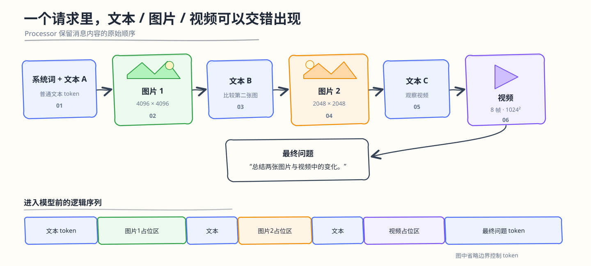
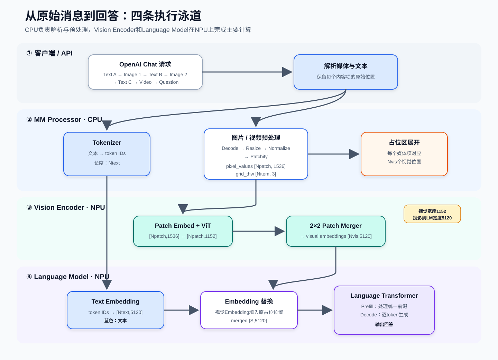
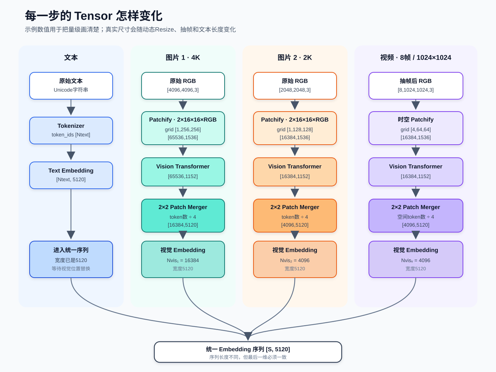
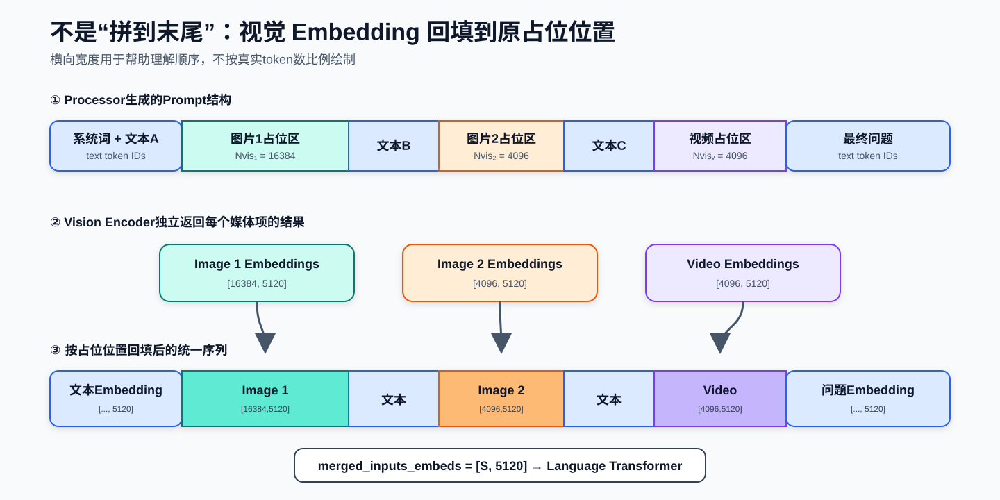
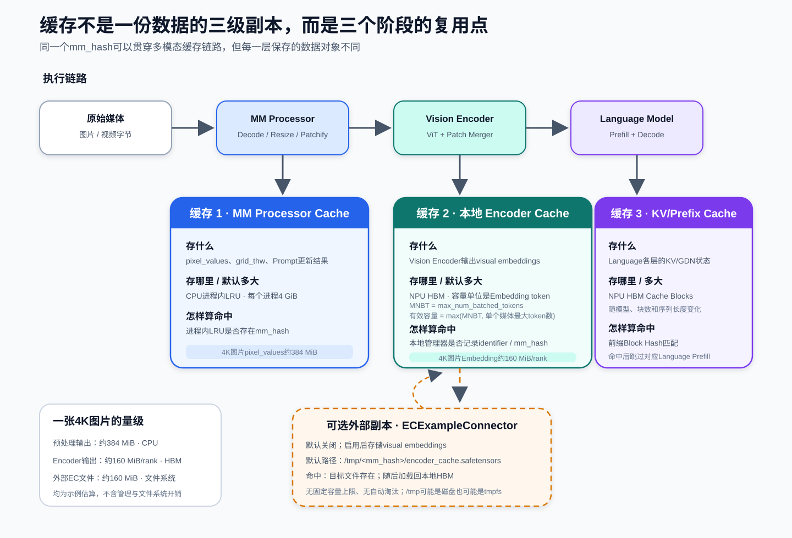
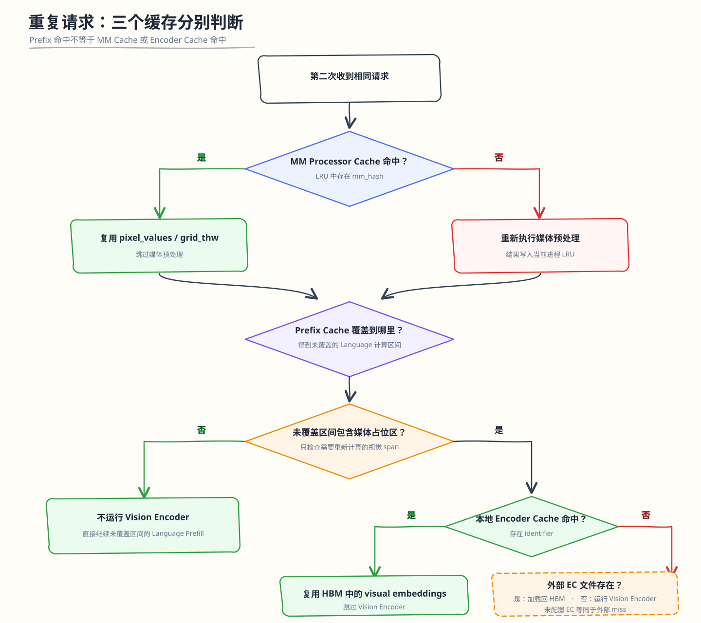

# Qwen3.8 多模态推理与缓存复用图解

> 口径：Qwen3.8-27B、vLLM 0.23.0、vLLM Ascend 0.23.0。示例尺寸用于说明 Tensor 变化，不代表固定输入规格。

## 1. 示例请求



示例模型参数：

```text
patch_size = 16
temporal_patch_size = 2
spatial_merge_size = 2
vision_hidden_size = 1152
language_hidden_size = 5120
```

| 媒体项 | 预处理后输入 | `grid_thw` | `Npatch` | `Nvis` |
|---|---:|---:|---:|---:|
| 图片1 | `4096×4096` | `[1,256,256]` | 65536 | 16384 |
| 图片2 | `2048×2048` | `[1,128,128]` | 16384 | 4096 |
| 视频 | 8帧、`1024×1024` | `[4,64,64]` | 16384 | 4096 |

## 2. 端到端流程



文本与媒体分别处理，最终合并为：

```text
merged_inputs_embeds [S,5120]

S = Ntext + ΣNvis + Nspecial
```

`Nspecial` 表示媒体边界和控制 Token。

## 3. Tensor 维度



关键关系：

```text
pixel_values.shape[-1]
= 3 × temporal_patch_size × patch_size²
= 3 × 2 × 16²
= 1536

Npatch = Tgrid × Hgrid × Wgrid
Nvis = Npatch / spatial_merge_size² = Npatch / 4
```

4096×4096 图片的主路径：

```text
[4096,4096,3]
→ pixel_values [65536,1536]
→ Vision Transformer [65536,1152]
→ Patch Merger [16384,5120]
```

## 4. 文本与视觉 Embedding 合并



Vision Encoder 为每个媒体项独立生成 Embedding；合并时按媒体占位位置替换，不改变请求的逻辑顺序。

## 5. 缓存实现



| 缓存 | 默认容量 | 常驻位置 | 缓存对象 | 命中判断 |
|---|---|---|---|---|
| MM Processor Cache | 每个API/Engine进程4 GiB | CPU进程内LRU | `pixel_values`、`grid_thw`、Prompt更新 | LRU存在`mm_hash` |
| 本地 Encoder Cache | `max(max_num_batched_tokens, max_tokens_per_mm_item)`个视觉Token | NPU HBM | `visual embeddings` | 本地管理器存在`identifier` |
| KV/Prefix Cache | 由可用HBM与Cache Block配置决定 | NPU HBM Blocks | KV或GDN状态 | 前缀Block Hash匹配 |
| ECExampleConnector | 默认关闭；示例实现无容量上限 | `/tmp`所在文件系统 | Encoder输出的Safetensors文件 | `<mm_hash>/encoder_cache.safetensors`存在 |

命中键口径：

- MM Processor Cache 的 `mm_hash` 由模型身份、媒体内容或用户 UUID、Processor 参数共同决定；
- 本地 Encoder Cache 使用媒体 `identifier`，通常就是 `mm_hash`；
- 原生多模态 Prefix Block Hash 会纳入媒体身份及媒体在 Block 内的相对位置。

4096×4096 图片的核心 Tensor 大小：

```text
pixel_values [65536,1536] FP32
= 65536 × 1536 × 4 B
= 384 MiB

visual embeddings [16384,5120] BF16
= 16384 × 5120 × 2 B
= 160 MiB / rank
```

`ECExampleConnector` 命中后仍需把 Safetensors 文件加载回本地 HBM。`/tmp` 位于磁盘还是 `tmpfs`，由系统挂载决定；`ec_buffer_size` 不限制该示例实现的文件总量。

## 6. 重复请求的命中流程



三个结论：

1. MM Processor Cache、Encoder Cache 与 Prefix Cache 独立判断；
2. 仅当未被 Prefix Cache 覆盖的区间包含媒体占位区时，才需要视觉结果；
3. 本地 Encoder Cache miss 后，只有启用 EC Connector 才会继续查询外部 Encoder Cache。
