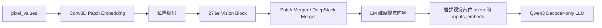
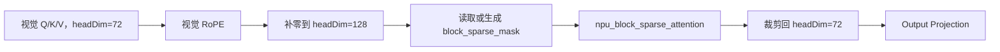

# BlockSparseAttention 算子及其在 Qwen3-VL / vLLM Ascend 中的应用调研

调研日期：2026-07-16

## 一、结论先行

1. `BlockSparseAttention`（BSA）是一个“由外部块级 Mask 指定计算区域”的稀疏注意力算子。它把 Q 和 KV 序列切成块，只计算 `block_sparse_mask=1` 的 Q×KV 块，以减少 Attention 中 `QK^T` 和 `PV` 两个矩阵乘的计算量。它本身不负责决定哪些块重要，CANN 9.0.0 版本需要调用方提供 Mask。

2. 当前本地 `vllm-ascend-0.21.0rc1` 没有调用 CANN 的 `BlockSparseAttention`，也没有调用 `torch_npu.npu_block_sparse_attention`。Qwen3-VL 的视觉注意力目前走 `MMEncoderAttention -> AscendMMEncoderAttention -> npu_flash_attention`，BF16 场景最终使用稠密 FlashAttention 路径。

3. 对 Qwen3-VL 来说，最适合替换的是视觉编码器每一层中的稠密 `MMEncoderAttention`，不是语言模型 Decoder 的 Attention：

   - 视觉注意力是无 KV Cache、非因果、双向 self-attention，输入布局和语义与 BSA 高度匹配。
   - Decoder Attention 需要 causal mask 和 Paged KV Cache，而 CANN 9.0.0 BSA 不支持 token 级 attention mask，也不支持 PagedAttention，不能保持 Decoder 的精确语义。
   - Qwen3-VL 没有视觉编码器到语言模型的 cross-attention；视觉特征是写入 `inputs_embeds` 后再进入 Decoder，因此不存在可替换的 cross-attention 算子。

4. 不能只做一次“函数名替换”。Qwen3-VL 视觉头维为 `1152 / 16 = 72`，而 BSA 正向只支持 headDim 64 或 128，因此需要沿用当前 Ascend 视觉 Attention 已有的 `72 -> 128` 补零逻辑，Attention 结束后再裁剪回 72；缩放系数仍必须使用 `1 / sqrt(72)`。

5. 真正具有课题价值的部分是多模态稀疏 Mask：建议先完成全 1 Mask 的等价接入，再研究“二维局部窗口 + 少量全局块 + 分层/分头稀疏”的图像结构感知方案。高分辨率图片应作为第一目标，视频作为第二阶段，因为 Qwen3-VL 当前把每个视频时间片作为独立视觉 Attention 序列，BSA 只能压缩每个时间片内部的空间 Attention。

推荐课题表述：

> 面向 Qwen3-VL 视觉编码器的二维结构感知块稀疏注意力适配与性能—精度协同优化

## 二、BlockSparseAttention 是什么

### 2.1 计算语义

普通稠密 Attention 会计算所有 Query token 与所有 Key token 的相关性：

$$
O = Softmax(scale \cdot QK^T)V
$$

BSA 将 Q 序列按 `blockShapeX` 切块，将 KV 序列按 `blockShapeY` 切块。调用方提供四维 INT8 Mask：

$$
[batch, head, qBlockNum, kvBlockNum]
$$

Mask 中为 1 的块参与计算，为 0 的块跳过。因此其近似计算量取决于有效块对的数量，而不是完整的 `S_q × S_kv`。

官方说明可参考：

- [CANN ops-transformer 9.0.0 BlockSparseAttention](https://gitcode.com/cann/ops-transformer/blob/9.0.0/attention/block_sparse_attention/README.md)
- [CANN 9.0 BlockSparseAttention 接口文档](https://www.hiascend.com/document/detail/zh/CANNCommunityEdition/900beta2/API/aolapi/context/ops-transformer/aclnnBlockSparseAttention.md)
- [torch_npu.npu_block_sparse_attention API](https://gitcode.com/Ascend/op-plugin/blob/master/docs/zh/custom_APIs/torch_npu/torch_npu-npu_block_sparse_attention.md)

### 2.2 CANN 9.0.0 的主要能力与限制

| 项目 | CANN 9.0.0 情况 | 对 Qwen3-VL 的影响 |
|---|---|---|
| 数据类型 | FP16、BF16 | Qwen3-VL BF16 可用 |
| 布局 | TND、BNSD | 当前视觉 Attention 可转换为 TND，匹配 |
| headDim | 正向仅支持 64 或 128 | Qwen3-VL 视觉 headDim=72，必须补零到 128 |
| 块大小 | `blockShapeY` 必须为 128 的倍数 | 首版优先使用 128×128 |
| 稀疏 Mask | 必须由调用方提供 | 需要设计多模态 Mask 生成逻辑 |
| Attention Mask | 不支持，必须为空 | 适合非因果视觉 Attention，不适合 Decoder causal Attention |
| PagedAttention | 不支持 | 不能直接替换 vLLM Decoder 的 KV Cache Attention |
| 变长序列 | TND 下通过每个 batch 的实际长度列表传入 | 可对应图片或视频时间片的不同 patch 数量 |
| Softmax 精度 | BF16 时 `inner_precise=0` | 应使用 FP32 中间 Softmax |

`torch_npu.npu_block_sparse_attention` 已作为 PyTorch NPU 自定义 API 提供，并依赖 CANN 9.0.0。当前本地 vLLM Ascend 版本要求 CANN 9.0.0、PyTorch/torch-npu 2.10.0，因此软件版本组合原则上具备调用条件，但仍需在真实 NPU 环境检查 API 和算子包是否完整安装。[torch-npu 发布说明](https://gitcode.com/Ascend/pytorch/blob/v2.7.1/docs/zh/release_notes/release_notes.md)

### 2.3 它不是什么

- 它不是自动选择重要 token 的算子。9.0.0 版本只消费 Mask，不生成 Mask。
- 它不是 PagedAttention，不能直接读取 vLLM 的分页 KV Cache。
- 它不是 causal Attention 的直接实现。仅使用块级下三角 Mask 仍会在对角块内部看到未来 token，而 9.0.0 又不支持额外 token 级 causal mask。
- 它与代码中名为 `block_sparse_moe` 的 MoE 模块没有关系。
- 上游 vLLM CUDA PagedAttention 中也存在另一套固定 pattern 的 block-sparse 参数，但那是 CUDA Kernel 逻辑，不是 CANN 的 `aclnnBlockSparseAttention`。

## 三、vLLM Ascend 目前是否使用该算子

结论：当前本地版本没有使用 CANN BlockSparseAttention。

本地全仓搜索没有发现以下符号：

- `aclnnBlockSparseAttention`
- `torch_npu.npu_block_sparse_attention`
- `npu_block_sparse_attention`

当前与 Qwen3-VL 视觉 Attention 相关的代码路径如下：

1. Qwen3-VL 的每个视觉 Block 使用 `Qwen2_5_VisionAttention`。
2. `Qwen2_5_VisionAttention` 完成 QKV 投影、视觉 RoPE，然后调用通用 `MMEncoderAttention`。
3. vLLM Ascend 将 `MMEncoderAttention` 替换成 `AscendMMEncoderAttention`。
4. `AscendMMEncoderAttention` 把 Q/K/V 整理成 TND；当 headDim 处于 64 和 128 之间时补零到 128。
5. A2/A3 BF16 路径调用稠密 `_npu_flash_attention_unpad`，Attention 完成后再裁剪补零维度。

相关本地代码：

`@vllm-0.21.0/vllm/model_executor/models/qwen3_vl.py`

`@vllm-0.21.0/vllm/model_executor/models/qwen2_5_vl.py`

`@vllm-0.21.0/vllm/model_executor/layers/attention/mm_encoder_attention.py`

`@vllm-ascend-0.21.0rc1/vllm_ascend/ops/mm_encoder_attention.py`

`@vllm-ascend-0.21.0rc1/vllm_ascend/device/device_op.py`

`@vllm-ascend-0.21.0rc1/vllm_ascend/utils.py`

## 四、Qwen3-VL 中应替换哪个算子

### 4.1 Qwen3-VL 视觉 Attention 的真实位置

Qwen3-VL 是“视觉塔 + Decoder-only LLM”，不是 encoder-decoder cross-attention 架构。视觉侧主要流程为：



每个 Vision Block 内部为：

```text
LayerNorm
  -> QKV Projection
  -> 2D RoPE
  -> MMEncoderAttention
  -> Output Projection
  -> Residual
  -> LayerNorm
  -> MLP
  -> Residual
```

因此最直接的替换关系是：

```text
现有：MMEncoderAttention / npu_flash_attention
目标：BlockSparseAttention / torch_npu.npu_block_sparse_attention
```

### 4.2 替换候选评估

| Qwen3-VL 部位 | 是否建议替换 | 原因 |
|---|---:|---|
| 视觉塔 `MMEncoderAttention` | 强烈建议 | 无缓存、非因果、双向 self-attention，TND 变长序列可直接对应 BSA |
| LLM Decoder prefill Attention | 不建议直接替换 | 需要严格 causal mask；BSA 9.0.0 无 token 级 mask，块对角内部会产生未来信息泄漏 |
| LLM Decoder decode Attention | 不可直接替换 | 依赖 Paged KV Cache，BSA 9.0.0 不支持 PagedAttention |
| 视觉—语言 cross-attention | 不存在 | Qwen3-VL 通过 embedding 替换融合视觉信息 |
| Patch Embedding / Patch Merger | 不可替换 | 属于卷积、归并和线性投影，不是 Attention |
| 视觉 MLP / LLM MLP / MoE | 不可替换 | 计算语义不同 |

### 4.3 为什么视觉 Attention 尤其适合

Qwen3-VL-8B 与 30B-A3B 使用相同的视觉骨干配置：视觉隐藏维度 1152、16 个头、27 层、patch size 16、spatial merge size 2，视觉 headDim 为 72。[Qwen3-VL-8B 配置](https://huggingface.co/Qwen/Qwen3-VL-8B-Instruct/blob/main/config.json) [Qwen3-VL-30B-A3B 配置](https://huggingface.co/Qwen/Qwen3-VL-30B-A3B-Instruct/blob/main/config.json)

视觉 Attention 发生在最终 spatial merge 之前，因此每个时间片参与 Attention 的长度是 `h × w` 个 patch，而不是 merge 后的 `h × w / 4`。高分辨率图像下，Attention 的二次复杂度很快成为瓶颈。

Qwen3-VL 默认图像预处理配置给出了较大的动态像素预算；patch size 为 16，因此一个时间片的视觉 Attention 长度可粗略估算为：

$$
S \approx \frac{resized\_pixels}{16^2}
$$

例如：

| 近似图像尺寸 | Attention patch 数 S | 128-token 块数 |
|---|---:|---:|
| 512×512 | 1024 | 8 |
| 1024×1024 | 4096 | 32 |
| 2048×2048 | 16384 | 128 |

图像预处理配置来源：[Qwen3-VL preprocessor_config](https://huggingface.co/Qwen/Qwen3-VL-8B-Instruct/blob/main/preprocessor_config.json)

## 五、建议的替换后数据路径



关键参数建议：

| 参数 | Qwen3-VL 首版建议 |
|---|---|
| `q_input_layout` | `TND` |
| `kv_input_layout` | `TND` |
| `num_key_value_heads` | 当前 TP 分片上的本地视觉 head 数 |
| `block_shape` | 首版 `[128, 128]` |
| `scale_value` | `1 / sqrt(72)`，不能因补零改成 `1 / sqrt(128)` |
| `inner_precise` | BF16 使用 0 |
| `actual_seq_lengths` | 每张图片或每个视频时间片的 `h × w` |
| `actual_seq_lengths_kv` | self-attention 下与 Q 长度相同 |
| `softmax_lse_flag` | 推理首版使用 0 |

### 5.1 图片和视频的 batch 语义

Qwen3-VL 根据 `grid_thw` 构造视觉 Attention 序列：

- 图片的 `t=1`，形成一个长度为 `h × w` 的 Attention 序列。
- 视频的 `t>1`，形成 `t` 个长度为 `h × w` 的独立 Attention 序列。
- 这些序列打包为 TND，实际长度列表传给 Attention 后端。

因此 BSA Mask 的 batch 维应对应“图片/视频时间片形成的视觉序列数”，而不是 vLLM 请求 batch 的简单值。多种分辨率混合时，Mask 需要按最大块数建张量，并结合实际长度屏蔽无效区域。

### 5.2 headDim=72 的处理

当前 Ascend MM Encoder Attention 已经包含如下兼容思路：

```text
Q/K/V: [..., 72]
  -> 尾部补 56 个 0
  -> [..., 128]
  -> Attention
  -> 输出裁剪为 [..., 72]
```

这一路径可复用于 BSA。因为补入的 Q/K 维为 0，不会改变点积；补入的 V 维为 0，输出多出的维度也为 0。唯一必须保持的是原始 headDim=72 的缩放系数。

## 六、多模态 block_sparse_mask 应如何设计

### 6.1 第一阶段：全 1 Mask，验证等价接入

先令所有有效块为 1：

```text
block_sparse_mask[:] = 1
```

该模式没有稀疏收益，甚至可能慢于当前稠密 FlashAttention，但它能验证：

- Python API、CANN 算子包和设备是否可用；
- TND 多序列长度是否传递正确；
- 72→128 padding 是否正确；
- 输出布局和 TP 本地 head 数是否正确；
- BSA 与当前稠密 Attention 的数值误差是否在可接受范围。

这是必须完成的基线，不能一开始就混入稀疏精度误差。

### 6.2 第二阶段：二维局部 + 全局固定块

首个真正稀疏版本建议使用不依赖模型内容的结构化 Mask：

1. 每个 Q 块选择其二维空间邻域内的 KV 块。
2. 额外选择少量均匀分布的全局块，保证远距离信息传播。
3. 可让部分 Attention head 使用更大的窗口或全局模式，其他 head 使用更强稀疏。
4. 对短序列回退到稠密 Attention。

需要注意：Qwen3-VL 的 patch 顺序为适配 spatial merge 做过重排，不能简单假设“连续 128 token 等于规则的二维正方形”。更稳妥的做法是复用视觉位置坐标，计算每个 token block 的空间中心或包围框，再根据二维距离建立块连接。

建议的首版 head 分组：

| Head 组 | 比例 | Pattern |
|---|---:|---|
| 局部 head | 50% | 邻近二维块 |
| 局部 + 稀疏全局 head | 25% | 邻近块 + 固定间隔全局块 |
| 保真 head | 25% | 更高密度或全局块 |

这种方案利用 BSA 的 per-head Mask，通常比所有 head 共用同一强稀疏 pattern 更稳健。

### 6.3 第三阶段：动态内容路由

更高级的方案是对每个 Q block 和 KV block 做池化，用轻量相似度或 predictor 选出远距离 top-k block，再与局部窗口取并集：

```text
最终 Mask = 局部二维窗口 ∪ 动态 top-k 全局块
```

这类设计更有研究价值，但也带来额外开销和精度风险：

- 每层 Q/K 内容不同，逐层生成 Mask 可能抵消 BSA 收益。
- 复用同一 Mask 可以降低开销，但可能损失层间自适应能力。
- 原始 Qwen3-VL 没有按该稀疏模式训练，强稀疏通常需要蒸馏或微调。

当前 ops-transformer master 已增加 `BSASelectBlockMask` 前置算子，可根据 Q/K 内容生成 BSA Mask；但用户指定的 CANN 9.0.0 版本不应依赖这一后续能力。[当前算子接口列表](https://gitcode.com/cann/ops-transformer/blob/master/docs/zh/op_api_list.md)

## 七、已有多模态应用的参考价值

MindSpeed-MM 已在 HunyuanVideo 1.5 的 SSTA 稀疏 Attention 中使用 `torch_npu.npu_block_sparse_attention`。SSTA 将局部时空邻域与动态全局路由结合，并明确指出修改稀疏参数通常需要重新训练或使用稀疏蒸馏权重。[MindSpeed-MM HunyuanVideo 1.5 SSTA 指南](https://gitcode.com/Ascend/MindSpeed-MM/blob/master/examples/hunyuanvideo_1.5/README.md)

这说明 BSA 应用于多模态 Attention 在工程上是可行的，但不能直接把 HunyuanVideo 的 Mask 搬到 Qwen3-VL：

- HunyuanVideo 是视频生成 DiT；Qwen3-VL 是视觉编码器 + Decoder-only LLM。
- HunyuanVideo 的 token 是 3D 时空 latent；Qwen3-VL 视觉 Attention 当前按时间片拆分，主要是 2D 空间 token。
- HunyuanVideo 使用稀疏训练/蒸馏权重；Qwen3-VL 原始权重没有针对该 Mask 训练。

可以借鉴的是“局部结构 + 动态全局”的设计方法和训练思路，而不是直接复用参数。

## 八、性能收益的粗略判断

设每个 Q block 平均只选择全部 KV block 的比例为 $\rho$，则 Attention 两个主矩阵乘的理论计算量约降到稠密 Attention 的 $\rho$。例如 Mask 密度为 25%，Attention 主计算理论上减少约 75%。

但 Vision Block 还包含 QKV 投影、输出投影和 MLP，整层收益会低于 Attention 子模块收益。用 Qwen3-VL 视觉参数 `H=1152`、`I=4304` 做简化估算，在 Mask 密度 25% 时：

| 单时间片 patch 数 S | Attention 在整层中的粗略占比 | 理想整层加速上限 |
|---:|---:|---:|
| 1024 | 约 13% | 约 1.1× |
| 4096 | 约 38% | 约 1.4× |
| 16384 | 约 71% | 约 2.1× |

该表忽略算子启动、Mask 生成、数据变换、内存带宽及稠密 FlashAttention 的硬件效率，只用于判断趋势。实际结论必须通过 NPU 单算子 benchmark 和整网 profile 获取。

由此可见：

- 小图或低分辨率视频时间片可能没有收益，应回退稠密 Attention。
- 1024×1024 及以上高分辨率图片更值得优先测试。
- Mask 生成最好在进入 27 层视觉 Block 前完成一次并复用，避免每层重复开销。
- 静态 Mask 可按 `(h, w, block_shape, pattern, head_group)` 缓存。

## 九、建议的工程改造方案

### 9.1 最小原型：只使用序列长度的 1D Pattern

目标是尽快打通 BSA，不改 Qwen3-VL 的视觉元数据接口。

- 在 `AscendMMEncoderAttention` 中根据 `sequence_lengths` 生成 1D 局部 + 固定间隔全局 Mask。
- 短序列或不满足约束时继续走当前稠密路径。
- 增加 72→128 padding、BSA 调用和输出裁剪。
- 优点是改动集中、便于单算子验证。
- 缺点是无法准确利用图片二维结构，只适合作为性能原型。

主要改动位置：

`@vllm-ascend-0.21.0rc1/vllm_ascend/ops/mm_encoder_attention.py`

`@vllm-ascend-0.21.0rc1/vllm_ascend/device/device_op.py`

### 9.2 研究版本：传递 grid_thw 并生成二维 Mask

目标是形成真正面向多模态视觉结构的方案。

1. 在视觉元数据准备阶段根据 `grid_thw` 和 token 坐标生成或查找二维块 Mask。
2. 将 Mask 与 `cu_seqlens`、`sequence_lengths` 一起传入 Vision Block。
3. 扩展 `Qwen2_5_VisionAttention` / `MMEncoderAttention` 的可选参数，把 Mask 传给 Ascend 后端。
4. 同一请求的静态 Mask 在全部视觉层复用。
5. 对不同 TP 分片按本地 head 数选择对应的 Mask 切片。

可能涉及：

`@vllm-0.21.0/vllm/model_executor/models/qwen3_vl.py`

`@vllm-0.21.0/vllm/model_executor/models/qwen2_5_vl.py`

`@vllm-0.21.0/vllm/model_executor/layers/attention/mm_encoder_attention.py`

`@vllm-ascend-0.21.0rc1/vllm_ascend/ops/mm_encoder_attention.py`

`@vllm-ascend-0.21.0rc1/vllm_ascend/device/device_op.py`

### 9.3 建议保留的回退条件

以下情况继续使用当前稠密 FlashAttention：

- BSA API 或算子包不可用；
- dtype 不是 FP16/BF16；
- headDim 无法安全补齐到支持值；
- 单时间片块数过少；
- Mask 密度过高，预计不能覆盖 BSA 额外开销；
- torch.compile / NPU Graph 捕获阶段不支持当前动态 Mask shape；
- 用户显式关闭视觉块稀疏。

## 十、实验与验收方案

### 10.1 单算子正确性

固定 Qwen3-VL 视觉形状：BF16、16 heads、原始 headDim 72、补齐 headDim 128。

测试序列长度：

```text
256, 512, 1024, 2048, 4096, 8192, 16384
```

测试内容：

1. 全 1 Mask 的 BSA 与当前稠密 Attention 对比。
2. 单序列与多序列 TND 对比。
3. 不同长宽比、非 128 对齐序列对比。
4. 验证 scale 使用 72 而不是 128。
5. 检查 max absolute error、relative error、cosine similarity。

### 10.2 单算子性能

Mask 密度建议覆盖：

```text
100%, 75%, 50%, 25%, 12.5%
```

记录：

- 当前稠密 Attention 耗时；
- BSA Kernel 耗时；
- Mask 生成与 H2D/NPU 内存开销；
- 72→128 padding 与裁剪开销；
- 不同 batch/视频时间片数量下的变化；
- 稀疏密度与实际 FLOPs、带宽、加速比的关系。

### 10.3 整网性能

重点指标：

- 视觉编码器总耗时；
- 首 token 时延 TTFT；
- 端到端请求时延；
- NPU 峰值显存；
- 视觉 Attention 在整网 profile 中的占比；
- 高分辨率、多图和视频输入下的收益。

### 10.4 整网精度

建议覆盖：

- 通用图像理解：MMMU、MMBench；
- OCR / 文档：OCRBench、DocVQA；
- 视频：Video-MME；
- 自建高分辨率小目标、密集文字、图表和长宽比极端样例。

精度实验应同时比较：

1. 稠密基线；
2. 全 1 BSA；
3. 静态二维局部 + 全局；
4. 分 head 稀疏；
5. 分层稀疏；
6. 动态 top-k 或蒸馏版本。

Qwen3-VL 会从视觉层 8、16、24 提取 DeepStack 特征，并与最终视觉输出一起送入语言模型。因此需要关注稀疏误差在多层视觉特征上的累积，不能只检查最后一层输出。

## 十一、主要风险

1. **算子可调用不等于一定加速。** 当前稠密 `_npu_flash_attention_unpad` 已高度优化；短序列、高 Mask 密度或 Mask 生成过慢时，BSA 可能更慢。
2. **原始模型没有稀疏训练。** OCR、细粒度目标和远距离关系可能明显掉点。
3. **headDim 补零增加计算。** BSA 实际按 128 维计算，而原模型只有 72 维，稀疏比例必须足够低才能抵消额外维度。
4. **动态 shape 与图模式。** 不同图片分辨率导致 Mask shape 不同，可能增加编译或图缓存数量。
5. **Mask 的二维语义容易做错。** token 顺序包含 spatial merge 重排，直接按一维 token 下标做窗口未必对应真实二维邻域。
6. **视频收益不一定优于图片。** 当前视觉 Attention 按时间片拆分，若每个时间片 patch 数较少，BSA 的空间稀疏收益有限。

## 十二、推荐推进顺序

### 阶段 A：算子接入基线

- 确认 NPU 环境存在 `torch_npu.npu_block_sparse_attention`。
- 完成 D=128 单算子 smoke test。
- 完成 Qwen3-VL D=72 补齐测试。
- 使用全 1 Mask 接入 `AscendMMEncoderAttention`。
- 建立稠密与 BSA 的精度、性能基线。

### 阶段 B：静态多模态稀疏

- 实现短序列回退。
- 实现二维局部 + 固定全局 Mask。
- 实现 Mask 缓存和 27 层复用。
- 搜索 block 数、窗口大小、全局块数、稀疏层数和 head 分组。

### 阶段 C：精度恢复与动态稀疏

- 尝试部分层保持稠密、部分层稀疏。
- 尝试保留部分全局 head。
- 研究基于 block pooled Q/K 的 top-k 路由。
- 必要时进行小规模蒸馏或微调。

### 阶段 D：vLLM Ascend 产品化

- 增加可配置开关、阈值和 pattern。
- 适配 TP、torch.compile、NPU Graph 和多分辨率 batch。
- 加入单测、性能回归和模型精度看护。

## 十三、最终建议

导师给出的“把 BlockSparseAttention 应用到多模态模型”课题，与 Qwen3-VL 的最佳结合点不是语言 Decoder，而是视觉编码器的 `MMEncoderAttention`。

建议把课题拆成两个清晰目标：

1. **工程目标**：在 vLLM Ascend 中为 Qwen3-VL 视觉 Attention 增加可回退的 BSA 后端，解决 TND 变长序列、headDim=72、TP 和图模式兼容问题。
2. **算法目标**：基于 `grid_thw` 设计二维结构感知的块稀疏 Mask，并通过分层、分 head、动态全局块或蒸馏控制精度损失。

只做全 1 Mask 或简单一维窗口属于算子适配；完成二维视觉结构 Mask、自动回退和性能—精度搜索，才会形成较完整的多模态研究课题。
