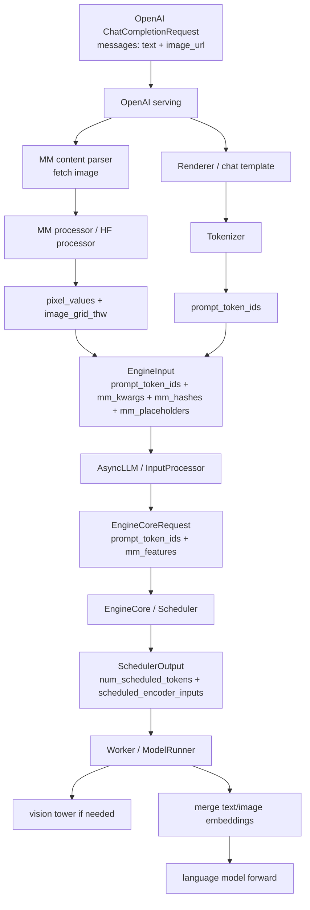
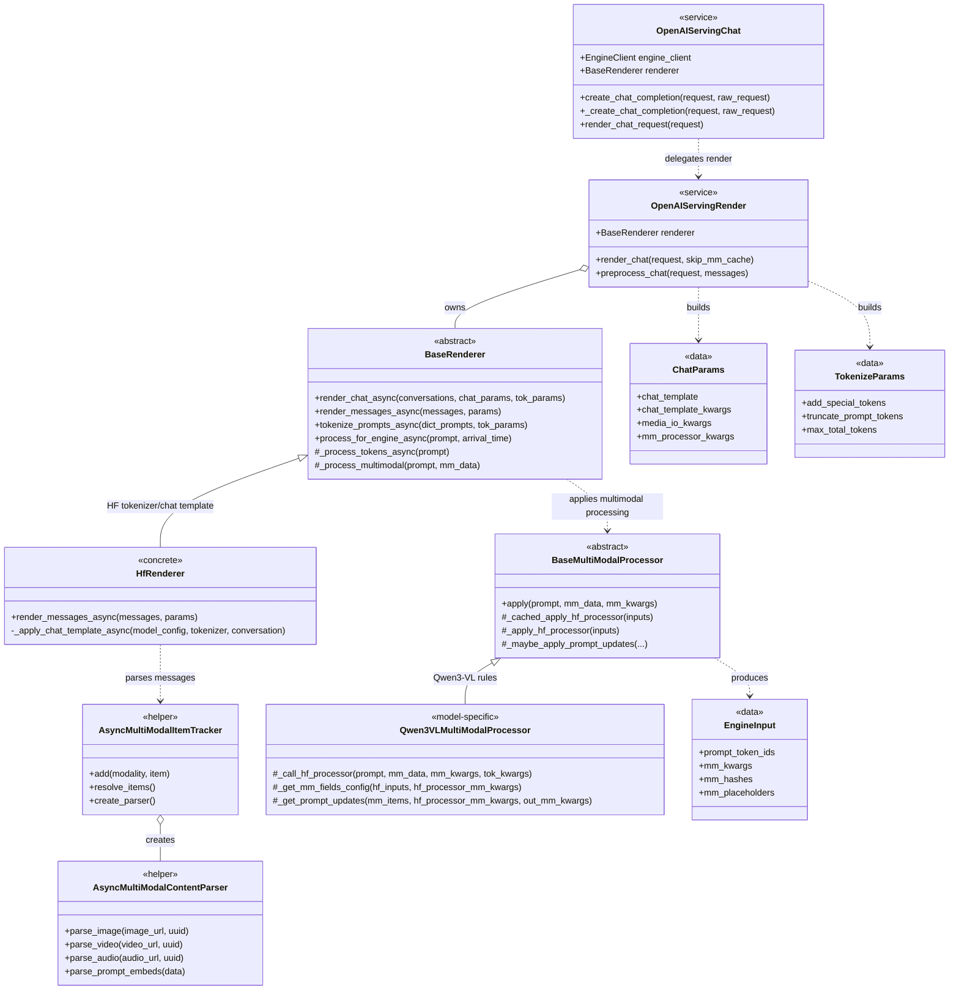
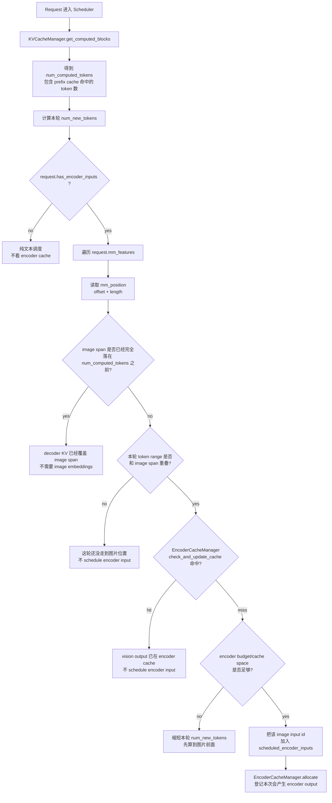
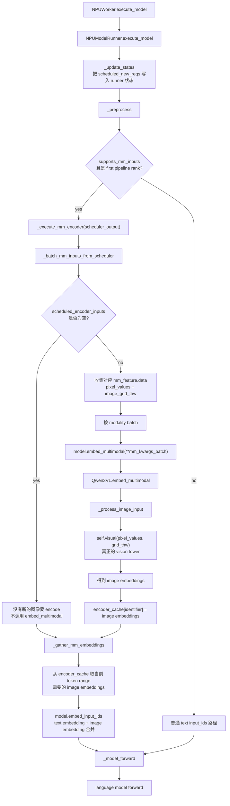
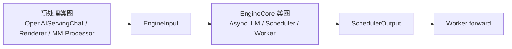

# vLLM 多模态请求类图：预处理到 EngineCore

这份文档只做一件事：用类图把 Qwen3-VL 图文请求的两段链路串起来。

```text
第一段: API server / render / tokenizer / MM processor
    目标是把 OpenAI messages 变成 EngineInput。

第二段: AsyncLLM / EngineCore / Scheduler / Worker
    目标是把 EngineInput 变成可调度、可执行的模型计算。
```

先记住一句话：

```text
预处理阶段只准备 token ids、pixel_values、image_grid_thw、mm_hash 和 placeholder span。
EngineCore 之后才决定 prefix cache、encoder cache，以及 worker 是否真的跑 vision tower。
```

## 1. 整体数据流



这里有两个合流点：

```text
第一个合流点:
    tokenizer 的文本 token ids
    + HF processor 的图像预处理结果
    -> 合成 EngineInput。

第二个合流点:
    text embeddings
    + vision tower 或 encoder cache 给出的 image embeddings
    -> 合成 inputs_embeds，送进 language model。
```

## 2. 预处理部分类图

这一段发生在 engine 真正调度之前。它不跑 vision tower，也不查 prefix cache。



### 2.1 这一段每层负责什么

```text
OpenAIServingChat
    OpenAI Chat Completions 的 serving 入口。
    它负责接 request，调用 render_chat_request，然后把 EngineInput 交给 engine_client.generate。

OpenAIServingRender
    把 ChatCompletionRequest 拆成 renderer 需要的 ChatParams、TokenizeParams。

HfRenderer
    负责 messages -> conversation + DictPrompt。
    这里会套 chat template，并把 image_url 解析出来挂到 multi_modal_data。

BaseRenderer
    负责 DictPrompt -> TokPrompt -> EngineInput。
    tokenize_prompts_async 只 tokenize 文本 prompt。
    process_for_engine_async 才会进入多模态 processor。

Qwen3VLMultiModalProcessor
    负责 Qwen3-VL 的图像预处理规则。
    它会让 HF processor 输出 pixel_values / image_grid_thw。
    它也会根据 image_grid_thw 把 image placeholder 展开成一段 image_token_id。
```

### 2.2 预处理阶段的输出

预处理结束后，给 engine 的不是原始 image_url，而是类似这样的结构：

```text
EngineInput:
    prompt_token_ids:
        文本 token ids + 展开后的 image_token_id 序列

    mm_kwargs:
        pixel_values
        image_grid_thw

    mm_hashes:
        image 对应的 hash / uuid

    mm_placeholders:
        image embedding 应该覆盖 prompt token 序列里的哪个 span
```

注意：

```text
pixel_values / image_grid_thw 还不是 image embedding。
它们只是 vision tower 的输入。
```

## 3. EngineCore 部分类图

从 `engine_client.generate` 往后，核心可以拆成 Scheduler 半边和 Worker 半边。

```text
Scheduler 半边:
    管排队、prefix cache、encoder cache、token budget。
    它决定本轮 scheduler_output 里是否带 scheduled_encoder_inputs。

Worker 半边:
    真正执行模型。
    它根据 scheduled_encoder_inputs 决定是否跑 vision tower。
```



```mermaid
classDiagram
    direction LR

    class AsyncLLM {
        <<frontend>>
        +BaseRenderer renderer
        +InputProcessor input_processor
        +EngineCoreClient engine_core
        +generate(prompt, sampling_params, request_id)
        +add_request(request_id, prompt, params)
    }

    class InputProcessor {
        <<adapter>>
        +process_inputs(request_id, prompt, params)
        -_get_mm_identifier(base_mm_hash, lora_request)
    }

    class EngineCoreRequest {
        <<data>>
        +request_id
        +prompt_token_ids
        +mm_features
        +sampling_params
        +cache_salt
    }

    class MultiModalFeatureSpec {
        <<data>>
        +data
        +modality
        +identifier
        +mm_position
        +mm_hash
    }

    class EngineCoreClient {
        <<client>>
        +add_request_async(request)
        +abort_requests_async(request_ids)
    }

    class EngineCore {
        <<engine>>
        +Scheduler scheduler
        +Executor model_executor
        +add_request(request)
        +step()
    }

    class Request {
        <<runtime-state>>
        +all_token_ids
        +block_hashes
        +mm_features
        +num_computed_tokens
        +has_encoder_inputs
    }

    class Scheduler {
        <<scheduler>>
        +KVCacheManager kv_cache_manager
        +EncoderCacheManager encoder_cache_manager
        +schedule()
        -_try_schedule_encoder_inputs(request, num_computed_tokens, num_new_tokens)
    }

    class KVCacheManager {
        <<cache-manager>>
        +get_computed_blocks(request)
    }

    class EncoderCacheManager {
        <<cache-manager>>
        +check_and_update_cache(request, input_id)
        +can_allocate(request, input_id, budget, already_scheduled)
        +allocate(request, input_id)
        +get_freed_mm_hashes()
    }

    class SchedulerOutput {
        <<data>>
        +scheduled_new_reqs
        +num_scheduled_tokens
        +scheduled_encoder_inputs
        +free_encoder_mm_hashes
    }

    class Executor {
        <<executor>>
        +execute_model(scheduler_output)
        +sample_tokens(grammar_output)
    }

    class NPUWorker {
        <<worker>>
        +NPUModelRunner model_runner
        +execute_model(scheduler_output)
    }

    class NPUModelRunner {
        <<runner>>
        +encoder_cache
        +execute_model(scheduler_output)
        #_preprocess(scheduler_output, num_input_tokens)
        #_gather_mm_embeddings(scheduler_output)
    }

    class GPUModelRunner {
        <<base-runner>>
        +encoder_cache
        #_execute_mm_encoder(scheduler_output)
        #_gather_mm_embeddings(scheduler_output)
        #_preprocess(scheduler_output, num_input_tokens)
    }

    class Qwen3VLForConditionalGeneration {
        <<model>>
        +Qwen3_VisionTransformer visual
        +embed_multimodal(**kwargs)
        +embed_input_ids(input_ids, multimodal_embeddings, is_multimodal)
        +forward(input_ids, positions, inputs_embeds)
    }

    class Qwen3_VisionTransformer {
        <<vision-tower>>
        +patch_embed
        +blocks
        +merger
        +forward(pixel_values, grid_thw)
    }

    AsyncLLM o-- InputProcessor : owns
    AsyncLLM o-- EngineCoreClient : owns
    InputProcessor ..> EngineCoreRequest : creates
    EngineCoreRequest "1" o-- "0..*" MultiModalFeatureSpec : mm_features
    EngineCoreClient ..> EngineCore : sends ADD
    EngineCore ..> Request : creates runtime state
    Request "1" o-- "0..*" MultiModalFeatureSpec : mm_features
    EngineCore o-- Scheduler : owns
    EngineCore o-- Executor : owns
    Scheduler o-- KVCacheManager : prefix cache
    Scheduler o-- EncoderCacheManager : encoder cache state
    Scheduler ..> SchedulerOutput : emits
    EngineCore ..> Executor : execute_model(output)
    Executor ..> NPUWorker : RPC / local call
    NPUWorker o-- NPUModelRunner : owns
    NPUModelRunner --|> GPUModelRunner : reuses MM path
    GPUModelRunner ..> Qwen3VLForConditionalGeneration : calls model APIs
    Qwen3VLForConditionalGeneration o-- Qwen3_VisionTransformer : visual
```

### 3.1 EngineCore 之后的最短流程

```text
AsyncLLM.generate
  -> InputProcessor.process_inputs
      -> EngineCoreRequest(prompt_token_ids, mm_features)
  -> EngineCoreClient.add_request_async
      -> EngineCore.add_request
          -> Request(mm_features, block_hashes)
  -> EngineCore.step
      -> Scheduler.schedule
          -> KVCacheManager.get_computed_blocks
          -> Scheduler._try_schedule_encoder_inputs
          -> SchedulerOutput
      -> Executor.execute_model
          -> NPUWorker.execute_model
          -> NPUModelRunner.execute_model
              -> _preprocess
                  -> _execute_mm_encoder
                  -> _gather_mm_embeddings
                  -> embed_input_ids
              -> _model_forward
```

这里最重要的分工是：

```text
Scheduler 判断“这轮要不要安排 vision encoder 输入”。
Worker 判断“收到安排后，实际跑 vision tower，还是从 encoder_cache 取结果”。
```

## 4. 多模态相关对象怎么传

### 4.1 EngineInput 到 EngineCoreRequest

预处理阶段得到：

```text
mm_kwargs
mm_hashes
mm_placeholders
```

进入 `InputProcessor.process_inputs` 后，会被整理成：

```text
MultiModalFeatureSpec:
    data:
        该图像对应的 pixel_values / image_grid_thw 等输入

    identifier:
        多模态输入的稳定标识
        后面 encoder cache 和 prefix block extra key 都会用它

    mm_position:
        该图像 span 在 prompt_token_ids 里的 offset 和 length

    mm_hash:
        原始多模态 hash
```

从这一步开始，Scheduler 和 Worker 基本不再关心原始 image_url。

### 4.2 Scheduler 看什么

Scheduler 主要看两件事：

```text
1. prefix cache:
    用 request.block_hashes 查 decoder KV 已经算到了哪里。
    得到 num_computed_tokens。

2. encoder cache:
    看当前本轮要算的 token range 是否碰到 image span。
    如果碰到，再看该 image identifier 的 vision output 是否已经缓存。
```

判断逻辑可以简化成：

```text
当前要算的 token range:
    [num_computed_tokens, num_computed_tokens + num_new_tokens)

图像占位 span:
    [mm_position.offset, mm_position.offset + mm_position.length)

如果两者不重叠:
    这轮不需要 image embeddings。

如果两者重叠，但 encoder cache 命中:
    不 schedule encoder input。

如果两者重叠，且 encoder cache miss:
    把 image input id 放入 scheduled_encoder_inputs。
```

### 4.3 Worker 看什么

Worker 收到的是 `SchedulerOutput`。

```text
SchedulerOutput:
    num_scheduled_tokens:
        每个 request 本轮要 forward 多少 token

    scheduled_encoder_inputs:
        哪些 request 的哪些 multimodal input 需要跑 encoder

    free_encoder_mm_hashes:
        哪些 encoder cache 项可以从 worker 侧释放
```

Worker 侧有自己的 `encoder_cache`：

```text
worker encoder_cache:
    key:
        mm_feature.identifier

    value:
        vision tower 输出的 image embeddings
```

如果 `scheduled_encoder_inputs` 为空，不代表没有图像；它只说明这轮没有新的图像需要跑 vision tower。

### 4.4 Scheduler 怎么判断命中

Scheduler 的多模态判断不是直接看“请求里有没有图片”，而是看：

```text
prefix cache 已经让 decoder KV 算到了哪里？
本轮还需要 forward 的 token range 是否碰到 image span？
如果碰到，encoder cache 里是否已经有该图片的 vision output？
```

流程可以画成：



这里的三个“命中”不是同一个东西：

```text
prefix cache hit:
    结果是 num_computed_tokens 变大。
    如果它覆盖 image span，Scheduler 直接认为 decoder KV 已经有了这段结果。

encoder cache hit:
    结果是不把 image input id 放入 scheduled_encoder_inputs。
    它只说明 vision tower 输出可复用，不说明 decoder KV 可复用。

MM processor cache hit:
    更早发生在预处理阶段。
    它只省 HF processor，不参与 Scheduler 的这个判断。
```

换成一句更短的话：

```text
Scheduler 先用 prefix cache 决定“decoder 已经算到哪里”，
再用 encoder cache 决定“如果还需要 image embeddings，要不要重新跑 vision tower”。
```

### 4.5 Worker 怎么进入 vision tower

Worker 不重新判断 prefix cache。它只执行 `SchedulerOutput`。



因此 worker 进入 vision tower 的条件非常具体：

```text
scheduled_encoder_inputs 非空
    且其中某个 mm_feature.data 不是 prompt_embeds 这类 passthrough
    且没有 encoder cudagraph replay 等替代路径直接给出结果
```

对普通 Qwen3-VL image_url 请求，可以简化成：

```text
scheduled_encoder_inputs 有 image id
  -> _execute_mm_encoder 收集 pixel_values / image_grid_thw
  -> model.embed_multimodal
  -> Qwen3VL._process_image_input
  -> self.visual(pixel_values, grid_thw)
```

如果第二次请求同图，并且 encoder cache 命中：

```text
scheduled_encoder_inputs 里不会包含这个 image id。
_execute_mm_encoder 不会调用 model.embed_multimodal。
worker 只在 _gather_mm_embeddings 里从 encoder_cache 取之前的 image embeddings。
```

## 5. 第二次同图请求怎么复用

### 5.1 prefix cache 覆盖 image span

```text
prefix cache hit length >= image span end
```

这时 decoder KV 已经覆盖图像 span：

```text
不用重新跑 vision tower。
也不用重新 merge image embeddings。
只需要继续算未命中的 token，或者为了 logits 重算最后一个 token。
```

### 5.2 prefix cache 没覆盖 image span，但 encoder cache 命中

这是最容易混的场景：

```text
prefix cache 没命中 image span
    说明 decoder KV 不能直接复用到那里。

encoder cache 命中
    说明同一张图的 vision tower 输出还在。
```

执行结果是：

```text
Scheduler:
    不把 image input id 放进 scheduled_encoder_inputs。

Worker:
    不调用 model.embed_multimodal。
    不进入 self.visual。
    从 encoder_cache 取 image embeddings。
    仍然需要把 image embeddings merge 进 inputs_embeds。
    仍然需要跑 language model prefill。
```

所以这时省掉的是：

```text
vision tower
```

没有省掉的是：

```text
decoder prefill
```

### 5.3 prefix cache 没覆盖 image span，encoder cache 也没命中

这时才会真正跑 vision tower：

```text
Scheduler:
    把 image input id 放入 scheduled_encoder_inputs。

Worker:
    _execute_mm_encoder
      -> model.embed_multimodal
          -> Qwen3VLForConditionalGeneration._process_image_input
              -> self.visual(pixel_values, grid_thw)
```

得到 image embeddings 后：

```text
worker encoder_cache[identifier] = image_embeddings
embed_input_ids 合并 text embeddings 和 image embeddings
language model forward
```

## 6. 两张类图如何连起来



连接点就是 `EngineInput`：

```text
预处理类图的终点:
    EngineInput(prompt_token_ids, mm_kwargs, mm_hashes, mm_placeholders)

EngineCore 类图的起点:
    AsyncLLM.generate 接收 EngineInput
    InputProcessor 把它转成 EngineCoreRequest(prompt_token_ids, mm_features)
```

可以把两段记成：

```text
Renderer / Processor:
    把“用户输入”整理成“engine 能懂的输入”。

EngineCore / Scheduler / Worker:
    把“engine 输入”整理成“本轮要执行的模型计算”。
```

## 7. 源码模块速查

预处理部分：

`@C:/Users/z00943858/Desktop/lzx-vllmascend0210/vllm-0.21.0/vllm/entrypoints/openai/chat_completion/serving.py`

`@C:/Users/z00943858/Desktop/lzx-vllmascend0210/vllm-0.21.0/vllm/entrypoints/serve/render/serving.py`

`@C:/Users/z00943858/Desktop/lzx-vllmascend0210/vllm-0.21.0/vllm/renderers/base.py`

`@C:/Users/z00943858/Desktop/lzx-vllmascend0210/vllm-0.21.0/vllm/renderers/hf.py`

`@C:/Users/z00943858/Desktop/lzx-vllmascend0210/vllm-0.21.0/vllm/entrypoints/chat_utils.py`

`@C:/Users/z00943858/Desktop/lzx-vllmascend0210/vllm-0.21.0/vllm/multimodal/processing/processor.py`

EngineCore / Scheduler / Worker 部分：

`@C:/Users/z00943858/Desktop/lzx-vllmascend0210/vllm-0.21.0/vllm/v1/engine/async_llm.py`

`@C:/Users/z00943858/Desktop/lzx-vllmascend0210/vllm-0.21.0/vllm/v1/engine/input_processor.py`

`@C:/Users/z00943858/Desktop/lzx-vllmascend0210/vllm-0.21.0/vllm/v1/engine/core.py`

`@C:/Users/z00943858/Desktop/lzx-vllmascend0210/vllm-0.21.0/vllm/v1/core/sched/scheduler.py`

`@C:/Users/z00943858/Desktop/lzx-vllmascend0210/vllm-0.21.0/vllm/v1/core/kv_cache_manager.py`

`@C:/Users/z00943858/Desktop/lzx-vllmascend0210/vllm-0.21.0/vllm/v1/core/encoder_cache_manager.py`

`@C:/Users/z00943858/Desktop/lzx-vllmascend0210/vllm-0.21.0/vllm/v1/worker/gpu_model_runner.py`

`@C:/Users/z00943858/Desktop/lzx-vllmascend0210/vllm-ascend-0.21.0rc1/vllm_ascend/worker/worker.py`

`@C:/Users/z00943858/Desktop/lzx-vllmascend0210/vllm-ascend-0.21.0rc1/vllm_ascend/worker/model_runner_v1.py`

Qwen3-VL 模型部分：

`@C:/Users/z00943858/Desktop/lzx-vllmascend0210/vllm-0.21.0/vllm/model_executor/models/qwen3_vl.py`

## 8. 最短记忆

```text
预处理:
    messages -> EngineInput
    产出 token ids、pixel_values、image_grid_thw、mm_hash、placeholder span。

EngineCore:
    EngineInput -> EngineCoreRequest -> Request。

Scheduler:
    先查 prefix cache。
    再根据 image span 和 encoder cache 决定 scheduled_encoder_inputs。

Worker:
    scheduled_encoder_inputs 有内容，才可能跑 vision tower。
    encoder cache 命中时，不跑 vision tower，只 gather image embeddings。

Qwen3-VL:
    self.visual 才是 vision tower。
    embed_input_ids 负责把 text embeddings 和 image embeddings 合起来。
```
