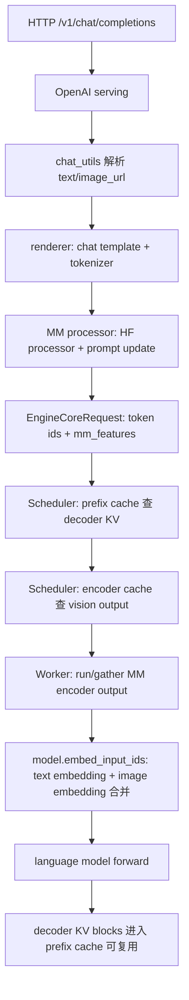
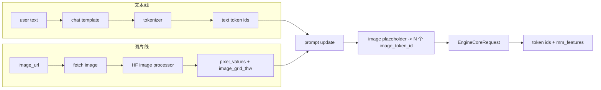
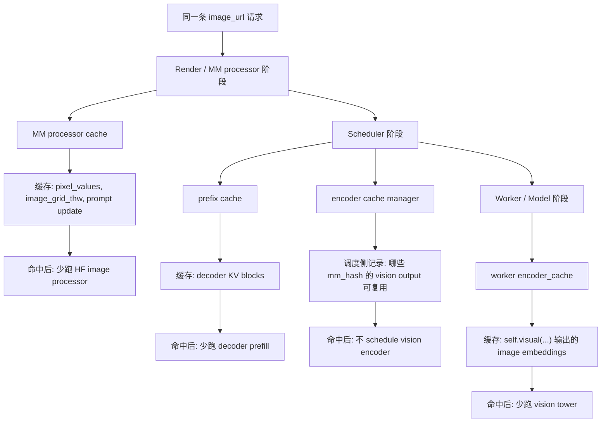
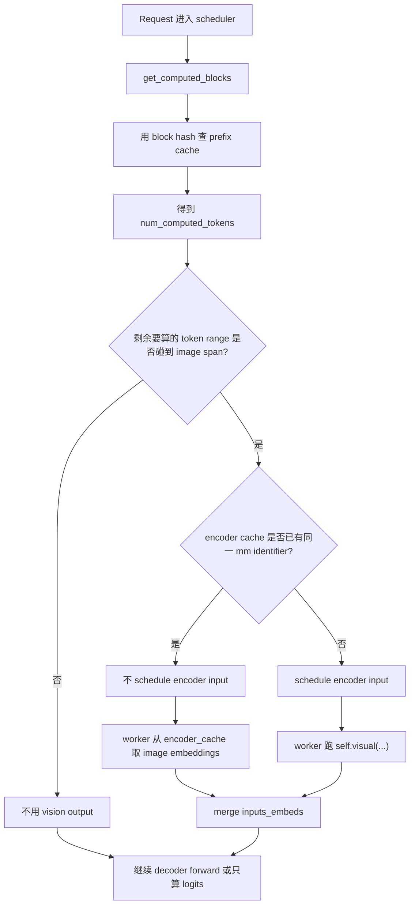
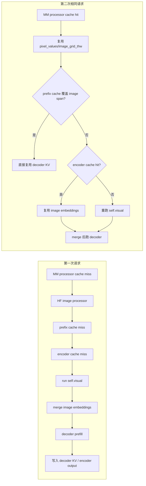
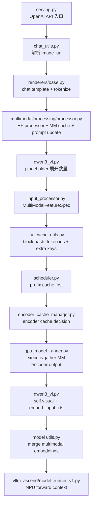
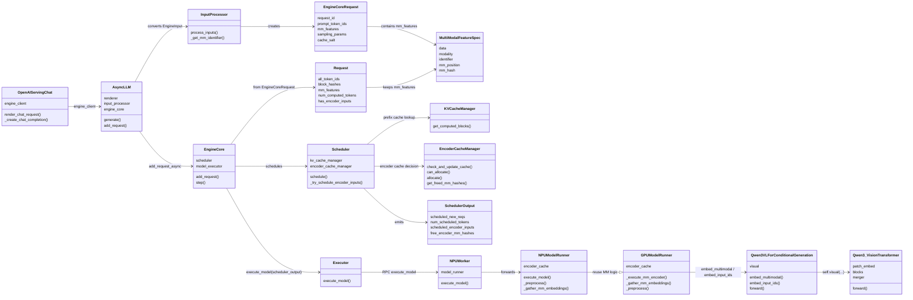
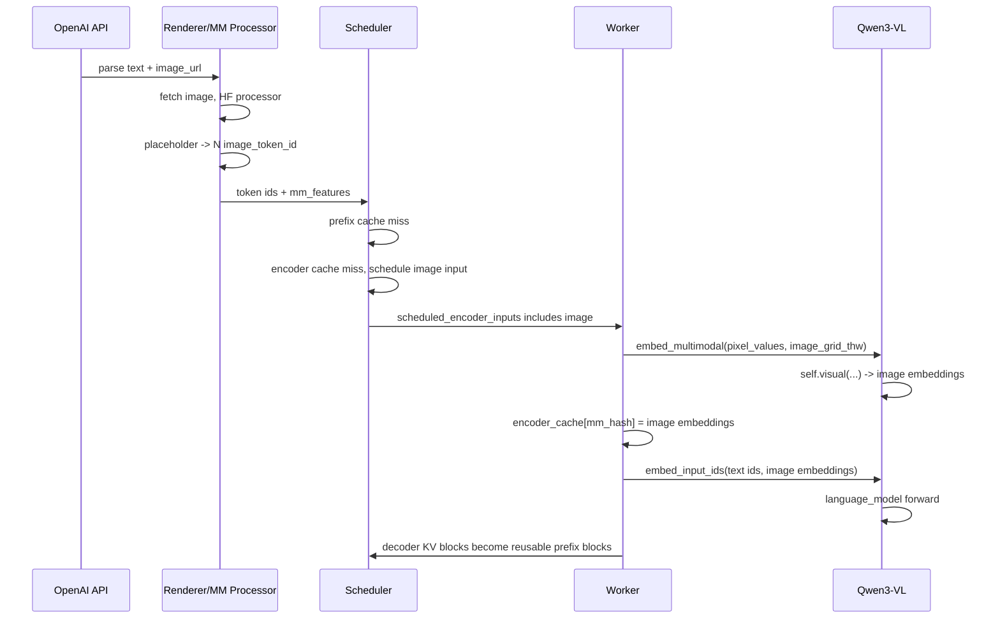
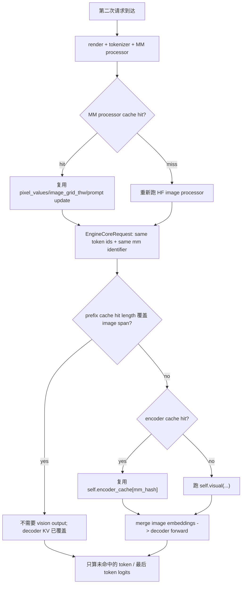

# vLLM + vLLM-Ascend 多模态请求代码伴读

本文按本地源码重新串一次 Qwen3-VL 的 `text + image_url` 请求处理全过程，重点回答：

- 文本和图片分别在哪里被处理？
- tokenizer 处理的是什么？
- HF image processor 输出的是什么？
- vision encoder 在哪里跑，什么时候产出 image embedding？
- `MM cache`、`encoder cache`、`prefix cache` 各自缓存什么，第二次请求如何复用？
- block hash 是否基于 token id，而不是 embedding？

源码基线：

```text
C:/Users/z00943858/Desktop/lzx-vllmascend0210/vllm-0.21.0
tag: v0.21.0
commit: ad7125a431e176d4161099480a66f0169609a690

C:/Users/z00943858/Desktop/lzx-vllmascend0210/vllm-ascend-0.21.0rc1
tag: v0.21.0rc1
commit: 80610e4438dba05011b05f89fc45d91e96992671
```

## 0. 先给结论

一条 OpenAI Chat Completions 多模态请求，在 vLLM V1 里大致是：



三层缓存要分清：

| 缓存 | 缓存对象 | 发生位置 | 命中后省什么 |
|---|---|---|---|
| MM processor cache | HF processor 之后的 `mm_kwargs` / prompt update 信息，例如 `pixel_values`、`image_grid_thw` | render / processor 阶段 | 省 HF image processor 的预处理 |
| encoder cache | vision tower 输出的 image embeddings，也就是 `self.visual(...)` 的结果 | scheduler + worker 阶段 | 省 vision encoder |
| prefix cache | decoder 已算过的 KV blocks | scheduler / KV cache manager | 省 decoder prefill token forward |

非常关键的一句话：

```text
image_url 请求里的图片不会被 tokenizer 直接 token 成 image embedding。
tokenizer 只得到文本 token id 和图像占位 token id。
image embedding 是 worker 阶段跑 vision encoder 后，再覆盖进 inputs_embeds 的。
```

## 0.1 先看图：把脑内地图搭起来

如果后面的源码片段看起来散，先按这几张图读。建议顺序是：先看“文本线/图片线”，再看“三层缓存”，最后看“第二次请求怎么分叉”。

### 图 1：文本和图片是两条线，直到 prompt update 才合到一起



这张图对应一个核心理解：

```text
tokenizer 不把图片变成 embedding。
tokenizer 看到的是文本和图像占位 token。
HF image processor 负责把图片变成 pixel_values/image_grid_thw。
prompt update 根据 image_grid_thw 决定要放多少个 image_token_id。
```

### 图 2：三层缓存不是一回事



可以把三层缓存记成这句话：

```text
MM cache 省图片预处理。
encoder cache 省 vision tower。
prefix cache 省 decoder KV prefill。
```

### 图 3：scheduler 的判断顺序：prefix cache 在前，encoder cache 在后



这里最容易卡住的是这个分叉：

```text
prefix cache 没覆盖 image span，不代表一定重跑 vision tower。
只要 encoder cache 有同一张图的 vision output，就能复用 image embeddings。
```

### 图 4：第一次请求和第二次请求的差异



同一个日志里的命中率可以对应到不同层：

```text
MM cache hit rate:
    更靠前，说明 HF processor 后的多模态输入复用情况。

Prefix cache hit rate:
    更靠后，说明 decoder KV block 复用情况。

两者可能同时高，也可能一个高一个低。
```

### 图 5：源码坐标图：先看主干，再看细节



读后面代码时，可以按这条主干找，不要一开始就陷进某个文件的局部函数里。

## 1. vLLM-Ascend 和 upstream vLLM 的边界

你起的是 vLLM-Ascend 服务，但 OpenAI API、chat content 解析、MM processor、prefix hash、scheduler 的核心逻辑都来自 upstream vLLM。Ascend 侧主要选择 NPU worker/model runner，并在 runner、attention、图模式、部分模型 patch 上接管执行。

```text
vllm-ascend-0.21.0rc1/vllm_ascend/platform.py:602-614
```

```python
602:        if parallel_config and parallel_config.worker_cls == "auto":
603:            # TODO: this is a tricky way to disable `use_sequence_parallel_moe` in vllm.
604:            if not vllm_config.compilation_config.pass_config.enable_sp:
605:                parallel_config.all2all_backend = "flashinfer_all2allv"
606:            if is_310p():
607:                parallel_config.worker_cls = "vllm_ascend._310p.worker_310p.NPUWorker310"
608:            elif ascend_config.xlite_graph_config.enabled:
609:                logger.info("openEuler Xlite enabled. See: https://atomgit.com/openeuler/GVirt/tree/master/xlite")
610:                parallel_config.worker_cls = "vllm_ascend.xlite.xlite_worker.XliteWorker"
611:            else:
612:                parallel_config.worker_cls = "vllm_ascend.worker.worker.NPUWorker"
613:
614:        refresh_block_size(vllm_config)
```

`NPUWorker` 初始化时会打 Ascend patch，然后创建 `NPUModelRunner`。

```text
vllm-ascend-0.21.0rc1/vllm_ascend/worker/worker.py:99-102
vllm-ascend-0.21.0rc1/vllm_ascend/worker/worker.py:320-333
vllm-ascend-0.21.0rc1/vllm_ascend/worker/worker.py:474-510
```

```python
 99:        # register patch for vllm
100:        from vllm_ascend.utils import adapt_patch
101:
102:        adapt_patch()
```

```python
320:        # for more details
321:        self.device = self._init_device()
322:        # Initialize workspace manager
323:        num_ubatches = 1
324:        init_workspace_manager(self.device, num_ubatches)
325:        # Init ModelRunner here, so that we have access to self.device.
326:        if self.use_v2_model_runner:
327:            logger.warning("npu model runner v2 is in developing, some features doesn't work for now.")
328:            from vllm_ascend.worker.v2.model_runner import NPUModelRunner as NPUModelRunnerV2
329:
330:            self.model_runner = NPUModelRunnerV2(self.vllm_config, self.device)
331:        else:
332:            self.model_runner = NPUModelRunner(self.vllm_config, self.device)
333:
```

```python
474:    def execute_model(
475:        self,
476:        scheduler_output: "SchedulerOutput",
477:    ) -> ModelRunnerOutput | AsyncModelRunnerOutput | None:
478:        self.profile_memory()
...
510:        output = self.model_runner.execute_model(scheduler_output, intermediate_tensors)
```

`NPUModelRunner` 继承 upstream 的 `GPUModelRunner`，所以很多多模态方法直接复用 upstream。

```text
vllm-ascend-0.21.0rc1/vllm_ascend/worker/model_runner_v1.py:104-105
vllm-ascend-0.21.0rc1/vllm_ascend/worker/model_runner_v1.py:255-276
```

```python
104:from vllm.v1.worker.gpu_model_runner import AsyncGPUModelRunnerOutput, GPUModelRunner
105:from vllm.v1.worker.ubatch_utils import (
```

```python
255:class NPUModelRunner(GPUModelRunner):
256:    def __init__(self, vllm_config: VllmConfig, device: torch.device):
...
274:        with _torch_cuda_wrapper():
275:            super().__init__(vllm_config, device)
276:
```

## 2. HTTP 入口：OpenAI serving 先 render，再交给 engine

Chat Completions 请求先进入 serving，`render_chat_request()` 做校验并委托 renderer。

```text
vllm-0.21.0/vllm/entrypoints/openai/chat_completion/serving.py:198-223
```

```python
198:    async def render_chat_request(
199:        self,
200:        request: ChatCompletionRequest,
201:    ) -> tuple[list[ConversationMessage], list[EngineInput]] | ErrorResponse:
...
212:        error_check_ret = await self._check_model(request)
213:        if error_check_ret is not None:
214:            logger.error("Error with model %s", error_check_ret)
215:            return error_check_ret
...
223:        return await self.openai_serving_render.render_chat(request)
```

然后 `_create_chat_completion()` 拿到 `engine_inputs`，逐个交给 engine。

```text
vllm-0.21.0/vllm/entrypoints/openai/chat_completion/serving.py:241-260
vllm-0.21.0/vllm/entrypoints/openai/chat_completion/serving.py:347-350
```

```python
241:    async def _create_chat_completion(
242:        self,
243:        request: ChatCompletionRequest,
244:        raw_request: Request | None = None,
...
256:        result = await self.render_chat_request(request)
257:        if isinstance(result, ErrorResponse):
258:            return result
259:
260:        conversation, engine_inputs = result
```

```python
347:                generator = self.engine_client.generate(
348:                    engine_input,
349:                    sampling_params,
350:                    sub_request_id,
```

到这里，还是 API 层。真正把 `image_url` 变成 PIL image / placeholder / `mm_kwargs` 的逻辑在 renderer 和 multimodal processor。

## 3. chat_utils：解析 `image_url`，并放入多模态 tracker

OpenAI content part 里的 `image_url` 先在 `MM_PARSER_MAP` 中识别。

```text
vllm-0.21.0/vllm/entrypoints/chat_utils.py:1439-1440
```

```python
1439:    "input_image": lambda part: _ResponsesInputImageParser(part).get("image_url", None),
1440:    "image_url": lambda part: _ImageParser(part).get("image_url", {}).get("url", None),
```

content part 被解析后，会调用 `mm_parser.parse_image(...)`。

```text
vllm-0.21.0/vllm/entrypoints/chat_utils.py:1673-1682
```

```python
1673:
1674:    modality = None
1675:    if part_type == "image_pil":
1676:        image_content = cast(Image.Image, content) if content is not None else None
1677:        mm_parser.parse_image_pil(image_content, uuid)
1678:        modality = "image"
1679:    elif part_type in ("image_url", "input_image"):
1680:        str_content = cast(str, content)
1681:        mm_parser.parse_image(str_content, uuid)
1682:        modality = "image"
```

异步 parser 会 fetch image，然后把 `(image, uuid)` 放到 tracker，同时在文本流里加 placeholder。

```text
vllm-0.21.0/vllm/entrypoints/chat_utils.py:1106-1116
```

```python
1106:    async def _image_with_uuid_async(self, image_url: str | None, uuid: str | None):
1107:        image = (
1108:            await self._connector.fetch_image_async(image_url) if image_url else None
1109:        )
1110:        return image, uuid
1111:
1112:    def parse_image(self, image_url: str | None, uuid: str | None = None) -> None:
1113:        coro = self._image_with_uuid_async(image_url, uuid)
1114:
1115:        placeholder = self._tracker.add("image", coro)
1116:        self._add_placeholder("image", placeholder)
```

注意这里的 placeholder 还不是最终 N 个 image token，只是 render 阶段用来占位，后面会被 Qwen3-VL processor 根据图片网格大小展开。

## 4. renderer：chat template + tokenizer + MM processor

`render_chat_async()` 负责把 chat messages 变成 token prompt，再调用 `process_for_engine_async()`。

```text
vllm-0.21.0/vllm/renderers/base.py:998-1034
```

```python
 998:    async def render_chat_async(
 999:        self,
1000:        conversations: Sequence[list["ChatCompletionMessageParam"]],
1001:        chat_params: ChatParams,
1002:        tok_params: TokenizeParams | None = None,
1003:        *,
...
1025:        self._apply_prompt_extras(tok_prompts, prompt_extras)
1026:
1027:        eng_prompts = await asyncio.gather(
1028:            *(
1029:                self.process_for_engine_async(
1030:                    p, arrival_time, skip_mm_cache=skip_mm_cache
1031:                )
1032:                for p in tok_prompts
1033:            )
1034:        )
```

如果 prompt 带 `multi_modal_data`，就进入 `_process_multimodal()`，这里会创建 `MMProcessorInputs`，然后调用 `mm_processor.apply(...)`。

```text
vllm-0.21.0/vllm/renderers/base.py:666-704
```

```python
666:    def _process_multimodal(
667:        self,
668:        prompt: list[int] | str,
669:        mm_data: MultiModalDataDict,
670:        mm_uuids: MultiModalUUIDDict | None,
671:        mm_processor_kwargs: Mapping[str, object] | None,
...
699:        with set_default_torch_num_threads():
700:            mm_inputs = mm_processor.apply(mm_processor_inputs, mm_timing_ctx)
701:
702:        self.update_mm_cache_stats()
703:
704:        return mm_inputs
```

这里可以拆成两条线：

```text
文本线: chat template -> tokenizer -> prompt_token_ids
图片线: image_url -> PIL image -> HF image processor -> pixel_values/image_grid_thw
```

最后两条线在 prompt update 阶段合并：文本 token id 里代表图片的 placeholder，会按图片 feature 数展开成多个 image token id。

## 5. MM processor cache：复用 HF processor 输出，不是复用 vision tower 输出

`BaseMultiModalProcessor.apply()` 的注释直接写了三步：

```text
vllm-0.21.0/vllm/multimodal/processing/processor.py:1663-1707
```

```python
1663:    def apply(
1664:        self,
1665:        inputs: ProcessorInputs,
1666:        timing_ctx: TimingContext,
1667:    ) -> MultiModalInput:
1668:        """
1669:        Process multi-modal inputs to be used in vLLM.
1670:
1671:        The main steps are:
1672:
1673:        1. Apply HF Processor on prompt text and multi-modal data together,
1674:           outputting token IDs and processed tensors.
1675:        2. Find and update sequences in the token IDs with placeholder tokens.
1676:           The number of placeholder tokens equals the feature size of the
1677:           multi-modal data outputted by the multi-modal encoder.
1678:        3. Extract information about the placeholder tokens from the
1679:           processed token IDs.
1680:        """
1681:        (
1682:            prompt_ids,
1683:            mm_info,
1684:            is_update_applied,
1685:        ) = self._cached_apply_hf_processor(inputs, timing_ctx)
...
1702:        return mm_input(
1703:            prompt_token_ids=prompt_ids,
1704:            mm_kwargs=mm_info.kwargs,
1705:            mm_hashes=mm_info.hashes,
1706:            mm_placeholders=mm_placeholder_ranges,
1707:        )
```

`_cached_apply_hf_processor()` 的缓存点在 HF processor 前后。命中时，它复用 processor 后的 `mm_kwargs` / prompt update 信息。

```text
vllm-0.21.0/vllm/multimodal/processing/processor.py:1441-1510
```

```python
1441:    def _cached_apply_hf_processor(
1442:        self,
1443:        inputs: ProcessorInputs,
1444:        timing_ctx: TimingContext,
1445:    ) -> tuple[list[int], MultiModalProcessingInfo, bool]:
1446:        """
1447:        Apply the HF processor on the full prompt text,
1448:        caching the results and reusing cached results.
1449:        """
1450:        cache = self.cache
...
1456:        with timing_ctx.record("get_mm_hashes"):
1457:            mm_hashes = inputs.get_mm_hashes(self.info.model_id)
1458:
1459:        with timing_ctx.record("get_cache_missing_items"):
1460:            mm_is_cached, mm_missing_data_items = self._get_cache_missing_items(
1461:                cache=cache,
1462:                mm_data_items=inputs.mm_data_items,
1463:                mm_hashes=mm_hashes,
1464:            )
...
1469:        with timing_ctx.record("apply_hf_processor"):
1470:            (
1471:                prompt_ids,
1472:                mm_missing_processed_data,
1473:                is_update_applied,
1474:            ) = self._apply_hf_processor_main(
1475:                prompt=inputs.prompt,
1476:                mm_items=mm_missing_data_items,
1477:                hf_processor_mm_kwargs=inputs.hf_processor_mm_kwargs,
1478:                tokenization_kwargs=inputs.tokenization_kwargs,
1479:                enable_hf_prompt_update=False,
1480:            )
...
1495:        with timing_ctx.record("merge_mm_kwargs"):
1496:            mm_kwargs, mm_prompt_updates = self._merge_mm_kwargs(
1497:                cache,
1498:                mm_hashes=mm_hashes,
1499:                mm_is_cached=mm_is_cached,
1500:                mm_missing_kwargs=mm_missing_kwargs,
1501:                mm_missing_prompt_updates=mm_missing_prompt_updates,
1502:            )
...
1504:        mm_info = MultiModalProcessingInfo(
1505:            kwargs=mm_kwargs,
1506:            hashes=mm_hashes,
1507:            prompt_updates=mm_prompt_updates,
1508:        )
1509:
1510:        return prompt_ids, mm_info, is_update_applied
```

`mm_hashes` 默认来自多模态数据内容 + model id + processor kwargs。你的 curl 没传 uuid，所以同一张图通常要靠内容 hash 识别。

```text
vllm-0.21.0/vllm/multimodal/processing/inputs.py:25-69
```

```python
25:    def get_mm_hashes(self, model_id: str) -> MultiModalHashes:
26:        mm_data_items = self.mm_data_items
27:        mm_uuid_items = self.mm_uuid_items or {}
28:        hf_processor_mm_kwargs = self.hf_processor_mm_kwargs
29:
30:        mm_hashes = dict[str, list[str]]()
31:        hasher = MultiModalHasher
...
46:                    if uuid_item is None or hf_processor_mm_kwargs:
47:                        # NOTE: use provided hash string to hash with kwargs
48:                        # if available for better performance.
49:                        item = uuid_item if uuid_item is not None else item
50:                        hashes.append(
51:                            hasher.hash_kwargs(
52:                                model_id=model_id,
53:                                **{modality: item},
54:                                **hf_processor_mm_kwargs,
55:                            )
56:                        )
57:                    else:
58:                        hashes.append(uuid_item)
...
62:                mm_hashes[modality] = [
63:                    hasher.hash_kwargs(
64:                        model_id=model_id,
65:                        **{modality: item},
66:                        **hf_processor_mm_kwargs,
67:                    )
68:                    for item in data_items
69:                ]
```

这里的 MM cache 还没有跑 vision tower。它复用的是 HF processor 后的数据，例如 `pixel_values`、`image_grid_thw`。

## 6. HF image processor 输出到底是什么？

Qwen3-VL 的 processing info 继承 Qwen2-VL 的数据 parser，并使用 `Qwen3VLProcessor`。

```text
vllm-0.21.0/vllm/model_executor/models/qwen3_vl.py:863-875
```

```python
863:class Qwen3VLProcessingInfo(Qwen2VLProcessingInfo):
864:    def get_hf_config(self):
865:        return self.ctx.get_hf_config(Qwen3VLConfig)
866:
867:    def get_hf_processor(self, **kwargs: object) -> Qwen3VLProcessor:
868:        return self.ctx.get_hf_processor(
869:            Qwen3VLProcessor,
870:            use_fast=kwargs.pop("use_fast", True),
871:            **kwargs,
872:        )
873:
874:    def get_image_processor(self, **kwargs: object) -> Qwen2VLImageProcessorFast:
875:        return self.get_hf_processor(**kwargs).image_processor
```

Qwen2-VL/Qwen3-VL 的图像 processor 输出字段在 schema 里很直白：`pixel_values` 和 `image_grid_thw`。

```text
vllm-0.21.0/vllm/model_executor/models/qwen2_vl.py:121-145
```

```python
121:    """
122:    Dimensions:
123:        - np: The total number of patches over each image over each prompt in
124:              the batch
125:        - ni: Number of images
126:        - cps: Number of channels * patch_size * patch_size
127:
128:    Historical context:
129:        - pixel_values shape: (num_patches, num_channels * patch_size *
130:          patch_size)
131:        - image_grid_thw shape: (num_images, 3) in (grid_t, grid_h, grid_w)
132:          format
133:    """
134:
135:    type: Literal["pixel_values"]
136:
137:    pixel_values: Annotated[
138:        torch.Tensor,
139:        TensorShape("np", "cps"),
140:    ]
141:
142:    image_grid_thw: Annotated[
143:        torch.Tensor,
144:        TensorShape("ni", 3),
145:    ]
```

字段配置决定这些 HF 输出如何按 image item 切分、batch、保留在 CPU 或转设备。

```text
vllm-0.21.0/vllm/model_executor/models/qwen2_vl.py:723-750
```

```python
723:def _create_qwen2vl_field_factory(
724:    spatial_merge_size: int,
725:) -> Callable[
...
729:    def _qwen2vl_field_config(hf_inputs: Mapping[str, torch.Tensor]):
730:        image_grid_thw = hf_inputs.get("image_grid_thw", torch.empty((0, 3)))
731:        image_pixel_grid_sizes = image_grid_thw.prod(-1)
732:        image_embed_grid_sizes = (
733:            image_pixel_grid_sizes // spatial_merge_size // spatial_merge_size
734:        )
...
742:        return dict(
743:            pixel_values=MultiModalFieldConfig.flat_from_sizes(
744:                "image", image_pixel_grid_sizes
745:            ),
746:            image_embeds=MultiModalFieldConfig.flat_from_sizes(
747:                "image", image_embed_grid_sizes
748:            ),
749:            image_grid_thw=MultiModalFieldConfig.batched("image", keep_on_cpu=True),
750:            pixel_values_videos=MultiModalFieldConfig.flat_from_sizes(
```

结论：

```text
HF image processor 输出的是视觉 encoder 的输入张量和形状元数据。
它不是 language model hidden_size 的 image embedding。
image embedding 要等 worker 阶段调用 Qwen3-VL 的 self.visual(...) 才产生。
```

## 7. Qwen3-VL：placeholder 如何展开成 image token ids

Qwen3-VL 的占位字符串是固定的：

```text
vllm-0.21.0/vllm/model_executor/models/qwen3_vl.py:1636-1643
```

```python
1636:    @classmethod
1637:    def get_placeholder_str(cls, modality: str, i: int) -> str | None:
1638:        if modality.startswith("image"):
1639:            return "<|vision_start|><|image_pad|><|vision_end|>"
1640:        if modality.startswith("video"):
1641:            return "<|vision_start|><|video_pad|><|vision_end|>"
1642:
1643:        raise ValueError("Only image or video modality is supported")
```

真正替换数量来自 `image_grid_thw.prod() // merge_size**2`。

```text
vllm-0.21.0/vllm/model_executor/models/qwen3_vl.py:1343-1375
```

```python
1343:    def _get_mm_fields_config(
1344:        self,
1345:        hf_inputs: BatchFeature,
1346:        hf_processor_mm_kwargs: Mapping[str, object],
1347:    ) -> Mapping[str, MultiModalFieldConfig]:
1348:        return _create_qwen2vl_field_factory(
1349:            self.info.get_hf_config().vision_config.spatial_merge_size
1350:        )(hf_inputs)
...
1358:        hf_processor = self.info.get_hf_processor(**hf_processor_mm_kwargs)
1359:        image_processor = self.info.get_image_processor(**hf_processor_mm_kwargs)
1360:        tokenizer = self.info.get_tokenizer()
1361:        hf_config = self.info.get_hf_config()
...
1367:        merge_length = image_processor.merge_size**2
1368:
1369:        def get_image_replacement_qwen3vl(item_idx: int):
1370:            out_item = out_mm_kwargs["image"][item_idx]
1371:            grid_thw = out_item["image_grid_thw"].data
1372:            assert isinstance(grid_thw, torch.Tensor)
1373:
1374:            num_tokens = int(grid_thw.prod()) // merge_length
1375:            return [hf_processor.image_token_id] * num_tokens
```

所以 tokenizer / prompt update 之后，decoder 看到的是：

```text
普通文本 token ids
+ image_token_id 重复 N 次
+ 后续文本 token ids
```

此时仍然只是 token ids，不是 image embedding。

## 8. EngineCoreRequest：把 mm kwargs / placeholder / hash 变成 mm_features

processor 返回的 `mm_kwargs`、`mm_placeholders`、`mm_hashes` 会在 engine input processor 里被整理成 `MultiModalFeatureSpec`。

```text
vllm-0.21.0/vllm/v1/engine/input_processor.py:324-359
```

```python
324:        # Multimodal related.
325:        mm_features: list[MultiModalFeatureSpec] | None = None
326:
327:        if decoder_inputs["type"] == "multimodal":
328:            decoder_mm_inputs = decoder_inputs["mm_kwargs"]
329:            decoder_mm_positions = decoder_inputs["mm_placeholders"]
330:            decoder_mm_hashes = decoder_inputs["mm_hashes"]
...
341:            # Merge and flatten multimodal placeholders, hashes and inputs
342:            # from dictionaries to lists, and sort them by each item's position
343:            # in the input sequence.
344:            sorted_mm_idxs = argsort_mm_positions(decoder_mm_positions)
345:
346:            mm_features = []
347:            for modality, idx in sorted_mm_idxs:
348:                base_mm_hash = decoder_mm_hashes[modality][idx]
349:                mm_features.append(
350:                    MultiModalFeatureSpec(
351:                        data=decoder_mm_inputs[modality][idx],
352:                        modality=modality,
353:                        identifier=self._get_mm_identifier(
354:                            base_mm_hash,
355:                            lora_request,
356:                        ),
357:                        mm_position=decoder_mm_positions[modality][idx],
358:                        mm_hash=base_mm_hash,
359:                    )
```

`identifier` 后面会同时用于：

- prefix block hash 的 multimodal extra key
- encoder cache 的 key
- worker `encoder_cache` 的 key

这就是同一张图能够在不同层级被识别的原因。

## 9. Prefix cache 的 block hash：基于 token ids，不是 embedding

你问的这个点，源码非常明确。

先看 multimodal block 额外 key：如果一个 block 覆盖了某个 MM span，会加入 `(mm_feature.identifier, offset - start_token_idx)`。

```text
vllm-0.21.0/vllm/v1/core/kv_cache_utils.py:393-444
```

```python
393:def _gen_mm_extra_hash_keys(
394:    request: Request, start_token_idx: int, end_token_idx: int, start_mm_idx: int
395:) -> tuple[list[Any], int]:
396:    """Generate extra keys related to MultiModal request for block hash
397:    computation. For multi-modal inputs, the extra keys are
398:    (mm_hash, start_offset) that indicate a mm input contained in the
399:    block and its starting offset in the block tokens.
...
428:    curr_mm_idx = start_mm_idx
429:    while mm_features and curr_mm_idx < len(mm_features):
430:        mm_feature = mm_features[curr_mm_idx]
431:        assert mm_feature.identifier is not None
432:        offset = mm_feature.mm_position.offset
433:        length = mm_feature.mm_position.length
...
440:            # The block contains the current mm input. Include its offset
441:            # relative to the start of the block so prefix-cache keys stay
442:            # distinct when the same MM item appears at different positions
443:            # within otherwise-identical placeholder blocks.
444:            extra_keys.append((mm_feature.identifier, offset - start_token_idx))
```

再看 block hash 本体：它把当前 block 的 token ids 转成 tuple，然后和 parent block hash、extra keys 一起 hash。

```text
vllm-0.21.0/vllm/v1/core/kv_cache_utils.py:539-565
```

```python
539:def hash_block_tokens(
540:    hash_function: Callable[[Any], bytes],
541:    parent_block_hash: BlockHash | None,
542:    curr_block_token_ids: Sequence[int],
543:    extra_keys: tuple[Any, ...] | None = None,
544:) -> BlockHash:
...
553:        curr_block_token_ids: A list of token ids in the current
554:            block. The current block is assumed to be full.
555:        extra_keys: Extra keys for the block.
...
560:    if not parent_block_hash:
561:        parent_block_hash = NONE_HASH
562:
563:    curr_block_token_ids_tuple = tuple(curr_block_token_ids)
564:    return BlockHash(
565:        hash_function((parent_block_hash, curr_block_token_ids_tuple, extra_keys))
```

请求的 block hashes 也是拿 `request.all_token_ids[start:end]` 来算。

```text
vllm-0.21.0/vllm/v1/core/kv_cache_utils.py:662-678
```

```python
662:        new_block_hashes: list[BlockHash] = []
663:        while True:
664:            end_token_idx = start_token_idx + block_size
665:            if end_token_idx > num_tokens:
666:                # We only hash full blocks
667:                break
668:
669:            # MM and LoRA requests need extra keys for block-hash computation.
670:            extra_keys, curr_mm_idx = generate_block_hash_extra_keys(
671:                request, start_token_idx, end_token_idx, curr_mm_idx
672:            )
673:
674:            # Compute the hash of the current block
675:            block_tokens = request.all_token_ids[start_token_idx:end_token_idx]
676:            block_hash = hash_block_tokens(
677:                caching_hash_fn, prev_block_hash_value, block_tokens, extra_keys
678:            )
```

所以：

```text
prefix cache block hash = parent hash + 当前 block token ids + extra keys

对 image_url/Qwen3-VL 来说：
extra keys 里有 image identifier 和 image span 在 block 内的相对 offset。

不拿 image embedding 做 prefix block hash。
```

补充一个例外：如果请求本身是 `prompt_embeds`，vLLM 有专门的 prompt embeds hash。但你的 `image_url` Qwen3-VL 路径不是这个。

## 9.5 EngineCore / Scheduler / Worker 多模态类图

从 `engine_client.generate` 往后，可以先把系统拆成两半：

```text
Scheduler 半边:
    负责把 EngineCoreRequest 排队、查 prefix cache、查 encoder cache、
    决定本轮 scheduler_output 里要不要带 scheduled_encoder_inputs。

Worker 半边:
    负责拿 scheduler_output 真正执行。
    如果 scheduled_encoder_inputs 里有未缓存的图像输入，才跑 vision tower。
    如果 encoder cache 已经有同一 mm identifier，则只 gather image embeddings。
```

类关系可以先看这张图：



这张图里最重要的是三条边：

```text
InputProcessor -> EngineCoreRequest -> MultiModalFeatureSpec
    API server 侧的 mm_kwargs、mm_hashes、mm_placeholders 在这里被整理成 mm_features。
    后面 scheduler 和 worker 不再看原始 image_url，而是看 mm_features。

Scheduler -> EncoderCacheManager -> SchedulerOutput.scheduled_encoder_inputs
    scheduler 不跑 vision tower。
    scheduler 只判断这个 mm_feature 的 vision output 是否已经可复用。
    如果不可复用，才把对应 input id 放进 scheduled_encoder_inputs。

GPUModelRunner/NPUModelRunner -> Qwen3VLForConditionalGeneration -> Qwen3_VisionTransformer
    worker/model runner 才真正执行 vision tower。
    Qwen3-VL 的 vision tower 是 self.visual(...)。
```

多模态请求在 EngineCore 之后的最短流程是：

```text
AsyncLLM.generate
  -> input_processor.process_inputs
      -> EngineCoreRequest(prompt_token_ids, mm_features)
  -> EngineCore.add_request
      -> Request(mm_features, block_hashes)
  -> Scheduler.schedule
      -> KVCacheManager.get_computed_blocks        # 查 prefix cache
      -> Scheduler._try_schedule_encoder_inputs   # 查 encoder cache
      -> SchedulerOutput(scheduled_encoder_inputs)
  -> Executor.execute_model
      -> NPUWorker.execute_model
      -> NPUModelRunner.execute_model
          -> _preprocess
              -> _execute_mm_encoder              # 只有需要时跑 vision tower
              -> _gather_mm_embeddings            # 从 encoder_cache 取 image embeddings
              -> embed_input_ids                  # 合并 text/image embeddings
          -> _model_forward                       # language model forward
```

注意这里有一个非常关键的分界：

```text
Scheduler 判断“要不要跑 vision tower”。
Worker 执行“真的跑不跑 vision tower”。
```

如果第二次请求同图像，并且 encoder cache 还保留着同一个 `mm_feature.identifier` 的输出：

```text
Scheduler._try_schedule_encoder_inputs
  -> EncoderCacheManager.check_and_update_cache 命中
  -> 不把该 image id 放入 scheduled_encoder_inputs

Worker._execute_mm_encoder
  -> 没有新的 mm_kwargs 要 encode
  -> 不调用 model.embed_multimodal
  -> 不进入 self.visual(...)

Worker._gather_mm_embeddings
  -> 从 worker encoder_cache 取之前的 image embeddings
  -> 后续仍然可以 merge 到 inputs_embeds，继续 language model forward
```

## 10. Scheduler：先查 prefix cache，再查 encoder cache

这个顺序是理解第二次请求的关键。

等待队列里的新请求，先调用 `kv_cache_manager.get_computed_blocks(request)` 查 prefix cache。

```text
vllm-0.21.0/vllm/v1/core/sched/scheduler.py:567-575
```

```python
567:                num_external_computed_tokens = 0
568:                load_kv_async = False
569:                connector_prefix_cache_queries, connector_prefix_cache_hits = 0, 0
570:
571:                # Get already-cached tokens.
572:                if request.num_computed_tokens == 0:
573:                    # Get locally-cached tokens.
574:                    new_computed_blocks, num_new_local_computed_tokens = (
575:                        self.kv_cache_manager.get_computed_blocks(request)
```

`get_computed_blocks()` 内部会查最长 prefix hit，并且最多只命中到 `request.num_tokens - 1`，因为最后一个 token 要重新算 logits。

```text
vllm-0.21.0/vllm/v1/core/kv_cache_manager.py:183-223
```

```python
183:    def get_computed_blocks(self, request: Request) -> tuple[KVCacheBlocks, int]:
...
195:        # We skip finding the prefix cache hit when prefix caching is
196:        # disabled or the request is marked as skipping kv cache read
...
202:        # NOTE: When all tokens hit the cache, we must recompute the last token
203:        # to obtain logits. Thus, set max_cache_hit_length to prompt_length - 1.
...
208:        max_cache_hit_length = request.num_tokens - 1
209:        computed_blocks, num_new_computed_tokens = (
210:            self.coordinator.find_longest_cache_hit(
211:                request.block_hashes, max_cache_hit_length
212:            )
213:        )
...
215:        if self.log_stats:
216:            assert self.prefix_cache_stats is not None
217:            self.prefix_cache_stats.record(
218:                num_tokens=request.num_tokens,
219:                num_hits=num_new_computed_tokens,
220:                preempted=request.num_preemptions > 0,
221:            )
223:        return self.create_kv_cache_blocks(computed_blocks), num_new_computed_tokens
```

拿到 `num_computed_tokens` 后，scheduler 才判断这一步剩余要算的 token range 是否覆盖 image span。如果覆盖，才考虑 encoder input。

```text
vllm-0.21.0/vllm/v1/core/sched/scheduler.py:631-666
```

```python
631:                    # Number of tokens to be scheduled.
632:                    # We use `request.num_tokens` instead of
633:                    # `request.num_prompt_tokens` to consider the resumed
634:                    # requests, which have output tokens.
635:                    num_new_tokens = request.num_tokens - num_computed_tokens
...
653:                    # Schedule encoder inputs.
654:                    if request.has_encoder_inputs:
655:                        (
656:                            encoder_inputs_to_schedule,
657:                            num_new_tokens,
658:                            new_encoder_compute_budget,
659:                            external_load_encoder_input,
660:                        ) = self._try_schedule_encoder_inputs(
661:                            request,
662:                            num_computed_tokens,
663:                            num_new_tokens,
664:                            encoder_compute_budget,
665:                            shift_computed_tokens=1 if self.use_eagle else 0,
666:                        )
```

`_try_schedule_encoder_inputs()` 的注释把条件写清楚了：只有当前要算的 token range 和 encoder output span 有 overlap，且 encoder cache 未命中，才会 schedule。

```text
vllm-0.21.0/vllm/v1/core/sched/scheduler.py:1061-1088
```

```python
1061:    def _try_schedule_encoder_inputs(
1062:        self,
1063:        request: Request,
1064:        num_computed_tokens: int,
1065:        num_new_tokens: int,
1066:        encoder_compute_budget: int,
1067:        shift_computed_tokens: int = 0,
1068:    ) -> tuple[list[int], int, int, list[int]]:
1069:        """
1070:        Determine which encoder inputs need to be scheduled in the current step,
1071:        and update `num_new_tokens` and encoder token budget accordingly.
1072:
1073:        An encoder input will be scheduled if:
1074:        - Its output tokens overlap with the range of tokens being computed
1075:        in this step, i.e.,
1076:        [num_computed_tokens, num_computed_tokens + num_new_tokens).
1077:        - It is not already computed and stored in the encoder cache.
1078:        - It is not exist on remote encoder cache (via ECConnector)
1079:        - There is sufficient encoder token budget to process it.
1080:        - The encoder cache has space to store it.
...
1086:        Note that num_computed_tokens includes both locally cached
1087:        blocks and externally cached blocks (via KVConnector).
1088:        """
```

关键判断：

```text
vllm-0.21.0/vllm/v1/core/sched/scheduler.py:1102-1149
```

```python
1102:        for i, mm_feature in enumerate(mm_features):
1103:            start_pos = mm_feature.mm_position.offset
1104:            num_encoder_tokens = mm_feature.mm_position.length
1105:            num_encoder_embeds = mm_feature.mm_position.get_num_embeds()
1106:            item_identifier = mm_feature.identifier
1107:
1108:            # The encoder output is needed if the two ranges overlap:
1109:            # [num_computed_tokens, num_computed_tokens + num_new_tokens) and
1110:            # [start_pos, start_pos + num_encoder_tokens)
1111:            if (
1112:                start_pos
1113:                >= num_computed_tokens + num_new_tokens + shift_computed_tokens
1114:            ):
1115:                # The encoder input is not needed in this step.
1116:                break
...
1133:            elif start_pos + num_encoder_tokens <= num_computed_tokens:
1134:                # The encoder input is already computed and stored
1135:                # in the decoder's KV cache.
1136:                continue
...
1146:                if self.encoder_cache_manager.check_and_update_cache(request, i):
1147:                    # The encoder input is already computed and cached from a
1148:                    # previous step.
1149:                    continue
```

这说明：

```text
prefix cache 命中覆盖 image span:
    image span 已经在 decoder KV 里，不需要 encoder output。

prefix cache 没覆盖 image span，但当前要算的 token range 覆盖 image span:
    再查 encoder cache。
    encoder cache 命中则不重跑 vision tower，但仍要跑 decoder prefill，把 cached image embeddings 合并进 inputs_embeds。
```

encoder cache manager 的 key 是 `request.mm_features[input_id].identifier`。

```text
vllm-0.21.0/vllm/v1/core/encoder_cache_manager.py:91-117
```

```python
 91:    def check_and_update_cache(self, request: Request, input_id: int) -> bool:
 92:        """Check if encoder output for a specific multimodal input is cached.
...
103:        Returns:
104:            True if the encoder output for this input is already cached
105:        """
106:        mm_hash = request.mm_features[input_id].identifier
107:        # Not cached at all
108:        if mm_hash not in self.cached:
109:            return False
...
116:        self.cached[mm_hash].add(request.request_id)
117:        return True
```

## 11. Worker：什么时候真正过 embedding？

先看 upstream `GPUModelRunner`。它持有一个 `encoder_cache`，key 是 `mm_hash`，value 是 vision encoder output。

```text
vllm-0.21.0/vllm/v1/worker/gpu_model_runner.py:469-512
```

```python
469:        # Multi-modal data support
470:        self.mm_registry = MULTIMODAL_REGISTRY
471:        self.uses_mrope = model_config.uses_mrope
472:        self.uses_xdrope_dim = model_config.uses_xdrope_dim
473:        self.supports_mm_inputs = self.mm_registry.supports_multimodal_inputs(
474:            model_config
475:        )
...
510:        # mm_hash ->  encoder_output
511:        self.encoder_cache: dict[str, torch.Tensor] = {}
512:        self.late_interaction_runner = LateInteractionRunner()
```

### 11.1 先从 scheduler output 里取本步要跑的 encoder inputs

```text
vllm-0.21.0/vllm/v1/worker/gpu_model_runner.py:2732-2783
```

```python
2732:    def _batch_mm_inputs_from_scheduler(
2733:        self,
2734:        scheduler_output: "SchedulerOutput",
...
2752:        scheduled_encoder_inputs = scheduler_output.scheduled_encoder_inputs
2753:        if not scheduled_encoder_inputs:
2754:            return [], [], []
...
2761:        for req_id, encoder_input_ids in scheduled_encoder_inputs.items():
2762:            req_state = self.requests[req_id]
2763:
2764:            for mm_input_id in encoder_input_ids:
2765:                mm_feature = req_state.mm_features[mm_input_id]
2766:                if mm_feature.data is None:
2767:                    continue
2768:
2769:                mm_hashes.append(mm_feature.identifier)
2770:                mm_kwargs.append((mm_feature.modality, mm_feature.data))
2771:                mm_lora_refs.append((req_id, mm_feature.mm_position))
2772:
2773:        return mm_hashes, mm_kwargs, mm_lora_refs
2774:
2775:    def _execute_mm_encoder(
2776:        self, scheduler_output: "SchedulerOutput"
2777:    ) -> list[torch.Tensor]:
2778:        mm_hashes, mm_kwargs, mm_lora_refs = self._batch_mm_inputs_from_scheduler(
2779:            scheduler_output
2780:        )
2781:
2782:        if not mm_kwargs:
2783:            return []
```

如果 scheduler 没有安排 encoder input，例如 prefix cache 已覆盖 image span，或 encoder cache 已命中，这里就没有 vision tower 要跑。

### 11.2 真的需要跑 vision tower 时，调用 `model.embed_multimodal`

```text
vllm-0.21.0/vllm/v1/worker/gpu_model_runner.py:2899-2982
```

```python
2899:        for modality, num_items, mm_kwargs_batch in group_and_batch_mm_kwargs(
2900:            mm_kwargs,
2901:            device=self.device,
2902:            pin_memory=self.pin_memory,
2903:        ):
...
2940:                        micro_batch_outputs = model.embed_multimodal(
2941:                            **micro_batch_mm_inputs
2942:                        )
...
2968:                    if cudagraph_output is not None:
2969:                        batch_outputs = cudagraph_output
2970:                    else:
2971:                        batch_outputs = model.embed_multimodal(**mm_kwargs_batch)
2972:
2973:            sanity_check_mm_encoder_outputs(batch_outputs, expected_num_items=num_items)
2974:            encoder_outputs.extend(batch_outputs)
...
2978:        # Cache the encoder outputs by mm_hash
2979:        for mm_hash, output in zip(mm_hashes, encoder_outputs):
2980:            self.encoder_cache[mm_hash] = output
2981:            logger.debug("Finish execute for mm hash %s", mm_hash)
2982:            self.maybe_save_ec_to_connector(self.encoder_cache, mm_hash)
```

这一步的输出才是 image embeddings。

### 11.3 从 encoder_cache 取 embedding，并标记哪些 token 位置要被 image embedding 覆盖

```text
vllm-0.21.0/vllm/v1/worker/gpu_model_runner.py:2986-3060
```

```python
2986:    def _gather_mm_embeddings(
2987:        self,
2988:        scheduler_output: "SchedulerOutput",
2989:        shift_computed_tokens: int = 0,
2990:    ) -> tuple[list[torch.Tensor], torch.Tensor]:
2991:        total_num_scheduled_tokens = scheduler_output.total_num_scheduled_tokens
2992:
2993:        mm_embeds = list[torch.Tensor]()
2994:        is_mm_embed = torch.zeros(
2995:            total_num_scheduled_tokens, dtype=torch.bool, device="cpu"
2996:        )
...
3009:            for mm_feature in req_state.mm_features:
3010:                pos_info = mm_feature.mm_position
3011:                start_pos = pos_info.offset
3012:                num_encoder_tokens = pos_info.length
...
3040:                mm_hash = mm_feature.identifier
3041:                encoder_output = self.encoder_cache.get(mm_hash, None)
3042:                assert encoder_output is not None, f"Encoder cache miss for {mm_hash}."
...
3050:                req_start_pos = req_start_idx + start_pos - num_computed_tokens
3051:                # OR mask for overlapping mm_features (use_audio_in_video)
3052:                if is_embed is None:
3053:                    is_mm_embed[req_start_pos + start_idx : req_start_pos + end_idx] = (
3054:                        True
3055:                    )
3056:                else:
3057:                    is_mm_embed[
3058:                        req_start_pos + start_idx : req_start_pos + end_idx
3059:                    ] |= is_embed
3060:                mm_embeds_req.append(mm_embeds_item)
```

### 11.4 text embedding 和 image embedding 在 `embed_input_ids` 合并

`_preprocess()` 里先执行 encoder / gather，然后调用 `model.embed_input_ids(...)`。

```text
vllm-0.21.0/vllm/v1/worker/gpu_model_runner.py:3279-3324
```

```python
3279:    def _preprocess(
3280:        self,
3281:        scheduler_output: "SchedulerOutput",
3282:        num_input_tokens: int,  # Padded
...
3296:        # _prepare_inputs may reorder the batch, so we must gather multi
3297:        # modal outputs after that to ensure the correct order
3298:        ec_connector_output = None
3299:
3300:        if self.supports_mm_inputs and is_first_rank and not is_encoder_decoder:
3301:            # Run the multimodal encoder if any.
3302:            with self.maybe_get_ec_connector_output(
3303:                scheduler_output,
3304:                encoder_cache=self.encoder_cache,
3305:            ) as ec_connector_output:
3306:                self._execute_mm_encoder(scheduler_output)
3307:                mm_embeds, is_mm_embed = self._gather_mm_embeddings(scheduler_output)
3308:
3309:            # NOTE(woosuk): To unify token ids and soft tokens (vision
3310:            # embeddings), we always use embeddings (rather than token ids)
3311:            # as input to the multimodal model, even when the input is text.
3312:            inputs_embeds_scheduled = self.model.embed_input_ids(
3313:                self.input_ids.gpu[:num_scheduled_tokens],
3314:                multimodal_embeddings=mm_embeds,
3315:                is_multimodal=is_mm_embed,
3316:            )
3317:
3318:            # TODO(woosuk): Avoid the copy. Optimize.
3319:            self.inputs_embeds.gpu[:num_scheduled_tokens].copy_(inputs_embeds_scheduled)
3320:
3321:            input_ids, inputs_embeds = self._prepare_mm_inputs(num_input_tokens)
3322:            model_kwargs = {
3323:                **self._init_model_kwargs(),
3324:                **self._extract_mm_kwargs(scheduler_output),
```

这里回答“什么时候过 embedding”：

```text
text token ids -> text embedding:
    worker 阶段，model.embed_input_ids 内部先调用 language_model.embed_input_ids。

image pixel_values -> image embedding:
    worker 阶段，_execute_mm_encoder -> model.embed_multimodal -> Qwen3VL self.visual。

image embedding 合并进 decoder input:
    model.embed_input_ids 里根据 is_multimodal mask 覆盖 inputs_embeds。
```

## 12. Qwen3-VL：vision encoder 和 merge 具体在哪里

Qwen3-VL 的 vision tower 类是 `Qwen3_VisionTransformer`。

```text
vllm-0.21.0/vllm/model_executor/models/qwen3_vl.py:519-533
```

```python
519:class Qwen3_VisionTransformer(nn.Module):
520:    def __init__(
521:        self,
522:        vision_config: Qwen3VLVisionConfig,
523:        norm_eps: float = 1e-6,
524:        quant_config: QuantizationConfig | None = None,
525:        prefix: str = "",
526:    ) -> None:
527:        super().__init__()
528:        self.hidden_size = vision_config.hidden_size
529:        self.num_heads = vision_config.num_heads
530:        self.num_position_embeddings = vision_config.num_position_embeddings
531:        self.patch_size = vision_config.patch_size
532:        self.spatial_merge_size = vision_config.spatial_merge_size
533:        self.spatial_merge_unit = self.spatial_merge_size**2
```

模型初始化时挂到 `self.visual`。

```text
vllm-0.21.0/vllm/model_executor/models/qwen3_vl.py:1670-1676
```

```python
1670:        with self._mark_tower_model(vllm_config, {"image", "video"}):
1671:            self.visual = Qwen3_VisionTransformer(
1672:                config.vision_config,
1673:                norm_eps=getattr(config, "rms_norm_eps", 1e-6),
1674:                quant_config=quant_config,
1675:                prefix=maybe_prefix(prefix, "visual"),
1676:            )
```

图片输入真正经过 vision tower 的位置：

```text
vllm-0.21.0/vllm/model_executor/models/qwen3_vl.py:2086-2106
```

```python
2086:    def _process_image_input(
2087:        self, image_input: Qwen2_5_VLImageInputs
2088:    ) -> tuple[torch.Tensor, ...]:
2089:        grid_thw = image_input["image_grid_thw"]
2090:        assert grid_thw.ndim == 2
2091:
2092:        if image_input["type"] == "image_embeds":
2093:            image_embeds = image_input["image_embeds"].type(self.visual.dtype)
2094:        else:
2095:            pixel_values = image_input["pixel_values"].type(self.visual.dtype)
2096:            if self.use_data_parallel:
2097:                return run_dp_sharded_mrope_vision_model(
2098:                    self.visual, pixel_values, grid_thw.tolist(), rope_type="rope_3d"
2099:                )
2100:            else:
2101:                image_embeds = self.visual(pixel_values, grid_thw=grid_thw)
2102:
2103:        # Split concatenated embeddings for each image item.
2104:        merge_size = self.visual.spatial_merge_size
2105:        sizes = (grid_thw.prod(-1) // merge_size // merge_size).tolist()
2106:        return image_embeds.split(sizes)
```

`embed_multimodal()` 会调用 `_process_image_input()`。

```text
vllm-0.21.0/vllm/model_executor/models/qwen3_vl.py:2668-2696
```

```python
2668:    def embed_multimodal(self, **kwargs: object) -> MultiModalEmbeddings | None:
2669:        mm_input_by_modality = self._parse_and_validate_multimodal_inputs(**kwargs)
2670:        if not mm_input_by_modality:
2671:            return None
...
2679:        for modality in mm_input_by_modality:
2680:            multimodal_input = mm_input_by_modality[modality]
2681:            if modality == "image":
2682:                image_embeddings = self._process_image_input(multimodal_input)
2683:                image_embeddings = self._postprocess_image_embeds_evs(
2684:                    image_embeddings, multimodal_input
2685:                )
2686:                multimodal_embeddings.extend(image_embeddings)
...
2695:        embeddings_tuple = tuple(multimodal_embeddings)
2696:        return embeddings_tuple
```

`embed_input_ids()` 先做文本 embedding，再把 image embeddings merge 进去。

```text
vllm-0.21.0/vllm/model_executor/models/qwen3_vl.py:2739-2778
```

```python
2739:    def embed_input_ids(
2740:        self,
2741:        input_ids: torch.Tensor,
2742:        multimodal_embeddings: MultiModalEmbeddings | None = None,
2743:        *,
2744:        is_multimodal: torch.Tensor | None = None,
2745:    ) -> torch.Tensor:
2746:        inputs_embeds = self._embed_text_input_ids(
2747:            input_ids,
2748:            self.language_model.embed_input_ids,
2749:            is_multimodal=is_multimodal,
2750:        )
...
2769:        inputs_embeds = _merge_multimodal_embeddings(
2770:            inputs_embeds=inputs_embeds,
2771:            multimodal_embeddings=multimodal_embeddings,
2772:            is_multimodal=is_multimodal,
2773:        )
...
2778:        return inputs_embeds
```

merge 函数就是按 mask 覆盖。

```text
vllm-0.21.0/vllm/model_executor/models/utils.py:458-480
```

```python
458:def _merge_multimodal_embeddings(
459:    inputs_embeds: torch.Tensor,
460:    multimodal_embeddings: NestedTensors,
461:    is_multimodal: torch.Tensor,
462:) -> torch.Tensor:
463:    """
464:    Merge `multimodal_embeddings` into `inputs_embeds` by overwriting the
465:    positions in `inputs_embeds` corresponding to placeholder tokens in
466:    `input_ids`.
...
474:    mm_embeds_flat = _flatten_embeddings(multimodal_embeddings)
475:    input_dtype = inputs_embeds.dtype
476:
477:    try:
478:        # If is_multimodal is on CPU this avoids a D2H sync
479:        inputs_embeds[is_multimodal] = mm_embeds_flat.to(dtype=input_dtype)
480:    except RuntimeError as e:
```

最后 Qwen3-VL forward 把 `inputs_embeds` 交给 language model。

```text
vllm-0.21.0/vllm/model_executor/models/qwen3_vl.py:2822-2828
```

```python
2822:        hidden_states = self.language_model.model(
2823:            input_ids=input_ids,
2824:            positions=positions,
2825:            intermediate_tensors=intermediate_tensors,
2826:            inputs_embeds=inputs_embeds,
2827:            # args for deepstack
2828:            deepstack_input_embeds=deepstack_input_embeds,
```

## 13. vLLM-Ascend runner：哪些多模态逻辑继承，哪些覆盖

Ascend 的 `_preprocess()` 普通场景会调用 `super()._preprocess(...)`，也就是 upstream `GPUModelRunner` 的多模态 encoder / embedding merge 流程。PCP 场景会先本地化 scheduler output。

```text
vllm-ascend-0.21.0rc1/vllm_ascend/worker/model_runner_v1.py:1393-1445
```

```python
1393:    def _preprocess(
1394:        self,
1395:        scheduler_output: "SchedulerOutput",
1396:        num_input_tokens: int,
1397:        intermediate_tensors: IntermediateTensors | None = None,
...
1406:        restore_state = None
1407:
1408:        # For PCP, local worker token count can differ from scheduler global count.
1409:        # Multimodal preprocessing must use local scheduled token count.
1410:        if (
1411:            self.pcp_size > 1
1412:            and self.supports_mm_inputs
1413:            and get_pp_group().is_first_rank
1414:            and not self.model_config.is_encoder_decoder
1415:        ):
...
1432:        try:
1433:            return super()._preprocess(
1434:                scheduler_output, num_input_tokens, intermediate_tensors
1435:            )
1436:        finally:
1437:            if (
1438:                self.pcp_size > 1
1439:                and self.supports_mm_inputs
1440:                and get_pp_group().is_first_rank
1441:                and not self.model_config.is_encoder_decoder
1442:            ):
1443:                self.pcp_manager.restore_scheduler_output_after_mm_preprocess(
1444:                    scheduler_output, restore_state
1445:                )
```

Ascend 覆盖了 PCP 场景的 `_gather_mm_embeddings()`；非 PCP 时仍回到 upstream。

```text
vllm-ascend-0.21.0rc1/vllm_ascend/worker/model_runner_v1.py:1447-1492
```

```python
1447:    def _gather_mm_embeddings(
1448:        self,
1449:        scheduler_output: "SchedulerOutput",
1450:        shift_computed_tokens: int = 0,
1451:    ) -> tuple[list[torch.Tensor], torch.Tensor]:
1452:        if self.pcp_size <= 1:
1453:            return super()._gather_mm_embeddings(scheduler_output, shift_computed_tokens)
1454:
1455:        local_num_scheduled_tokens, _ = self.pcp_manager.get_local_schedule_layout()
1456:        if local_num_scheduled_tokens is None:
1457:            return super()._gather_mm_embeddings(scheduler_output, shift_computed_tokens)
...
1470:        ) = self.pcp_manager.gather_mm_embeddings_for_pcp(
1471:            req_ids=self.input_batch.req_ids,
1472:            requests=self.requests,
1473:            positions_np=positions_np,
1474:            local_num_scheduled_tokens=local_num_scheduled_tokens,
1475:            shift_computed_tokens=shift_computed_tokens,
1476:            encoder_cache=self.encoder_cache,
1477:            is_mm_embed=is_mm_embed,
1478:            model=self.model,
1479:            is_multimodal_pruning_enabled=self.is_multimodal_pruning_enabled,
1480:            uses_mrope=self.uses_mrope,
...
1492:        return mm_embeds, is_mm_embed
```

Ascend execute loop 中，先 `_preprocess()`，再设置 Ascend forward context，然后 `_model_forward(...)`。

```text
vllm-ascend-0.21.0rc1/vllm_ascend/worker/model_runner_v1.py:2189-2205
vllm-ascend-0.21.0rc1/vllm_ascend/worker/model_runner_v1.py:2233-2258
```

```python
2189:            (
2190:                input_ids,
2191:                inputs_embeds,
2192:                positions,
2193:                intermediate_tensors,
2194:                model_kwargs,
2195:                ec_connector_output,
2196:            ) = self._preprocess(
2197:                scheduler_output,
2198:                num_tokens_padded
2199:                if not (self.use_cp and self.pcp_manager.pcp_use_hybrid_attn)
2200:                else total_num_scheduled_tokens,
2201:                intermediate_tensors,
2202:            )
2203:
2204:            # update global cos, sin
2205:            update_cos_sin(positions)
```

```python
2233:            set_ascend_forward_context(
2234:                attn_metadata,
2235:                self.vllm_config,
2236:                num_tokens=num_tokens_padded,
2237:                num_tokens_across_dp=num_tokens_across_dp,
2238:                aclgraph_runtime_mode=cudagraph_mode,
2239:                batch_descriptor=batch_desc,
2240:                num_actual_tokens=scheduler_output.total_num_scheduled_tokens,
2241:                model_instance=self.model,
2242:                max_tokens_across_pcp=0 if self.pcp_size == 1 else self.pcp_manager.max_num_tokens_across_pcp,
2243:                skip_compiled=has_encoder_input,
2244:                has_sinks=self._has_sinks,
2245:                input_ids=input_ids,
2246:            ),
...
2256:            hidden_states = self._model_forward(
2257:                num_tokens_padded, input_ids, positions, intermediate_tensors, inputs_embeds, **model_kwargs
2258:            )
```

`_model_forward()` 最终还是调用 `self.model(...)`，把 `inputs_embeds` 传进去。

```text
vllm-ascend-0.21.0rc1/vllm_ascend/worker/model_runner_v1.py:2756-2792
```

```python
2756:    def _model_forward(
2757:        self,
2758:        num_tokens_padded: int,
2759:        input_ids: torch.Tensor | None = None,
2760:        positions: torch.Tensor | None = None,
2761:        intermediate_tensors: IntermediateTensors | None = None,
2762:        inputs_embeds: torch.Tensor | None = None,
2763:        **model_kwargs: dict[str, Any],
2764:    ):
...
2769:        model_inputs: dict[str, Any] = {
2770:            "input_ids": input_ids,
2771:            "positions": positions,
2772:            "intermediate_tensors": intermediate_tensors,
2773:            "inputs_embeds": inputs_embeds,
2774:            **model_kwargs,
2775:        }
2776:        run_model = partial(self.model, **model_inputs)
...
2783:            hidden_states = run_model()
2784:        else:
2785:            hidden_states = run_model()
...
2792:        return hidden_states
```

Ascend 对 Qwen3-VL 还有一个 patch 文件，主要改 attention / deepstack / position embedding interpolation，不改变“HF processor -> self.visual -> merge inputs_embeds”的主链路。

```text
vllm-ascend-0.21.0rc1/vllm_ascend/patch/worker/patch_qwen3vl.py:5-8
vllm-ascend-0.21.0rc1/vllm_ascend/patch/worker/patch_qwen3vl.py:72-94
```

```python
5:from vllm.model_executor.models.qwen3_vl import (
6:    Qwen3_VisionTransformer,
7:    Qwen3VLForConditionalGeneration,
8:    pos_embed_interpolate_native,
```

```python
72:Qwen3VLForConditionalGeneration._get_deepstack_input_embeds = tensor_parallel_wrap(
73:    Qwen3VLForConditionalGeneration._get_deepstack_input_embeds
74:)
...
77:def _fast_pos_embed_interpolate(self, grid_thw: list[list[int]]) -> torch.Tensor:
...
94:Qwen3_VisionTransformer.fast_pos_embed_interpolate = _fast_pos_embed_interpolate
```

## 14. 第一次请求完整状态变化

以你的 curl 为例：

```text
messages:
  system: "You are a helpful assistant."
  user:
    image_url: https://modelscope.oss-cn-beijing.aliyuncs.com/resource/qwen.png
    text: "Please carefully inspect..."
```

第一次请求通常是这样：



状态表：

| 阶段 | 第一次请求状态 |
|---|---|
| MM processor cache | 大概率 miss，运行 HF image processor，得到 `pixel_values` / `image_grid_thw` |
| prompt_token_ids | 文本 token id + Qwen3-VL image token id 重复 N 次 |
| prefix cache | 大概率 miss，因为之前没有相同 block |
| encoder cache manager | miss，scheduler 把 image input id 放入 `scheduled_encoder_inputs` |
| worker encoder_cache | miss，`_execute_mm_encoder()` 跑 `model.embed_multimodal()` |
| vision tower | 跑 `self.visual(pixel_values, grid_thw=grid_thw)` |
| decoder forward | 跑完整或 chunked prefill，生成 KV blocks |

## 15. 第二次相同请求：三种复用情况

第二次完全相同请求进来时，有三层复用可能同时发生，但它们省的是不同东西。

### 15.1 MM processor cache 命中

如果同一张图的 `mm_hash` 相同，并且 processor kwargs 相同，那么 `_cached_apply_hf_processor()` 可以复用处理后的 `mm_kwargs` 和 prompt update 信息。

```text
省掉: HF image processor 预处理
不等于省掉: vision tower
```

如果需要拿图像内容来算 hash，image fetch / decode 仍可能在更早阶段发生；如果用户传了可复用 uuid 且没有会改变 processor 输出的 kwargs，hash 路径会更轻。

### 15.2 prefix cache 命中并覆盖 image span

如果第二次请求的 prompt token ids 完全一样，并且 image identifier / offset 也一样，那么 block hash 一样，prefix cache 可能命中。

```text
prefix cache hit length >= image span end:
    scheduler 认为 image span 对应的 decoder KV 已经存在。
    _try_schedule_encoder_inputs() 里 start_pos + num_encoder_tokens <= num_computed_tokens。
    不需要 encoder output。
    不跑 vision tower。
    也不需要把 image embedding 再 merge 到这段已命中的 token。
```

这就是重复相同请求时最强的复用：decoder prefill 和 vision encoder 都可以省掉大部分。

### 15.3 prefix cache 没覆盖 image span，但 encoder cache 命中

这是你前面问的那个情况。

典型原因：

| 场景 | 为什么 prefix cache 没覆盖 | 为什么 encoder cache 还能命中 |
|---|---|---|
| 图片前面的文本变了 | parent block hash 变了，后面的 image block 也不是同一个 prefix 链 | 图片内容相同，`mm_feature.identifier` 相同 |
| 图片位置变了 | prefix extra key 包含 `offset - start_token_idx`，block hash 可能不同 | encoder cache key 只看 image identifier |
| prefix KV block 被回收了 | decoder KV 不在 prefix cache 里 | encoder output 可能还在 encoder cache |
| prefix 只命中到图片前 | 后续 image span 需要重算 decoder token | vision output 可以从 encoder cache 拿 |

对应源码路径：

```text
1. scheduler 先 get_computed_blocks()，得到 num_computed_tokens。
2. _try_schedule_encoder_inputs() 发现当前 token range 覆盖 image span。
3. encoder_cache_manager.check_and_update_cache(request, i) 返回 True。
4. scheduler 不把 image id 加进 scheduled_encoder_inputs。
5. worker 不跑 _execute_mm_encoder()，但 _gather_mm_embeddings() 从 self.encoder_cache[mm_hash] 取 output。
6. model.embed_input_ids() 把 cached image embeddings merge 进 inputs_embeds。
7. decoder forward 重算这段 token 的 KV。
```

一句话：

```text
prefix cache 复用的是 decoder KV。
encoder cache 复用的是 vision encoder output。

prefix cache 没命中 image span，不代表 vision tower 必须重跑。
只要 encoder cache 里还有同一 mm identifier 的 output，就可以复用 vision output。
```

### 15.4 两个 cache 都没命中

如果 `mm_hash` 不同、encoder cache 被驱逐，或者 processor kwargs 改变导致 identifier 不同，那么 scheduler 会 schedule encoder input，worker 再跑 vision tower。

```text
_try_schedule_encoder_inputs() -> encoder_inputs_to_schedule.append(i)
_execute_mm_encoder() -> model.embed_multimodal(**mm_kwargs_batch)
Qwen3VL._process_image_input() -> self.visual(pixel_values, grid_thw=grid_thw)
```

## 16. 第二次请求的决策树



## 17. 模块路径速查

```text
vllm-0.21.0/vllm/entrypoints/openai/chat_completion/serving.py
职责: OpenAI Chat Completions API 入口；调用 render_chat_request；把 EngineInput 交给 engine_client.generate。

vllm-0.21.0/vllm/entrypoints/chat_utils.py
职责: 解析 chat content part；识别 image_url/input_image/text；fetch image；加入 multimodal placeholder。

vllm-0.21.0/vllm/renderers/base.py
职责: chat template、tokenize、组装 prompt extras；调用 multimodal processor。

vllm-0.21.0/vllm/multimodal/processing/processor.py
职责: 调 HF processor；MM processor cache；prompt update；返回 prompt_token_ids/mm_kwargs/mm_hashes/mm_placeholders。

vllm-0.21.0/vllm/multimodal/processing/inputs.py
职责: 计算 multimodal item hash，或使用用户 uuid。

vllm-0.21.0/vllm/model_executor/models/qwen2_vl.py
职责: Qwen2/Qwen3 VL 共享的图像字段配置；pixel_values/image_grid_thw schema；field factory。

vllm-0.21.0/vllm/model_executor/models/qwen3_vl.py
职责: Qwen3-VL processor、placeholder 展开、vision tower、embed_multimodal、embed_input_ids、forward。

vllm-0.21.0/vllm/model_executor/models/utils.py
职责: _merge_multimodal_embeddings，把 image embeddings 覆盖进 inputs_embeds。

vllm-0.21.0/vllm/v1/engine/input_processor.py
职责: 把 renderer 输出转换成 EngineCoreRequest；构建 MultiModalFeatureSpec。

vllm-0.21.0/vllm/v1/core/kv_cache_utils.py
职责: 生成 prefix cache block hash；token ids + parent hash + MM extra keys。

vllm-0.21.0/vllm/v1/core/kv_cache_manager.py
职责: 查 prefix cache longest hit，记录 prefix cache stats。

vllm-0.21.0/vllm/v1/core/sched/scheduler.py
职责: 调度请求；先查 prefix cache，再决定是否 schedule encoder inputs。

vllm-0.21.0/vllm/v1/core/encoder_cache_manager.py
职责: 管理 encoder output cache 的调度侧状态；key 是 mm identifier。

vllm-0.21.0/vllm/v1/worker/gpu_model_runner.py
职责: worker 侧 encoder_cache；执行 vision encoder；gather image embeddings；merge inputs_embeds；调用模型 forward。

vllm-ascend-0.21.0rc1/vllm_ascend/platform.py
职责: Ascend 平台配置；选择 NPUWorker；刷新 block size；设置 custom ops。

vllm-ascend-0.21.0rc1/vllm_ascend/worker/worker.py
职责: NPUWorker；初始化 NPU；创建 NPUModelRunner；execute_model 转发到 runner。

vllm-ascend-0.21.0rc1/vllm_ascend/worker/model_runner_v1.py
职责: NPUModelRunner；继承 GPUModelRunner；覆盖 NPU forward context、PCP、多种 Ascend 执行细节。

vllm-ascend-0.21.0rc1/vllm_ascend/patch/worker/patch_qwen3vl.py
职责: Qwen3-VL Ascend patch；attention/deepstack/position embedding 优化。
```

## 18. 最短心智模型

把一次 Qwen3-VL image_url 请求记成这四层：

```text
Layer 1: tokenizer 层
    text -> token ids
    image placeholder -> image_token_id repeated N

Layer 2: HF processor 层
    image -> pixel_values + image_grid_thw
    可被 MM processor cache 复用

Layer 3: vision encoder 层
    pixel_values + image_grid_thw -> image embeddings
    可被 encoder cache 复用

Layer 4: decoder 层
    text embeddings + image embeddings -> hidden states/KV
    可被 prefix cache 复用
```

所以 block hash 的答案是：

```text
prefix block hash 是根据 token ids 算的，再加 parent hash 和 extra keys。
对多模态请求，extra keys 里放 image identifier 和 offset。
不是拿 image embedding 算。
```

而“什么时候过 embedding”的答案是：

```text
HF image processor 阶段不过 language-model embedding。
worker 阶段才过 embedding：
    1. _execute_mm_encoder() 可能跑 vision tower 得到 image embeddings；
    2. model.embed_input_ids() 先做 text embedding；
    3. _merge_multimodal_embeddings() 用 image embeddings 覆盖 image token 位置；
    4. forward 用 inputs_embeds 进入 language model。
```
