# vLLM 多模态输入处理与复用机制

本文以本 workspace 中的 vLLM 0.21.0 代码为准，解释一条 OpenAI Chat Completions 多模态请求如何从 `text + image_url` 变成模型可执行输入，以及第二次请求如何在不同层级复用。

重点拆开三种容易混在一起的缓存：

- MM processor cache: 复用图片预处理结果，例如 `pixel_values`、`image_grid_thw`、prompt update 信息。
- vision encoder cache: 复用 vision tower 输出的图像 embedding。
- prefix KV cache: 复用 language model decoder 已经算好的 KV blocks。

## 一眼总览

```mermaid
flowchart LR
    A["OpenAI Chat JSON<br/>text + image_url"] --> B["chat_utils<br/>解析 content parts"]
    B --> C["插入模型占位符<br/><|vision_start|><|image_pad|><|vision_end|>"]
    C --> D["chat template + tokenizer<br/>得到初始 token ids"]
    D --> E["MM processor<br/>HF processor 处理图片"]
    E --> F["prompt update<br/>image_pad 扩成 N 个 image_token_id"]
    F --> G["EngineInput<br/>prompt_token_ids<br/>mm_kwargs<br/>mm_hashes<br/>mm_placeholders"]
    G --> H["InputProcessor<br/>生成 MultiModalFeatureSpec"]
    H --> I["Request block hashes<br/>token ids + mm identifier + offset"]
    I --> J["Scheduler<br/>查 prefix KV cache"]
    J --> K["Worker<br/>vision encoder / embedding / forward"]
```

## 源码模块地图

先用这张表把代码位置定住。读源码时建议按表的顺序走，不然很容易把 processor、encoder、decoder KV 三层混在一起。

| 阶段 | 负责什么 | 主要源码 |
|---|---|---|
| OpenAI Chat 入口 | 接收 `/v1/chat/completions`，调用 chat serving | `@vllm-0.21.0/vllm/entrypoints/openai/chat_completion/api_router.py`<br/>`@vllm-0.21.0/vllm/entrypoints/openai/chat_completion/serving.py` |
| Chat content 解析 | 解析 `text`、`image_url`，下载图片，插入模型占位符 | `@vllm-0.21.0/vllm/entrypoints/chat_utils.py`<br/>`@vllm-0.21.0/vllm/multimodal/media/connector.py` |
| Render / tokenizer / MM processor 调度 | 套 chat template、tokenize、调用 MM processor | `@vllm-0.21.0/vllm/renderers/base.py` |
| HF processor 和 MM processor cache | 运行 HF processor，生成 `pixel_values`、`image_grid_thw`，并做 processor cache | `@vllm-0.21.0/vllm/multimodal/processing/processor.py`<br/>`@vllm-0.21.0/vllm/multimodal/processing/inputs.py`<br/>`@vllm-0.21.0/vllm/multimodal/cache.py` |
| Qwen3-VL 多模态 processor | Qwen3-VL 的 placeholder、prompt update、字段配置 | `@vllm-0.21.0/vllm/model_executor/models/qwen3_vl.py`<br/>`@vllm-0.21.0/vllm/model_executor/models/qwen2_vl.py` |
| Engine input 结构 | `MultiModalInput`、`MultiModalFeatureSpec`、`mm_hashes`、`mm_placeholders` | `@vllm-0.21.0/vllm/inputs/engine.py`<br/>`@vllm-0.21.0/vllm/multimodal/inputs.py`<br/>`@vllm-0.21.0/vllm/v1/engine/input_processor.py` |
| Prefix KV cache | 构造 block hash，查找和写入 decoder KV blocks | `@vllm-0.21.0/vllm/v1/core/kv_cache_utils.py`<br/>`@vllm-0.21.0/vllm/v1/core/kv_cache_manager.py`<br/>`@vllm-0.21.0/vllm/v1/core/sched/scheduler.py` |
| Vision encoder cache | 管理 vision tower 输出的 image embeddings | `@vllm-0.21.0/vllm/v1/core/encoder_cache_manager.py`<br/>`@vllm-0.21.0/vllm/v1/worker/gpu_model_runner.py` |
| Qwen3-VL vision encoder | `Qwen3_VisionTransformer`，即 vision tower 本体 | `@vllm-0.21.0/vllm/model_executor/models/qwen3_vl.py` |
| Embedding merge 和模型前向 | 文本 token embedding、图像 embedding 覆盖、`inputs_embeds` forward | `@vllm-0.21.0/vllm/v1/worker/gpu_model_runner.py`<br/>`@vllm-0.21.0/vllm/model_executor/models/qwen3_vl.py`<br/>`@vllm-0.21.0/vllm/model_executor/models/utils.py` |

## 三个“输出”的区别

这三个东西都容易被叫成“图像处理结果”，但层级完全不同：

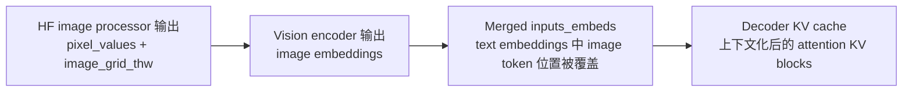

| 名称 | 它是什么 | 由谁产生 | 被谁消费 | 是否已经过模型 |
|---|---|---|---|---|
| `pixel_values` / `image_grid_thw` | 图片 patch tensor 和网格元数据 | HF image processor | Qwen3-VL vision tower | 还没过模型 |
| image embeddings | vision tower 的输出 token embeddings | `Qwen3_VisionTransformer` | embedding merge / decoder prefill | 已经过 vision encoder，还没过 language decoder |
| `inputs_embeds` | 文本 embedding + 图像 embedding 覆盖后的输入 | `embed_input_ids` | language model forward | 已完成输入 embedding，还没完成 decoder |
| KV blocks | decoder attention KV 状态 | language model prefill | 后续 prefix cache / decode | 已经过 language decoder |

## 请求在进入 engine 前变成什么

原始请求里有两类内容：

```text
messages:
  system: "You are a helpful assistant."
  user:
    image_url: "https://..."
    text: "Please carefully inspect ..."
```

解析后会分成两条线：

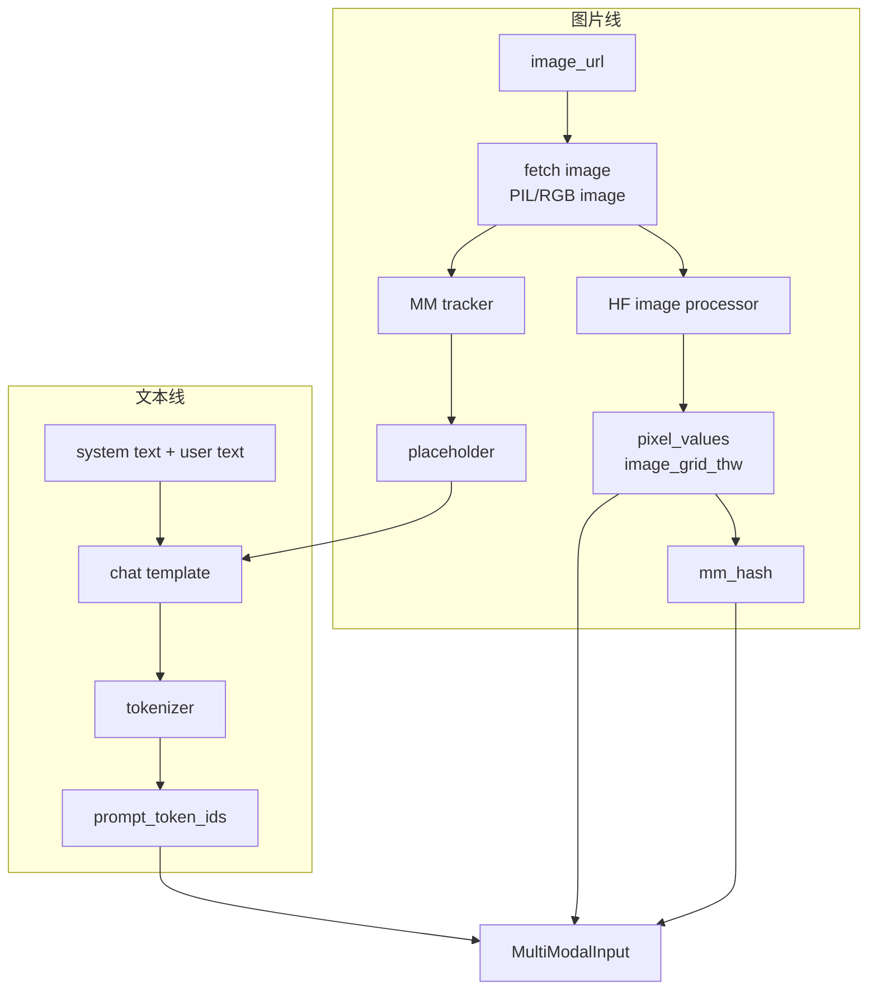

Qwen3-VL 的图片占位符是：

```text
<|vision_start|><|image_pad|><|vision_end|>
```

这个占位符不是最终送进模型的全部图像 token。MM processor 会根据 `image_grid_thw` 和 `merge_size` 算出图像需要多少个 embedding token，然后把单个 image pad 位置扩展成一段 `image_token_id`。

最终给 engine 的多模态输入可以理解为：

```text
MultiModalInput:
  prompt_token_ids:
    文本 token ids + 展开后的 image_token_id 序列

  mm_kwargs:
    image:
      pixel_values
      image_grid_thw
      其他 processor 输出

  mm_hashes:
    image:
      hash(model_id, image content, processor kwargs)

  mm_placeholders:
    image:
      offset + length
```

HF image processor 的输出不是 embedding。对 Qwen3-VL image，最关键的是：

```text
pixel_values:
  图片被 resize / normalize / patchify 后的视觉输入 tensor

image_grid_thw:
  每张图对应的视觉 token 网格，通常理解为 (grid_t, grid_h, grid_w)

input_ids:
  如果 HF processor 同时处理 text + image，会产出文本 token ids；
  vLLM 随后会把 input_ids 和多模态字段分开处理
```

然后 vLLM 会把 HF processor 的 `BatchFeature` 按模型字段配置拆成 `MultiModalKwargsItem`。对 Qwen3-VL image，进入模型侧的核心 `mm_kwargs` 就是 `pixel_values` 和 `image_grid_thw`；真正的 image embeddings 要等 worker 运行 vision tower 时才产生。

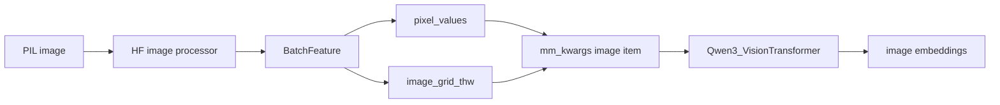

相关代码锚点：

`@vllm-0.21.0/vllm/entrypoints/chat_utils.py`

`@vllm-0.21.0/vllm/renderers/base.py`

`@vllm-0.21.0/vllm/multimodal/processing/processor.py`

`@vllm-0.21.0/vllm/multimodal/processing/inputs.py`

`@vllm-0.21.0/vllm/inputs/engine.py`

`@vllm-0.21.0/vllm/model_executor/models/qwen3_vl.py`

## 三种缓存的分工

| 缓存 | 缓存对象 | key 的核心 | 命中后省什么 | 不负责什么 |
|---|---|---|---|---|
| MM processor cache | 图片预处理后的 processor 输出和 prompt updates | `mm_hash` | 省 HF processor 图像预处理、prompt update 计算，IPC 场景还可少传 tensor | 不代表 decoder KV 已复用 |
| vision encoder cache | vision tower 输出的图像 embeddings | `mm_feature.identifier` | 省 vision tower 前向 | 不代表语言模型上下文 KV 已复用 |
| prefix KV cache | decoder 已计算的 KV blocks | block hash | 省 language model prefill 的已命中 blocks | 不直接缓存原始图片或 processor 输出 |

可以把它们想成三层楼：

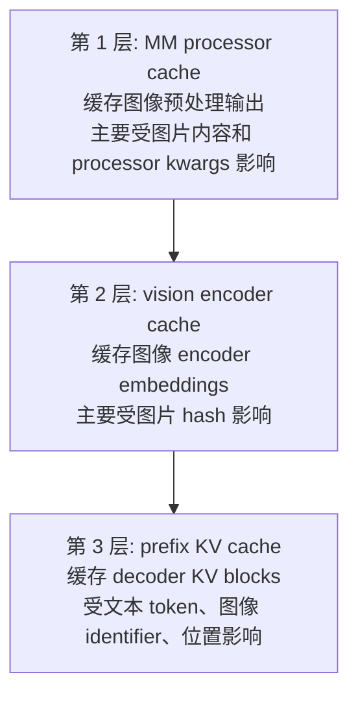

实际调度顺序要再精确一点：MM processor cache 在 API/render 侧最早发生；prefix KV cache 查询在 scheduler 里先发生；encoder cache 的查询发生在 scheduler 决定“剩余要算的 token range 是否覆盖图像 span”之后。

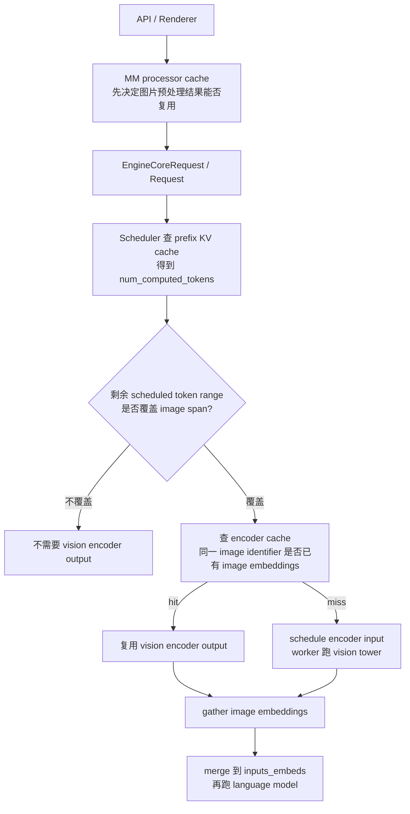

所以“prefix 在前还是 encoder cache 在前”的答案是：

```text
同一个请求的调度路径里:
  prefix KV cache 查询在前。
  encoder cache 查询在后，只针对 prefix 没覆盖、但本 step 需要图像 embedding 的情况。

数据依赖上:
  encoder output 是产生图像 embedding 的来源。
  prefix KV 是 language decoder 已经消费过这些 embedding 之后的结果。
```

换句话说，如果 prefix cache 已经覆盖图像 span，当前 step 通常根本不需要图像 embedding；如果 prefix cache 没覆盖图像 span，才需要看 encoder cache 能不能提供同一张图的 image embeddings。

## 第一次请求发生什么

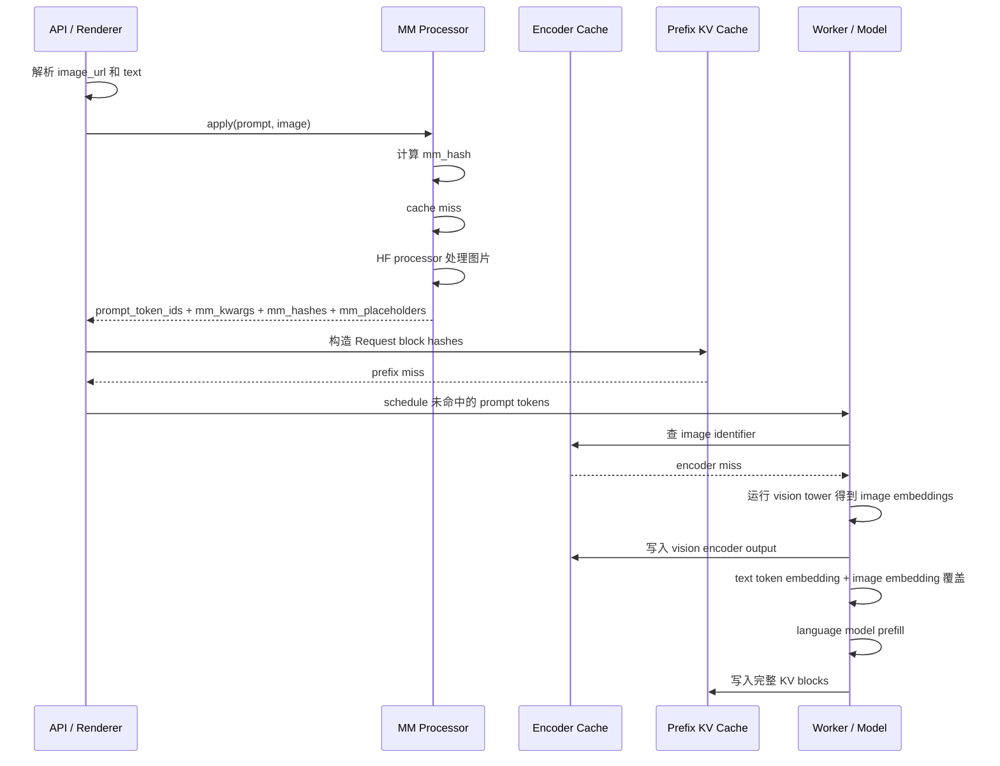

第一次请求通常会出现：

```text
MM processor cache:
  miss -> 写入图片预处理结果

vision encoder cache:
  miss -> 跑 vision tower -> 写入 encoder output

prefix KV cache:
  miss -> 跑 decoder prefill -> 写入 full KV blocks
```

## 第二次完全相同请求发生什么

完全相同指：

- system message 相同。
- user text 相同。
- image 内容相同。
- processor kwargs 相同。
- chat template 和 tokenizer 配置相同。
- 图像插入位置相同。

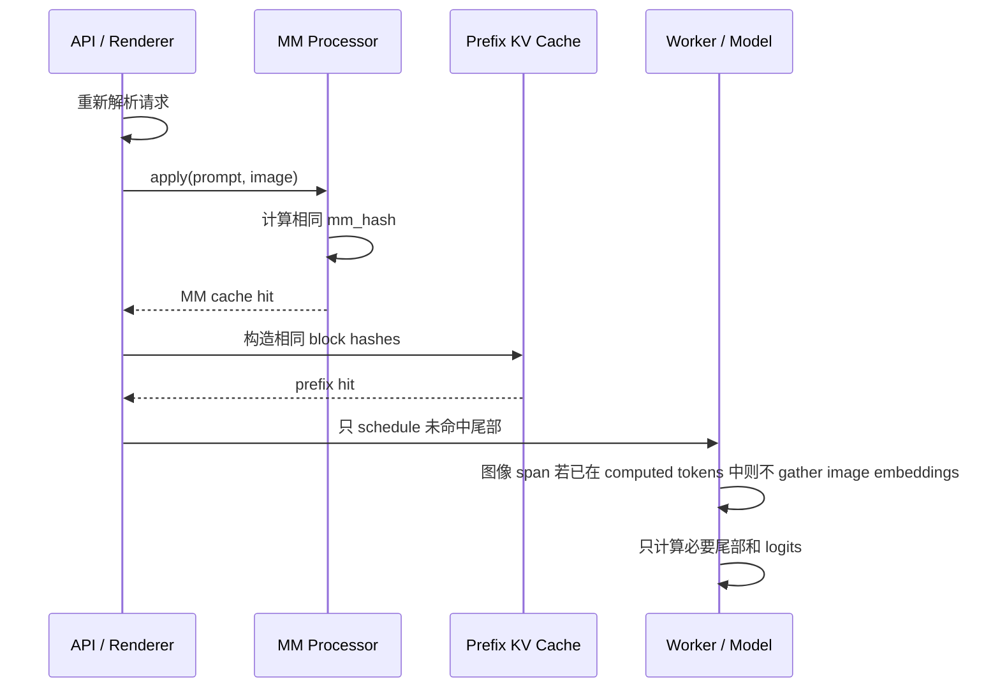

第二次相同请求的理想复用状态：

```text
MM processor cache:
  hit

prefix KV cache:
  大段 hit

vision encoder:
  如果 prefix hit 已覆盖图像 span，则当前 step 不需要图像 embedding
  如果 prefix 没覆盖图像 span，则可再看 encoder cache 是否命中
```

注意：MM cache 命中不等价于 URL 一定没有重新下载。`image_url` 拉取发生在 media connector 侧，MM processor cache 统计的是 processor cache 的查询和命中。

## block hash 到底 hash 什么

prefix cache 的 block hash 主体是 token ids，不是 embedding。

普通文本 block 可以抽象成：

```text
block_hash = H(parent_block_hash, current_block_token_ids, extra_keys)
```

多模态 block 的 `extra_keys` 会加入图像相关信息：

```text
extra_keys includes:
  (mm_feature.identifier, image_offset_relative_to_this_block)
```

图示如下：

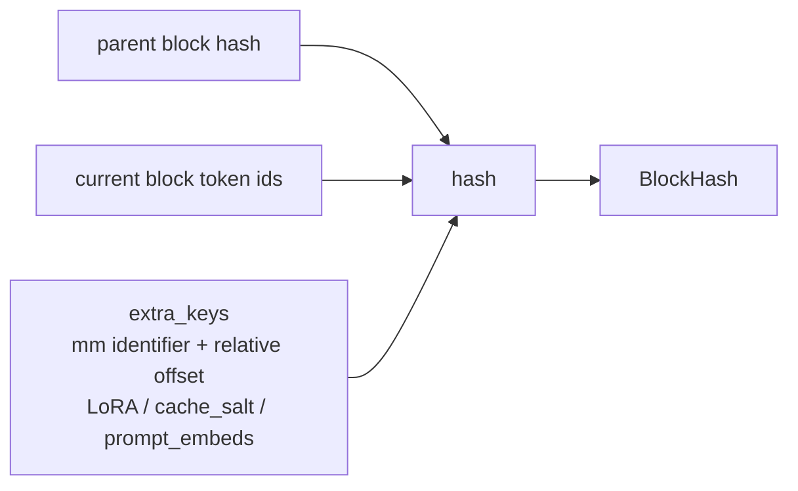

这解决了一个关键安全问题：

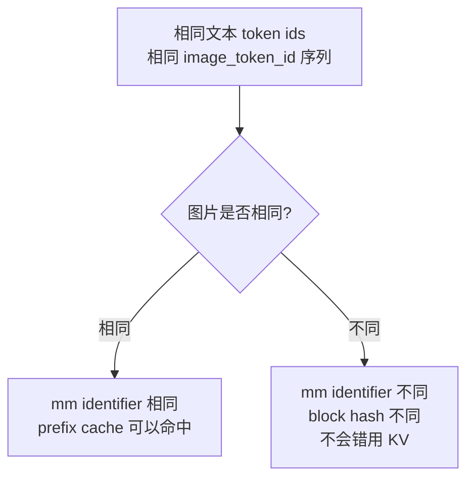

特殊情况：如果用户直接传 `prompt_embeds`，vLLM 会把 prompt embedding 的 tensor bytes hash 后放进 extra keys。这不是 `image_url + text` 的常规路径。

相关代码锚点：

`@vllm-0.21.0/vllm/v1/core/kv_cache_utils.py`

`@vllm-0.21.0/vllm/v1/request.py`

`@vllm-0.21.0/vllm/v1/core/kv_cache_manager.py`

## 什么时候过 embedding

embedding 发生在 scheduler 查完 prefix cache 之后。

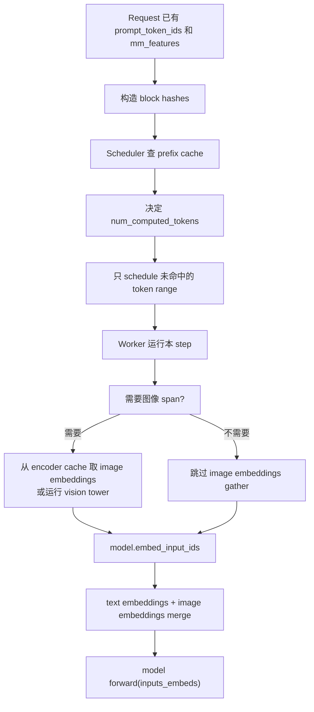

在 Qwen3-VL 中，多模态路径统一走 `inputs_embeds`：

```text
input_ids
  -> text embedding table
  -> 如果本 step 覆盖 image token span，则用 image embeddings 覆盖对应位置
  -> language model forward(inputs_embeds)
```

相关代码锚点：

`@vllm-0.21.0/vllm/v1/worker/gpu_model_runner.py`

`@vllm-0.21.0/vllm/model_executor/models/qwen3_vl.py`

`@vllm-0.21.0/vllm/model_executor/models/utils.py`

## prefix 没覆盖图像 span，但 encoder cache 能命中的情况

这是最容易混的场景。它的本质是：

```text
decoder KV 依赖完整上下文:
  文本 token ids
  图像 token ids
  图像位置
  parent block hash

vision encoder output 主要依赖图片本身:
  image content
  processor kwargs
  model / LoRA 相关 identifier
```

所以可能出现：

```text
prefix KV cache miss
但 vision encoder cache hit
```

### 场景 A: 同一张图，前文不同

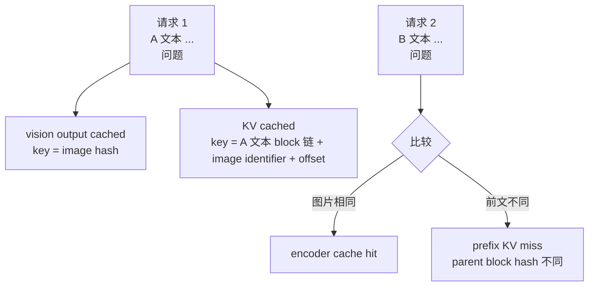

解释：

- 图片相同，所以 `mm_feature.identifier` 相同，vision encoder output 可以复用。
- 前面的文本不同，所以 block hash 链不同，decoder KV 不能复用到图像 span。
- 结果是：重新跑 decoder prefill，但图像 embedding 可以从 encoder cache 拿，不必重跑 vision tower。

### 场景 B: 同一张图，位置不同

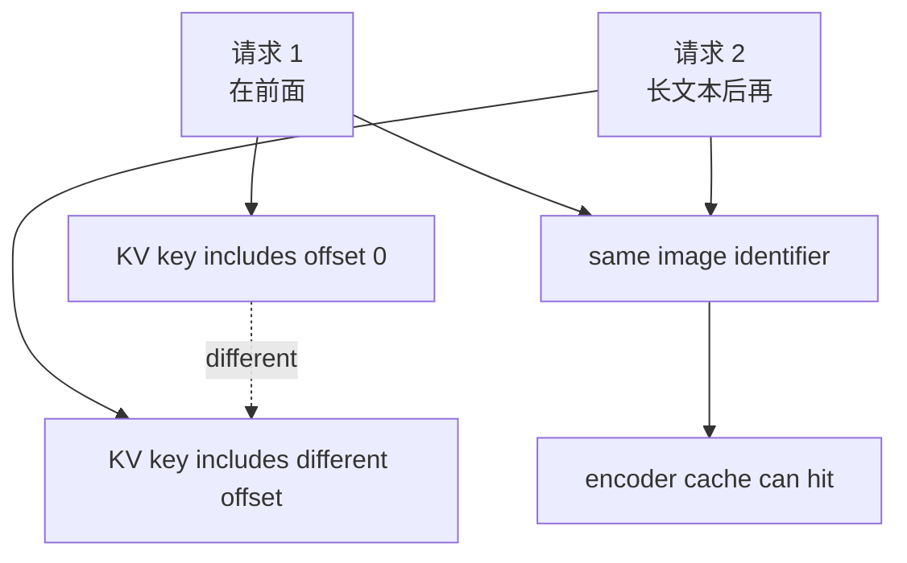

解释：

- prefix cache 的多模态 extra key 包含图像在 block 内的相对 offset。
- 位置变了，prefix KV key 会变。
- 但图片本身没变，vision encoder output 仍然可以复用。

### 场景 C: chunked prefill

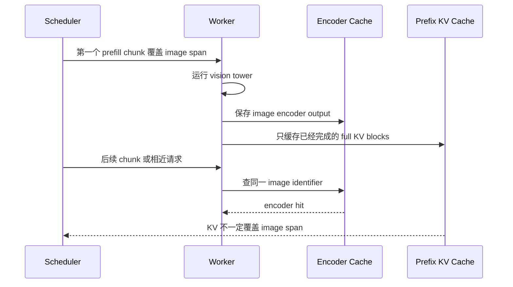

解释：

- vision encoder output 可以比 decoder KV 更早或更独立地存在。
- prefix KV cache 只缓存 full blocks，并受 block hash 链约束。
- encoder cache 只要未被容量回收或 reset，就能按 image identifier 复用。

## 复用矩阵

| 场景 | MM processor cache | vision encoder cache | prefix KV cache | 说明 |
|---|---:|---:|---:|---|
| 完全相同请求 | 高概率命中 | 可能不需要，或命中 | 高概率命中 | prefix 覆盖图像 span 时，当前 step 不需要再 gather 图像 embedding |
| 同图但前文不同 | 命中 | 命中 | 通常 miss 或只命中更短前缀 | 省 vision tower，但 decoder KV 要重算 |
| 同文但图片不同 | miss | miss | 图像所在 block 之后不能命中 | mm identifier 不同，防止错用 KV |
| 同图但位置不同 | 命中 | 命中 | 图像相关 block miss | offset 进入 prefix extra keys |
| processor kwargs 变化 | miss | 通常 miss | 通常不能按旧图像特征命中 | 图像被处理成不同尺寸或网格时，hash 应变化 |
| 只改后缀问题，前缀完全相同 | 命中 | 可能不需要 | 前缀大段命中 | 常见 prefix cache 受益场景 |

## 一条请求的状态字段地图

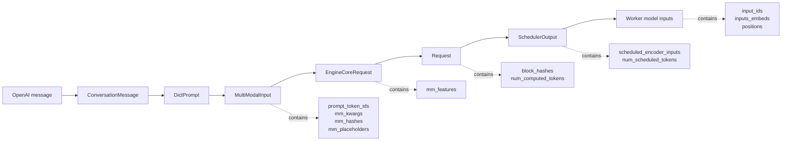

核心字段含义：

| 字段 | 所在阶段 | 含义 |
|---|---|---|
| `prompt_token_ids` | render / engine | 展开 image token 后的 token ids |
| `mm_kwargs` | render / worker | 模型侧需要的图片 tensor 和元数据 |
| `mm_hashes` | render | 图片处理缓存和后续 identifier 的基础 |
| `mm_placeholders` | render | 图像 token 在 prompt 中的位置和长度 |
| `mm_features` | engine / scheduler / worker | 每个图像 item 的 data、identifier、position |
| `block_hashes` | request / prefix cache | prefix KV cache 查询键 |
| `num_computed_tokens` | scheduler / worker | prefix 已命中或已算过的 token 数 |
| `inputs_embeds` | worker / model | text embedding 和 image embedding 合并后的模型输入 |

## 代码锚点

入口和 render：

`@vllm-0.21.0/vllm/entrypoints/openai/chat_completion/api_router.py`

`@vllm-0.21.0/vllm/entrypoints/openai/chat_completion/serving.py`

`@vllm-0.21.0/vllm/entrypoints/chat_utils.py`

`@vllm-0.21.0/vllm/renderers/base.py`

MM processor 和 processor cache：

`@vllm-0.21.0/vllm/multimodal/processing/processor.py`

`@vllm-0.21.0/vllm/multimodal/processing/inputs.py`

`@vllm-0.21.0/vllm/multimodal/cache.py`

engine input 和 feature 构造：

`@vllm-0.21.0/vllm/inputs/engine.py`

`@vllm-0.21.0/vllm/v1/engine/input_processor.py`

prefix KV cache：

`@vllm-0.21.0/vllm/v1/core/kv_cache_utils.py`

`@vllm-0.21.0/vllm/v1/core/kv_cache_manager.py`

`@vllm-0.21.0/vllm/v1/core/sched/scheduler.py`

vision encoder cache 和 worker 执行：

`@vllm-0.21.0/vllm/v1/core/encoder_cache_manager.py`

`@vllm-0.21.0/vllm/v1/worker/gpu_model_runner.py`

Qwen3-VL 模型侧：

`@vllm-0.21.0/vllm/model_executor/models/qwen3_vl.py`

`@vllm-0.21.0/vllm/model_executor/models/utils.py`
