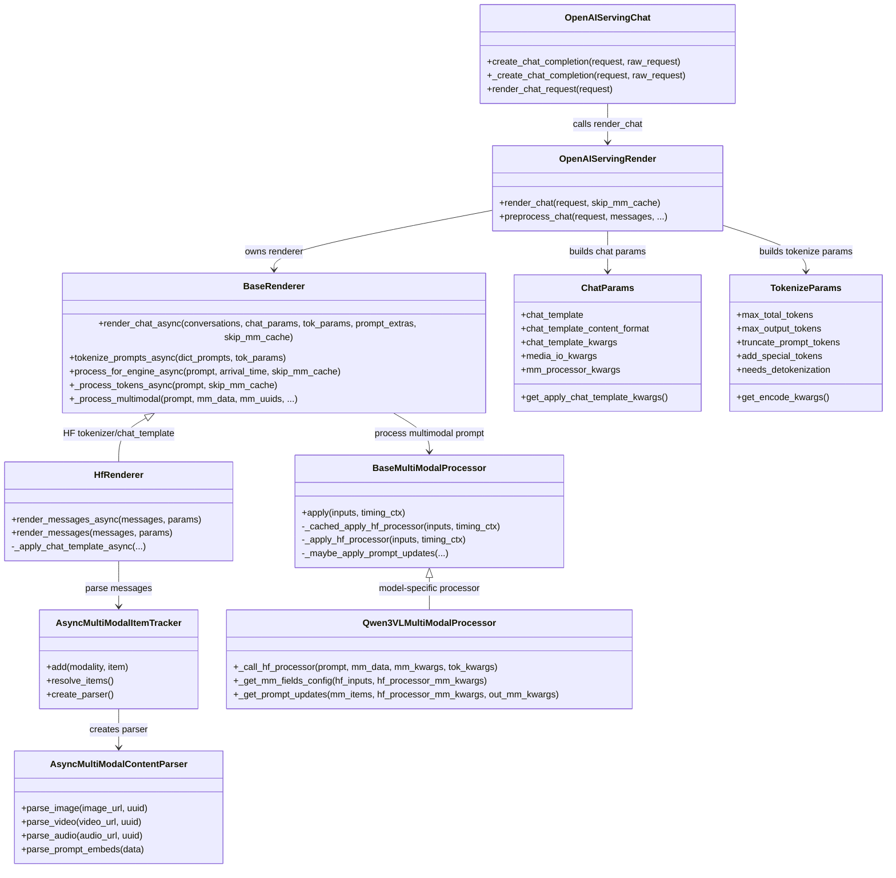
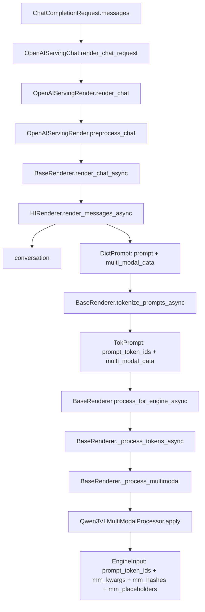

# vLLM Prompt Preprocess Class Diagram

本文只看 OpenAI Chat Completions 请求进入 engine 之前的 prompt 预处理链路。

这段链路的目标不是推理，也不是跑 vision tower，而是把 OpenAI 风格的 `messages` 转成 vLLM engine 可以接收的 `EngineInput`。

## 1. 总体认知

prompt 预处理可以分成四层：

```text
OpenAI serving 层
  接 HTTP 请求，调用 render_chat_request。

Render service 层
  统一处理 chat template 参数、tokenize 参数、工具调用参数。

Renderer 层
  使用具体 tokenizer/chat_template，把 messages 变成 prompt，并做 tokenize。

Multimodal processor 层
  把图片等多模态数据处理成 pixel_values、grid 信息、hash 和 placeholder span。
```

对一条图文请求，数据大概这样变化：

```text
messages
  -> conversation + DictPrompt
  -> TokPrompt
  -> EngineInput
```

其中：

```text
conversation
  给响应阶段、echo、tool、reasoning 等逻辑使用。

DictPrompt
  chat template 后的 prompt 文本，加上 multi_modal_data。

TokPrompt
  在 DictPrompt 基础上补出 prompt_token_ids。

EngineInput
  最终提交给 engine_client.generate 的结构。
```

## 2. 类图



## 3. 主流程图



## 4. HfRenderer 做什么

`HfRenderer.render_messages_async` 是 prompt 预处理里最容易混的一层。

它只做三件事：

```text
1. 解析 OpenAI messages。
2. 调用 HF chat template，生成 prompt_raw。
3. 把 multi_modal_data / multi_modal_uuids 挂回 prompt。
```

它不做：

```text
不生成 pixel_values。
不生成 image_grid_thw。
不跑 vision tower。
不做 prefix cache。
不做 encoder cache。
```

这层结束后，输出还是 `DictPrompt`，大概是：

```python
{
    "prompt": "...chat template rendered prompt...",
    "multi_modal_data": {
        "image": ["<decoded image object>"]
    },
    "multi_modal_uuids": {
        "image": [None]
    }
}
```

## 5. BaseRenderer 做什么

`BaseRenderer.render_chat_async` 把 `HfRenderer` 产出的 `DictPrompt` 继续往 engine 输入转换：

```text
DictPrompt
  -> tokenize_prompts_async
  -> TokPrompt
  -> process_for_engine_async
  -> EngineInput
```

其中 `tokenize_prompts_async` 只负责文本 tokenization：

```python
{
    "prompt": "...",
    "multi_modal_data": {"image": [...]}
}
```

变成：

```python
{
    "prompt": "...",
    "prompt_token_ids": [151644, 8948, "..."],
    "multi_modal_data": {"image": [...]}
}
```

图片仍然只是挂在 `multi_modal_data` 里。

## 6. 多模态 processor 做什么

`process_for_engine_async` 看到 `multi_modal_data` 后，会进入 `_process_multimodal`。

这时才会调用 Qwen3-VL 的多模态 processor，把图片处理成 engine input 需要的结构：

```python
{
    "type": "multimodal",
    "prompt_token_ids": [151644, "..."],
    "mm_kwargs": {
        "pixel_values": "...",
        "image_grid_thw": "..."
    },
    "mm_hashes": {
        "image": ["..."]
    },
    "mm_placeholders": {
        "image": [
            {"offset": "...", "length": "..."}
        ]
    }
}
```

这里的 `mm_kwargs` 后面会给模型侧使用，`mm_hashes` 后面会参与多模态缓存和 encoder cache 识别，`mm_placeholders` 表示图像特征应该替换 prompt token 序列中的哪一段。

## 7. 关键源码文件

```text
@C:/Users/z00943858/Desktop/lzx-vllmascend0210/vllm-0.21.0/vllm/entrypoints/openai/chat_completion/serving.py
@C:/Users/z00943858/Desktop/lzx-vllmascend0210/vllm-0.21.0/vllm/entrypoints/serve/render/serving.py
@C:/Users/z00943858/Desktop/lzx-vllmascend0210/vllm-0.21.0/vllm/renderers/base.py
@C:/Users/z00943858/Desktop/lzx-vllmascend0210/vllm-0.21.0/vllm/renderers/hf.py
@C:/Users/z00943858/Desktop/lzx-vllmascend0210/vllm-0.21.0/vllm/entrypoints/chat_utils.py
@C:/Users/z00943858/Desktop/lzx-vllmascend0210/vllm-0.21.0/vllm/multimodal/processing/processor.py
@C:/Users/z00943858/Desktop/lzx-vllmascend0210/vllm-0.21.0/vllm/model_executor/models/qwen3_vl.py
```

## 8. 一句话记忆

```text
HfRenderer 负责 messages -> prompt。
BaseRenderer 负责 prompt -> tokenized prompt -> engine input。
Qwen3VLMultiModalProcessor 负责 image -> pixel_values / grid / hash / placeholder。
```
