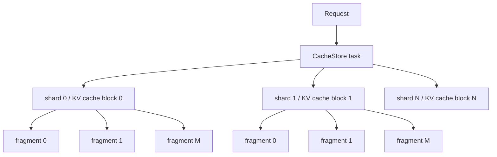
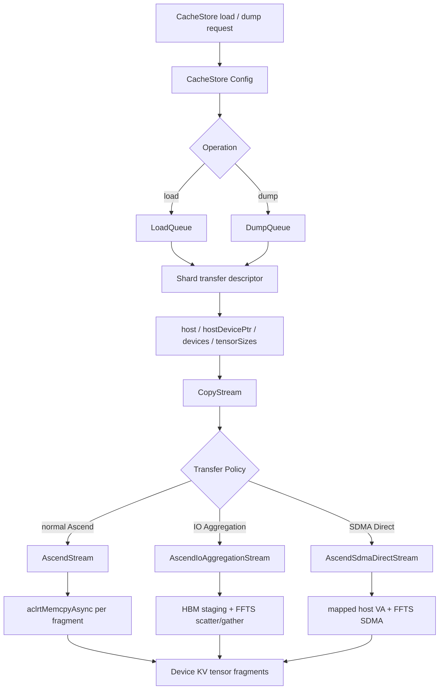
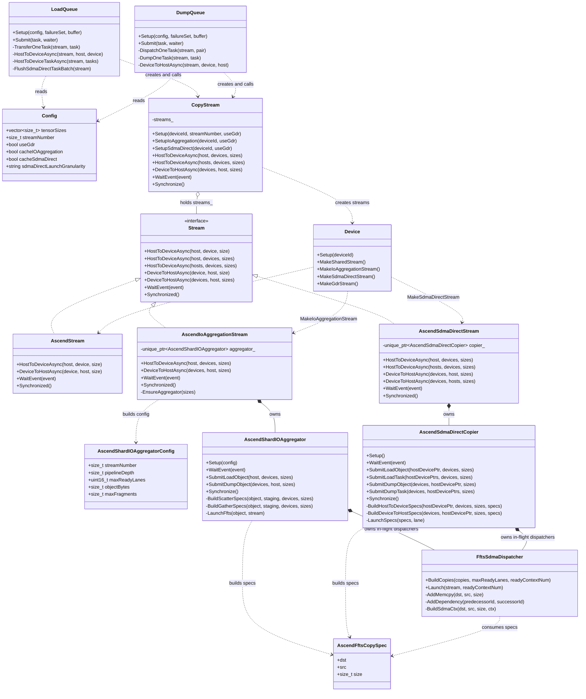
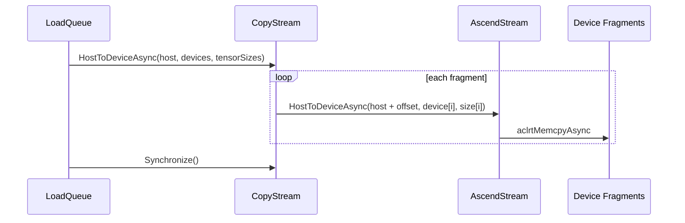
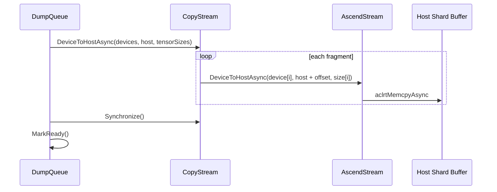
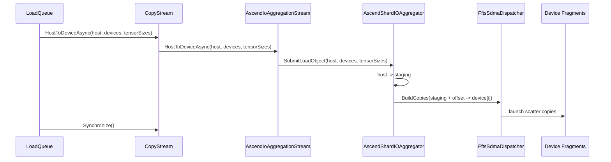
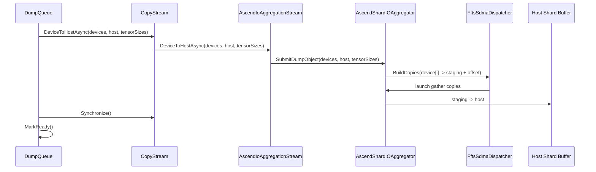
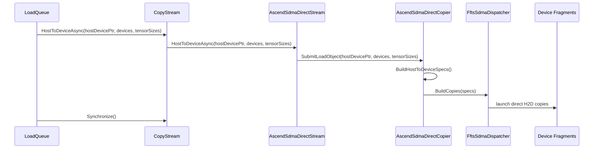
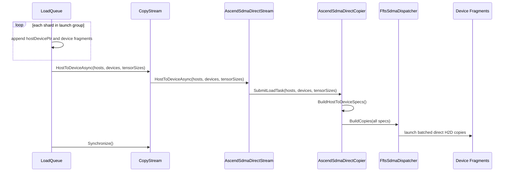
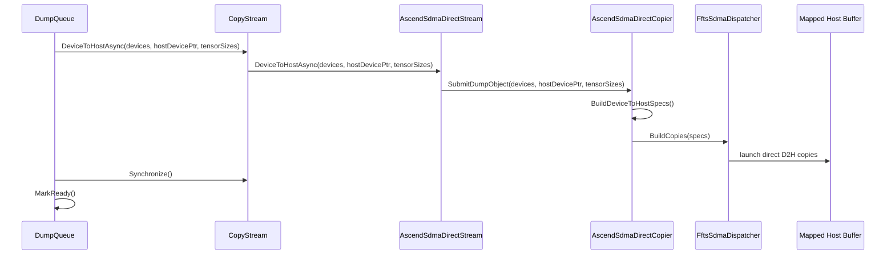

# UCM CacheStore Ascend KV Cache Shard 传输优化设计说明书

## 1. 背景与问题定义

### 1.1 业务背景

UCM CacheStore 用于在大模型推理过程中复用外部 KV cache。命中 cache 后，UCM 将后端中的 KV cache 数据加载到 host shard buffer，再恢复到 vLLM 已分配的 device KV cache；dump 场景则反向执行，将 device KV cache 回写到 host shard buffer，并提交给后端存储。

CacheStore 的核心数据链路如下：

```text
storage backend <-> host shard buffer <-> device KV tensor fragments
```

在本文语境中，一个 shard 对应一个 block 的 KV cache。host 侧是一段连续 shard buffer；device 侧由于 paged KV cache、layer、K/V tensor 或 MLA tensor slice 的布局差异，通常表现为多个离散 fragments。因此一次 shard 传输在语义上是：

```text
load: host shard buffer -> device KV tensor fragments
dump: device KV tensor fragments -> host shard buffer
```

### 1.2 主要问题

当单个 fragment size 较小时，Runtime API 调用、任务构造、driver 交互和 DMA 下发的固定开销会显著高于数据搬运本身的耗时。此时性能瓶颈体现为小 IO 提交能力不足，而不是链路带宽不足。

典型小 IO 粒度包括 256B、2KB、16KB、32KB、128KB 等。原有 AscendStream 逐 fragment copy 在这些场景下容易出现以下问题：

- 单 shard 内 copy 调用次数过多。
- CPU submit 开销占比过高。
- DMA 任务粒度过小，设备侧带宽利用率不足。
- H2D 阶段同步等待时间增加，影响端到端 TTFT。

从 UCM 角度看，DRAM 命中场景下后端读取开销已经较低，host 到 device 的恢复链路会成为主要瓶颈。如果仍然沿用逐 fragment runtime copy，PCIe 等硬件链路带宽利用率偏低，无法把 DRAM 命中的收益充分转化为端到端时延收益。

## 2. 设计目标

本设计目标是优化 Ascend 场景下 UCM CacheStore 的 KV cache shard 传输路径，重点解决小 IO H2D 恢复阶段带宽不足的问题。

具体目标如下：

- 加速 KV cache shard 内多 fragment 小 IO 拷贝，降低逐 fragment runtime copy 的固定提交开销。
- 提高 load H2D 阶段有效带宽，使 DRAM 命中场景能够更充分利用 PCIe 等硬件链路带宽。
- 保留原有 AscendStream 作为基线路径，并在此基础上引入 IO Aggregation 与 SDMA Direct 两条优化路径。
- 对 layerwise 模型，在高命中率场景下降低每层 KV cache 恢复时间，从而改善 TTFT。
- 对非 layerwise 模型，在 DRAM 命中场景下提升请求内所有层 KV cache 的整体恢复效率，使命中收益更全面地体现到端到端性能。
- 保持 task、shard、fragment 的语义清晰，避免业务队列直接耦合具体传输优化实现。

## 3. 术语定义

| 术语 | 定义 |
| --- | --- |
| task | 一个请求的一次 CacheStore 传输任务。task 的覆盖范围取决于 connector 模式。 |
| block | vLLM KV cache 的块级管理单元。在本文中，一个 block 的 KV cache 对应一个 CacheStore shard。 |
| shard | CacheStore 中一个 block 的 KV cache 传输对象。host 侧对应一段连续 shard buffer，device 侧对应一组 KV tensor fragments。 |
| fragment | shard 在 device 侧的一个目标或来源 tensor slice。一个 shard 可包含多个 fragments。 |
| `tensorSizes` | 一个 shard 内各 fragments 的字节长度列表。 |
| host shard buffer | CacheStore 分配或复用的 host 连续内存，作为后端存储与 device 传输之间的中间对象。 |
| CPU host VA | CPU 侧可访问的 host 虚拟地址，由已有 `Data()` 能力提供。 |
| mapped host device VA | device 侧可访问的 host 映射地址，由 `DeviceData()` 能力提供。 |
| HBM staging buffer | IO Aggregation 路径使用的 device 侧中间 buffer。 |
| load | 从后端加载 shard，并恢复到 device KV tensor fragments。 |
| dump | 从 device KV tensor fragments 回写 shard，并提交给后端。 |
| launch granularity | SDMA Direct load 侧 FFTS SDMA task 的提交粒度，包括 `shard` 和 `task`。 |

## 4. Task、Shard 与 Fragment 层级

### 4.1 基本层级

CacheStore 的传输层级如下：



一个 shard 表示一个 block 的 KV cache；一个 shard 在 device 侧会展开为多个 fragments。传输实现必须保证 `tensorSizes`、host offset 和 device fragment 地址之间的顺序一致。

### 4.2 Layerwise 与非 Layerwise 差异

task 的含义与 connector 模式相关：

- layerwise 模式下，一个 task 只包含当前 layer 的 KV cache。对于同一个请求，不同 layer 会形成不同 task；每个 task 内包含该 layer 下命中的 blocks，也就是一组 shards。
- 非 layerwise 模式下，一个 task 覆盖请求命中的所有 layers 的 KV cache。该 task 内包含请求命中的所有 blocks，每个 shard 的 fragments 可覆盖多个 layer 的 K/V tensor slice。

因此，SDMA Direct 的 `task` 粒度在 layerwise 模式下表示“同一请求同一层内多个 blocks 的合并提交”；在非 layerwise 模式下表示“同一请求所有层相关 blocks 的合并提交”。

## 5. 总体架构



LoadQueue 和 DumpQueue 负责推进 task 与 shard 生命周期，并组织 shard transfer descriptor。CopyStream 根据配置选择具体传输路径。AscendStream 是原有逐 fragment runtime copy 基线路径；IO Aggregation 与 SDMA Direct 是针对 Ascend 小 IO 场景的优化路径。

## 6. Shard 数据模型

一个 shard 表示一个 KV cache block 的传输对象，由以下字段构成：

| 字段 | 说明 |
| --- | --- |
| `host` | CPU host VA，原有 AscendStream 路径和 IO Aggregation 使用该地址。 |
| `hostDevicePtr` | mapped host device VA，SDMA Direct 使用该地址。 |
| `devices` | device KV tensor fragment 地址数组。 |
| `tensorSizes` | 每个 device fragment 的字节数。 |
| `objectBytes` | `tensorSizes` 的总和，即 shard 有效传输字节数。 |
| `direction` | H2D 或 D2H。 |
| `events` | copy 与上游计算、slot 复用之间的同步依赖。 |

Shard 传输执行前必须满足以下不变量：

- `devices` 数量与 `tensorSizes` 数量一致。
- `objectBytes` 等于 `tensorSizes` 中所有元素之和。
- 第 `i` 个 fragment 在 host shard buffer 中的偏移等于前 `i` 个 size 的前缀和。
- load 场景下 backend load 完成后，host shard buffer 内容才可提交 H2D。
- dump 场景下 D2H 完成并同步后，host shard buffer 才可标记 ready 并提交后端。
- SDMA Direct 场景下 `hostDevicePtr` 必须非空。

## 7. 各类职责与接口

### 7.1 核心类图

本节类图只包含 `io-aggregation-upstream-pr-v2` 分支中真实存在的类或结构。UML 关系含义如下：

- `<|..` 表示接口实现。
- `*--` 表示组合关系，左侧对象拥有右侧对象的生命周期。
- `o--` 表示聚合关系，左侧对象持有右侧对象集合或引用。
- `..>` 表示依赖关系，左侧对象在创建、配置或调用过程中使用右侧对象。



### 7.2 `Config`

`Config` 是 CacheStore 的运行配置结构。与本设计相关的字段包括 `tensorSizes`、`streamNumber`、`useGdr`、`cacheIOAggregation`、`cacheSdmaDirect` 和 `sdmaDirectLaunchGranularity`。

`LoadQueue` 与 `DumpQueue` 在 `Setup` 阶段读取这些字段，决定后续 CopyStream 使用原有 AscendStream、IO Aggregation stream 还是 SDMA Direct stream。

### 7.3 `LoadQueue`

`LoadQueue` 负责 load 侧 task 调度与 H2D 提交。它不直接持有具体 Ascend 优化类，而是在传输线程中创建并调用 `CopyStream`。

关键接口与职责：

- `Setup`：读取配置，初始化队列、buffer、backend 与传输参数。
- `Submit`：接收上层提交的 load task。
- `TransferOneTask`：处理单个 shard 的 H2D 提交。
- `HostToDeviceAsync`：以 shard 粒度提交 H2D。
- `HostToDeviceTaskAsync`：以 task 粒度提交多个 shards 的 H2D。
- `FlushSdmaDirectTaskBatch`：在 SDMA Direct task 粒度下刷新当前 batch。

### 7.4 `DumpQueue`

`DumpQueue` 负责 dump 侧 task 调度与 D2H 提交。它同样只通过 `CopyStream` 访问底层传输能力。

关键接口与职责：

- `Setup`：读取配置，初始化 dump 队列与传输参数。
- `Submit`：接收上层提交的 dump task。
- `DispatchOneTask`：等待前置 event，并准备 D2H。
- `DumpOneTask`：执行一个 task 内各 shard 的 D2H。
- `DeviceToHostAsync`：以 shard 粒度提交 D2H。

### 7.5 `CopyStream`

`CopyStream` 是 CacheStore 侧的统一传输入口，内部通过 `streams_` 保存实际 `Trans::Stream` 实例。

关键接口与职责：

- `Setup`：创建原有普通 stream，内部调用 `Device::MakeSharedStream()` 或 GDR stream。
- `SetupIoAggregation`：创建 IO Aggregation stream，内部调用 `Device::MakeIoAggregationStream()`。
- `SetupSdmaDirect`：创建 SDMA Direct stream，内部调用 `Device::MakeSdmaDirectStream()`。
- `HostToDeviceAsync`：转发 shard 或 task 粒度 H2D 请求。
- `DeviceToHostAsync`：转发 shard 或 task 粒度 D2H 请求。
- `WaitEvent` / `Synchronize`：对内部所有 streams 执行同步控制。

### 7.6 `Device`

`Device` 是 trans 层 stream 工厂。它根据编译期能力创建不同 stream 实现。

关键接口与职责：

- `MakeSharedStream`：创建原有 `AscendStream`。
- `MakeIoAggregationStream`：在编译启用 IO Aggregation 时创建 `AscendIoAggregationStream`。
- `MakeSdmaDirectStream`：在编译启用 SDMA Direct 时创建 `AscendSdmaDirectStream`。

### 7.7 `Stream` 与 `AscendStream`

`Stream` 是 trans 层抽象接口，提供 H2D、D2H、event wait 和 synchronize 等能力。`AscendStream` 是原有 Ascend runtime stream 实现，使用 runtime copy 接口逐 fragment 完成传输。

原有 AscendStream 路径依赖 `Stream` 默认的 vector-sizes overload：该 overload 按 `tensorSizes` 计算 host offset，并逐 fragment 调用单段 H2D/D2H。

### 7.8 `AscendIoAggregationStream`

`AscendIoAggregationStream` 是 IO Aggregation 的 trans stream 实现，继承 `Stream`。它覆盖 vector-sizes H2D/D2H 接口，将 shard 传输转交给内部 `AscendShardIOAggregator`。

关键接口与职责：

- `HostToDeviceAsync(host, devices, sizes)`：提交 load 侧 shard 聚合传输。
- `DeviceToHostAsync(devices, host, sizes)`：提交 dump 侧 shard 聚合传输。
- `EnsureAggregator`：根据首次收到的 `sizes` 懒创建 `AscendShardIOAggregator`，并补充此前缓存的 pending events。
- `WaitEvent` / `Synchronized`：向 aggregator 转发同步控制。

### 7.9 `AscendShardIOAggregatorConfig`

`AscendShardIOAggregatorConfig` 是 `AscendShardIOAggregator::Setup` 的配置结构。

关键字段：

- `streamNumber`：aggregation lane 数。
- `pipelineDepth`：每个 lane 的 staging slot 数。
- `maxReadyLanes`：FFTS SDMA dispatcher 的 ready context 上限。
- `objectBytes`：单个 shard object 字节数。
- `maxFragments`：单个 shard 内最大 fragment 数量。

### 7.10 `AscendShardIOAggregator`

`AscendShardIOAggregator` 是 IO Aggregation 的核心执行类。它管理 copy stream、FFTS stream、HBM staging buffer、slot event 以及 in-flight FFTS dispatcher。

关键接口与职责：

- `Setup`：根据 `AscendShardIOAggregatorConfig` 初始化 lanes、staging buffers 和事件。
- `SubmitLoadObject`：执行 host shard buffer 到 HBM staging，再由 FFTS SDMA scatter 到 device fragments。
- `SubmitDumpObject`：执行 device fragments 到 HBM staging，再连续 copy 回 host shard buffer。
- `BuildScatterSpecs` / `BuildGatherSpecs`：构造 staging 与 device fragments 之间的 `AscendFftsCopySpec`。
- `LaunchFfts`：调用 `FftsSdmaDispatcher` 提交 FFTS SDMA task。
- `Synchronize`：等待内部 lanes 完成。

### 7.11 `AscendSdmaDirectStream`

`AscendSdmaDirectStream` 是 SDMA Direct 的 trans stream 实现，继承 `Stream`。它内部持有 `AscendSdmaDirectCopier`，并将 shard/task 粒度 H2D/D2H 转交给 copier。

关键接口与职责：

- `HostToDeviceAsync(host, devices, sizes)`：提交 shard 粒度 direct H2D。
- `HostToDeviceAsync(hosts, devices, sizes)`：提交 task 粒度 direct H2D。
- `DeviceToHostAsync(devices, host, sizes)`：提交 shard 粒度 direct D2H。
- `DeviceToHostAsync(devices, hosts, sizes)`：保留 task 粒度 D2H 接口能力。
- `WaitEvent` / `Synchronized`：向 copier 转发同步控制。

### 7.12 `AscendSdmaDirectCopier`

`AscendSdmaDirectCopier` 是 SDMA Direct 的核心执行类。它不使用 HBM staging buffer，而是直接基于 mapped host device VA 与 device fragments 构造 FFTS SDMA copy specs。

关键接口与职责：

- `Setup`：初始化 FFTS stream lane。
- `SubmitLoadObject`：构造并提交单 shard H2D specs。
- `SubmitLoadTask`：构造并提交多 shard H2D specs。
- `SubmitDumpObject`：构造并提交单 shard D2H specs。
- `SubmitDumpTask`：构造并提交多 shard D2H specs。
- `BuildHostToDeviceSpecs` / `BuildDeviceToHostSpecs`：构造 direct H2D/D2H 的 `AscendFftsCopySpec`。
- `LaunchSpecs`：通过 `FftsSdmaDispatcher` 发起 FFTS SDMA task。

### 7.13 `AscendFftsCopySpec` 与 `FftsSdmaDispatcher`

`AscendFftsCopySpec` 是一次 FFTS SDMA copy descriptor 的输入结构，包含 `dst`、`src` 和 `size`。

`FftsSdmaDispatcher` 负责把一组 `AscendFftsCopySpec` 转换成 FFTS SDMA contexts，并提交到指定 `aclrtStream`。

关键接口与职责：

- `BuildCopies`：根据 copy specs 构造 SDMA contexts，并按 `maxReadyLanes` 建立 ready lane 依赖。
- `Launch`：调用 FFTS plus task launch，将 contexts 提交到指定 stream。

## 8. 策略选择设计

### 8.1 构建期能力隔离

| 构建入口 | CMake runtime | 编译能力 | 默认 CacheStore 策略 |
| --- | --- | --- | --- |
| `PLATFORM=ascend` | `RUNTIME_ENVIRONMENT=ascend` | IO Aggregation | `cache_io_aggregation=true` |
| `PLATFORM=ascend-a3` | `RUNTIME_ENVIRONMENT=ascend-a3` | SDMA Direct | `cache_sdma_direct=true` |
| `PLATFORM=cuda` | `RUNTIME_ENVIRONMENT=cuda` | 不编译 Ascend 小 IO 优化 | 平台原有路径 |
| 其他平台 | 对应 runtime | 不编译 Ascend 小 IO 优化 | 平台原有路径 |

IO Aggregation 和 SDMA Direct 不在同一个标准 runtime 中同时默认启用。该隔离方式用于降低配置组合复杂度，并避免不同硬件能力之间产生隐式冲突。

### 8.2 Connector 默认策略

vLLM connector 在创建 store 前注入策略默认值：

- 非 layerwise 场景下，SDMA Direct load 默认按 `shard` 粒度提交。
- layerwise 场景下，SDMA Direct load 默认按 `task` 粒度提交，以减少同一层多个 blocks 的 launch 次数。
- 用户显式配置 `cache_sdma_direct_launch_granularity` 时，connector 保留用户配置，并交给 CacheStore 校验。
- layerwise 场景下，IO Aggregation 可被关闭，避免单层小 object 进入 staging pipeline 后收益不足。
- FAWA/HMA 场景下，FA store 可继承 runtime 默认优化策略；WA store 当前不采用 IO Aggregation。

## 9. 普通 AscendStream 路径

普通 AscendStream 路径是 Ascend runtime 的基线行为。该路径不使用 IO Aggregation，不使用 SDMA Direct，不使用 HBM staging buffer，也不使用 mapped host device VA。

### 9.1 H2D load



LoadQueue 在 backend load ready 后以 CPU host VA 作为 `host`，并调用 CopyStream 的 H2D 接口。CopyStream 将请求转发到原有 AscendStream，AscendStream 根据 `tensorSizes` 计算 host offset，对每个 device fragment 逐个提交 runtime copy。

### 9.2 D2H dump



DumpQueue 以 CPU host VA 作为 `host`，并调用 CopyStream 的 D2H 接口。原有 AscendStream 逐 fragment 从 device 拷回 host shard buffer。D2H 同步完成后，DumpQueue 标记 shard host buffer ready。后端 dump 属于后续存储阶段，不在本传输时序图中展开。

## 10. IO Aggregation 路径

### 10.1 适用场景

IO Aggregation 面向 `RUNTIME_ENVIRONMENT=ascend`。该路径适用于 shard 内存在多个小 fragment，且原有 AscendStream 逐 fragment runtime copy 的提交开销占比较高的场景。

IO Aggregation 使用 CPU host VA，不要求 host buffer 具备 mapped host device VA。

### 10.2 H2D load

IO Aggregation H2D 将一个 shard 拆为两个阶段：

1. `copyStream` 将连续 host shard buffer 拷贝到 HBM staging buffer。
2. `fftsStream` 使用 FFTS SDMA 将 staging buffer scatter 到多个 device fragments。



### 10.3 D2H dump

IO Aggregation D2H 与 H2D 对称：

1. `fftsStream` 将多个 device fragments gather 到 HBM staging buffer。
2. `copyStream` 将 staging buffer 连续拷回 host shard buffer。



D2H 时序图只描述 device 到 host shard buffer 的传输阶段。`Synchronize()` 完成后，host shard buffer 可被标记为 ready；后端 dump 是后续存储阶段，不在该图中展示。

### 10.4 资源占用

IO Aggregation 的额外 HBM 占用来自 staging buffer。每个 stream 使用双 buffer，单个 buffer 大小等于该 store 的 shard object 大小。

以 DeepSeek-V4 的 FA store 为例：

```text
single stream staging = 3 MiB * 2
default stream number = 4
extra HBM per NPU = 3 MiB * 2 * 4 = 24 MiB
```

WA store 当前不再采用 IO Aggregation。原因是 WA store 只有一个 block，无法从 shard 内多 fragment 聚合中获得足够收益，因此不会产生上述 staging buffer 额外占用。

### 10.5 约束

IO Aggregation 存在以下约束：

- 仅支持 CacheStore shard-level vector sizes 接口。
- 不支持单段 copy 接口作为优化入口。
- 不依赖 mapped host device VA。
- `AppendCallback` 当前不作为该路径的强依赖能力；需要 callback 统计时允许调用方降级为不记录 callback 时间。

## 11. SDMA Direct 路径

### 11.1 适用场景

SDMA Direct 面向 `RUNTIME_ENVIRONMENT=ascend-a3`。该路径适用于 Ascend A3 上 host buffer 已具备 device-visible mapped address 的场景。它不使用 HBM staging buffer，而是直接构造 host buffer 与 device fragments 之间的 FFTS SDMA copy descriptors。

SDMA Direct 的关键差异是 host 入参必须为 mapped host device VA，而不是 CPU host VA。

### 11.2 Host Pointer 来源

Shard transfer descriptor 中使用两类 host 地址：

- CPU host VA：用于原有 AscendStream 路径、IO Aggregation 和 backend dump，来源于已有 `Data()` 能力。
- mapped host device VA：用于 SDMA Direct，来源于 `DeviceData()` 能力。

shared buffer 模式下，SharedBufferStrategy 负责注册共享内存 data 区，并保存对应的 mapped device base。local buffer 模式下，仅当 `cache_sdma_direct=true` 时才需要获取或注册 host buffer 的 device-visible pointer。

### 11.3 H2D shard 粒度

当 `cache_sdma_direct_launch_granularity=shard` 时，每个 shard 在 backend load ready 后单独提交一次 FFTS SDMA launch。



### 11.4 H2D task 粒度

当 `cache_sdma_direct_launch_granularity=task` 时，LoadQueue 在同一个 CacheStore load task 内收集多个 shards，并通过一次 batch 提交减少 FFTS launch 次数。

task 粒度提交需要区分两类 shards：

- 已在 buffer 中 ready 的 shards。
- 仍需等待 backend load 的 pending shards。

LoadQueue 在 ready 组与 pending 组之间设置 launch boundary。该边界用于避免已 ready shards 被 pending shards 阻塞，同时保留组内 batch launch 的收益。



### 11.5 D2H shard 粒度

SDMA Direct 的 `task` 粒度仅影响 load H2D。dump D2H 当前保持 shard 粒度，不受 `cache_sdma_direct_launch_granularity` 影响。



D2H copy 的目标是 mapped host buffer，因此时序图中由 FftsSdmaDispatcher 指向 mapped host buffer，而不是反向指回 AscendSdmaDirectStream。AscendSdmaDirectStream 只负责接收 CopyStream 调用并转交给 copier。

### 11.6 约束

SDMA Direct 存在以下约束：

- `DeviceData()` 必须返回非空地址。
- 不支持与 GDR 同时启用。
- ready-lane 上限属于内部实现细节，不作为常规用户配置暴露。
- `task` 粒度只影响 load H2D，不影响 dump D2H。
