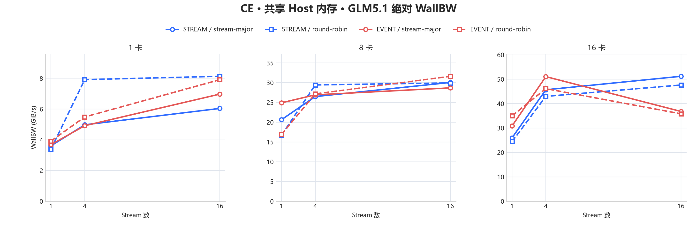
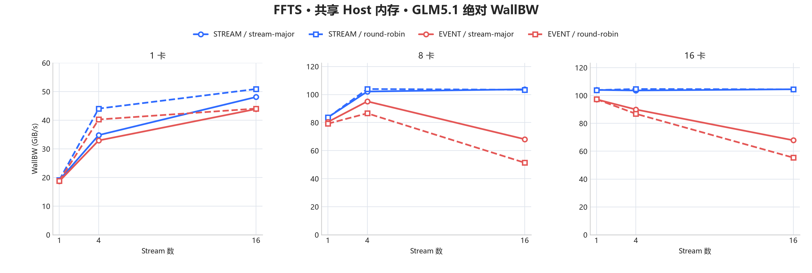
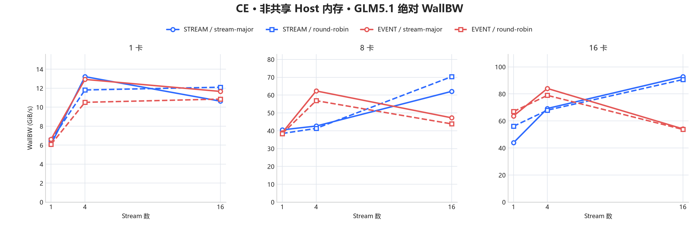
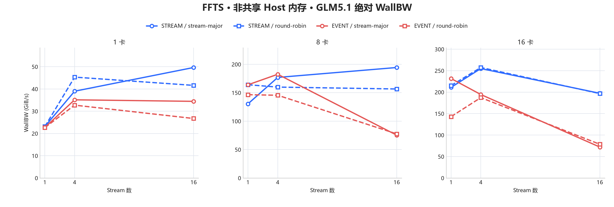

# Ascend H2D GLM5.1 CE/FFTS 144 组矩阵性能报告

## 1. 测试说明

本报告整理一次关闭 Trace 的 144 组完整矩阵，只展示实测绝对带宽。四张折线图中的每一个点都对应一个原始矩阵单元，合计覆盖全部 144 组数据。

### 1.1 测试矩阵与固定工作负载

- Method：`ce`、`ffts`
- Host 内存形态：共享 Host 内存、非共享 Host 内存
- 参数映射：共享 Host 内存对应 `one_share`；非共享 Host 内存对应 `all`
- Devices：1、8、16
- Streams：1、4、16
- Submit mode：`stream-major`、`round-robin`
- Stream sync：`event`、`stream`
- IO 模式：`glm5.1`
- 每个 task：128 KiB + 16 KiB + 32 KiB，共 176 KiB
- 每卡 task 数：512；每卡每轮传输量：88 MiB
- 正式迭代：128 轮
- FFTS ready lane 上限：3
- 进程同步：`barrier`；stream start gate：`off`
- 运行标识：`20260831_160033`
- 结果状态：144/144 组 `exit_code=0`

这里的 task 不是一次单独的 memcpy。一个 GLM5.1 task 固定包含三段连续 IO：

```text
一个 task，共 176 KiB

Host:   [ 128 KiB ][ 16 KiB ][ 32 KiB ]
                    H2D
Device: [ 128 KiB ][ 16 KiB ][ 32 KiB ]

每卡每轮：512 tasks × 176 KiB = 88 MiB
```

### 1.2 CE 与 FFTS 表示什么

CE 和 FFTS 搬运的数据、task 数以及 task 到 stream 的分配完全相同，区别在于一个 task 如何提交给 Ascend：

```text
同一个 GLM5.1 task
        |
        +-- CE
        |     128 KiB -> aclrtMemcpyAsync --+
        |      16 KiB -> aclrtMemcpyAsync --+--> 同一条 stream
        |      32 KiB -> aclrtMemcpyAsync --+
        |
        +-- FFTS Direct H2D
              3 个 copy spec
                    |
                    +--> dispatcher.BuildCopies
                    +--> dispatcher.Launch(stream, readyCount)
                         一次 launch 描述该 task 的三段搬运
```

- **CE**：每个 task 调用三次 `aclrtMemcpyAsync`，三段 IO 都下发到该 task 选中的同一条 stream。
- **FFTS**：每个 task 构造三个 SDMA copy spec，再通过 FFTS Direct H2D dispatcher 做一次 launch。本轮固定 `FFTS_MAX_READY_LANES=3`。
- 两者都是异步提交。Host API 返回只表示任务已经入队，不表示数据已经搬完；完成由后面的 stream sync 阶段确认。

### 1.3 共享 Host 内存、非共享 Host 内存与设备进程

多卡 case 使用 fork runner。设备数为 N 时创建 N 个子进程；每个子进程只绑定一张 device，并在自己的进程内创建、提交和同步这张卡的 streams。不存在一个 submit 线程跨多个设备进程下发任务。

```text
                         父进程
              创建 barrier 和共享计时区
                           |
                    fork N 个子进程
                           |
        +------------------+------------------+
        |                  |                  |
     子进程 P0          子进程 P1         子进程 P(N-1)
     bind device 0       bind device 1      bind device N-1
     streams of D0       streams of D1      streams of D(N-1)

共享 Host 内存：

              同一个 POSIX Shared Host Region
                  |          |          |
                 P0         P1       P(N-1)
                  |          |          |
                 D0         D1       D(N-1)

非共享 Host 内存：

             Host 0      Host 1      Host N-1
                |           |            |
               P0          P1         P(N-1)
                |           |            |
               D0          D1         D(N-1)
```

- **共享 Host 内存**：所有设备子进程重新映射同一个 POSIX Shared Memory 对象，并分别为自己的 device 注册/映射这块 Host 内存。所有卡读取的是同一份 Host 数据源。原始测试参数名是 `one_share`。
- **非共享 Host 内存**：每个设备子进程创建自己的 Host buffer，卡与 Host 源一一对应，各进程之间不共享这个数据区。它避免多卡共同读取同一个 Host 源，更接近各卡独立供数时的带宽上限。原始测试参数名是 `all`。

### 1.4 submit mode 表示什么

submit mode 只改变 task 如何分给 streams，以及 Host 按什么顺序调用提交 API；它不改变 task 内容和总数据量。下面以 8 个 task、4 条 stream 为例：

```text
stream-major（SM）：连续分块，按 stream 提交

S0: T0 T1    S1: T2 T3    S2: T4 T5    S3: T6 T7
Host 提交顺序：S0(T0,T1) -> S1(T2,T3) -> S2(T4,T5) -> S3(T6,T7)

round-robin（RR）：taskIndex % streamCount，轮询提交

S0: T0 T4    S1: T1 T5    S2: T2 T6    S3: T3 T7
Host 提交顺序：S0(T0) -> S1(T1) -> S2(T2) -> S3(T3)
             -> S0(T4) -> S1(T5) -> S2(T6) -> S3(T7)
```

当 streams=1 时，SM 和 RR 都只能提交到 S0，二者在任务映射和提交顺序上等价。因此这组数据也可以作为独立运行波动的 sanity check。

### 1.5 stream sync 表示什么

stream sync 是**单个设备子进程内部**等待本设备所有 streams 完成的方式，不负责不同设备进程之间的起点对齐。

```text
EVENT：每条 stream 记录 end event，再汇聚到 S0

S0: [copies] -> endE0 ---------------------------> totalEnd -> sync S0
S1: [copies] -> endE1 -> S0 wait endE1 ---------^
S2: [copies] -> endE2 -> S0 wait endE2 ---------^
...                                               |
所有 stream 的 event 依赖到齐后，S0 上的 totalEnd 才能完成

STREAM：Host 直接逐条等待

Host: sync S0 -> sync S1 -> sync S2 -> ... -> sync S(last)
      某次调用可能阻塞；函数返回后，本设备所有 streams 均已完成
```

- **`event`**：在每条 stream 尾部记录 end event；stream 0 等待其他 streams 的 end event，再记录 total end，最后只同步 stream 0。该模式还能用 device Event 计算 `DevBW`。
- **`stream`**：不创建这些完成 Event，Host 对所有 streams 逐一调用 `aclrtSynchronizeStream`。虽然调用顺序是逐条的，但各 stream 上的设备任务此前已经异步下发，可以并行执行。
- 本轮 `stream_start_gate=off`，因此没有额外 Event 把同一设备内的各 streams 强制对齐到同一个 device 起点。

### 1.6 进程同步、GroupWall 与 WallBW

`process_sync=barrier` 位于所有设备子进程之间。每轮开始前，N 个子进程先在共享 barrier 会合，再从共同约定的 release time 继续；barrier 之后分别记录 Host start。每个子进程完成本设备的 submit 和 stream sync 后记录 Host end。

```text
                         process barrier
P0 / Device 0   -----------| start0 ===================== end0
P1 / Device 1   -----------|   start1 =============== end1
P2 / Device 2   -----------|  start2 ========================= end2
...                         |
P(N-1)          -----------| startN =================== endN
                            ^                               ^
                       min(start_i)                    max(end_i)
                            |<------ GroupWall ------------>|

StartSkew = max(start_i) - min(start_i)
GroupWall = max(end_i)   - min(start_i)
WallBW    = 所有设备总传输量 / GroupWall Avg
```

因此，barrier 只是尽量对齐各进程的 Host 起点，并不会让各设备同时完成。`StartSkew` 反映 barrier 释放后各子进程真正进入本轮的起点偏差；`GroupWall` 从最早设备开始一直覆盖到最慢设备结束，是多卡端到端完成区间。

本轮每卡每轮搬运 88 MiB。例如 16 卡总量为 16 × 88 MiB = 1.375 GiB；某个配置的 `GroupWall Avg` 为 5342 us，则：

```text
WallBW = 1.375 GiB / 0.005342 s = 257.4 GiB/s
```

## 2. 核心结论

1. **FFTS 在共享 Host 内存、16 卡同时拷贝场景下存在明显瓶颈。** STREAM + SM 下，1、4、16 streams 的 WallBW 分别为 **104.009**、**103.602**、**104.475** GiB/s，增加 streams 没有继续提升；4 streams 时，8 卡和 16 卡分别为 **102.139** 和 **103.602** GiB/s，增加设备数也没有继续提升。作为对照，非共享 Host 内存、16 卡、4 streams 达到 **254.960** GiB/s。

2. **在本轮重点的多卡多流 FFTS 场景下，STREAM sync 优于 EVENT sync。** 共享 Host 内存、16 卡、16 streams、SM 下，STREAM/EVENT 分别为 **104.475 / 67.841** GiB/s；非共享 Host 内存的同配置分别为 **197.359 / 72.095** GiB/s。因此 FFTS 多卡多流配置优先使用 STREAM sync。

## 3. 性能趋势图

本章按 Host 数据源是否被设备进程共享来分图：

- **共享 Host 内存**：所有设备进程从同一个 POSIX 共享内存区读取数据，观察多卡共同读取一个 Host 源时的表现。
- **非共享 Host 内存**：每个设备进程从自己的独立 Host buffer 读取数据，观察每卡独立供数时的表现。

每张图固定一种 Method 和 Host 内存形态，三个子图分别对应 1、8、16 卡。横轴为 stream 数，四条线完整保留 submit mode 和 sync mode。各子图纵轴都从 0 开始，并按该设备规模的绝对带宽单独设置上限。

### 3.1 CE · 共享 Host 内存



### 3.2 FFTS · 共享 Host 内存



### 3.3 CE · 非共享 Host 内存



### 3.4 FFTS · 非共享 Host 内存



## 4. 真实数据

以下四张表与四张图一一对应。SM 表示 `stream-major`，RR 表示 `round-robin`。每张表包含 36 个矩阵单元，四张表共覆盖全部 144 组数据。Submit、Copy、StartSkew 和 GroupWall 的顺序均为 `Min/Max/Avg/P50/P90`，时间单位为微秒；DevBW 和 WallBW 单位为 GiB/s。

多卡 Submit/Copy 时间先按每轮所有设备进程中的最大值合并，再对 128 轮计算统计量。STREAM 模式不使用 device Event 统计 Copy 时间，因此 Copy 和 DevBW 显示为 N/A；它仍然通过 GroupWall 和 WallBW 记录端到端完成时间。原始汇总保存在 `docs/source/developer-guide/data/ascend_h2d_glm512_144_matrix.tsv`，从完整日志解析出的全量数据保存在 `docs/source/developer-guide/data/ascend_h2d_glm512_144_matrix_full.tsv`。

### 4.1 CE · 共享 Host 内存

| Devices | Streams | Submit | Sync | Submit us Min/Max/Avg/P50/P90 | Copy us Min/Max/Avg/P50/P90 | DevBW | StartSkew us Min/Max/Avg/P50/P90 | GroupWall us Min/Max/Avg/P50/P90 | WallBW | Exit |
| ---: | ---: | ---: | ---: | ---: | ---: | ---: | ---: | ---: | ---: | ---: |
| 1 | 1 | SM | EVENT | 1951 / 3689 / 2892 / 2855 / 2973 | 13269 / 27745 / 23137 / 25805 / 27270 | 3.714 | 0 / 0 / 0 / 0 / 0 | 13363 / 29061 / 23354 / 26025 / 27608 | 3.680 | 0 |
| 1 | 1 | SM | STREAM | 1632 / 2043 / 1840 / 1863 / 1938 | N/A | N/A | 0 / 0 / 0 / 0 / 0 | 12731 / 30088 / 23837 / 25699 / 29104 | 3.605 | 0 |
| 1 | 1 | RR | EVENT | 1526 / 2307 / 1728 / 1681 / 2044 | 12539 / 28532 / 21805 / 25640 / 27632 | 3.941 | 0 / 0 / 0 / 0 / 0 | 12631 / 28617 / 21970 / 25929 / 27825 | 3.912 | 0 |
| 1 | 1 | RR | STREAM | 1705 / 2050 / 1930 / 1957 / 2026 | N/A | N/A | 0 / 0 / 0 / 0 / 0 | 13151 / 29578 / 25414 / 26942 / 28451 | 3.382 | 0 |
| 1 | 4 | SM | EVENT | 1648 / 2628 / 1917 / 1752 / 2369 | 6391 / 114238 / 16509 / 10826 / 15852 | 5.205 | 0 / 0 / 0 / 0 / 0 | 6577 / 114340 / 17479 / 11708 / 17353 | 4.917 | 0 |
| 1 | 4 | SM | STREAM | 1574 / 1882 / 1675 / 1673 / 1741 | N/A | N/A | 0 / 0 / 0 / 0 / 0 | 9323 / 110166 / 17273 / 11393 / 13193 | 4.975 | 0 |
| 1 | 4 | RR | EVENT | 1620 / 7936 / 1918 / 1905 / 1966 | 10967 / 112306 / 14620 / 12097 / 13842 | 5.878 | 0 / 0 / 0 / 0 / 0 | 11584 / 112416 / 15665 / 12824 / 16578 | 5.486 | 0 |
| 1 | 4 | RR | STREAM | 1771 / 2387 / 2235 / 2224 / 2348 | N/A | N/A | 0 / 0 / 0 / 0 / 0 | 6268 / 106689 / 10855 / 9594 / 12260 | 7.917 | 0 |
| 1 | 16 | SM | EVENT | 2100 / 2959 / 2566 / 2572 / 2825 | 8199 / 12993 / 10037 / 9243 / 12529 | 8.562 | 0 / 0 / 0 / 0 / 0 | 8522 / 17811 / 12325 / 11287 / 16291 | 6.973 | 0 |
| 1 | 16 | SM | STREAM | 1643 / 2113 / 1773 / 1728 / 1977 | N/A | N/A | 0 / 0 / 0 / 0 / 0 | 9331 / 101840 / 14226 / 13719 / 14305 | 6.041 | 0 |
| 1 | 16 | RR | EVENT | 2006 / 2916 / 2678 / 2726 / 2863 | 7654 / 12328 / 8745 / 8475 / 10754 | 9.827 | 0 / 0 / 0 / 0 / 0 | 8355 / 18286 / 10863 / 10561 / 12740 | 7.911 | 0 |
| 1 | 16 | RR | STREAM | 1610 / 1825 / 1727 / 1729 / 1781 | N/A | N/A | 0 / 0 / 0 / 0 / 0 | 8043 / 104643 / 10568 / 9372 / 12236 | 8.132 | 0 |
| 8 | 1 | SM | EVENT | 1881 / 3847 / 2474 / 2521 / 3009 | 25496 / 30619 / 27461 / 27408 / 28784 | 25.036 | 0 / 1 / 0 / 1 / 1 | 25712 / 30769 / 27606 / 27544 / 28912 | 24.904 | 0 |
| 8 | 1 | SM | STREAM | 1839 / 3220 / 2222 / 2227 / 2643 | N/A | N/A | 1 / 36 / 1 / 1 / 1 | 30346 / 37512 / 33319 / 33349 / 34808 | 20.634 | 0 |
| 8 | 1 | RR | EVENT | 1920 / 3012 / 2703 / 2843 / 2955 | 36599 / 44991 / 40497 / 40576 / 42448 | 16.977 | 1 / 20 / 1 / 1 / 1 | 36975 / 45106 / 40706 / 40716 / 42653 | 16.889 | 0 |
| 8 | 1 | RR | STREAM | 1866 / 3380 / 2369 / 2342 / 3216 | N/A | N/A | 1 / 1 / 1 / 1 / 1 | 37157 / 68820 / 41142 / 40841 / 42797 | 16.710 | 0 |
| 8 | 4 | SM | EVENT | 1833 / 3588 / 2450 / 2460 / 2746 | 14491 / 115514 / 18716 / 15605 / 16607 | 36.733 | 1 / 7 / 1 / 1 / 1 | 20348 / 115615 / 25531 / 22744 / 24307 | 26.928 | 0 |
| 8 | 4 | SM | STREAM | 2068 / 2789 / 2409 / 2421 / 2512 | N/A | N/A | 0 / 2 / 1 / 1 / 1 | 14509 / 113078 / 25958 / 15740 / 104970 | 26.485 | 0 |
| 8 | 4 | RR | EVENT | 2129 / 3781 / 2744 / 2662 / 3352 | 13510 / 111562 / 18139 / 15286 / 16221 | 37.902 | 1 / 30 / 1 / 1 / 1 | 20210 / 111644 / 25306 / 22688 / 24493 | 27.167 | 0 |
| 8 | 4 | RR | STREAM | 2346 / 3038 / 2637 / 2628 / 2759 | N/A | N/A | 1 / 1 / 1 / 1 / 1 | 12160 / 113842 / 23359 / 13837 / 103675 | 29.432 | 0 |
| 8 | 16 | SM | EVENT | 2372 / 3477 / 3076 / 3077 / 3351 | 12613 / 102822 / 14943 / 14323 / 15043 | 46.008 | 1 / 16 / 1 / 1 / 1 | 19260 / 102987 / 23969 / 23212 / 26376 | 28.683 | 0 |
| 8 | 16 | SM | STREAM | 2231 / 4003 / 2797 / 2891 / 3423 | N/A | N/A | 1 / 1 / 1 / 1 / 1 | 14594 / 202836 / 22871 / 16555 / 17721 | 30.060 | 0 |
| 8 | 16 | RR | EVENT | 2523 / 3252 / 2893 / 2929 / 3121 | 11773 / 13894 / 12890 / 12897 / 13402 | 53.336 | 1 / 13 / 1 / 1 / 1 | 18931 / 26512 / 21748 / 21633 / 23612 | 31.612 | 0 |
| 8 | 16 | RR | STREAM | 1894 / 2485 / 2118 / 2079 / 2401 | N/A | N/A | 1 / 9 / 1 / 1 / 1 | 14717 / 309064 / 22967 / 16662 / 17575 | 29.934 | 0 |
| 16 | 1 | SM | EVENT | 2125 / 3788 / 2876 / 2904 / 3560 | 38424 / 75566 / 44284 / 42187 / 51599 | 31.050 | 1 / 18 / 1 / 1 / 1 | 39083 / 75685 / 44565 / 42408 / 55147 | 30.854 | 0 |
| 16 | 1 | SM | STREAM | 2126 / 4163 / 2967 / 2899 / 3758 | N/A | N/A | 1 / 17 / 1 / 1 / 1 | 39514 / 78803 / 52955 / 44514 / 74860 | 25.965 | 0 |
| 16 | 1 | RR | EVENT | 1947 / 3692 / 3094 / 2998 / 3601 | 33613 / 63126 / 39149 / 36474 / 53196 | 35.122 | 1 / 19 / 1 / 1 / 1 | 33787 / 63215 / 39327 / 36639 / 53359 | 34.963 | 0 |
| 16 | 1 | RR | STREAM | 2030 / 10600 / 3132 / 3077 / 3715 | N/A | N/A | 1 / 13 / 1 / 1 / 1 | 35900 / 67902 / 56310 / 61390 / 65960 | 24.418 | 0 |
| 16 | 4 | SM | EVENT | 1960 / 3190 / 2509 / 2573 / 3043 | 17332 / 27835 / 20679 / 20687 / 21586 | 66.493 | 1 / 1 / 1 / 1 / 1 | 25266 / 30624 / 26932 / 26874 / 27543 | 51.055 | 0 |
| 16 | 4 | SM | STREAM | 2014 / 4581 / 2712 / 2526 / 3373 | N/A | N/A | 1 / 1 / 1 / 1 / 1 | 18475 / 117063 / 30112 / 21297 / 29904 | 45.663 | 0 |
| 16 | 4 | RR | EVENT | 2089 / 3580 / 3003 / 3037 / 3200 | 19589 / 23972 / 22024 / 22150 / 23378 | 62.432 | 1 / 31 / 1 / 1 / 1 | 28327 / 41262 / 29809 / 29723 / 30319 | 46.127 | 0 |
| 16 | 4 | RR | STREAM | 2278 / 4150 / 3576 / 3802 / 3999 | N/A | N/A | 1 / 19 / 1 / 1 / 1 | 20664 / 121019 / 32007 / 23756 / 36744 | 42.959 | 0 |
| 16 | 16 | SM | EVENT | 2532 / 5308 / 2955 / 2862 / 3412 | 19448 / 32218 / 22691 / 22661 / 23777 | 60.597 | 1 / 12 / 1 / 1 / 1 | 31669 / 44181 / 37369 / 37179 / 40995 | 36.795 | 0 |
| 16 | 16 | SM | STREAM | 2352 / 3339 / 2711 / 2642 / 3210 | N/A | N/A | 1 / 29 / 1 / 1 / 1 | 18535 / 202379 / 26865 / 22692 / 24761 | 51.182 | 0 |
| 16 | 16 | RR | EVENT | 2573 / 4788 / 3428 / 3437 / 3655 | 19142 / 39688 / 22376 / 22021 / 23177 | 61.450 | 1 / 710 / 6 / 1 / 1 | 34955 / 46877 / 38386 / 37813 / 41171 | 35.820 | 0 |
| 16 | 16 | RR | STREAM | 2346 / 27023 / 3179 / 2961 / 3239 | N/A | N/A | 1 / 1 / 1 / 1 / 1 | 19671 / 117643 / 28874 / 23626 / 25990 | 47.621 | 0 |

### 4.2 FFTS · 共享 Host 内存

| Devices | Streams | Submit | Sync | Submit us Min/Max/Avg/P50/P90 | Copy us Min/Max/Avg/P50/P90 | DevBW | StartSkew us Min/Max/Avg/P50/P90 | GroupWall us Min/Max/Avg/P50/P90 | WallBW | Exit |
| ---: | ---: | ---: | ---: | ---: | ---: | ---: | ---: | ---: | ---: | ---: |
| 1 | 1 | SM | EVENT | 1163 / 1434 / 1330 / 1329 / 1390 | 4428 / 4486 / 4457 / 4459 / 4477 | 19.281 | 0 / 0 / 0 / 0 / 0 | 4517 / 5623 / 4597 / 4556 / 4586 | 18.694 | 0 |
| 1 | 1 | SM | STREAM | 1149 / 1411 / 1338 / 1343 / 1384 | N/A | N/A | 0 / 0 / 0 / 0 / 0 | 4475 / 4950 / 4506 / 4504 / 4520 | 19.072 | 0 |
| 1 | 1 | RR | EVENT | 1233 / 1594 / 1481 / 1493 / 1548 | 4421 / 4472 / 4448 / 4451 / 4463 | 19.320 | 0 / 0 / 0 / 0 / 0 | 4516 / 5661 / 4563 / 4555 / 4580 | 18.834 | 0 |
| 1 | 1 | RR | STREAM | 1199 / 1443 / 1298 / 1291 / 1362 | N/A | N/A | 0 / 0 / 0 / 0 / 0 | 4473 / 4530 / 4494 / 4492 / 4510 | 19.123 | 0 |
| 1 | 4 | SM | EVENT | 1241 / 1562 / 1405 / 1407 / 1445 | 2383 / 2555 / 2459 / 2459 / 2486 | 34.948 | 0 / 0 / 0 / 0 / 0 | 2494 / 3744 / 2610 / 2573 / 2697 | 32.926 | 0 |
| 1 | 4 | SM | STREAM | 1112 / 1368 / 1286 / 1302 / 1342 | N/A | N/A | 0 / 0 / 0 / 0 / 0 | 2375 / 2524 / 2470 / 2476 / 2503 | 34.793 | 0 |
| 1 | 4 | RR | EVENT | 1125 / 1860 / 1404 / 1315 / 1739 | 1859 / 1968 / 1891 / 1890 / 1912 | 45.446 | 0 / 0 / 0 / 0 / 0 | 1920 / 3342 / 2135 / 2026 / 2733 | 40.252 | 0 |
| 1 | 4 | RR | STREAM | 1207 / 1653 / 1415 / 1417 / 1496 | N/A | N/A | 0 / 0 / 0 / 0 / 0 | 1915 / 2043 / 1951 / 1951 / 1969 | 44.048 | 0 |
| 1 | 16 | SM | EVENT | 1221 / 1437 / 1317 / 1315 / 1388 | 1678 / 1789 / 1736 / 1739 / 1764 | 49.503 | 0 / 0 / 0 / 0 / 0 | 1773 / 4522 / 1958 / 1824 / 2335 | 43.890 | 0 |
| 1 | 16 | SM | STREAM | 1102 / 1291 / 1179 / 1183 / 1245 | N/A | N/A | 0 / 0 / 0 / 0 / 0 | 1740 / 1829 / 1787 / 1787 / 1818 | 48.090 | 0 |
| 1 | 16 | RR | EVENT | 1367 / 1959 / 1563 / 1551 / 1686 | 1553 / 2002 / 1646 / 1625 / 1736 | 52.210 | 0 / 0 / 0 / 0 / 0 | 1677 / 3639 / 1951 / 1868 / 2213 | 44.048 | 0 |
| 1 | 16 | RR | STREAM | 1278 / 1787 / 1474 / 1470 / 1574 | N/A | N/A | 0 / 0 / 0 / 0 / 0 | 1636 / 1852 / 1689 / 1678 / 1735 | 50.881 | 0 |
| 8 | 1 | SM | EVENT | 1329 / 2261 / 1679 / 1718 / 1906 | 8043 / 8248 / 8144 / 8144 / 8195 | 84.418 | 0 / 2 / 1 / 1 / 1 | 8265 / 9746 / 8547 / 8486 / 8649 | 80.438 | 0 |
| 8 | 1 | SM | STREAM | 1436 / 4871 / 1941 / 1956 / 2103 | N/A | N/A | 1 / 33 / 1 / 1 / 1 | 8070 / 8416 / 8211 / 8221 / 8266 | 83.729 | 0 |
| 8 | 1 | RR | EVENT | 1363 / 1722 / 1509 / 1504 / 1582 | 8166 / 8377 / 8275 / 8281 / 8335 | 83.082 | 0 / 10 / 1 / 1 / 1 | 8495 / 9146 / 8677 / 8688 / 8772 | 79.232 | 0 |
| 8 | 1 | RR | STREAM | 2323 / 3476 / 2609 / 2585 / 2774 | N/A | N/A | 1 / 3 / 1 / 1 / 1 | 8120 / 8703 / 8222 / 8214 / 8292 | 83.617 | 0 |
| 8 | 4 | SM | EVENT | 1486 / 2415 / 1866 / 1846 / 2015 | 6622 / 7381 / 6662 / 6656 / 6677 | 103.197 | 1 / 17 / 1 / 1 / 1 | 7073 / 8455 / 7229 / 7204 / 7304 | 95.103 | 0 |
| 8 | 4 | SM | STREAM | 1590 / 2616 / 1930 / 1882 / 2204 | N/A | N/A | 1 / 8 / 1 / 1 / 1 | 6685 / 6819 / 6731 / 6731 / 6760 | 102.139 | 0 |
| 8 | 4 | RR | EVENT | 1431 / 2238 / 1767 / 1781 / 1895 | 6482 / 6583 / 6535 / 6539 / 6562 | 105.203 | 1 / 15 / 1 / 1 / 1 | 7322 / 9034 / 7939 / 7895 / 8346 | 86.598 | 0 |
| 8 | 4 | RR | STREAM | 1179 / 1933 / 1496 / 1480 / 1689 | N/A | N/A | 0 / 14 / 1 / 1 / 1 | 6597 / 6664 / 6616 / 6615 / 6627 | 103.915 | 0 |
| 8 | 16 | SM | EVENT | 1616 / 2343 / 1950 / 1944 / 2139 | 6513 / 6596 / 6546 / 6547 / 6567 | 105.026 | 1 / 1 / 1 / 1 / 1 | 8590 / 11591 / 10089 / 9993 / 11185 | 68.144 | 0 |
| 8 | 16 | SM | STREAM | 1492 / 1810 / 1634 / 1634 / 1705 | N/A | N/A | 1 / 11 / 1 / 1 / 1 | 6598 / 6670 / 6628 / 6626 / 6647 | 103.727 | 0 |
| 8 | 16 | RR | EVENT | 2401 / 3232 / 2774 / 2784 / 2963 | 6458 / 6562 / 6523 / 6527 / 6544 | 105.396 | 1 / 9 / 1 / 1 / 1 | 9374 / 18217 / 13381 / 13276 / 14822 | 51.379 | 0 |
| 8 | 16 | RR | STREAM | 2529 / 3471 / 2703 / 2684 / 2825 | N/A | N/A | 1 / 11 / 1 / 1 / 1 | 6621 / 6685 / 6650 / 6651 / 6661 | 103.383 | 0 |
| 16 | 1 | SM | EVENT | 1673 / 2701 / 2076 / 2074 / 2310 | 13057 / 13153 / 13100 / 13098 / 13131 | 104.962 | 1 / 18 / 1 / 1 / 1 | 13976 / 14650 / 14144 / 14123 / 14252 | 97.214 | 0 |
| 16 | 1 | SM | STREAM | 1974 / 2573 / 2105 / 2091 / 2190 | N/A | N/A | 1 / 7 / 1 / 1 / 1 | 13190 / 13255 / 13220 / 13219 / 13238 | 104.009 | 0 |
| 16 | 1 | RR | EVENT | 4875 / 8512 / 6154 / 6044 / 7109 | 13019 / 13164 / 13078 / 13072 / 13113 | 105.138 | 1 / 22 / 1 / 1 / 1 | 13920 / 14953 / 14131 / 14091 / 14339 | 97.304 | 0 |
| 16 | 1 | RR | STREAM | 1738 / 3082 / 1965 / 1918 / 2248 | N/A | N/A | 1 / 1 / 1 / 1 / 1 | 13203 / 13370 / 13234 / 13233 / 13250 | 103.899 | 0 |
| 16 | 4 | SM | EVENT | 4389 / 7955 / 5429 / 5274 / 6182 | 13065 / 13253 / 13138 / 13140 / 13173 | 104.658 | 1 / 17 / 1 / 1 / 1 | 14217 / 16959 / 15287 / 15267 / 15853 | 89.946 | 0 |
| 16 | 4 | SM | STREAM | 3941 / 7779 / 5166 / 4933 / 6583 | N/A | N/A | 1 / 24 / 1 / 1 / 1 | 13195 / 13388 / 13272 / 13265 / 13336 | 103.602 | 0 |
| 16 | 4 | RR | EVENT | 7399 / 10633 / 8453 / 8392 / 9056 | 12934 / 13696 / 12992 / 12982 / 13040 | 105.834 | 1 / 10 / 1 / 1 / 1 | 15010 / 23991 / 15831 / 15763 / 16109 | 86.855 | 0 |
| 16 | 4 | RR | STREAM | 2037 / 8821 / 7648 / 7656 / 8138 | N/A | N/A | 1 / 15 / 1 / 1 / 1 | 13107 / 13949 / 13140 / 13131 / 13152 | 104.642 | 0 |
| 16 | 16 | SM | EVENT | 1794 / 2323 / 2043 / 2058 / 2193 | 13018 / 13094 / 13052 / 13052 / 13070 | 105.348 | 1 / 1 / 1 / 1 / 1 | 15881 / 25345 / 20268 / 20647 / 22327 | 67.841 | 0 |
| 16 | 16 | SM | STREAM | 1523 / 2641 / 1930 / 1878 / 2365 | N/A | N/A | 1 / 1 / 1 / 1 / 1 | 13134 / 13558 / 13161 / 13155 / 13166 | 104.475 | 0 |
| 16 | 16 | RR | EVENT | 7855 / 10152 / 8675 / 8661 / 9141 | 12925 / 13116 / 13022 / 13021 / 13077 | 105.591 | 1 / 22 / 1 / 1 / 1 | 21309 / 32890 / 24825 / 24511 / 26576 | 55.388 | 0 |
| 16 | 16 | RR | STREAM | 2415 / 8923 / 7816 / 7779 / 8403 | N/A | N/A | 1 / 9 / 1 / 1 / 1 | 13128 / 13970 / 13168 / 13162 / 13182 | 104.420 | 0 |

### 4.3 CE · 非共享 Host 内存

| Devices | Streams | Submit | Sync | Submit us Min/Max/Avg/P50/P90 | Copy us Min/Max/Avg/P50/P90 | DevBW | StartSkew us Min/Max/Avg/P50/P90 | GroupWall us Min/Max/Avg/P50/P90 | WallBW | Exit |
| ---: | ---: | ---: | ---: | ---: | ---: | ---: | ---: | ---: | ---: | ---: |
| 1 | 1 | SM | EVENT | 1463 / 2375 / 1699 / 1652 / 1835 | 7240 / 15698 / 12894 / 14127 / 14982 | 6.665 | 0 / 0 / 0 / 0 / 0 | 7303 / 15787 / 12972 / 14186 / 15056 | 6.625 | 0 |
| 1 | 1 | SM | STREAM | 1626 / 2568 / 1803 / 1805 / 1889 | N/A | N/A | 0 / 0 / 0 / 0 / 0 | 7239 / 16465 / 14117 / 15097 / 15943 | 6.088 | 0 |
| 1 | 1 | RR | EVENT | 1584 / 2755 / 1930 / 1775 / 2498 | 7692 / 15951 / 14043 / 14306 / 15230 | 6.120 | 0 / 0 / 0 / 0 / 0 | 7822 / 16030 / 14137 / 14384 / 15297 | 6.079 | 0 |
| 1 | 1 | RR | STREAM | 1438 / 2720 / 1781 / 1699 / 2600 | N/A | N/A | 0 / 0 / 0 / 0 / 0 | 7402 / 15416 / 13201 / 13253 / 14760 | 6.510 | 0 |
| 1 | 4 | SM | EVENT | 1662 / 1850 / 1723 / 1724 / 1771 | 3340 / 7497 / 6234 / 6422 / 7050 | 13.785 | 0 / 0 / 0 / 0 / 0 | 3672 / 8341 / 6647 / 6821 / 7601 | 12.929 | 0 |
| 1 | 4 | SM | STREAM | 1780 / 2808 / 2420 / 2416 / 2491 | N/A | N/A | 0 / 0 / 0 / 0 / 0 | 4006 / 7697 / 6500 / 6512 / 7350 | 13.221 | 0 |
| 1 | 4 | RR | EVENT | 2032 / 2566 / 2412 / 2416 / 2485 | 5843 / 7260 / 6704 / 6733 / 6985 | 12.819 | 0 / 0 / 0 / 0 / 0 | 7140 / 9791 / 8174 / 8111 / 8776 | 10.514 | 0 |
| 1 | 4 | RR | STREAM | 1446 / 1856 / 1560 / 1560 / 1594 | N/A | N/A | 0 / 0 / 0 / 0 / 0 | 5983 / 8115 / 7273 / 7308 / 7789 | 11.816 | 0 |
| 1 | 16 | SM | EVENT | 1537 / 1880 / 1743 / 1758 / 1830 | 4931 / 7111 / 6189 / 6213 / 6844 | 13.886 | 0 / 0 / 0 / 0 / 0 | 5061 / 9031 / 7369 / 7142 / 8472 | 11.662 | 0 |
| 1 | 16 | SM | STREAM | 1564 / 1745 / 1665 / 1671 / 1702 | N/A | N/A | 0 / 0 / 0 / 0 / 0 | 6048 / 102043 / 8080 / 7360 / 7608 | 10.636 | 0 |
| 1 | 16 | RR | EVENT | 1745 / 2097 / 1943 / 1956 / 2013 | 4988 / 7228 / 6128 / 6126 / 6692 | 14.024 | 0 / 0 / 0 / 0 / 0 | 6238 / 9574 / 7916 / 8155 / 8643 | 10.856 | 0 |
| 1 | 16 | RR | STREAM | 1538 / 1809 / 1696 / 1712 / 1746 | N/A | N/A | 0 / 0 / 0 / 0 / 0 | 5680 / 7962 / 7098 / 7280 / 7754 | 12.107 | 0 |
| 8 | 1 | SM | EVENT | 1867 / 3807 / 2929 / 3000 / 3394 | 16422 / 18946 / 17536 / 17446 / 18420 | 39.205 | 0 / 1 / 0 / 1 / 1 | 16517 / 19044 / 17651 / 17565 / 18507 | 38.950 | 0 |
| 8 | 1 | SM | STREAM | 2769 / 5710 / 3083 / 3052 / 3282 | N/A | N/A | 1 / 295 / 3 / 1 / 1 | 15638 / 18168 / 16972 / 16929 / 17472 | 40.508 | 0 |
| 8 | 1 | RR | EVENT | 1838 / 3913 / 2818 / 2612 / 3720 | 15895 / 19000 / 17776 / 17782 / 18339 | 38.676 | 1 / 1 / 1 / 1 / 1 | 16042 / 19142 / 17905 / 17907 / 18504 | 38.397 | 0 |
| 8 | 1 | RR | STREAM | 2216 / 3921 / 2514 / 2448 / 2810 | N/A | N/A | 1 / 19 / 1 / 1 / 1 | 15968 / 18840 / 17870 / 17868 / 18413 | 38.472 | 0 |
| 8 | 4 | SM | EVENT | 1653 / 3366 / 2651 / 2643 / 2822 | 7819 / 9089 / 8406 / 8377 / 8810 | 81.787 | 1 / 18 / 1 / 1 / 1 | 10054 / 12768 / 11030 / 11025 / 11669 | 62.330 | 0 |
| 8 | 4 | SM | STREAM | 2626 / 3630 / 3226 / 3283 / 3480 | N/A | N/A | 1 / 17 / 1 / 1 / 1 | 8095 / 109243 / 16121 / 9286 / 10853 | 42.646 | 0 |
| 8 | 4 | RR | EVENT | 2476 / 3822 / 3191 / 3336 / 3630 | 7551 / 9750 / 8216 / 8181 / 8623 | 83.678 | 1 / 11 / 1 / 1 / 1 | 10973 / 13343 / 12089 / 12072 / 12430 | 56.870 | 0 |
| 8 | 4 | RR | STREAM | 2513 / 3327 / 3008 / 3003 / 3172 | N/A | N/A | 1 / 11 / 1 / 1 / 1 | 7142 / 105141 / 16637 / 8577 / 9616 | 41.324 | 0 |
| 8 | 16 | SM | EVENT | 2187 / 3686 / 2680 / 2707 / 2894 | 6502 / 8261 / 7446 / 7442 / 7849 | 92.331 | 1 / 1 / 1 / 1 / 1 | 11491 / 20776 / 14547 / 14619 / 16087 | 47.261 | 0 |
| 8 | 16 | SM | STREAM | 1838 / 3135 / 2337 / 2438 / 2762 | N/A | N/A | 1 / 7 / 1 / 1 / 1 | 7132 / 104630 / 11072 / 8953 / 9419 | 62.094 | 0 |
| 8 | 16 | RR | EVENT | 2553 / 3720 / 3175 / 3176 / 3426 | 7060 / 8306 / 7629 / 7631 / 7922 | 90.117 | 0 / 20 / 1 / 1 / 1 | 12535 / 20646 / 15679 / 15767 / 16723 | 43.848 | 0 |
| 8 | 16 | RR | STREAM | 1723 / 3622 / 2671 / 2779 / 2879 | N/A | N/A | 1 / 11 / 1 / 1 / 1 | 7574 / 100503 / 9773 / 9131 / 9664 | 70.347 | 0 |
| 16 | 1 | SM | EVENT | 2396 / 20139 / 3357 / 3296 / 3658 | 19634 / 35237 / 21414 / 20734 / 22261 | 64.210 | 1 / 20 / 1 / 1 / 1 | 19806 / 35330 / 21585 / 20924 / 22473 | 63.702 | 0 |
| 16 | 1 | SM | STREAM | 2292 / 4393 / 2811 / 2821 / 3057 | N/A | N/A | 1 / 25 / 1 / 1 / 1 | 19208 / 36975 / 31320 / 34520 / 35726 | 43.902 | 0 |
| 16 | 1 | RR | EVENT | 1842 / 20184 / 2806 / 2556 / 2940 | 18834 / 32755 / 20366 / 20067 / 21202 | 67.514 | 1 / 1 / 1 / 1 / 1 | 19019 / 32931 / 20529 / 20217 / 21318 | 66.978 | 0 |
| 16 | 1 | RR | STREAM | 2269 / 4296 / 3189 / 3302 / 3901 | N/A | N/A | 1 / 20 / 1 / 1 / 1 | 18937 / 36478 / 24536 / 20831 / 35288 | 56.040 | 0 |
| 16 | 4 | SM | EVENT | 2593 / 3959 / 3212 / 3190 / 3622 | 10202 / 17922 / 11670 / 11656 / 12089 | 117.823 | 1 / 1 / 1 / 1 / 1 | 15258 / 18253 / 16363 / 16331 / 16979 | 84.031 | 0 |
| 16 | 4 | SM | STREAM | 2490 / 3814 / 3018 / 2977 / 3540 | N/A | N/A | 1 / 8 / 1 / 1 / 1 | 10645 / 112291 / 19862 / 12956 / 17794 | 69.228 | 0 |
| 16 | 4 | RR | EVENT | 2725 / 18289 / 3518 / 3124 / 3907 | 10069 / 18892 / 11392 / 11319 / 11987 | 120.699 | 1 / 19 / 1 / 1 / 1 | 16671 / 22055 / 17422 / 17334 / 17893 | 78.923 | 0 |
| 16 | 4 | RR | STREAM | 2237 / 4119 / 2702 / 2654 / 3138 | N/A | N/A | 1 / 11 / 1 / 1 / 1 | 10012 / 111435 / 20230 / 11791 / 17254 | 67.968 | 0 |
| 16 | 16 | SM | EVENT | 2480 / 3811 / 3107 / 2985 / 3673 | 9350 / 15888 / 10694 / 10795 / 11342 | 128.577 | 1 / 162 / 2 / 1 / 1 | 20296 / 39019 / 25384 / 25182 / 28116 | 54.168 | 0 |
| 16 | 16 | SM | STREAM | 2192 / 3377 / 2894 / 2963 / 3210 | N/A | N/A | 1 / 7 / 1 / 1 / 1 | 9608 / 107000 / 14821 / 12890 / 14190 | 92.774 | 0 |
| 16 | 16 | RR | EVENT | 2639 / 4487 / 3289 / 3255 / 3609 | 9389 / 12094 / 10592 / 10324 / 11601 | 129.815 | 1 / 1 / 1 / 1 / 1 | 20862 / 35280 / 25593 / 25366 / 28030 | 53.726 | 0 |
| 16 | 16 | RR | STREAM | 2259 / 3614 / 2587 / 2497 / 3149 | N/A | N/A | 1 / 1 / 1 / 1 / 1 | 9798 / 109899 / 15176 / 13241 / 14270 | 90.604 | 0 |

### 4.4 FFTS · 非共享 Host 内存

| Devices | Streams | Submit | Sync | Submit us Min/Max/Avg/P50/P90 | Copy us Min/Max/Avg/P50/P90 | DevBW | StartSkew us Min/Max/Avg/P50/P90 | GroupWall us Min/Max/Avg/P50/P90 | WallBW | Exit |
| ---: | ---: | ---: | ---: | ---: | ---: | ---: | ---: | ---: | ---: | ---: |
| 1 | 1 | SM | EVENT | 1264 / 1483 / 1406 / 1404 / 1450 | 3640 / 3705 / 3662 / 3657 / 3688 | 23.467 | 0 / 0 / 0 / 0 / 0 | 3731 / 4270 / 3780 / 3768 / 3807 | 22.735 | 0 |
| 1 | 1 | SM | STREAM | 1277 / 1531 / 1397 / 1397 / 1428 | N/A | N/A | 0 / 0 / 0 / 0 / 0 | 3688 / 3765 / 3711 / 3707 / 3741 | 23.158 | 0 |
| 1 | 1 | RR | EVENT | 1111 / 1248 / 1187 / 1187 / 1215 | 3647 / 3708 / 3664 / 3662 / 3676 | 23.455 | 0 / 0 / 0 / 0 / 0 | 3727 / 4938 / 3794 / 3761 / 3794 | 22.651 | 0 |
| 1 | 1 | RR | STREAM | 1258 / 1555 / 1427 / 1425 / 1511 | N/A | N/A | 0 / 0 / 0 / 0 / 0 | 3694 / 3759 / 3715 / 3711 / 3737 | 23.133 | 0 |
| 1 | 4 | SM | EVENT | 1367 / 1799 / 1610 / 1613 / 1733 | 2222 / 2406 / 2325 / 2324 / 2384 | 36.962 | 0 / 0 / 0 / 0 / 0 | 2311 / 3491 / 2446 / 2411 / 2493 | 35.134 | 0 |
| 1 | 4 | SM | STREAM | 1027 / 1244 / 1130 / 1124 / 1206 | N/A | N/A | 0 / 0 / 0 / 0 / 0 | 2166 / 2242 / 2204 / 2205 / 2227 | 38.992 | 0 |
| 1 | 4 | RR | EVENT | 2079 / 2510 / 2323 / 2324 / 2440 | 2124 / 2548 / 2357 / 2360 / 2474 | 36.461 | 0 / 0 / 0 / 0 / 0 | 2236 / 4159 / 2625 / 2525 / 3232 | 32.738 | 0 |
| 1 | 4 | RR | STREAM | 1355 / 2259 / 1690 / 1650 / 1938 | N/A | N/A | 0 / 0 / 0 / 0 / 0 | 1816 / 2301 / 1896 / 1857 / 2079 | 45.326 | 0 |
| 1 | 16 | SM | EVENT | 1464 / 1903 / 1692 / 1677 / 1826 | 1699 / 1947 / 1784 / 1758 / 1868 | 48.171 | 0 / 0 / 0 / 0 / 0 | 1892 / 4923 / 2495 / 2232 / 3164 | 34.444 | 0 |
| 1 | 16 | SM | STREAM | 1172 / 1314 / 1223 / 1223 / 1255 | N/A | N/A | 0 / 0 / 0 / 0 / 0 | 1695 / 1765 / 1731 / 1730 / 1749 | 49.646 | 0 |
| 1 | 16 | RR | EVENT | 1975 / 2889 / 2575 / 2619 / 2805 | 2063 / 2938 / 2645 / 2687 / 2863 | 32.491 | 0 / 0 / 0 / 0 / 0 | 2597 / 4374 / 3214 / 3208 / 3388 | 26.738 | 0 |
| 1 | 16 | RR | STREAM | 1444 / 2176 / 1941 / 1991 / 2100 | N/A | N/A | 0 / 0 / 0 / 0 / 0 | 1811 / 2254 / 2065 / 2095 / 2178 | 41.616 | 0 |
| 8 | 1 | SM | EVENT | 2013 / 3450 / 2372 / 2366 / 2482 | 3741 / 4165 / 3823 / 3814 / 3873 | 179.833 | 1 / 1 / 1 / 1 / 1 | 4051 / 5163 / 4193 / 4159 / 4277 | 163.964 | 0 |
| 8 | 1 | SM | STREAM | 3837 / 5405 / 4464 / 4417 / 4852 | N/A | N/A | 1 / 18 / 1 / 1 / 1 | 5185 / 6084 / 5272 / 5231 / 5377 | 130.406 | 0 |
| 8 | 1 | RR | EVENT | 2829 / 3839 / 3250 / 3243 / 3437 | 4428 / 4936 / 4500 / 4500 / 4533 | 152.778 | 0 / 22 / 1 / 1 / 1 | 4583 / 6170 / 4691 / 4672 / 4725 | 146.557 | 0 |
| 8 | 1 | RR | STREAM | 1783 / 3527 / 1968 / 1956 / 2037 | N/A | N/A | 1 / 6 / 1 / 1 / 1 | 4079 / 4672 / 4190 / 4181 / 4244 | 164.081 | 0 |
| 8 | 4 | SM | EVENT | 2845 / 3358 / 3103 / 3107 / 3195 | 3156 / 3771 / 3500 / 3511 / 3615 | 196.429 | 1 / 1 / 1 / 1 / 1 | 3454 / 4790 / 3768 / 3714 / 4009 | 182.458 | 0 |
| 8 | 4 | SM | STREAM | 2536 / 3541 / 2926 / 2925 / 3007 | N/A | N/A | 1 / 16 / 1 / 1 / 1 | 3779 / 4248 / 3886 / 3881 / 3933 | 176.917 | 0 |
| 8 | 4 | RR | EVENT | 3688 / 4734 / 4113 / 4117 / 4333 | 4297 / 4720 / 4339 / 4332 / 4361 | 158.447 | 1 / 12 / 1 / 1 / 1 | 4493 / 5408 / 4723 / 4711 / 4851 | 145.564 | 0 |
| 8 | 4 | RR | STREAM | 3050 / 4274 / 3406 / 3387 / 3653 | N/A | N/A | 0 / 4 / 1 / 1 / 1 | 4273 / 4345 / 4299 / 4299 / 4316 | 159.921 | 0 |
| 8 | 16 | SM | EVENT | 2608 / 3745 / 3235 / 3237 / 3637 | 3376 / 3823 / 3494 / 3419 / 3677 | 196.766 | 1 / 21 / 1 / 1 / 1 | 7577 / 11977 / 9121 / 9070 / 10085 | 75.376 | 0 |
| 8 | 16 | SM | STREAM | 1788 / 3378 / 3176 / 3213 / 3311 | N/A | N/A | 1 / 21 / 1 / 1 / 1 | 2961 / 3699 / 3537 / 3573 / 3642 | 194.374 | 0 |
| 8 | 16 | RR | EVENT | 3710 / 5020 / 4065 / 4067 / 4282 | 4194 / 5066 / 4264 / 4243 / 4325 | 161.234 | 1 / 19 / 1 / 1 / 1 | 6320 / 11397 / 8857 / 8790 / 9499 | 77.622 | 0 |
| 8 | 16 | RR | STREAM | 3585 / 4284 / 3838 / 3805 / 4060 | N/A | N/A | 1 / 13 / 1 / 1 / 1 | 4351 / 4509 / 4390 / 4389 / 4417 | 156.606 | 0 |
| 16 | 1 | SM | EVENT | 3005 / 4877 / 4303 / 4328 / 4607 | 5267 / 5895 / 5528 / 5520 / 5732 | 248.734 | 1 / 22 / 1 / 1 / 1 | 5626 / 7827 / 5935 / 5836 / 6344 | 231.676 | 0 |
| 16 | 1 | SM | STREAM | 3101 / 4376 / 3503 / 3500 / 3729 | N/A | N/A | 1 / 22 / 1 / 1 / 1 | 6397 / 6746 / 6512 / 6514 / 6562 | 211.149 | 0 |
| 16 | 1 | RR | EVENT | 2428 / 4114 / 2769 / 2683 / 3114 | 8903 / 9262 / 9073 / 9072 / 9159 | 151.549 | 1 / 41 / 1 / 1 / 1 | 9394 / 10822 / 9618 / 9584 / 9734 | 142.961 | 0 |
| 16 | 1 | RR | STREAM | 2673 / 4297 / 3019 / 2989 / 3290 | N/A | N/A | 1 / 18 / 1 / 1 / 1 | 6288 / 6766 / 6384 / 6378 / 6466 | 215.382 | 0 |
| 16 | 4 | SM | EVENT | 2140 / 4274 / 2791 / 2744 / 3152 | 5939 / 6151 / 5990 / 5986 / 6034 | 229.549 | 1 / 9 / 1 / 1 / 1 | 6191 / 8200 / 7071 / 7056 / 7670 | 194.456 | 0 |
| 16 | 4 | SM | STREAM | 2382 / 4289 / 2588 / 2525 / 2773 | N/A | N/A | 1 / 3921 / 32 / 1 / 1 | 5314 / 6431 / 5393 / 5382 / 5421 | 254.960 | 0 |
| 16 | 4 | RR | EVENT | 3714 / 6124 / 4594 / 4523 / 5218 | 5869 / 6075 / 5976 / 5968 / 6028 | 230.087 | 1 / 21 / 1 / 1 / 1 | 6505 / 9703 / 7343 / 7129 / 8362 | 187.253 | 0 |
| 16 | 4 | RR | STREAM | 2809 / 5289 / 3828 / 3964 / 4212 | N/A | N/A | 1 / 48 / 1 / 1 / 1 | 5245 / 5428 / 5342 / 5345 / 5383 | 257.394 | 0 |
| 16 | 16 | SM | EVENT | 3313 / 5168 / 3713 / 3558 / 4204 | 5908 / 6091 / 6005 / 6009 / 6045 | 228.976 | 1 / 21 / 1 / 1 / 1 | 17025 / 44627 / 19072 / 18194 / 20761 | 72.095 | 0 |
| 16 | 16 | SM | STREAM | 2396 / 4038 / 2658 / 2574 / 2808 | N/A | N/A | 1 / 9 / 1 / 1 / 1 | 6916 / 7046 / 6967 / 6967 / 6995 | 197.359 | 0 |
| 16 | 16 | RR | EVENT | 3428 / 5356 / 4246 / 4235 / 4890 | 6751 / 6969 / 6873 / 6874 / 6924 | 200.058 | 1 / 19 / 1 / 1 / 1 | 14449 / 20964 / 17493 / 17312 / 18966 | 78.603 | 0 |
| 16 | 16 | RR | STREAM | 2306 / 5358 / 3690 / 3713 / 4254 | N/A | N/A | 1 / 42 / 1 / 1 / 1 | 6954 / 7151 / 6992 / 6991 / 7020 | 196.653 | 0 |
