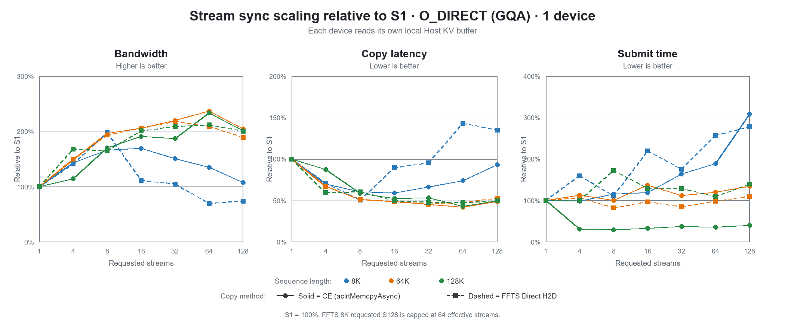
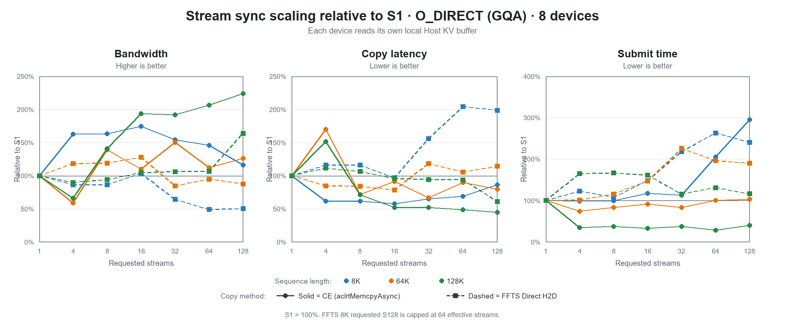
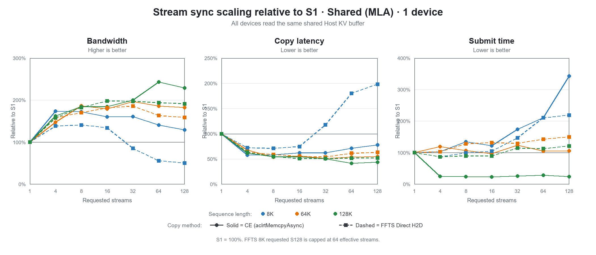
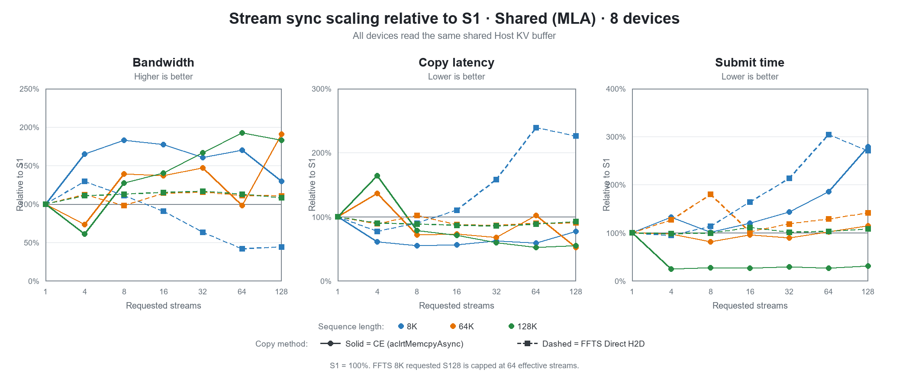
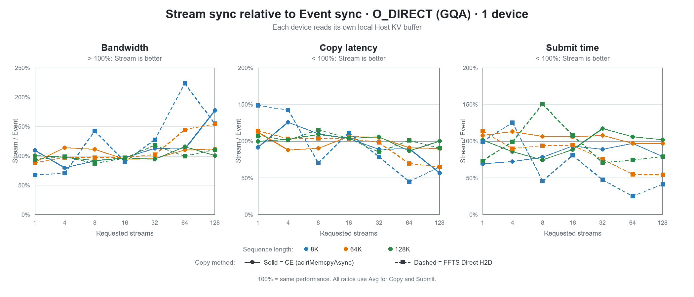
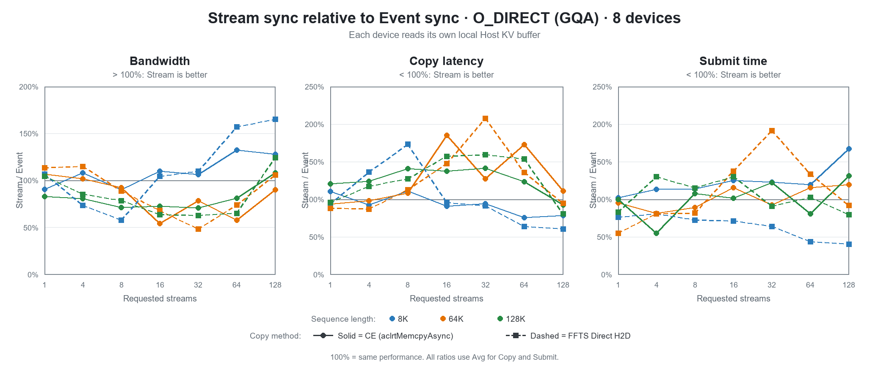
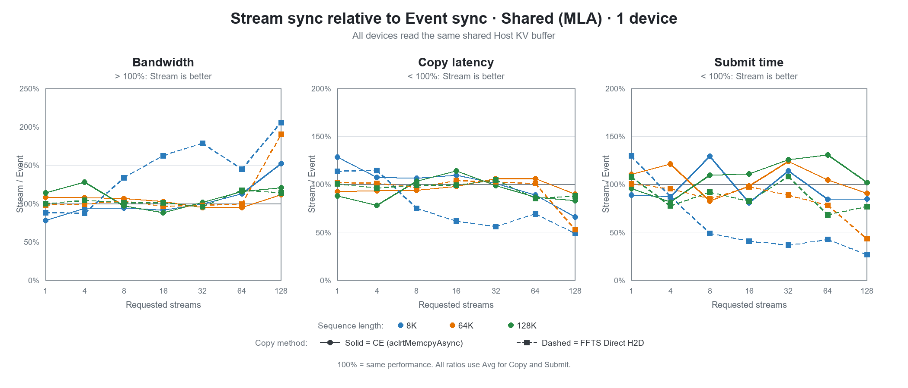
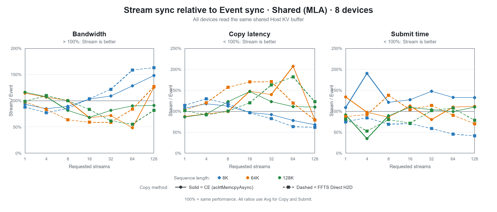

# Ascend H2D GLM5 简化 IO 模型 Stream Sweep 数据报告

## 1. 测试口径

本报告以数据整理和可视化为主，不展开根因分析。

- Event Run ID：`20260825_062905`
- Event 代码提交：`7fa8f4bd88a4eab9dd3a9ab489343c617293f850`
- Stream Run ID：`20260825_122058`
- Stream 代码提交：`55b8df4317f485dabb8ab155d72393d6374352db`
- 单个物理 IO：32K
- 每个 shard：128 tokens、3 个 32K IO
- Iterations：128，另有 3 次 warmup
- 设备数：1、8
- Requested stream：1、4、8、16、32、64、128
- 完成同步模式：`event`、`stream`
- Host：O_DIRECT、Shared
- 方法：CE Multi-stream、FFTS Direct H2D
- 每种同步模式完整组合：168；Event 失败数：0，Stream 失败数：0

| 序列长度 | Shard 数 | 每卡 IO 数 | 每卡传输量 | 8 卡总传输量 | CE 参数 | FFTS 参数 |
|---:|---:|---:|---:|---:|---|---|
| 8K | 64 | 192 | 6 MiB | 48 MiB | `-n 192` | `-n 64 -f 3` |
| 64K | 512 | 1536 | 48 MiB | 384 MiB | `-n 1536` | `-n 512 -f 3` |
| 128K | 1024 | 3072 | 96 MiB | 768 MiB | `-n 3072` | `-n 1024 -f 3` |

表格中的 Submit、Copy 单位均为微秒，统计顺序为 `Min/Max/Avg/P50/P90`。BW 沿用日志口径，实际按 1024³ 换算，数值单位更接近 GiB/s。8 卡 Submit/Copy 使用每轮最慢设备的时间。

## 2. 可视化

本节只展示归一化趋势和同步方式对比；带宽、Copy 时延和 Submit 下发时间的实际值统一保留在第 3、4 节完整数据表中。

图例统一使用两组视觉编码：颜色区分序列长度；实线加圆点表示 CE（`aclrtMemcpyAsync`）拷贝，虚线加方点表示 FFTS Direct H2D。

### 2.1 Event 同步相对 S1 的总体趋势

各组合先相对自身 S1 归一化，再按 Host 内存形态和设备数拆为 4 张图。每张图同时展示带宽、Copy 时延和 Submit 时间，适合分别观察不同内存形态和卡数下的 stream 拐点。

- O_DIRECT 对应本次模拟的 GQA 内存形态：每张卡读取各自独立的本地 Host KV Buffer。
- Shared 对应本次模拟的 MLA 内存形态：多张卡读取同一块共享 Host KV Buffer 的相同 offset。

#### O_DIRECT（GQA）· 1 卡

#### O_DIRECT（GQA）· 8 卡

#### Shared（MLA）· 1 卡

#### Shared（MLA）· 8 卡

### 2.2 Stream 同步相对 S1 的总体趋势

归一化口径与 Event 同步一致，直接展示 Stream 同步下 Requested Stream 增长时的带宽、Copy 时延和 Submit 时间变化。

#### O_DIRECT（GQA）· 1 卡

#### O_DIRECT（GQA）· 8 卡

#### Shared（MLA）· 1 卡

#### Shared（MLA）· 8 卡

### 2.3 Stream 与 Event 同步对比

以下图表直接绘制 `Stream/Event`。带宽高于 100% 表示 Stream 同步更好；Copy 和 Submit 低于 100% 表示 Stream 同步更好。

#### O_DIRECT（GQA）· 1 卡

#### O_DIRECT（GQA）· 8 卡

#### Shared（MLA）· 1 卡

#### Shared（MLA）· 8 卡

8K FFTS 只有 64 个 task，因此 Requested Stream 128 的 Effective Stream 实际为 64。

## 3. Event 同步完整数据

数据按 case 拆分，每个 case 再拆为单卡和 8 卡，共 8 张表。

### 3.1 O_DIRECT CE

#### 1 卡

| 序列 | Req Stream | Eff Stream | IO/卡 | Total IO | Submit us Min/Max/Avg/P50/P90 | Copy us Min/Max/Avg/P50/P90 | BW |
|---:|---:|---:|---:|---:|---|---|---:|
| 8K | 1 | 1 | 192 | 192 | 249/361/337/342/353 | 2544/3213/2745/2722/2807 | 2.135 |
| 8K | 4 | 4 | 192 | 192 | 232/372/317/318/364 | 1153/1724/1396/1378/1652 | 4.197 |
| 8K | 8 | 8 | 192 | 192 | 259/1025/345/345/389 | 1082/1743/1377/1377/1507 | 4.255 |
| 8K | 16 | 16 | 192 | 192 | 243/454/297/272/389 | 1177/1938/1428/1357/1700 | 4.103 |
| 8K | 32 | 32 | 192 | 192 | 321/772/428/425/455 | 1528/2413/1875/1890/2039 | 3.125 |
| 8K | 64 | 64 | 192 | 192 | 396/483/452/457/471 | 1749/2604/2076/2069/2297 | 2.822 |
| 8K | 128 | 128 | 192 | 192 | 618/959/906/913/933 | 3868/4754/4150/4142/4309 | 1.412 |
| 64K | 1 | 1 | 1536 | 1536 | 1499/2450/1654/1617/1741 | 8498/22194/17407/17325/18784 | 2.693 |
| 64K | 4 | 4 | 1536 | 1536 | 1571/11515/1781/1615/1676 | 8526/109195/14981/9521/11114 | 3.129 |
| 64K | 8 | 8 | 1536 | 1536 | 1606/1923/1677/1669/1739 | 8271/106624/11032/9546/10293 | 4.249 |
| 64K | 16 | 16 | 1536 | 1536 | 1844/2485/2309/2352/2443 | 7261/10300/8911/8960/9593 | 5.260 |
| 64K | 32 | 32 | 1536 | 1536 | 1699/2234/1853/1802/2091 | 7228/9592/8446/8443/9076 | 5.550 |
| 64K | 64 | 64 | 1536 | 1536 | 1864/2633/2199/2113/2569 | 8419/9660/9046/9056/9372 | 5.182 |
| 64K | 128 | 128 | 1536 | 1536 | 2164/2873/2482/2464/2655 | 8982/12119/10646/10722/11474 | 4.403 |
| 128K | 1 | 1 | 3072 | 3072 | 10025/13628/11550/11593/12034 | 30335/37894/34148/34293/35608 | 2.745 |
| 128K | 4 | 4 | 3072 | 3072 | 3124/21609/4213/3246/4521 | 15122/117934/29022/18894/109940 | 3.230 |
| 128K | 8 | 8 | 3072 | 3072 | 3428/6847/4588/4605/4726 | 14666/109293/18390/17684/19155 | 5.098 |
| 128K | 16 | 16 | 3072 | 3072 | 3558/4788/4398/4457/4671 | 13980/20569/17203/17454/18833 | 5.450 |
| 128K | 32 | 32 | 3072 | 3072 | 3282/6126/3709/3453/4561 | 13983/100890/17160/16451/17968 | 5.463 |
| 128K | 64 | 64 | 3072 | 3072 | 3411/4747/3873/3753/4508 | 14616/20082/16837/16819/18236 | 5.568 |
| 128K | 128 | 128 | 3072 | 3072 | 3906/5394/4589/4382/5248 | 14763/18407/16940/17067/17592 | 5.534 |

#### 8 卡

| 序列 | Req Stream | Eff Stream | IO/卡 | Total IO | Submit us Min/Max/Avg/P50/P90 | Copy us Min/Max/Avg/P50/P90 | BW |
|---:|---:|---:|---:|---:|---|---|---:|
| 8K | 1 | 1 | 192 | 1536 | 266/686/365/366/383 | 2671/3275/2908/2906/3036 | 16.119 |
| 8K | 4 | 4 | 192 | 1536 | 226/383/324/320/358 | 1609/10133/2129/1812/2508 | 22.017 |
| 8K | 8 | 8 | 192 | 1536 | 271/419/325/334/363 | 1553/2477/1774/1779/1877 | 26.423 |
| 8K | 16 | 16 | 192 | 1536 | 277/463/350/360/396 | 1747/2634/2026/2014/2207 | 23.137 |
| 8K | 32 | 32 | 192 | 1536 | 320/577/342/334/373 | 1956/2654/2202/2197/2372 | 21.287 |
| 8K | 64 | 64 | 192 | 1536 | 467/916/641/630/826 | 2480/3332/2909/2895/3140 | 16.114 |
| 8K | 128 | 128 | 192 | 1536 | 617/813/658/652/688 | 3190/4498/3532/3500/3772 | 13.272 |
| 64K | 1 | 1 | 1536 | 12288 | 2566/4024/3034/3051/3321 | 18752/25387/22330/22489/23886 | 16.794 |
| 64K | 4 | 4 | 1536 | 12288 | 1626/12809/2639/2345/2755 | 10176/111620/36245/11792/108073 | 10.346 |
| 64K | 8 | 8 | 1536 | 12288 | 1981/12461/2701/2542/2785 | 9794/108880/13884/10868/11552 | 27.010 |
| 64K | 16 | 16 | 1536 | 12288 | 1964/2673/2291/2292/2491 | 9459/11545/10295/10287/10639 | 36.425 |
| 64K | 32 | 32 | 1536 | 12288 | 1956/3028/2591/2643/2835 | 9923/12093/10941/10918/11501 | 34.275 |
| 64K | 64 | 64 | 1536 | 12288 | 2022/3213/2510/2516/2681 | 9425/12153/10825/10844/11600 | 34.642 |
| 64K | 128 | 128 | 1536 | 12288 | 2344/3372/2497/2440/2680 | 10908/23458/14952/15144/16680 | 25.080 |
| 128K | 1 | 1 | 3072 | 24576 | 12441/17119/15051/14961/16352 | 37923/49653/43690/43511/47173 | 17.166 |
| 128K | 4 | 4 | 3072 | 24576 | 4914/26338/9430/6349/20861 | 20159/120613/64391/23367/118007 | 11.648 |
| 128K | 8 | 8 | 3072 | 24576 | 3949/10147/5244/5210/5748 | 19089/119943/26590/21054/22432 | 28.206 |
| 128K | 16 | 16 | 3072 | 24576 | 3822/6417/4835/4701/5671 | 18312/21681/19786/19684/20846 | 37.906 |
| 128K | 32 | 32 | 3072 | 24576 | 3746/5664/4579/4551/5178 | 18258/20725/19387/19376/19981 | 38.686 |
| 128K | 64 | 64 | 3072 | 24576 | 4047/7651/5212/4974/6539 | 18905/23924/20704/20616/21545 | 36.225 |
| 128K | 128 | 128 | 3072 | 24576 | 3942/7777/4616/4483/5447 | 21839/39365/25381/25387/26750 | 29.550 |

### 3.2 O_DIRECT FFTS

#### 1 卡

| 序列 | Req Stream | Eff Stream | IO/卡 | Total IO | Submit us Min/Max/Avg/P50/P90 | Copy us Min/Max/Avg/P50/P90 | BW |
|---:|---:|---:|---:|---:|---|---|---:|
| 8K | 1 | 1 | 192 | 192 | 128/205/145/136/178 | 394/418/403/403/409 | 14.539 |
| 8K | 4 | 4 | 192 | 192 | 174/242/184/181/197 | 255/339/298/297/307 | 19.662 |
| 8K | 8 | 8 | 192 | 192 | 299/422/351/350/374 | 376/489/432/432/455 | 13.563 |
| 8K | 16 | 16 | 192 | 192 | 352/423/392/393/410 | 439/518/481/484/500 | 12.182 |
| 8K | 32 | 32 | 192 | 192 | 503/713/536/519/661 | 676/931/728/715/839 | 8.049 |
| 8K | 64 | 64 | 192 | 192 | 1369/1547/1489/1494/1527 | 1732/2069/1914/1938/2008 | 3.061 |
| 8K | 128 | 64 | 192 | 192 | 920/1019/973/977/992 | 1158/1381/1250/1244/1317 | 4.688 |
| 64K | 1 | 1 | 1536 | 1536 | 1059/1198/1144/1148/1183 | 3250/3339/3280/3280/3293 | 14.291 |
| 64K | 4 | 4 | 1536 | 1536 | 1432/1651/1543/1542/1606 | 2327/2529/2418/2421/2473 | 19.386 |
| 64K | 8 | 8 | 1536 | 1536 | 1049/1215/1132/1137/1181 | 1828/1905/1866/1868/1888 | 25.121 |
| 64K | 16 | 16 | 1536 | 1536 | 1205/1414/1329/1347/1384 | 1703/1817/1763/1768/1789 | 26.588 |
| 64K | 32 | 32 | 1536 | 1536 | 1419/1560/1460/1450/1500 | 1692/1842/1746/1740/1788 | 26.847 |
| 64K | 64 | 64 | 1536 | 1536 | 2234/2614/2339/2319/2432 | 2453/2881/2579/2547/2744 | 18.176 |
| 64K | 128 | 128 | 1536 | 1536 | 2573/2729/2642/2649/2681 | 2888/3353/3050/3016/3216 | 15.369 |
| 128K | 1 | 1 | 3072 | 3072 | 2670/3536/2748/2723/2840 | 6570/7086/6611/6603/6620 | 14.181 |
| 128K | 4 | 4 | 3072 | 3072 | 1953/2207/2035/2028/2091 | 4101/4208/4145/4145/4171 | 22.618 |
| 128K | 8 | 8 | 3072 | 3072 | 2012/3239/2301/2115/2878 | 3564/4107/3718/3648/3961 | 25.215 |
| 128K | 16 | 16 | 3072 | 3072 | 2289/2500/2405/2410/2466 | 3329/3436/3384/3385/3416 | 27.704 |
| 128K | 32 | 32 | 3072 | 3072 | 3307/3981/3668/3658/3902 | 3661/4325/3979/3963/4150 | 23.561 |
| 128K | 64 | 64 | 3072 | 3072 | 2769/3253/2961/2940/3078 | 3191/3576/3312/3299/3425 | 28.306 |
| 128K | 128 | 128 | 3072 | 3072 | 3434/3768/3543/3512/3692 | 3750/4270/3897/3843/4135 | 24.057 |

#### 8 卡

| 序列 | Req Stream | Eff Stream | IO/卡 | Total IO | Submit us Min/Max/Avg/P50/P90 | Copy us Min/Max/Avg/P50/P90 | BW |
|---:|---:|---:|---:|---:|---|---|---:|
| 8K | 1 | 1 | 192 | 1536 | 187/402/279/278/352 | 594/1325/640/632/668 | 73.242 |
| 8K | 4 | 4 | 192 | 1536 | 225/522/323/308/420 | 366/835/510/472/708 | 91.912 |
| 8K | 8 | 8 | 192 | 1536 | 276/443/315/311/349 | 352/488/401/395/449 | 116.895 |
| 8K | 16 | 16 | 192 | 1536 | 380/543/442/441/487 | 543/713/605/599/654 | 77.479 |
| 8K | 32 | 32 | 192 | 1536 | 600/971/723/718/777 | 835/1376/1026/1028/1102 | 45.687 |
| 8K | 64 | 64 | 192 | 1536 | 1137/2464/1282/1269/1382 | 1736/3262/1917/1908/2033 | 24.452 |
| 8K | 128 | 64 | 192 | 1536 | 1122/1524/1264/1257/1350 | 1742/2220/1966/1958/2068 | 23.843 |
| 64K | 1 | 1 | 1536 | 12288 | 1739/3560/2971/3027/3204 | 4055/4854/4502/4532/4681 | 83.296 |
| 64K | 4 | 4 | 1536 | 12288 | 1401/2629/2047/2105/2403 | 2445/4636/3853/3940/4217 | 97.327 |
| 64K | 8 | 8 | 1536 | 12288 | 1636/3366/2317/2220/2935 | 2229/3889/2964/2949/3415 | 126.518 |
| 64K | 16 | 16 | 1536 | 12288 | 1533/2143/1749/1720/1943 | 1972/2348/2109/2101/2233 | 177.809 |
| 64K | 32 | 32 | 1536 | 12288 | 1583/2682/1925/1886/2225 | 1943/2981/2262/2208/2532 | 165.782 |
| 64K | 64 | 64 | 1536 | 12288 | 2136/2738/2398/2385/2560 | 2797/3507/3083/3077/3258 | 121.635 |
| 64K | 128 | 128 | 1536 | 12288 | 2957/4537/3381/3279/3830 | 4245/6583/4783/4690/5215 | 78.403 |
| 128K | 1 | 1 | 3072 | 24576 | 2904/4655/3899/3889/4312 | 7772/8682/8258/8315/8592 | 90.821 |
| 128K | 4 | 4 | 3072 | 24576 | 3602/5177/4102/4066/4347 | 6378/7930/7503/7535/7753 | 99.960 |
| 128K | 8 | 8 | 3072 | 24576 | 3929/5176/4671/4702/4883 | 5680/7080/6605/6663/6863 | 113.550 |
| 128K | 16 | 16 | 3072 | 24576 | 2936/4681/3997/4034/4462 | 3852/6361/4806/4788/5411 | 156.055 |
| 128K | 32 | 32 | 3072 | 24576 | 3377/5050/4111/4089/4547 | 3884/5834/4671/4666/5245 | 160.565 |
| 128K | 64 | 64 | 3072 | 24576 | 3353/5310/4139/4158/4852 | 3935/6063/4824/4746/5611 | 155.473 |
| 128K | 128 | 128 | 3072 | 24576 | 3971/7045/4726/4658/5289 | 5127/8071/5989/5939/6634 | 125.230 |

### 3.3 Shared CE

#### 1 卡

| 序列 | Req Stream | Eff Stream | IO/卡 | Total IO | Submit us Min/Max/Avg/P50/P90 | Copy us Min/Max/Avg/P50/P90 | BW |
|---:|---:|---:|---:|---:|---|---|---:|
| 8K | 1 | 1 | 192 | 192 | 219/278/253/256/265 | 1745/3685/2736/2792/3501 | 2.142 |
| 8K | 4 | 4 | 192 | 192 | 205/344/267/258/310 | 1548/2434/1895/1844/2219 | 3.092 |
| 8K | 8 | 8 | 192 | 192 | 218/254/234/233/250 | 1528/2333/1922/1877/2247 | 3.049 |
| 8K | 16 | 16 | 192 | 192 | 276/505/340/336/388 | 1663/2360/2007/1994/2174 | 2.919 |
| 8K | 32 | 32 | 192 | 192 | 309/519/344/322/436 | 1863/2641/2167/2143/2368 | 2.704 |
| 8K | 64 | 64 | 192 | 192 | 409/676/563/575/609 | 2277/3388/2819/2789/3126 | 2.079 |
| 8K | 128 | 128 | 192 | 192 | 636/996/912/927/960 | 3780/4914/4147/4052/4567 | 1.413 |
| 64K | 1 | 1 | 1536 | 1536 | 1523/1856/1705/1712/1826 | 19818/29753/23086/23255/26468 | 2.030 |
| 64K | 4 | 4 | 1536 | 1536 | 1656/14901/1850/1742/1775 | 9463/107849/15498/11910/13003 | 3.025 |
| 64K | 8 | 8 | 1536 | 1536 | 1928/2690/2440/2458/2529 | 9945/110641/12180/11443/12071 | 3.849 |
| 64K | 16 | 16 | 1536 | 1536 | 1672/7405/1849/1762/1812 | 9635/101488/12186/10741/11774 | 3.847 |
| 64K | 32 | 32 | 1536 | 1536 | 1713/2140/1883/1879/1949 | 8944/11751/10239/10392/10973 | 4.578 |
| 64K | 64 | 64 | 1536 | 1536 | 1762/2068/1879/1860/2019 | 6828/13088/10817/11332/12693 | 4.333 |
| 64K | 128 | 128 | 1536 | 1536 | 2043/3502/2199/2148/2275 | 7715/15956/13016/13479/14976 | 3.601 |
| 128K | 1 | 1 | 3072 | 3072 | 9031/21873/17733/18136/19862 | 24859/62072/51430/52765/56735 | 1.823 |
| 128K | 4 | 4 | 3072 | 3072 | 3316/36356/5065/3473/6181 | 19152/122989/35623/25359/112991 | 2.632 |
| 128K | 8 | 8 | 3072 | 3072 | 3122/3782/3608/3655/3744 | 19744/109655/23776/22493/23687 | 3.943 |
| 128K | 16 | 16 | 3072 | 3072 | 3301/5966/3525/3426/3632 | 18558/25286/21478/21448/23003 | 4.365 |
| 128K | 32 | 32 | 3072 | 3072 | 3181/8609/3488/3429/3527 | 18257/102246/22911/22323/24402 | 4.092 |
| 128K | 64 | 64 | 3072 | 3072 | 3314/3951/3623/3608/3850 | 18706/23719/21469/21395/23007 | 4.367 |
| 128K | 128 | 128 | 3072 | 3072 | 3781/4264/3992/3968/4169 | 20698/25250/23698/24022/24461 | 3.956 |

#### 8 卡

| 序列 | Req Stream | Eff Stream | IO/卡 | Total IO | Submit us Min/Max/Avg/P50/P90 | Copy us Min/Max/Avg/P50/P90 | BW |
|---:|---:|---:|---:|---:|---|---|---:|
| 8K | 1 | 1 | 192 | 1536 | 287/468/359/348/416 | 3058/4155/3611/3669/3939 | 12.981 |
| 8K | 4 | 4 | 192 | 1536 | 235/336/272/282/304 | 1613/2351/1990/2017/2195 | 23.555 |
| 8K | 8 | 8 | 192 | 1536 | 279/395/327/325/366 | 1498/2382/1881/1856/2111 | 24.920 |
| 8K | 16 | 16 | 192 | 1536 | 297/672/368/369/410 | 1874/2708/2251/2235/2430 | 20.824 |
| 8K | 32 | 32 | 192 | 1536 | 326/552/381/348/488 | 2143/3169/2622/2665/2882 | 17.878 |
| 8K | 64 | 64 | 192 | 1536 | 444/821/547/528/690 | 2325/3552/2922/2940/3210 | 16.042 |
| 8K | 128 | 128 | 192 | 1536 | 653/1546/825/762/1010 | 3776/5576/4405/4344/4824 | 10.641 |
| 64K | 1 | 1 | 1536 | 12288 | 1877/2949/2074/1925/2600 | 23902/32767/29121/29212/31565 | 12.877 |
| 64K | 4 | 4 | 1536 | 12288 | 1850/12767/2782/2574/3284 | 11574/112134/37114/13426/109763 | 10.104 |
| 64K | 8 | 8 | 1536 | 12288 | 1922/14526/2619/2374/2549 | 11153/112009/18442/12662/13683 | 20.334 |
| 64K | 16 | 16 | 1536 | 12288 | 1827/4529/2351/2325/2602 | 10443/102311/12624/11851/12715 | 29.705 |
| 64K | 32 | 32 | 1536 | 12288 | 2017/62402/3119/2666/3069 | 10536/67000/12413/12019/12610 | 30.210 |
| 64K | 64 | 64 | 1536 | 12288 | 2070/4092/2584/2557/3153 | 10962/13664/12546/12601/13292 | 29.890 |
| 64K | 128 | 128 | 1536 | 12288 | 2354/3828/2847/2861/3090 | 13660/32513/16768/16271/18666 | 22.364 |
| 128K | 1 | 1 | 3072 | 24576 | 16735/24335/19823/19733/21809 | 50997/63706/57737/57820/61032 | 12.990 |
| 128K | 4 | 4 | 3072 | 24576 | 4128/33080/12865/5741/27948 | 24886/127184/87891/116219/123303 | 8.533 |
| 128K | 8 | 8 | 3072 | 24576 | 4070/18697/5481/5251/5813 | 22909/122122/31891/25696/27353 | 23.518 |
| 128K | 16 | 16 | 3072 | 24576 | 3820/5755/4352/4308/4562 | 21786/27042/24154/24076/25560 | 31.051 |
| 128K | 32 | 32 | 3072 | 24576 | 3618/24321/5110/4978/5823 | 22119/28907/24307/24247/25540 | 30.855 |
| 128K | 64 | 64 | 3072 | 24576 | 3970/6606/4840/4757/5617 | 20509/28040/23247/23210/24561 | 32.262 |
| 128K | 128 | 128 | 3072 | 24576 | 4312/6890/5121/5069/5715 | 22211/34870/24724/24617/26089 | 30.335 |

### 3.4 Shared FFTS

#### 1 卡

| 序列 | Req Stream | Eff Stream | IO/卡 | Total IO | Submit us Min/Max/Avg/P50/P90 | Copy us Min/Max/Avg/P50/P90 | BW |
|---:|---:|---:|---:|---:|---|---|---:|
| 8K | 1 | 1 | 192 | 192 | 129/151/139/140/144 | 402/424/413/414/419 | 14.187 |
| 8K | 4 | 4 | 192 | 192 | 166/201/179/181/190 | 284/309/296/298/302 | 19.795 |
| 8K | 8 | 8 | 192 | 192 | 334/426/367/367/387 | 415/501/445/446/464 | 13.167 |
| 8K | 16 | 16 | 192 | 192 | 417/493/461/464/479 | 540/634/568/566/592 | 10.316 |
| 8K | 32 | 32 | 192 | 192 | 658/779/725/724/745 | 819/1233/984/988/1015 | 5.955 |
| 8K | 64 | 64 | 192 | 192 | 776/981/894/895/928 | 1072/1460/1220/1195/1366 | 4.803 |
| 8K | 128 | 64 | 192 | 192 | 1294/1583/1485/1482/1539 | 1738/2149/1912/1887/2069 | 3.065 |
| 64K | 1 | 1 | 1536 | 1536 | 915/1081/1013/1019/1044 | 3289/3332/3308/3309/3319 | 14.170 |
| 64K | 4 | 4 | 1536 | 1536 | 1030/1192/1103/1091/1166 | 2084/2504/2117/2112/2133 | 22.142 |
| 64K | 8 | 8 | 1536 | 1536 | 1426/1677/1538/1532/1629 | 1977/2114/2046/2045/2085 | 22.911 |
| 64K | 16 | 16 | 1536 | 1536 | 1319/1554/1379/1372/1421 | 1739/1907/1786/1781/1816 | 26.246 |
| 64K | 32 | 32 | 1536 | 1536 | 1417/1616/1486/1469/1560 | 1702/1904/1768/1766/1809 | 26.513 |
| 64K | 64 | 64 | 1536 | 1536 | 1774/1916/1863/1878/1896 | 1943/2231/2048/2052/2079 | 22.888 |
| 64K | 128 | 128 | 1536 | 1536 | 3329/3642/3524/3532/3573 | 3755/4449/4030/3933/4325 | 11.632 |
| 128K | 1 | 1 | 3072 | 3072 | 1879/2330/2128/2099/2303 | 6608/6900/6640/6638/6652 | 14.119 |
| 128K | 4 | 4 | 3072 | 3072 | 1990/3588/2575/2213/3214 | 4134/4897/4383/4223/4666 | 21.389 |
| 128K | 8 | 8 | 3072 | 3072 | 2161/2350/2242/2241/2282 | 3624/3743/3690/3691/3716 | 25.407 |
| 128K | 16 | 16 | 3072 | 3072 | 2202/2620/2500/2517/2573 | 3324/3470/3407/3413/3436 | 27.517 |
| 128K | 32 | 32 | 3072 | 3072 | 2283/2604/2425/2410/2558 | 3184/3329/3229/3224/3274 | 29.034 |
| 128K | 64 | 64 | 3072 | 3072 | 3549/4284/3780/3744/4045 | 3812/4483/4035/3998/4264 | 23.234 |
| 128K | 128 | 128 | 3072 | 3072 | 3564/3685/3618/3619/3651 | 3869/4334/3968/3920/4257 | 23.627 |

#### 8 卡

| 序列 | Req Stream | Eff Stream | IO/卡 | Total IO | Submit us Min/Max/Avg/P50/P90 | Copy us Min/Max/Avg/P50/P90 | BW |
|---:|---:|---:|---:|---:|---|---|---:|
| 8K | 1 | 1 | 192 | 1536 | 186/405/265/258/332 | 449/516/482/482/499 | 97.251 |
| 8K | 4 | 4 | 192 | 1536 | 182/324/222/218/243 | 299/404/327/324/345 | 143.349 |
| 8K | 8 | 8 | 192 | 1536 | 275/1241/327/308/349 | 358/1418/420/402/443 | 111.607 |
| 8K | 16 | 16 | 192 | 1536 | 376/871/461/448/526 | 523/1074/628/610/723 | 74.642 |
| 8K | 32 | 32 | 192 | 1536 | 614/833/720/729/773 | 869/1205/1055/1054/1131 | 44.431 |
| 8K | 64 | 64 | 192 | 1536 | 1175/1751/1333/1331/1451 | 1833/2754/2078/2113/2207 | 22.558 |
| 8K | 128 | 64 | 192 | 1536 | 1161/1558/1294/1288/1381 | 1852/2234/2017/2014/2139 | 23.240 |
| 64K | 1 | 1 | 1536 | 12288 | 1616/2756/2007/2007/2164 | 4113/4342/4200/4204/4247 | 89.286 |
| 64K | 4 | 4 | 1536 | 12288 | 1585/3440/2425/2421/2915 | 2488/4067/3178/3169/3524 | 117.999 |
| 64K | 8 | 8 | 1536 | 12288 | 1334/3463/2291/2255/2999 | 1994/3905/2795/2752/3346 | 134.168 |
| 64K | 16 | 16 | 1536 | 12288 | 1456/2484/1728/1699/1997 | 1929/3098/2216/2197/2482 | 169.224 |
| 64K | 32 | 32 | 1536 | 12288 | 1580/2475/1826/1798/2087 | 1922/2805/2180/2155/2400 | 172.018 |
| 64K | 64 | 64 | 1536 | 12288 | 2056/3386/2500/2450/2734 | 2698/4220/3238/3212/3495 | 115.812 |
| 64K | 128 | 128 | 1536 | 12288 | 3215/4097/3540/3499/3905 | 4465/5761/4917/4893/5247 | 76.266 |
| 128K | 1 | 1 | 3072 | 24576 | 3170/7381/4483/4463/5002 | 8240/9925/8420/8408/8487 | 89.074 |
| 128K | 4 | 4 | 3072 | 24576 | 3629/8814/6826/7517/8286 | 5902/10445/8442/8828/9496 | 88.842 |
| 128K | 8 | 8 | 3072 | 24576 | 3890/6319/4528/4523/4709 | 5920/8949/7547/7565/8157 | 99.377 |
| 128K | 16 | 16 | 3072 | 24576 | 3233/7729/5644/6104/7516 | 3837/8242/6172/6659/7879 | 121.517 |
| 128K | 32 | 32 | 3072 | 24576 | 3061/4242/3632/3611/3988 | 3704/5975/4496/4364/5326 | 166.815 |
| 128K | 64 | 64 | 3072 | 24576 | 3161/4272/3495/3448/3805 | 3786/4836/4149/4079/4489 | 180.766 |
| 128K | 128 | 128 | 3072 | 24576 | 4106/7122/5012/5038/5596 | 5134/9248/6446/6514/7087 | 116.351 |

## 4. Stream 同步完整数据

数据按 case 拆分，每个 case 再拆为单卡和 8 卡，共 8 张表。

### 4.1 O_DIRECT CE

#### 1 卡

| 序列 | Req Stream | Eff Stream | IO/卡 | Total IO | Submit us Min/Max/Avg/P50/P90 | Copy us Min/Max/Avg/P50/P90 | BW |
|---:|---:|---:|---:|---:|---|---|---:|
| 8K | 1 | 1 | 192 | 192 | 213/290/232/228/252 | 2094/2796/2509/2516/2711 | 2.335 |
| 8K | 4 | 4 | 192 | 192 | 200/294/228/229/249 | 1245/2056/1755/1762/1949 | 3.339 |
| 8K | 8 | 8 | 192 | 192 | 226/400/269/263/312 | 1030/2542/1512/1419/1873 | 3.875 |
| 8K | 16 | 16 | 192 | 192 | 245/328/277/270/302 | 1009/2410/1482/1440/1829 | 3.954 |
| 8K | 32 | 32 | 192 | 192 | 319/642/380/337/506 | 1286/2161/1665/1617/1944 | 3.519 |
| 8K | 64 | 64 | 192 | 192 | 407/583/438/417/542 | 1541/2200/1858/1865/1997 | 3.154 |
| 8K | 128 | 128 | 192 | 192 | 597/1103/716/653/1013 | 1537/2854/2341/2294/2714 | 2.503 |
| 64K | 1 | 1 | 1536 | 1536 | 1579/1930/1784/1790/1907 | 17871/22004/19520/19424/20826 | 2.401 |
| 64K | 4 | 4 | 1536 | 1536 | 1575/2476/2010/1881/2420 | 6698/108964/13146/10382/11934 | 3.566 |
| 64K | 8 | 8 | 1536 | 1536 | 1694/1889/1781/1782/1841 | 6988/107062/9933/8428/9155 | 4.719 |
| 64K | 16 | 16 | 1536 | 1536 | 2054/3764/2441/2408/2552 | 7763/104346/9481/8799/9498 | 4.944 |
| 64K | 32 | 32 | 1536 | 1536 | 1730/2340/1991/1844/2283 | 7179/12359/8858/8648/9572 | 5.292 |
| 64K | 64 | 64 | 1536 | 1536 | 1724/2728/2134/1951/2673 | 6211/9184/8239/8372/8853 | 5.689 |
| 64K | 128 | 128 | 1536 | 1536 | 1995/2974/2402/2400/2861 | 8220/12244/9541/9412/10799 | 4.913 |
| 128K | 1 | 1 | 3072 | 3072 | 5125/12974/11695/12411/12636 | 14675/37345/34049/36053/36805 | 2.753 |
| 128K | 4 | 4 | 3072 | 3072 | 3418/5182/3604/3606/3720 | 15120/118670/29738/18782/110618 | 3.153 |
| 128K | 8 | 8 | 3072 | 3072 | 3301/3702/3415/3393/3510 | 12989/114788/20020/17867/19861 | 4.683 |
| 128K | 16 | 16 | 3072 | 3072 | 3336/6740/3889/3538/5009 | 14348/20651/17827/17882/19337 | 5.259 |
| 128K | 32 | 32 | 3072 | 3072 | 3583/5796/4345/4370/5305 | 13249/105267/18199/17252/18325 | 5.151 |
| 128K | 64 | 64 | 3072 | 3072 | 3398/5219/4103/3964/4896 | 11603/16024/14594/14604/15676 | 6.424 |
| 128K | 128 | 128 | 3072 | 3072 | 3887/5497/4664/4516/5446 | 13145/18612/16916/17656/18292 | 5.542 |

#### 8 卡

| 序列 | Req Stream | Eff Stream | IO/卡 | Total IO | Submit us Min/Max/Avg/P50/P90 | Copy us Min/Max/Avg/P50/P90 | BW |
|---:|---:|---:|---:|---:|---|---|---:|
| 8K | 1 | 1 | 192 | 1536 | 247/522/372/383/434 | 2904/3720/3205/3194/3399 | 14.626 |
| 8K | 4 | 4 | 192 | 1536 | 278/458/367/369/418 | 1618/3903/1969/1954/2118 | 23.807 |
| 8K | 8 | 8 | 192 | 1536 | 281/484/370/363/430 | 1607/6751/1967/1833/2405 | 23.831 |
| 8K | 16 | 16 | 192 | 1536 | 318/854/437/397/548 | 1531/2525/1840/1834/1969 | 25.476 |
| 8K | 32 | 32 | 192 | 1536 | 349/530/419/414/464 | 1813/2439/2076/2059/2279 | 22.579 |
| 8K | 64 | 64 | 192 | 1536 | 448/5420/764/587/624 | 1702/7283/2197/2026/2195 | 21.336 |
| 8K | 128 | 128 | 192 | 1536 | 936/1327/1099/1083/1203 | 2239/4106/2764/2778/3014 | 16.959 |
| 64K | 1 | 1 | 1536 | 12288 | 2035/3755/2888/2837/3231 | 18961/23247/20916/20683/22356 | 17.929 |
| 64K | 4 | 4 | 1536 | 12288 | 1911/3140/2147/2054/2531 | 10747/204756/35536/12630/108997 | 10.553 |
| 64K | 8 | 8 | 1536 | 12288 | 1933/4827/2411/2396/2505 | 9911/110833/15034/11491/11988 | 24.943 |
| 64K | 16 | 16 | 1536 | 12288 | 2130/5828/2647/2564/2996 | 10542/205457/19074/12385/14457 | 19.660 |
| 64K | 32 | 32 | 1536 | 12288 | 1855/3062/2393/2452/2861 | 9380/20962/13936/14548/16892 | 26.909 |
| 64K | 64 | 64 | 1536 | 12288 | 2099/4487/2892/2845/3563 | 10365/42247/18693/16289/26464 | 20.061 |
| 64K | 128 | 128 | 1536 | 12288 | 2293/3531/2974/2927/3367 | 11163/39351/16589/13537/25177 | 22.605 |
| 128K | 1 | 1 | 3072 | 24576 | 13942/22387/15024/14772/15743 | 40710/226792/52651/43130/45448 | 14.245 |
| 128K | 4 | 4 | 3072 | 24576 | 4728/5827/5182/5150/5527 | 22140/138480/79620/113664/120845 | 9.420 |
| 128K | 8 | 8 | 3072 | 24576 | 3931/9103/5632/5567/6526 | 21861/120486/37392/24525/111168 | 20.058 |
| 128K | 16 | 16 | 3072 | 24576 | 3947/7390/4890/4984/5416 | 21672/107377/27215/24854/25815 | 27.558 |
| 128K | 32 | 32 | 3072 | 24576 | 4556/6190/5589/5590/5976 | 19679/104699/27441/22952/26194 | 27.331 |
| 128K | 64 | 64 | 3072 | 24576 | 3553/6737/4195/3984/5214 | 19237/56174/25526/21318/34432 | 29.382 |
| 128K | 128 | 128 | 3072 | 24576 | 4488/28618/6047/5609/7404 | 21393/30808/23525/23216/25183 | 31.881 |

### 4.2 O_DIRECT FFTS

#### 1 卡

| 序列 | Req Stream | Eff Stream | IO/卡 | Total IO | Submit us Min/Max/Avg/P50/P90 | Copy us Min/Max/Avg/P50/P90 | BW |
|---:|---:|---:|---:|---:|---|---|---:|
| 8K | 1 | 1 | 192 | 192 | 131/169/144/144/150 | 578/629/599/598/615 | 9.782 |
| 8K | 4 | 4 | 192 | 192 | 169/357/230/222/299 | 369/573/424/420/469 | 13.819 |
| 8K | 8 | 8 | 192 | 192 | 143/189/160/158/171 | 286/324/303/303/315 | 19.338 |
| 8K | 16 | 16 | 192 | 192 | 239/480/316/332/377 | 465/635/536/544/589 | 10.932 |
| 8K | 32 | 32 | 192 | 192 | 221/318/253/235/290 | 442/642/572/614/632 | 10.244 |
| 8K | 64 | 64 | 192 | 192 | 318/490/370/341/424 | 685/1030/858/926/978 | 6.829 |
| 8K | 128 | 64 | 192 | 192 | 315/441/401/422/435 | 713/1090/809/738/1068 | 7.243 |
| 64K | 1 | 1 | 1536 | 1536 | 1141/1430/1297/1289/1366 | 3642/3981/3740/3747/3807 | 12.533 |
| 64K | 4 | 4 | 1536 | 1536 | 1159/1494/1385/1388/1460 | 2326/2848/2497/2500/2544 | 18.773 |
| 64K | 8 | 8 | 1536 | 1536 | 1024/1120/1062/1061/1085 | 1852/1964/1930/1932/1953 | 24.288 |
| 64K | 16 | 16 | 1536 | 1536 | 1056/1490/1255/1276/1441 | 1744/2122/1817/1807/1873 | 25.798 |
| 64K | 32 | 32 | 1536 | 1536 | 1002/1263/1098/1083/1187 | 1639/2016/1714/1729/1770 | 27.348 |
| 64K | 64 | 64 | 1536 | 1536 | 1199/1496/1277/1267/1333 | 1653/1963/1787/1799/1898 | 26.231 |
| 64K | 128 | 128 | 1536 | 1536 | 1348/1597/1426/1423/1469 | 1892/2409/1977/1936/2014 | 23.710 |
| 128K | 1 | 1 | 3072 | 3072 | 1756/2131/2006/2011/2116 | 6754/7553/7069/7202/7298 | 13.262 |
| 128K | 4 | 4 | 3072 | 3072 | 1861/2177/2019/2016/2124 | 4124/4259/4201/4204/4236 | 22.316 |
| 128K | 8 | 8 | 3072 | 3072 | 2960/3869/3460/3446/3730 | 4100/4542/4284/4276/4414 | 21.884 |
| 128K | 16 | 16 | 3072 | 3072 | 2399/2730/2594/2598/2667 | 3454/3608/3517/3516/3562 | 26.656 |
| 128K | 32 | 32 | 3072 | 3072 | 2098/3309/2593/2755/2964 | 3238/3742/3380/3369/3518 | 27.737 |
| 128K | 64 | 64 | 3072 | 3072 | 2024/2528/2197/2141/2395 | 3156/3423/3339/3374/3397 | 28.077 |
| 128K | 128 | 128 | 3072 | 3072 | 2334/3887/2796/2713/3431 | 3263/4385/3524/3358/4105 | 26.603 |

#### 8 卡

| 序列 | Req Stream | Eff Stream | IO/卡 | Total IO | Submit us Min/Max/Avg/P50/P90 | Copy us Min/Max/Avg/P50/P90 | BW |
|---:|---:|---:|---:|---:|---|---|---:|
| 8K | 1 | 1 | 192 | 1536 | 158/303/212/211/248 | 566/741/599/598/618 | 78.255 |
| 8K | 4 | 4 | 192 | 1536 | 181/898/260/247/293 | 488/1352/694/682/824 | 67.543 |
| 8K | 8 | 8 | 192 | 1536 | 178/410/228/217/277 | 485/932/694/700/810 | 67.543 |
| 8K | 16 | 16 | 192 | 1536 | 234/431/314/316/363 | 437/880/579/577/645 | 80.959 |
| 8K | 32 | 32 | 192 | 1536 | 306/762/462/439/624 | 679/1378/935/912/1108 | 50.134 |
| 8K | 64 | 64 | 192 | 1536 | 358/652/558/557/617 | 922/1533/1222/1200/1382 | 38.359 |
| 8K | 128 | 64 | 192 | 1536 | 335/639/510/512/566 | 847/1493/1191/1185/1357 | 39.358 |
| 64K | 1 | 1 | 1536 | 12288 | 1332/1948/1632/1615/1762 | 3756/4282/3966/3933/4139 | 94.554 |
| 64K | 4 | 4 | 1536 | 12288 | 1434/1802/1652/1649/1735 | 2648/4463/3352/3307/3626 | 111.874 |
| 64K | 8 | 8 | 1536 | 12288 | 1683/2204/1890/1892/2013 | 2515/4368/3336/3261/3901 | 112.410 |
| 64K | 16 | 16 | 1536 | 12288 | 1457/4952/2404/2454/3279 | 2087/5654/3106/2962/4248 | 120.734 |
| 64K | 32 | 32 | 1536 | 12288 | 1420/7801/3683/3935/5252 | 2871/8564/4691/4734/6170 | 79.940 |
| 64K | 64 | 64 | 1536 | 12288 | 1889/4336/3198/3410/3777 | 2844/5507/4181/4234/4903 | 89.691 |
| 64K | 128 | 128 | 1536 | 12288 | 1910/4450/3102/3296/3936 | 3034/7355/4526/4391/5675 | 82.855 |
| 128K | 1 | 1 | 3072 | 24576 | 2874/3814/3228/3203/3440 | 7226/8400/7897/7909/8227 | 94.973 |
| 128K | 4 | 4 | 3072 | 24576 | 2911/6913/5328/5754/6390 | 6793/11452/8797/8677/10719 | 85.256 |
| 128K | 8 | 8 | 3072 | 24576 | 2849/7859/5374/5750/7125 | 6063/11006/8398/8373/9784 | 89.307 |
| 128K | 16 | 16 | 3072 | 24576 | 3087/8753/5198/4855/7759 | 6831/9766/7555/7372/8661 | 99.272 |
| 128K | 32 | 32 | 3072 | 24576 | 3109/6953/3733/3733/4035 | 7135/8558/7441/7428/7610 | 100.793 |
| 128K | 64 | 64 | 3072 | 24576 | 3181/6695/4234/3943/5049 | 6623/7944/7408/7385/7674 | 101.242 |
| 128K | 128 | 128 | 3072 | 24576 | 2999/6181/3750/3453/4635 | 3710/8599/4816/4875/5523 | 155.731 |

### 4.3 Shared CE

#### 1 卡

| 序列 | Req Stream | Eff Stream | IO/卡 | Total IO | Submit us Min/Max/Avg/P50/P90 | Copy us Min/Max/Avg/P50/P90 | BW |
|---:|---:|---:|---:|---:|---|---|---:|
| 8K | 1 | 1 | 192 | 192 | 206/244/225/226/234 | 3323/4029/3516/3481/3812 | 1.666 |
| 8K | 4 | 4 | 192 | 192 | 202/501/232/233/246 | 1573/2820/2029/2008/2269 | 2.888 |
| 8K | 8 | 8 | 192 | 192 | 247/406/302/298/346 | 1231/2263/2040/2061/2138 | 2.872 |
| 8K | 16 | 16 | 192 | 192 | 248/302/274/272/289 | 1611/2744/2192/2157/2615 | 2.673 |
| 8K | 32 | 32 | 192 | 192 | 289/673/392/318/550 | 1643/2530/2188/2223/2383 | 2.678 |
| 8K | 64 | 64 | 192 | 192 | 418/735/475/432/662 | 1839/3096/2506/2497/2773 | 2.338 |
| 8K | 128 | 128 | 192 | 192 | 643/951/771/674/916 | 1829/3212/2729/2767/3155 | 2.147 |
| 64K | 1 | 1 | 1536 | 1536 | 1710/3306/1882/1891/1977 | 9970/26128/21310/21062/23954 | 2.200 |
| 64K | 4 | 4 | 1536 | 1536 | 1742/3191/2240/2236/2688 | 9836/111595/14432/12986/14291 | 3.248 |
| 64K | 8 | 8 | 1536 | 1536 | 1717/2540/2010/1805/2511 | 10027/14250/11415/11428/11937 | 4.106 |
| 64K | 16 | 16 | 1536 | 1536 | 1663/2256/1815/1778/2017 | 8724/104563/11895/11347/11672 | 3.941 |
| 64K | 32 | 32 | 1536 | 1536 | 1745/2647/2334/2343/2592 | 8859/12786/10825/10804/11833 | 4.330 |
| 64K | 64 | 64 | 1536 | 1536 | 1844/2351/1966/1944/2119 | 8177/18195/11458/10686/15831 | 4.091 |
| 64K | 128 | 128 | 1536 | 1536 | 1940/2332/1987/1981/2028 | 10423/13251/11680/11654/12712 | 4.013 |
| 128K | 1 | 1 | 3072 | 3072 | 14489/19776/16900/16707/17809 | 40176/51329/45137/44699/46789 | 2.077 |
| 128K | 4 | 4 | 3072 | 3072 | 4004/5230/4131/4122/4186 | 19355/119813/27821/22169/24050 | 3.370 |
| 128K | 8 | 8 | 3072 | 3072 | 3563/6058/3955/3982/4149 | 20598/33142/24491/24245/26339 | 3.828 |
| 128K | 16 | 16 | 3072 | 3072 | 3472/5647/3910/3891/4166 | 18762/118555/24505/23291/25382 | 3.826 |
| 128K | 32 | 32 | 3072 | 3072 | 3612/6191/4381/4255/5122 | 19566/27525/22584/22520/24577 | 4.151 |
| 128K | 64 | 64 | 3072 | 3072 | 3662/6463/4733/4343/6000 | 15724/23722/18585/18439/20242 | 5.044 |
| 128K | 128 | 128 | 3072 | 3072 | 3759/5329/4062/3916/4324 | 17164/24075/19699/19841/21474 | 4.759 |

#### 8 卡

| 序列 | Req Stream | Eff Stream | IO/卡 | Total IO | Submit us Min/Max/Avg/P50/P90 | Copy us Min/Max/Avg/P50/P90 | BW |
|---:|---:|---:|---:|---:|---|---|---:|
| 8K | 1 | 1 | 192 | 1536 | 290/641/391/380/446 | 3298/5988/3866/3756/4510 | 12.125 |
| 8K | 4 | 4 | 192 | 1536 | 426/581/518/521/554 | 1931/2993/2347/2337/2565 | 19.972 |
| 8K | 8 | 8 | 192 | 1536 | 307/531/396/397/458 | 1789/5060/2112/1997/2332 | 22.195 |
| 8K | 16 | 16 | 192 | 1536 | 359/686/469/467/556 | 1754/2933/2182/2181/2416 | 21.483 |
| 8K | 32 | 32 | 192 | 1536 | 454/856/561/587/637 | 2025/2935/2407/2412/2679 | 19.474 |
| 8K | 64 | 64 | 192 | 1536 | 551/908/727/745/824 | 1975/2757/2275/2232/2502 | 20.604 |
| 8K | 128 | 128 | 192 | 1536 | 900/1585/1091/1036/1355 | 2426/8610/2979/2891/3393 | 15.735 |
| 64K | 1 | 1 | 1536 | 12288 | 1919/3473/2774/2912/3130 | 23348/28859/25495/25610/27038 | 14.709 |
| 64K | 4 | 4 | 1536 | 12288 | 1851/3547/2715/2702/3211 | 12585/112387/34743/14100/109677 | 10.794 |
| 64K | 8 | 8 | 1536 | 12288 | 1726/3067/2249/2275/2706 | 11197/106107/18335/12625/13476 | 20.453 |
| 64K | 16 | 16 | 1536 | 12288 | 2170/3533/2648/2609/3017 | 10704/109381/18645/11875/13663 | 20.113 |
| 64K | 32 | 32 | 1536 | 12288 | 2012/3295/2493/2477/2765 | 11054/108717/17344/16785/18182 | 21.621 |
| 64K | 64 | 64 | 1536 | 12288 | 2120/4379/2831/2768/3335 | 10374/121548/25959/18550/65245 | 14.446 |
| 64K | 128 | 128 | 1536 | 12288 | 2388/5184/3171/3100/3707 | 11967/26700/13353/13167/14239 | 28.084 |
| 128K | 1 | 1 | 3072 | 24576 | 14170/42058/18042/17921/19443 | 40996/56851/49700/49867/52473 | 15.091 |
| 128K | 4 | 4 | 3072 | 24576 | 3645/6751/4457/4070/5474 | 22696/216584/81499/112939/122365 | 9.203 |
| 128K | 8 | 8 | 3072 | 24576 | 3776/6095/4887/5060/5699 | 21534/126021/39095/25153/111155 | 19.184 |
| 128K | 16 | 16 | 3072 | 24576 | 3701/6492/4751/4831/6001 | 21928/112152/35418/24637/106348 | 21.176 |
| 128K | 32 | 32 | 3072 | 24576 | 4433/7579/5285/5260/5857 | 21524/107558/29802/24423/26352 | 25.166 |
| 128K | 64 | 64 | 3072 | 24576 | 3913/5746/4800/4854/5284 | 20616/183710/25811/22808/24189 | 29.057 |
| 128K | 128 | 128 | 3072 | 24576 | 4002/7501/5631/5411/7195 | 25013/29468/27159/27214/28249 | 27.615 |

### 4.4 Shared FFTS

#### 1 卡

| 序列 | Req Stream | Eff Stream | IO/卡 | Total IO | Submit us Min/Max/Avg/P50/P90 | Copy us Min/Max/Avg/P50/P90 | BW |
|---:|---:|---:|---:|---:|---|---|---:|
| 8K | 1 | 1 | 192 | 192 | 142/211/180/180/196 | 450/488/469/469/477 | 12.493 |
| 8K | 4 | 4 | 192 | 192 | 131/213/156/153/182 | 306/387/339/339/352 | 17.284 |
| 8K | 8 | 8 | 192 | 192 | 156/224/179/176/205 | 305/370/333/333/351 | 17.596 |
| 8K | 16 | 16 | 192 | 192 | 166/234/188/187/210 | 274/444/350/344/389 | 16.741 |
| 8K | 32 | 32 | 192 | 192 | 220/351/264/277/299 | 453/681/551/498/653 | 10.634 |
| 8K | 64 | 64 | 192 | 192 | 303/442/379/413/425 | 709/1056/844/737/1028 | 6.942 |
| 8K | 128 | 64 | 192 | 192 | 320/461/394/432/452 | 748/1363/930/820/1124 | 6.300 |
| 64K | 1 | 1 | 1536 | 1536 | 948/1245/1018/1016/1076 | 3328/3651/3369/3360/3409 | 13.914 |
| 64K | 4 | 4 | 1536 | 1536 | 989/1103/1051/1051/1089 | 2026/2542/2139/2135/2155 | 21.914 |
| 64K | 8 | 8 | 1536 | 1536 | 1157/1432/1305/1316/1369 | 1910/2119/1978/1977/2012 | 23.698 |
| 64K | 16 | 16 | 1536 | 1536 | 1100/1593/1343/1363/1535 | 1744/2285/1855/1857/1934 | 25.270 |
| 64K | 32 | 32 | 1536 | 1536 | 1097/1768/1317/1263/1599 | 1677/2148/1812/1820/1941 | 25.869 |
| 64K | 64 | 64 | 1536 | 1536 | 1108/1940/1453/1436/1692 | 1709/2566/2064/2101/2276 | 22.711 |
| 64K | 128 | 128 | 1536 | 1536 | 1397/1751/1525/1522/1543 | 2038/2618/2122/2083/2164 | 22.090 |
| 128K | 1 | 1 | 3072 | 3072 | 2113/2630/2292/2318/2425 | 6601/7421/6663/6647/6684 | 14.070 |
| 128K | 4 | 4 | 3072 | 3072 | 1875/2125/1991/1991/2067 | 4141/5075/4215/4209/4235 | 22.242 |
| 128K | 8 | 8 | 3072 | 3072 | 1960/2332/2057/2030/2196 | 3582/3758/3650/3648/3691 | 25.685 |
| 128K | 16 | 16 | 3072 | 3072 | 1988/2207/2058/2049/2116 | 3306/3506/3370/3374/3401 | 27.819 |
| 128K | 32 | 32 | 3072 | 3072 | 2131/3050/2623/2629/2977 | 3219/3902/3375/3365/3526 | 27.778 |
| 128K | 64 | 64 | 3072 | 3072 | 2164/3515/2578/2432/3193 | 3202/4084/3437/3494/3668 | 27.277 |
| 128K | 128 | 128 | 3072 | 3072 | 2384/3716/2780/2724/2948 | 3276/4204/3481/3376/3961 | 26.932 |

#### 8 卡

| 序列 | Req Stream | Eff Stream | IO/卡 | Total IO | Submit us Min/Max/Avg/P50/P90 | Copy us Min/Max/Avg/P50/P90 | BW |
|---:|---:|---:|---:|---:|---|---|---:|
| 8K | 1 | 1 | 192 | 1536 | 150/323/198/194/231 | 480/672/548/542/591 | 85.538 |
| 8K | 4 | 4 | 192 | 1536 | 152/250/187/184/213 | 355/724/424/420/468 | 110.554 |
| 8K | 8 | 8 | 192 | 1536 | 178/281/225/222/252 | 387/585/494/497/548 | 94.889 |
| 8K | 16 | 16 | 192 | 1536 | 249/400/325/326/365 | 503/720/605/605/664 | 77.479 |
| 8K | 32 | 32 | 192 | 1536 | 321/830/422/423/470 | 686/1557/867/871/1000 | 54.066 |
| 8K | 64 | 64 | 192 | 1536 | 402/711/603/633/684 | 1061/1695/1311/1268/1546 | 35.755 |
| 8K | 128 | 64 | 192 | 1536 | 447/650/536/536/581 | 957/1422/1238/1259/1342 | 37.863 |
| 64K | 1 | 1 | 1536 | 12288 | 1605/1952/1754/1747/1858 | 4232/4435/4291/4288/4329 | 87.392 |
| 64K | 4 | 4 | 1536 | 12288 | 1450/3523/2224/2208/2669 | 3078/4828/3820/3838/4220 | 98.168 |
| 64K | 8 | 8 | 1536 | 12288 | 1366/5430/3155/3818/4189 | 2656/6395/4387/4767/5206 | 85.480 |
| 64K | 16 | 16 | 1536 | 12288 | 1451/2119/1793/1787/2000 | 3411/4533/3762/3741/3853 | 99.681 |
| 64K | 32 | 32 | 1536 | 12288 | 1633/2850/2080/1993/2469 | 3299/3999/3714/3738/3892 | 100.969 |
| 64K | 64 | 64 | 1536 | 12288 | 1799/3141/2258/2161/2824 | 3196/4327/3869/3893/4164 | 96.924 |
| 64K | 128 | 128 | 1536 | 12288 | 2015/3863/2483/2488/2757 | 3073/5205/3879/3878/4402 | 96.674 |
| 128K | 1 | 1 | 3072 | 24576 | 3331/3848/3632/3630/3791 | 8413/8997/8523/8489/8607 | 87.997 |
| 128K | 4 | 4 | 3072 | 24576 | 3075/4117/3575/3581/3721 | 6172/9846/7698/7707/8034 | 97.428 |
| 128K | 8 | 8 | 3072 | 24576 | 3128/5702/3623/3595/3743 | 6431/8325/7556/7587/7989 | 99.259 |
| 128K | 16 | 16 | 3072 | 24576 | 3237/4635/4026/4087/4286 | 6449/8107/7403/7438/7802 | 101.310 |
| 128K | 32 | 32 | 3072 | 24576 | 3143/4726/3676/3713/4092 | 6747/7692/7308/7336/7609 | 102.627 |
| 128K | 64 | 64 | 3072 | 24576 | 3015/4928/3751/3500/4434 | 6764/8184/7551/7586/7906 | 99.325 |
| 128K | 128 | 128 | 3072 | 24576 | 2957/5546/3923/3880/4693 | 6947/8758/7896/7894/8407 | 94.985 |

## 5. Event 与 Stream 同步性能比较

### 5.1 全部扫描点的中位数

下表对每个 Host/方法/卡数组合的 21 个扫描点（3 个序列长度 × 7 个 Requested Stream）计算 `Stream/Event` 中位数。带宽大于 100% 更好，Copy 和 Submit 小于 100% 更好。`胜出点` 表示 Stream 同步优于 Event 同步的扫描点数量。

| Host | 方法 | 卡数 | BW 中位比 | Copy 中位比 | Submit 中位比 | BW 胜出点 | Copy 胜出点 | Submit 胜出点 |
|---|---|---:|---:|---:|---:|---:|---:|---:|
| O_DIRECT | CE | 1 | 100.1% | 99.9% | 96.9% | 11/21 | 11/21 | 12/21 |
| O_DIRECT | CE | 8 | 90.2% | 110.9% | 113.3% | 8/21 | 8/21 | 7/21 |
| O_DIRECT | FFTS | 1 | 98.7% | 101.4% | 78.9% | 9/21 | 9/21 | 17/21 |
| O_DIRECT | FFTS | 8 | 88.8% | 112.6% | 81.6% | 10/21 | 10/21 | 14/21 |
| Shared | CE | 1 | 102.4% | 97.6% | 101.8% | 12/21 | 12/21 | 10/21 |
| Shared | CE | 8 | 93.4% | 107.1% | 109.6% | 10/21 | 10/21 | 7/21 |
| Shared | FFTS | 1 | 101.1% | 98.9% | 82.3% | 12/21 | 12/21 | 17/21 |
| Shared | FFTS | 8 | 85.0% | 117.6% | 80.0% | 6/21 | 6/21 | 16/21 |

### 5.2 峰值带宽比较

峰值列格式为 `Requested Stream / GiB/s`。变化率以各同步模式在该组合内的最佳带宽计算，因此两个峰值可能位于不同 Stream 数。

| Host | 方法 | 卡数 | 序列 | Event 峰值 | Stream 峰值 | 峰值变化 |
|---|---|---:|---:|---:|---:|---:|
| O_DIRECT | CE | 1 | 8K | S8 / 4.255 | S16 / 3.954 | -7.1% |
| O_DIRECT | CE | 1 | 64K | S32 / 5.550 | S64 / 5.689 | +2.5% |
| O_DIRECT | CE | 1 | 128K | S64 / 5.568 | S64 / 6.424 | +15.4% |
| O_DIRECT | CE | 8 | 8K | S8 / 26.423 | S16 / 25.476 | -3.6% |
| O_DIRECT | CE | 8 | 64K | S16 / 36.425 | S32 / 26.909 | -26.1% |
| O_DIRECT | CE | 8 | 128K | S32 / 38.686 | S128 / 31.881 | -17.6% |
| O_DIRECT | FFTS | 1 | 8K | S4 / 19.662 | S8 / 19.338 | -1.6% |
| O_DIRECT | FFTS | 1 | 64K | S32 / 26.847 | S32 / 27.348 | +1.9% |
| O_DIRECT | FFTS | 1 | 128K | S64 / 28.306 | S64 / 28.077 | -0.8% |
| O_DIRECT | FFTS | 8 | 8K | S8 / 116.895 | S16 / 80.959 | -30.7% |
| O_DIRECT | FFTS | 8 | 64K | S16 / 177.809 | S16 / 120.734 | -32.1% |
| O_DIRECT | FFTS | 8 | 128K | S32 / 160.565 | S128 / 155.731 | -3.0% |
| Shared | CE | 1 | 8K | S4 / 3.092 | S4 / 2.888 | -6.6% |
| Shared | CE | 1 | 64K | S32 / 4.578 | S32 / 4.330 | -5.4% |
| Shared | CE | 1 | 128K | S64 / 4.367 | S64 / 5.044 | +15.5% |
| Shared | CE | 8 | 8K | S8 / 24.920 | S8 / 22.195 | -10.9% |
| Shared | CE | 8 | 64K | S32 / 30.210 | S128 / 28.084 | -7.0% |
| Shared | CE | 8 | 128K | S64 / 32.262 | S64 / 29.057 | -9.9% |
| Shared | FFTS | 1 | 8K | S4 / 19.795 | S8 / 17.596 | -11.1% |
| Shared | FFTS | 1 | 64K | S32 / 26.513 | S32 / 25.869 | -2.4% |
| Shared | FFTS | 1 | 128K | S32 / 29.034 | S16 / 27.819 | -4.2% |
| Shared | FFTS | 8 | 8K | S4 / 143.349 | S4 / 110.554 | -22.9% |
| Shared | FFTS | 8 | 64K | S32 / 172.018 | S32 / 100.969 | -41.3% |
| Shared | FFTS | 8 | 128K | S64 / 180.766 | S32 / 102.627 | -43.2% |

### 5.3 数据特征

- 单卡整体接近：8 个单卡 Host/方法组合的 BW 中位比位于 98.7%～102.4%，说明同步方式对单卡多数扫描点影响较小。
- 8 卡整体偏向 Event：O_DIRECT CE、O_DIRECT FFTS、Shared CE、Shared FFTS 的 BW 中位比分别为 90.2%、88.8%、93.4%、85.0%；对应 Copy 中位比分别为 110.9%、112.6%、107.1%、117.6%。
- FFTS 的 Stream 同步显著降低 Submit：四个 FFTS 组合的 Submit 中位比为 78.9%～82.3%，并在 14～17 个扫描点胜出；但 Copy 时延多数上升，因此 Submit 收益没有转化为带宽收益。
- 8 卡 Shared FFTS 退化最明显：64K、128K 峰值带宽分别下降 41.3%、43.2%；O_DIRECT FFTS 8 卡的 8K、64K 峰值分别下降 30.7%、32.1%。
- Stream 同步并非所有点都更差：单卡 128K CE 在 O_DIRECT 和 Shared 下的峰值分别提升 15.4%、15.5%。
- 同一配置的数据量固定，BW 由 Copy Avg 计算，因此 BW 与 Copy 的胜出点数量一一对应。
- 从代码行为推断，Event 模式把其他 Stream 的结束 Event 汇聚到主 Stream 后只阻塞一次；Stream 模式由 Host 依次同步每个 Stream。8 卡结果又逐轮取最慢设备，因此逐 Stream Host 等待更容易放大多卡长尾。该判断是代码与数据的联合推断，仍需结合 msprof 确认设备侧等待分布。

## 6. 代码 IO 与同步模式说明

- 每个 case 只准备一次 Host/Device buffer，然后循环执行 3 次 warmup 和 128 次正式测试；每轮复用同一批地址和数据。
- CE 将连续 IO 近似均分给各 stream，每个 stream 按地址顺序逐个提交 32K memcpy。
- FFTS 每 3 个连续 32K fragment 组成一个 task，再将 task round-robin 分配到各 stream。
- Shared 多卡场景中，所有设备子进程映射同一个 POSIX shared-memory 对象，并读取相同 offset；每张卡的 Device 目标 buffer 独立。
- O_DIRECT 多卡场景中，每张卡使用独立的匿名 Host mapping。
- 当前测试没有真实文件 `read/pread`、O_DIRECT backend IO 或 CacheStore 排队，因此结果反映的是热内存 H2D 微基准。

- Event 同步在其他 Stream 末尾记录 Event，由主 Stream 等待这些 Event，最后只同步主 Stream。
- Stream 同步不记录各 Stream 的结束 Event，而是由 Host 依次调用每个 Stream 的 `aclrtSynchronizeStream`；首尾 Event 仍用于 Copy 计时。
- 8 卡 Submit/Copy 按每轮最慢设备汇总，BW 使用 8 卡总数据量除以该最慢设备 Copy 时间。
