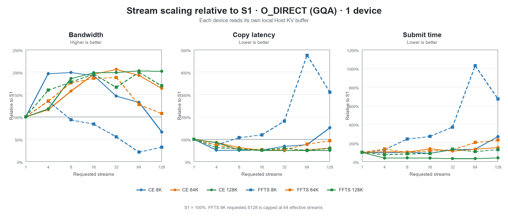
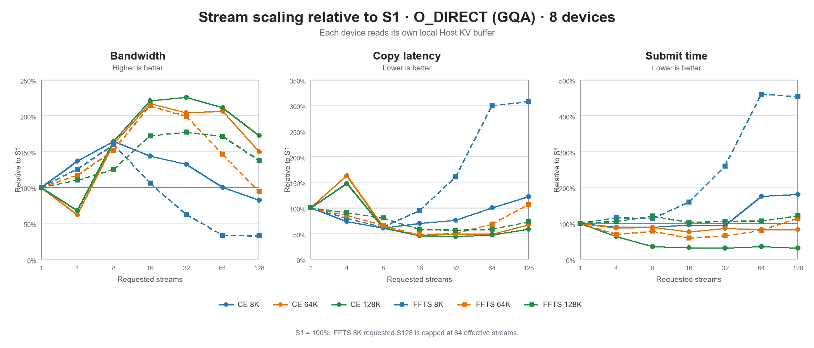
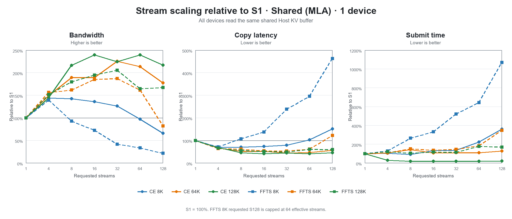
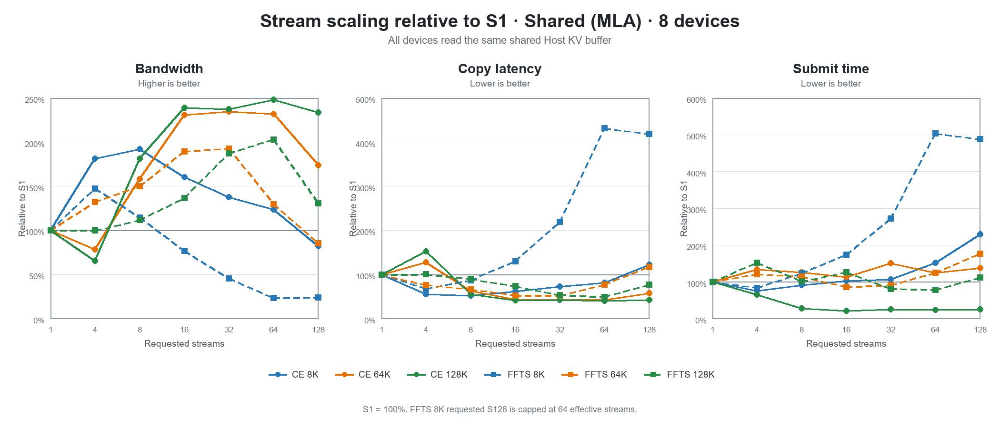
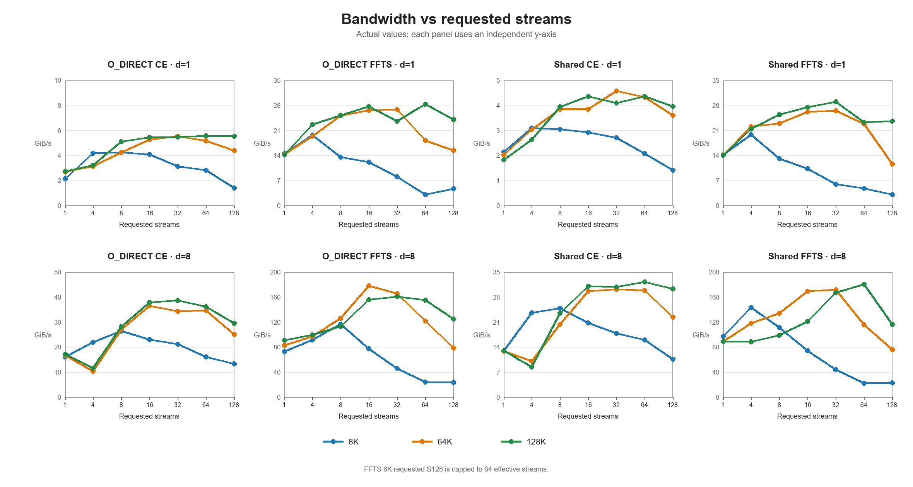
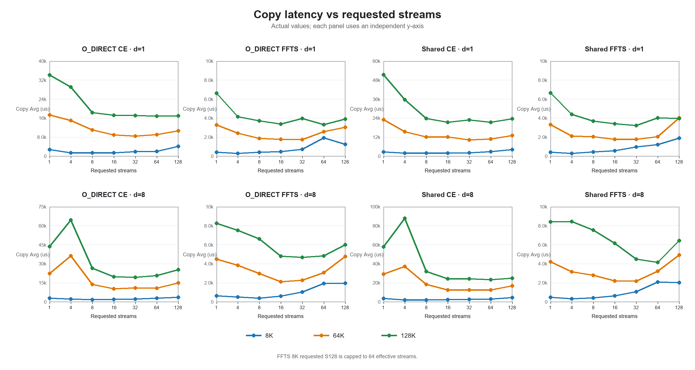
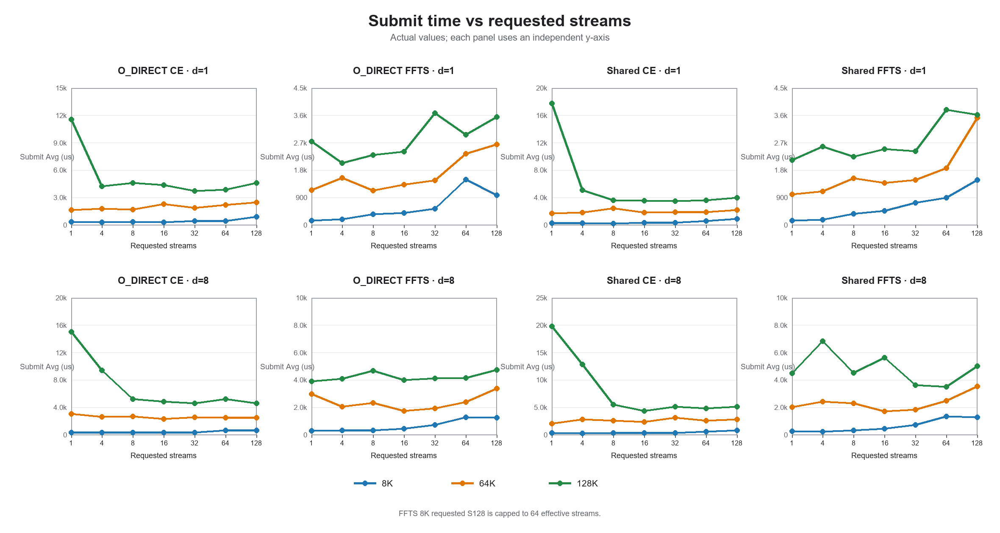

# Ascend H2D GLM5 简化 IO 模型 Stream Sweep 数据报告

## 1. 测试口径

本报告以数据整理和可视化为主，不展开根因分析。

- Run ID：`20260825_062905`
- 代码提交：`7fa8f4bd88a4eab9dd3a9ab489343c617293f850`
- 单个物理 IO：32K
- 每个 shard：128 tokens、3 个 32K IO
- Iterations：128，另有 3 次 warmup
- 设备数：1、8
- Requested stream：1、4、8、16、32、64、128
- 完成同步模式：`event`（其他 Stream 的结束 Event 汇聚到主 Stream）
- Host：O_DIRECT、Shared
- 方法：CE Multi-stream、FFTS Direct H2D
- 完整组合：168，失败数：0

| 序列长度 | Shard 数 | 每卡 IO 数 | 每卡传输量 | 8 卡总传输量 | CE 参数 | FFTS 参数 |
|---:|---:|---:|---:|---:|---|---|
| 8K | 64 | 192 | 6 MiB | 48 MiB | `-n 192` | `-n 64 -f 3` |
| 64K | 512 | 1536 | 48 MiB | 384 MiB | `-n 1536` | `-n 512 -f 3` |
| 128K | 1024 | 3072 | 96 MiB | 768 MiB | `-n 3072` | `-n 1024 -f 3` |

表格中的 Submit、Copy 单位均为微秒，统计顺序为 `Min/Max/Avg/P50/P90`。BW 沿用日志口径，实际按 1024³ 换算，数值单位更接近 GiB/s。8 卡 Submit/Copy 使用每轮最慢设备的时间。

## 2. 可视化

### 2.1 Stream 相对 S1 的总体趋势

各组合先相对自身 S1 归一化，再按 Host 内存形态和设备数拆为 4 张图。每张图同时展示带宽、Copy 时延和 Submit 时间，适合分别观察不同内存形态和卡数下的 stream 拐点。

- O_DIRECT 对应本次模拟的 GQA 内存形态：每张卡读取各自独立的本地 Host KV Buffer。
- Shared 对应本次模拟的 MLA 内存形态：多张卡读取同一块共享 Host KV Buffer 的相同 offset。

#### O_DIRECT（GQA）· 1 卡

#### O_DIRECT（GQA）· 8 卡

#### Shared（MLA）· 1 卡

#### Shared（MLA）· 8 卡

### 2.2 带宽实际值

8 个面板分别对应 4 个 case 和单卡/8卡。各面板使用独立纵轴，三条线对应 8K、64K、128K。

### 2.3 Copy 完成时延实际值

Copy Avg 越低越好。图中可以直接看到 CE 的长尾对平均时延的影响，以及 FFTS 在高 stream 下的退化点。

### 2.4 Submit 下发时间实际值

Submit Avg 越低越好。该图用于区分 Host 下发成本变化和设备 Copy 时延变化。

8K FFTS 只有 64 个 task，因此 Requested Stream 128 的 Effective Stream 实际为 64。

## 3. 完整数据

数据按 case 拆分，每个 case 再拆为单卡和 8 卡，共 8 张表。

### 3.1 O_DIRECT CE

#### 1 卡

| 序列 | Req Stream | Eff Stream | IO/卡 | Total IO | Submit us Min/Max/Avg/P50/P90 | Copy us Min/Max/Avg/P50/P90 | BW |
|---:|---:|---:|---:|---:|---|---|---:|
| 8K | 1 | 1 | 192 | 192 | 249/361/337/342/353 | 2544/3213/2745/2722/2807 | 2.135 |
| 8K | 4 | 4 | 192 | 192 | 232/372/317/318/364 | 1153/1724/1396/1378/1652 | 4.197 |
| 8K | 8 | 8 | 192 | 192 | 259/1025/345/345/389 | 1082/1743/1377/1377/1507 | 4.255 |
| 8K | 16 | 16 | 192 | 192 | 243/454/297/272/389 | 1177/1938/1428/1357/1700 | 4.103 |
| 8K | 32 | 32 | 192 | 192 | 321/772/428/425/455 | 1528/2413/1875/1890/2039 | 3.125 |
| 8K | 64 | 64 | 192 | 192 | 396/483/452/457/471 | 1749/2604/2076/2069/2297 | 2.822 |
| 8K | 128 | 128 | 192 | 192 | 618/959/906/913/933 | 3868/4754/4150/4142/4309 | 1.412 |
| 64K | 1 | 1 | 1536 | 1536 | 1499/2450/1654/1617/1741 | 8498/22194/17407/17325/18784 | 2.693 |
| 64K | 4 | 4 | 1536 | 1536 | 1571/11515/1781/1615/1676 | 8526/109195/14981/9521/11114 | 3.129 |
| 64K | 8 | 8 | 1536 | 1536 | 1606/1923/1677/1669/1739 | 8271/106624/11032/9546/10293 | 4.249 |
| 64K | 16 | 16 | 1536 | 1536 | 1844/2485/2309/2352/2443 | 7261/10300/8911/8960/9593 | 5.260 |
| 64K | 32 | 32 | 1536 | 1536 | 1699/2234/1853/1802/2091 | 7228/9592/8446/8443/9076 | 5.550 |
| 64K | 64 | 64 | 1536 | 1536 | 1864/2633/2199/2113/2569 | 8419/9660/9046/9056/9372 | 5.182 |
| 64K | 128 | 128 | 1536 | 1536 | 2164/2873/2482/2464/2655 | 8982/12119/10646/10722/11474 | 4.403 |
| 128K | 1 | 1 | 3072 | 3072 | 10025/13628/11550/11593/12034 | 30335/37894/34148/34293/35608 | 2.745 |
| 128K | 4 | 4 | 3072 | 3072 | 3124/21609/4213/3246/4521 | 15122/117934/29022/18894/109940 | 3.230 |
| 128K | 8 | 8 | 3072 | 3072 | 3428/6847/4588/4605/4726 | 14666/109293/18390/17684/19155 | 5.098 |
| 128K | 16 | 16 | 3072 | 3072 | 3558/4788/4398/4457/4671 | 13980/20569/17203/17454/18833 | 5.450 |
| 128K | 32 | 32 | 3072 | 3072 | 3282/6126/3709/3453/4561 | 13983/100890/17160/16451/17968 | 5.463 |
| 128K | 64 | 64 | 3072 | 3072 | 3411/4747/3873/3753/4508 | 14616/20082/16837/16819/18236 | 5.568 |
| 128K | 128 | 128 | 3072 | 3072 | 3906/5394/4589/4382/5248 | 14763/18407/16940/17067/17592 | 5.534 |

#### 8 卡

| 序列 | Req Stream | Eff Stream | IO/卡 | Total IO | Submit us Min/Max/Avg/P50/P90 | Copy us Min/Max/Avg/P50/P90 | BW |
|---:|---:|---:|---:|---:|---|---|---:|
| 8K | 1 | 1 | 192 | 1536 | 266/686/365/366/383 | 2671/3275/2908/2906/3036 | 16.119 |
| 8K | 4 | 4 | 192 | 1536 | 226/383/324/320/358 | 1609/10133/2129/1812/2508 | 22.017 |
| 8K | 8 | 8 | 192 | 1536 | 271/419/325/334/363 | 1553/2477/1774/1779/1877 | 26.423 |
| 8K | 16 | 16 | 192 | 1536 | 277/463/350/360/396 | 1747/2634/2026/2014/2207 | 23.137 |
| 8K | 32 | 32 | 192 | 1536 | 320/577/342/334/373 | 1956/2654/2202/2197/2372 | 21.287 |
| 8K | 64 | 64 | 192 | 1536 | 467/916/641/630/826 | 2480/3332/2909/2895/3140 | 16.114 |
| 8K | 128 | 128 | 192 | 1536 | 617/813/658/652/688 | 3190/4498/3532/3500/3772 | 13.272 |
| 64K | 1 | 1 | 1536 | 12288 | 2566/4024/3034/3051/3321 | 18752/25387/22330/22489/23886 | 16.794 |
| 64K | 4 | 4 | 1536 | 12288 | 1626/12809/2639/2345/2755 | 10176/111620/36245/11792/108073 | 10.346 |
| 64K | 8 | 8 | 1536 | 12288 | 1981/12461/2701/2542/2785 | 9794/108880/13884/10868/11552 | 27.010 |
| 64K | 16 | 16 | 1536 | 12288 | 1964/2673/2291/2292/2491 | 9459/11545/10295/10287/10639 | 36.425 |
| 64K | 32 | 32 | 1536 | 12288 | 1956/3028/2591/2643/2835 | 9923/12093/10941/10918/11501 | 34.275 |
| 64K | 64 | 64 | 1536 | 12288 | 2022/3213/2510/2516/2681 | 9425/12153/10825/10844/11600 | 34.642 |
| 64K | 128 | 128 | 1536 | 12288 | 2344/3372/2497/2440/2680 | 10908/23458/14952/15144/16680 | 25.080 |
| 128K | 1 | 1 | 3072 | 24576 | 12441/17119/15051/14961/16352 | 37923/49653/43690/43511/47173 | 17.166 |
| 128K | 4 | 4 | 3072 | 24576 | 4914/26338/9430/6349/20861 | 20159/120613/64391/23367/118007 | 11.648 |
| 128K | 8 | 8 | 3072 | 24576 | 3949/10147/5244/5210/5748 | 19089/119943/26590/21054/22432 | 28.206 |
| 128K | 16 | 16 | 3072 | 24576 | 3822/6417/4835/4701/5671 | 18312/21681/19786/19684/20846 | 37.906 |
| 128K | 32 | 32 | 3072 | 24576 | 3746/5664/4579/4551/5178 | 18258/20725/19387/19376/19981 | 38.686 |
| 128K | 64 | 64 | 3072 | 24576 | 4047/7651/5212/4974/6539 | 18905/23924/20704/20616/21545 | 36.225 |
| 128K | 128 | 128 | 3072 | 24576 | 3942/7777/4616/4483/5447 | 21839/39365/25381/25387/26750 | 29.550 |

### 3.2 O_DIRECT FFTS

#### 1 卡

| 序列 | Req Stream | Eff Stream | IO/卡 | Total IO | Submit us Min/Max/Avg/P50/P90 | Copy us Min/Max/Avg/P50/P90 | BW |
|---:|---:|---:|---:|---:|---|---|---:|
| 8K | 1 | 1 | 192 | 192 | 128/205/145/136/178 | 394/418/403/403/409 | 14.539 |
| 8K | 4 | 4 | 192 | 192 | 174/242/184/181/197 | 255/339/298/297/307 | 19.662 |
| 8K | 8 | 8 | 192 | 192 | 299/422/351/350/374 | 376/489/432/432/455 | 13.563 |
| 8K | 16 | 16 | 192 | 192 | 352/423/392/393/410 | 439/518/481/484/500 | 12.182 |
| 8K | 32 | 32 | 192 | 192 | 503/713/536/519/661 | 676/931/728/715/839 | 8.049 |
| 8K | 64 | 64 | 192 | 192 | 1369/1547/1489/1494/1527 | 1732/2069/1914/1938/2008 | 3.061 |
| 8K | 128 | 64 | 192 | 192 | 920/1019/973/977/992 | 1158/1381/1250/1244/1317 | 4.688 |
| 64K | 1 | 1 | 1536 | 1536 | 1059/1198/1144/1148/1183 | 3250/3339/3280/3280/3293 | 14.291 |
| 64K | 4 | 4 | 1536 | 1536 | 1432/1651/1543/1542/1606 | 2327/2529/2418/2421/2473 | 19.386 |
| 64K | 8 | 8 | 1536 | 1536 | 1049/1215/1132/1137/1181 | 1828/1905/1866/1868/1888 | 25.121 |
| 64K | 16 | 16 | 1536 | 1536 | 1205/1414/1329/1347/1384 | 1703/1817/1763/1768/1789 | 26.588 |
| 64K | 32 | 32 | 1536 | 1536 | 1419/1560/1460/1450/1500 | 1692/1842/1746/1740/1788 | 26.847 |
| 64K | 64 | 64 | 1536 | 1536 | 2234/2614/2339/2319/2432 | 2453/2881/2579/2547/2744 | 18.176 |
| 64K | 128 | 128 | 1536 | 1536 | 2573/2729/2642/2649/2681 | 2888/3353/3050/3016/3216 | 15.369 |
| 128K | 1 | 1 | 3072 | 3072 | 2670/3536/2748/2723/2840 | 6570/7086/6611/6603/6620 | 14.181 |
| 128K | 4 | 4 | 3072 | 3072 | 1953/2207/2035/2028/2091 | 4101/4208/4145/4145/4171 | 22.618 |
| 128K | 8 | 8 | 3072 | 3072 | 2012/3239/2301/2115/2878 | 3564/4107/3718/3648/3961 | 25.215 |
| 128K | 16 | 16 | 3072 | 3072 | 2289/2500/2405/2410/2466 | 3329/3436/3384/3385/3416 | 27.704 |
| 128K | 32 | 32 | 3072 | 3072 | 3307/3981/3668/3658/3902 | 3661/4325/3979/3963/4150 | 23.561 |
| 128K | 64 | 64 | 3072 | 3072 | 2769/3253/2961/2940/3078 | 3191/3576/3312/3299/3425 | 28.306 |
| 128K | 128 | 128 | 3072 | 3072 | 3434/3768/3543/3512/3692 | 3750/4270/3897/3843/4135 | 24.057 |

#### 8 卡

| 序列 | Req Stream | Eff Stream | IO/卡 | Total IO | Submit us Min/Max/Avg/P50/P90 | Copy us Min/Max/Avg/P50/P90 | BW |
|---:|---:|---:|---:|---:|---|---|---:|
| 8K | 1 | 1 | 192 | 1536 | 187/402/279/278/352 | 594/1325/640/632/668 | 73.242 |
| 8K | 4 | 4 | 192 | 1536 | 225/522/323/308/420 | 366/835/510/472/708 | 91.912 |
| 8K | 8 | 8 | 192 | 1536 | 276/443/315/311/349 | 352/488/401/395/449 | 116.895 |
| 8K | 16 | 16 | 192 | 1536 | 380/543/442/441/487 | 543/713/605/599/654 | 77.479 |
| 8K | 32 | 32 | 192 | 1536 | 600/971/723/718/777 | 835/1376/1026/1028/1102 | 45.687 |
| 8K | 64 | 64 | 192 | 1536 | 1137/2464/1282/1269/1382 | 1736/3262/1917/1908/2033 | 24.452 |
| 8K | 128 | 64 | 192 | 1536 | 1122/1524/1264/1257/1350 | 1742/2220/1966/1958/2068 | 23.843 |
| 64K | 1 | 1 | 1536 | 12288 | 1739/3560/2971/3027/3204 | 4055/4854/4502/4532/4681 | 83.296 |
| 64K | 4 | 4 | 1536 | 12288 | 1401/2629/2047/2105/2403 | 2445/4636/3853/3940/4217 | 97.327 |
| 64K | 8 | 8 | 1536 | 12288 | 1636/3366/2317/2220/2935 | 2229/3889/2964/2949/3415 | 126.518 |
| 64K | 16 | 16 | 1536 | 12288 | 1533/2143/1749/1720/1943 | 1972/2348/2109/2101/2233 | 177.809 |
| 64K | 32 | 32 | 1536 | 12288 | 1583/2682/1925/1886/2225 | 1943/2981/2262/2208/2532 | 165.782 |
| 64K | 64 | 64 | 1536 | 12288 | 2136/2738/2398/2385/2560 | 2797/3507/3083/3077/3258 | 121.635 |
| 64K | 128 | 128 | 1536 | 12288 | 2957/4537/3381/3279/3830 | 4245/6583/4783/4690/5215 | 78.403 |
| 128K | 1 | 1 | 3072 | 24576 | 2904/4655/3899/3889/4312 | 7772/8682/8258/8315/8592 | 90.821 |
| 128K | 4 | 4 | 3072 | 24576 | 3602/5177/4102/4066/4347 | 6378/7930/7503/7535/7753 | 99.960 |
| 128K | 8 | 8 | 3072 | 24576 | 3929/5176/4671/4702/4883 | 5680/7080/6605/6663/6863 | 113.550 |
| 128K | 16 | 16 | 3072 | 24576 | 2936/4681/3997/4034/4462 | 3852/6361/4806/4788/5411 | 156.055 |
| 128K | 32 | 32 | 3072 | 24576 | 3377/5050/4111/4089/4547 | 3884/5834/4671/4666/5245 | 160.565 |
| 128K | 64 | 64 | 3072 | 24576 | 3353/5310/4139/4158/4852 | 3935/6063/4824/4746/5611 | 155.473 |
| 128K | 128 | 128 | 3072 | 24576 | 3971/7045/4726/4658/5289 | 5127/8071/5989/5939/6634 | 125.230 |

### 3.3 Shared CE

#### 1 卡

| 序列 | Req Stream | Eff Stream | IO/卡 | Total IO | Submit us Min/Max/Avg/P50/P90 | Copy us Min/Max/Avg/P50/P90 | BW |
|---:|---:|---:|---:|---:|---|---|---:|
| 8K | 1 | 1 | 192 | 192 | 219/278/253/256/265 | 1745/3685/2736/2792/3501 | 2.142 |
| 8K | 4 | 4 | 192 | 192 | 205/344/267/258/310 | 1548/2434/1895/1844/2219 | 3.092 |
| 8K | 8 | 8 | 192 | 192 | 218/254/234/233/250 | 1528/2333/1922/1877/2247 | 3.049 |
| 8K | 16 | 16 | 192 | 192 | 276/505/340/336/388 | 1663/2360/2007/1994/2174 | 2.919 |
| 8K | 32 | 32 | 192 | 192 | 309/519/344/322/436 | 1863/2641/2167/2143/2368 | 2.704 |
| 8K | 64 | 64 | 192 | 192 | 409/676/563/575/609 | 2277/3388/2819/2789/3126 | 2.079 |
| 8K | 128 | 128 | 192 | 192 | 636/996/912/927/960 | 3780/4914/4147/4052/4567 | 1.413 |
| 64K | 1 | 1 | 1536 | 1536 | 1523/1856/1705/1712/1826 | 19818/29753/23086/23255/26468 | 2.030 |
| 64K | 4 | 4 | 1536 | 1536 | 1656/14901/1850/1742/1775 | 9463/107849/15498/11910/13003 | 3.025 |
| 64K | 8 | 8 | 1536 | 1536 | 1928/2690/2440/2458/2529 | 9945/110641/12180/11443/12071 | 3.849 |
| 64K | 16 | 16 | 1536 | 1536 | 1672/7405/1849/1762/1812 | 9635/101488/12186/10741/11774 | 3.847 |
| 64K | 32 | 32 | 1536 | 1536 | 1713/2140/1883/1879/1949 | 8944/11751/10239/10392/10973 | 4.578 |
| 64K | 64 | 64 | 1536 | 1536 | 1762/2068/1879/1860/2019 | 6828/13088/10817/11332/12693 | 4.333 |
| 64K | 128 | 128 | 1536 | 1536 | 2043/3502/2199/2148/2275 | 7715/15956/13016/13479/14976 | 3.601 |
| 128K | 1 | 1 | 3072 | 3072 | 9031/21873/17733/18136/19862 | 24859/62072/51430/52765/56735 | 1.823 |
| 128K | 4 | 4 | 3072 | 3072 | 3316/36356/5065/3473/6181 | 19152/122989/35623/25359/112991 | 2.632 |
| 128K | 8 | 8 | 3072 | 3072 | 3122/3782/3608/3655/3744 | 19744/109655/23776/22493/23687 | 3.943 |
| 128K | 16 | 16 | 3072 | 3072 | 3301/5966/3525/3426/3632 | 18558/25286/21478/21448/23003 | 4.365 |
| 128K | 32 | 32 | 3072 | 3072 | 3181/8609/3488/3429/3527 | 18257/102246/22911/22323/24402 | 4.092 |
| 128K | 64 | 64 | 3072 | 3072 | 3314/3951/3623/3608/3850 | 18706/23719/21469/21395/23007 | 4.367 |
| 128K | 128 | 128 | 3072 | 3072 | 3781/4264/3992/3968/4169 | 20698/25250/23698/24022/24461 | 3.956 |

#### 8 卡

| 序列 | Req Stream | Eff Stream | IO/卡 | Total IO | Submit us Min/Max/Avg/P50/P90 | Copy us Min/Max/Avg/P50/P90 | BW |
|---:|---:|---:|---:|---:|---|---|---:|
| 8K | 1 | 1 | 192 | 1536 | 287/468/359/348/416 | 3058/4155/3611/3669/3939 | 12.981 |
| 8K | 4 | 4 | 192 | 1536 | 235/336/272/282/304 | 1613/2351/1990/2017/2195 | 23.555 |
| 8K | 8 | 8 | 192 | 1536 | 279/395/327/325/366 | 1498/2382/1881/1856/2111 | 24.920 |
| 8K | 16 | 16 | 192 | 1536 | 297/672/368/369/410 | 1874/2708/2251/2235/2430 | 20.824 |
| 8K | 32 | 32 | 192 | 1536 | 326/552/381/348/488 | 2143/3169/2622/2665/2882 | 17.878 |
| 8K | 64 | 64 | 192 | 1536 | 444/821/547/528/690 | 2325/3552/2922/2940/3210 | 16.042 |
| 8K | 128 | 128 | 192 | 1536 | 653/1546/825/762/1010 | 3776/5576/4405/4344/4824 | 10.641 |
| 64K | 1 | 1 | 1536 | 12288 | 1877/2949/2074/1925/2600 | 23902/32767/29121/29212/31565 | 12.877 |
| 64K | 4 | 4 | 1536 | 12288 | 1850/12767/2782/2574/3284 | 11574/112134/37114/13426/109763 | 10.104 |
| 64K | 8 | 8 | 1536 | 12288 | 1922/14526/2619/2374/2549 | 11153/112009/18442/12662/13683 | 20.334 |
| 64K | 16 | 16 | 1536 | 12288 | 1827/4529/2351/2325/2602 | 10443/102311/12624/11851/12715 | 29.705 |
| 64K | 32 | 32 | 1536 | 12288 | 2017/62402/3119/2666/3069 | 10536/67000/12413/12019/12610 | 30.210 |
| 64K | 64 | 64 | 1536 | 12288 | 2070/4092/2584/2557/3153 | 10962/13664/12546/12601/13292 | 29.890 |
| 64K | 128 | 128 | 1536 | 12288 | 2354/3828/2847/2861/3090 | 13660/32513/16768/16271/18666 | 22.364 |
| 128K | 1 | 1 | 3072 | 24576 | 16735/24335/19823/19733/21809 | 50997/63706/57737/57820/61032 | 12.990 |
| 128K | 4 | 4 | 3072 | 24576 | 4128/33080/12865/5741/27948 | 24886/127184/87891/116219/123303 | 8.533 |
| 128K | 8 | 8 | 3072 | 24576 | 4070/18697/5481/5251/5813 | 22909/122122/31891/25696/27353 | 23.518 |
| 128K | 16 | 16 | 3072 | 24576 | 3820/5755/4352/4308/4562 | 21786/27042/24154/24076/25560 | 31.051 |
| 128K | 32 | 32 | 3072 | 24576 | 3618/24321/5110/4978/5823 | 22119/28907/24307/24247/25540 | 30.855 |
| 128K | 64 | 64 | 3072 | 24576 | 3970/6606/4840/4757/5617 | 20509/28040/23247/23210/24561 | 32.262 |
| 128K | 128 | 128 | 3072 | 24576 | 4312/6890/5121/5069/5715 | 22211/34870/24724/24617/26089 | 30.335 |

### 3.4 Shared FFTS

#### 1 卡

| 序列 | Req Stream | Eff Stream | IO/卡 | Total IO | Submit us Min/Max/Avg/P50/P90 | Copy us Min/Max/Avg/P50/P90 | BW |
|---:|---:|---:|---:|---:|---|---|---:|
| 8K | 1 | 1 | 192 | 192 | 129/151/139/140/144 | 402/424/413/414/419 | 14.187 |
| 8K | 4 | 4 | 192 | 192 | 166/201/179/181/190 | 284/309/296/298/302 | 19.795 |
| 8K | 8 | 8 | 192 | 192 | 334/426/367/367/387 | 415/501/445/446/464 | 13.167 |
| 8K | 16 | 16 | 192 | 192 | 417/493/461/464/479 | 540/634/568/566/592 | 10.316 |
| 8K | 32 | 32 | 192 | 192 | 658/779/725/724/745 | 819/1233/984/988/1015 | 5.955 |
| 8K | 64 | 64 | 192 | 192 | 776/981/894/895/928 | 1072/1460/1220/1195/1366 | 4.803 |
| 8K | 128 | 64 | 192 | 192 | 1294/1583/1485/1482/1539 | 1738/2149/1912/1887/2069 | 3.065 |
| 64K | 1 | 1 | 1536 | 1536 | 915/1081/1013/1019/1044 | 3289/3332/3308/3309/3319 | 14.170 |
| 64K | 4 | 4 | 1536 | 1536 | 1030/1192/1103/1091/1166 | 2084/2504/2117/2112/2133 | 22.142 |
| 64K | 8 | 8 | 1536 | 1536 | 1426/1677/1538/1532/1629 | 1977/2114/2046/2045/2085 | 22.911 |
| 64K | 16 | 16 | 1536 | 1536 | 1319/1554/1379/1372/1421 | 1739/1907/1786/1781/1816 | 26.246 |
| 64K | 32 | 32 | 1536 | 1536 | 1417/1616/1486/1469/1560 | 1702/1904/1768/1766/1809 | 26.513 |
| 64K | 64 | 64 | 1536 | 1536 | 1774/1916/1863/1878/1896 | 1943/2231/2048/2052/2079 | 22.888 |
| 64K | 128 | 128 | 1536 | 1536 | 3329/3642/3524/3532/3573 | 3755/4449/4030/3933/4325 | 11.632 |
| 128K | 1 | 1 | 3072 | 3072 | 1879/2330/2128/2099/2303 | 6608/6900/6640/6638/6652 | 14.119 |
| 128K | 4 | 4 | 3072 | 3072 | 1990/3588/2575/2213/3214 | 4134/4897/4383/4223/4666 | 21.389 |
| 128K | 8 | 8 | 3072 | 3072 | 2161/2350/2242/2241/2282 | 3624/3743/3690/3691/3716 | 25.407 |
| 128K | 16 | 16 | 3072 | 3072 | 2202/2620/2500/2517/2573 | 3324/3470/3407/3413/3436 | 27.517 |
| 128K | 32 | 32 | 3072 | 3072 | 2283/2604/2425/2410/2558 | 3184/3329/3229/3224/3274 | 29.034 |
| 128K | 64 | 64 | 3072 | 3072 | 3549/4284/3780/3744/4045 | 3812/4483/4035/3998/4264 | 23.234 |
| 128K | 128 | 128 | 3072 | 3072 | 3564/3685/3618/3619/3651 | 3869/4334/3968/3920/4257 | 23.627 |

#### 8 卡

| 序列 | Req Stream | Eff Stream | IO/卡 | Total IO | Submit us Min/Max/Avg/P50/P90 | Copy us Min/Max/Avg/P50/P90 | BW |
|---:|---:|---:|---:|---:|---|---|---:|
| 8K | 1 | 1 | 192 | 1536 | 186/405/265/258/332 | 449/516/482/482/499 | 97.251 |
| 8K | 4 | 4 | 192 | 1536 | 182/324/222/218/243 | 299/404/327/324/345 | 143.349 |
| 8K | 8 | 8 | 192 | 1536 | 275/1241/327/308/349 | 358/1418/420/402/443 | 111.607 |
| 8K | 16 | 16 | 192 | 1536 | 376/871/461/448/526 | 523/1074/628/610/723 | 74.642 |
| 8K | 32 | 32 | 192 | 1536 | 614/833/720/729/773 | 869/1205/1055/1054/1131 | 44.431 |
| 8K | 64 | 64 | 192 | 1536 | 1175/1751/1333/1331/1451 | 1833/2754/2078/2113/2207 | 22.558 |
| 8K | 128 | 64 | 192 | 1536 | 1161/1558/1294/1288/1381 | 1852/2234/2017/2014/2139 | 23.240 |
| 64K | 1 | 1 | 1536 | 12288 | 1616/2756/2007/2007/2164 | 4113/4342/4200/4204/4247 | 89.286 |
| 64K | 4 | 4 | 1536 | 12288 | 1585/3440/2425/2421/2915 | 2488/4067/3178/3169/3524 | 117.999 |
| 64K | 8 | 8 | 1536 | 12288 | 1334/3463/2291/2255/2999 | 1994/3905/2795/2752/3346 | 134.168 |
| 64K | 16 | 16 | 1536 | 12288 | 1456/2484/1728/1699/1997 | 1929/3098/2216/2197/2482 | 169.224 |
| 64K | 32 | 32 | 1536 | 12288 | 1580/2475/1826/1798/2087 | 1922/2805/2180/2155/2400 | 172.018 |
| 64K | 64 | 64 | 1536 | 12288 | 2056/3386/2500/2450/2734 | 2698/4220/3238/3212/3495 | 115.812 |
| 64K | 128 | 128 | 1536 | 12288 | 3215/4097/3540/3499/3905 | 4465/5761/4917/4893/5247 | 76.266 |
| 128K | 1 | 1 | 3072 | 24576 | 3170/7381/4483/4463/5002 | 8240/9925/8420/8408/8487 | 89.074 |
| 128K | 4 | 4 | 3072 | 24576 | 3629/8814/6826/7517/8286 | 5902/10445/8442/8828/9496 | 88.842 |
| 128K | 8 | 8 | 3072 | 24576 | 3890/6319/4528/4523/4709 | 5920/8949/7547/7565/8157 | 99.377 |
| 128K | 16 | 16 | 3072 | 24576 | 3233/7729/5644/6104/7516 | 3837/8242/6172/6659/7879 | 121.517 |
| 128K | 32 | 32 | 3072 | 24576 | 3061/4242/3632/3611/3988 | 3704/5975/4496/4364/5326 | 166.815 |
| 128K | 64 | 64 | 3072 | 24576 | 3161/4272/3495/3448/3805 | 3786/4836/4149/4079/4489 | 180.766 |
| 128K | 128 | 128 | 3072 | 24576 | 4106/7122/5012/5038/5596 | 5134/9248/6446/6514/7087 | 116.351 |

## 4. 简要数据观察

- 8K 的有效区间集中在 4～8 streams。
- 64K 的有效区间集中在 16～32 streams。
- 128K 的高带宽区间集中在 16～64 streams。
- Submit 与 Copy/BW 不总是同步变化，需结合三张图一起判断。
- S128 普遍不是最优点。
- CE S4 在部分 64K、128K 场景存在约 100ms 级 Copy 长尾，完整统计保留在对应表格中。

## 5. 代码 IO 模式说明

- 每个 case 只准备一次 Host/Device buffer，然后循环执行 3 次 warmup 和 128 次正式测试；每轮复用同一批地址和数据。
- CE 将连续 IO 近似均分给各 stream，每个 stream 按地址顺序逐个提交 32K memcpy。
- FFTS 每 3 个连续 32K fragment 组成一个 task，再将 task round-robin 分配到各 stream。
- Shared 多卡场景中，所有设备子进程映射同一个 POSIX shared-memory 对象，并读取相同 offset；每张卡的 Device 目标 buffer 独立。
- O_DIRECT 多卡场景中，每张卡使用独立的匿名 Host mapping。
- 当前测试没有真实文件 `read/pread`、O_DIRECT backend IO 或 CacheStore 排队，因此结果反映的是热内存 H2D 微基准。
