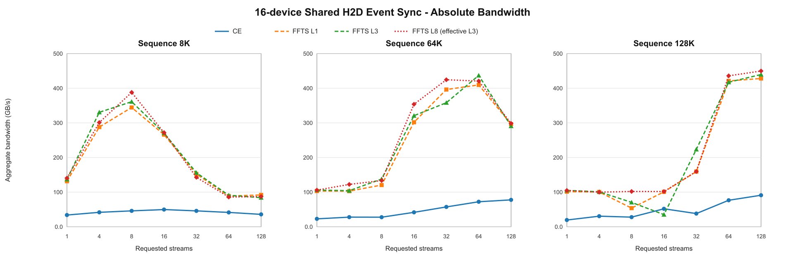
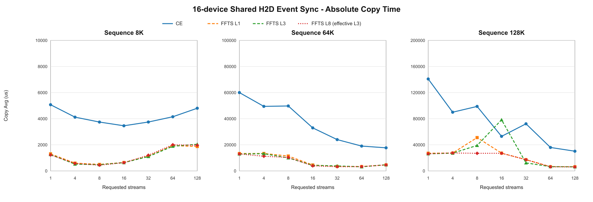
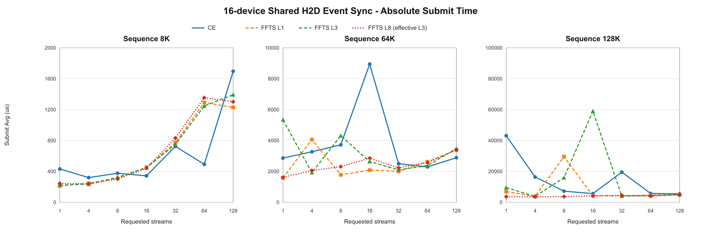

# Ascend H2D GLM Shared 简化 IO Stream/Lane Sweep 数据报告

## 1. 测试说明

本报告整理16卡Shared H2D、Event同步下的GLM简化IO实测结果，重点展示绝对带宽、Copy完成时间和Submit下发时间。

- Host形态：单块POSIX Shared Memory fan-out到16张卡，对应MLA共享内存形态
- IO模式：`glm`；每个task固定包含128K、16K、32K三个IO，合计176 KiB
- FFTS：一个task对应一次FFTS launch，launch内包含三个SDMA context
- CE：一个task对应三次`aclrtMemcpyAsync`，三个IO放在同一个stream
- Requested stream：1、4、8、16、32、64、128
- FFTS requested lane：1、3、8；由于每个launch只有三个context，lane 8的effective lane为3
- 同步方式：`event`
- Warmup：12轮；正式测试：128轮

| 序列长度 | 每卡task数 | 每卡IO数 | 每卡传输量 | 16卡聚合传输量 |
|---:|---:|---:|---:|---:|
| 8K | 64 | 192 | 11 MiB | 176 MiB |
| 64K | 512 | 1536 | 88 MiB | 1.375 GiB |
| 128K | 1024 | 3072 | 176 MiB | 2.75 GiB |

表格中的Submit和Copy单位均为微秒，顺序为`Min/Max/Avg/P50/P90`。多卡时间按每轮最慢设备合并；日志中的`BW(GB/s)`使用16卡总数据量除以Copy Avg，并按1024³换算，数值更接近GiB/s。

## 2. 性能趋势图

本节直接绘制实测绝对值。蓝色实线表示CE；其余虚线分别表示FFTS lane 1、3、8。每个序列长度子图都在纵轴上标明自己的绝对数值范围。

### 2.1 聚合带宽

### 2.2 Copy完成时间

### 2.3 Submit下发时间

## 3. 真实数据

### 3.1 Shared CE

| 序列 | Req Stream | Eff Stream | IO/卡 | Total IO | Submit us Min/Max/Avg/P50/P90 | Copy us Min/Max/Avg/P50/P90 | BW |
|---:|---:|---:|---:|---:|---:|---:|---:|
| 8K | 1 | 1 | 192 | 3072 | 289/770/352/356/377 | 3853/17305/4463/4273/4613 | 38.511 |
| 8K | 4 | 4 | 192 | 3072 | 286/396/318/311/354 | 3126/9016/3811/3400/5593 | 45.100 |
| 8K | 8 | 8 | 192 | 3072 | 295/607/327/315/350 | 2878/6041/3386/3202/3723 | 50.760 |
| 8K | 16 | 16 | 192 | 3072 | 310/485/349/339/392 | 2575/6421/3010/2954/3154 | 57.101 |
| 8K | 32 | 32 | 192 | 3072 | 396/576/473/476/526 | 3241/6785/3656/3540/3844 | 47.012 |
| 8K | 64 | 64 | 192 | 3072 | 468/947/595/590/707 | 3925/7073/4676/4670/4878 | 36.757 |
| 8K | 128 | 64 | 192 | 3072 | 483/858/589/546/722 | 3937/7832/4578/4504/4864 | 37.544 |
| 64K | 1 | 1 | 1536 | 24576 | 1960/11511/2658/2453/3198 | 40759/1112787/82686/45044/135493 | 16.629 |
| 64K | 4 | 4 | 1536 | 24576 | 2195/25209/3603/2614/5415 | 19125/122168/74929/108248/116586 | 18.351 |
| 64K | 8 | 8 | 1536 | 24576 | 2140/35918/3862/2529/3398 | 17339/132716/41290/22624/102904 | 33.301 |
| 64K | 16 | 16 | 1536 | 24576 | 1968/38822/3604/2399/2787 | 16038/226753/41314/21521/105153 | 33.282 |
| 64K | 32 | 32 | 1536 | 24576 | 2268/3472/2746/2736/2979 | 16029/210191/34464/31681/55026 | 39.897 |
| 64K | 64 | 64 | 1536 | 24576 | 2088/4211/2449/2387/2874 | 16381/76975/28863/27699/42209 | 47.639 |
| 64K | 128 | 128 | 1536 | 24576 | 2472/5601/3013/2931/3346 | 16994/46084/24287/19390/36937 | 56.615 |
| 128K | 1 | 1 | 3072 | 49152 | 21522/662172/29093/23708/25049 | 60924/1578274/78691/66410/70738 | 34.947 |
| 128K | 4 | 4 | 3072 | 49152 | 4623/54039/24062/22592/42541 | 32801/222551/115745/124647/130966 | 23.759 |
| 128K | 8 | 8 | 3072 | 49152 | 4666/41146/9236/5421/25534 | 30370/220755/89780/108307/128925 | 30.630 |
| 128K | 16 | 16 | 3072 | 49152 | 5101/52827/6509/5477/6451 | 28611/138708/53209/36392/108591 | 51.683 |
| 128K | 32 | 32 | 3072 | 49152 | 3964/11921/5252/5149/5723 | 24538/567204/68643/34613/143285 | 40.062 |
| 128K | 64 | 64 | 3072 | 49152 | 4064/29672/5280/4822/5917 | 25034/152071/45347/44465/60367 | 60.643 |
| 128K | 128 | 128 | 3072 | 49152 | 5110/24135/5807/5533/6479 | 23742/87924/35961/32589/49318 | 76.472 |

### 3.2 Shared FFTS · 8K

| Lane | Effective Lane | Req Stream | Eff Stream | IO/卡 | Total IO | Submit us Min/Max/Avg/P50/P90 | Copy us Min/Max/Avg/P50/P90 | BW |
|---:|---:|---:|---:|---:|---:|---:|---:|---:|
| 1 | 1 | 1 | 1 | 192 | 3072 | 173/392/247/242/295 | 1142/1321/1234/1235/1294 | 139.283 |
| 3 | 3 | 1 | 1 | 192 | 3072 | 222/626/348/333/468 | 996/1315/1159/1175/1239 | 148.296 |
| 8 | 3 | 1 | 1 | 192 | 3072 | 206/570/331/314/427 | 1038/1330/1171/1177/1247 | 146.776 |
| 1 | 1 | 4 | 4 | 192 | 3072 | 206/501/270/255/326 | 509/735/584/575/651 | 294.307 |
| 3 | 3 | 4 | 4 | 192 | 3072 | 228/648/329/313/444 | 406/778/516/510/603 | 333.091 |
| 8 | 3 | 4 | 4 | 192 | 3072 | 201/595/304/288/416 | 387/734/490/477/583 | 350.765 |
| 1 | 1 | 8 | 8 | 192 | 3072 | 269/635/338/324/406 | 448/771/518/508/580 | 331.805 |
| 3 | 3 | 8 | 8 | 192 | 3072 | 278/538/347/344/408 | 384/655/455/450/522 | 377.747 |
| 8 | 3 | 8 | 8 | 192 | 3072 | 288/547/352/345/403 | 393/650/463/452/522 | 371.220 |
| 1 | 1 | 16 | 16 | 192 | 3072 | 383/626/431/422/482 | 553/849/609/601/650 | 282.225 |
| 3 | 3 | 16 | 16 | 192 | 3072 | 405/565/454/448/498 | 582/775/643/638/690 | 267.302 |
| 8 | 3 | 16 | 16 | 192 | 3072 | 401/597/458/453/508 | 564/773/639/632/702 | 268.975 |
| 1 | 1 | 32 | 32 | 192 | 3072 | 666/1021/739/734/798 | 974/1311/1086/1077/1168 | 158.264 |
| 3 | 3 | 32 | 32 | 192 | 3072 | 634/1144/742/736/810 | 957/1730/1093/1079/1168 | 157.251 |
| 8 | 3 | 32 | 32 | 192 | 3072 | 620/902/729/722/816 | 936/1367/1081/1070/1187 | 158.996 |
| 1 | 1 | 64 | 64 | 192 | 3072 | 1181/2271/1412/1403/1527 | 1816/3094/2143/2128/2322 | 80.203 |
| 3 | 3 | 64 | 64 | 192 | 3072 | 1222/2326/1431/1414/1580 | 1888/3159/2146/2129/2306 | 80.091 |
| 8 | 3 | 64 | 64 | 192 | 3072 | 1216/2141/1425/1395/1535 | 1881/3190/2146/2091/2346 | 80.091 |
| 1 | 1 | 128 | 64 | 192 | 3072 | 1239/1693/1439/1428/1555 | 1971/2712/2172/2157/2314 | 79.132 |
| 3 | 3 | 128 | 64 | 192 | 3072 | 1140/2036/1353/1344/1458 | 1756/3133/2060/2017/2246 | 83.434 |
| 8 | 3 | 128 | 64 | 192 | 3072 | 1225/4222/1819/1445/3490 | 1842/5032/2466/2055/4177 | 69.698 |

### 3.3 Shared FFTS · 64K

| Lane | Effective Lane | Req Stream | Eff Stream | IO/卡 | Total IO | Submit us Min/Max/Avg/P50/P90 | Copy us Min/Max/Avg/P50/P90 | BW |
|---:|---:|---:|---:|---:|---:|---:|---:|---:|
| 1 | 1 | 1 | 1 | 1536 | 24576 | 1450/2275/1795/1806/2035 | 13237/13614/13428/13429/13480 | 102.398 |
| 3 | 3 | 1 | 1 | 1536 | 24576 | 1658/2100/1843/1860/1935 | 12830/13905/12993/12992/13029 | 105.826 |
| 8 | 3 | 1 | 1 | 1536 | 24576 | 1456/2267/1646/1578/2061 | 12713/13229/12989/12987/13031 | 105.859 |
| 1 | 1 | 4 | 4 | 1536 | 24576 | 1653/3763/1893/1857/2119 | 12097/15008/13196/13249/13594 | 104.198 |
| 3 | 3 | 4 | 4 | 1536 | 24576 | 1497/4014/1889/1829/2203 | 12389/14195/13414/13434/13624 | 102.505 |
| 8 | 3 | 4 | 4 | 1536 | 24576 | 1398/2501/1573/1534/1720 | 11954/13856/13247/13361/13633 | 103.797 |
| 1 | 1 | 8 | 8 | 1536 | 24576 | 1677/2329/1946/1928/2124 | 12432/14192/13447/13436/13757 | 102.253 |
| 3 | 3 | 8 | 8 | 1536 | 24576 | 1908/185290/4304/2633/4565 | 5901/186006/9972/8881/9684 | 137.886 |
| 8 | 3 | 8 | 8 | 1536 | 24576 | 1831/5934/3572/3547/5283 | 3486/7754/5185/5099/6442 | 265.188 |
| 1 | 1 | 16 | 16 | 1536 | 24576 | 1606/5480/2973/2633/4554 | 2987/6825/4575/4355/6068 | 300.546 |
| 3 | 3 | 16 | 16 | 1536 | 24576 | 1603/5484/2627/2427/3670 | 2602/6579/3698/3555/4751 | 371.823 |
| 8 | 3 | 16 | 16 | 1536 | 24576 | 1992/7263/3614/3308/4948 | 2741/7888/4208/4111/5429 | 326.759 |
| 1 | 1 | 32 | 32 | 1536 | 24576 | 1877/6264/2865/2758/3631 | 2692/6890/3602/3482/4510 | 381.732 |
| 3 | 3 | 32 | 32 | 1536 | 24576 | 1561/4802/2337/2148/3170 | 2171/6593/3156/3133/3819 | 435.678 |
| 8 | 3 | 32 | 32 | 1536 | 24576 | 1956/4309/2676/2628/3231 | 2295/4727/3254/3236/3837 | 422.557 |
| 1 | 1 | 64 | 64 | 1536 | 24576 | 2359/4878/2814/2652/3420 | 2949/5524/3558/3423/4162 | 386.453 |
| 3 | 3 | 64 | 64 | 1536 | 24576 | 2197/54720/3315/2886/3443 | 2913/55280/4067/3597/4185 | 338.087 |
| 8 | 3 | 64 | 64 | 1536 | 24576 | 2214/4774/2641/2511/3158 | 2933/5082/3286/3187/3733 | 418.442 |
| 1 | 1 | 128 | 128 | 1536 | 24576 | 3198/5030/3544/3490/3829 | 4469/6919/4914/4880/5229 | 279.813 |
| 3 | 3 | 128 | 128 | 1536 | 24576 | 3195/5008/3654/3623/3992 | 4455/6274/5061/5024/5523 | 271.685 |
| 8 | 3 | 128 | 128 | 1536 | 24576 | 3165/5848/3607/3575/3918 | 4426/8880/5008/4959/5397 | 274.561 |

### 3.4 Shared FFTS · 128K

| Lane | Effective Lane | Req Stream | Eff Stream | IO/卡 | Total IO | Submit us Min/Max/Avg/P50/P90 | Copy us Min/Max/Avg/P50/P90 | BW |
|---:|---:|---:|---:|---:|---:|---:|---:|---:|
| 1 | 1 | 1 | 1 | 3072 | 49152 | 2934/4223/3434/3446/3629 | 26862/27355/27206/27215/27284 | 101.081 |
| 3 | 3 | 1 | 1 | 3072 | 49152 | 2956/5827/3351/3233/3773 | 26100/26597/26248/26233/26341 | 104.770 |
| 8 | 3 | 1 | 1 | 3072 | 49152 | 2921/7428/3313/3235/3606 | 25941/26351/26180/26186/26251 | 105.042 |
| 1 | 1 | 4 | 4 | 3072 | 49152 | 2754/3946/3311/3252/3788 | 24099/27267/26085/26664/26912 | 105.425 |
| 3 | 3 | 4 | 4 | 3072 | 49152 | 2849/4804/3455/3420/3821 | 21833/25928/24433/24516/25397 | 112.553 |
| 8 | 3 | 4 | 4 | 3072 | 49152 | 3267/128722/5758/3876/4359 | 19845/130628/27336/26941/27249 | 100.600 |
| 1 | 1 | 8 | 8 | 3072 | 49152 | 5914/83352/9982/8999/10502 | 19913/85016/25799/25371/28025 | 106.593 |
| 3 | 3 | 8 | 8 | 3072 | 49152 | 8360/29425/10669/10180/12022 | 15094/31149/18417/18576/19976 | 149.319 |
| 8 | 3 | 8 | 8 | 3072 | 49152 | 7015/155887/11465/9776/11215 | 13912/156695/20115/18482/21066 | 136.714 |
| 1 | 1 | 16 | 16 | 3072 | 49152 | 4949/11559/8355/8586/10067 | 9562/22307/14348/14111/18536 | 191.664 |
| 3 | 3 | 16 | 16 | 3072 | 49152 | 5680/57466/10105/9859/11378 | 18218/58612/26619/26849/28128 | 103.310 |
| 8 | 3 | 16 | 16 | 3072 | 49152 | 4291/10166/6356/6124/8387 | 7407/16609/11958/11712/15277 | 229.972 |
| 1 | 1 | 32 | 32 | 3072 | 49152 | 4351/11810/7421/7472/9233 | 6239/13181/9116/8936/10896 | 301.667 |
| 3 | 3 | 32 | 32 | 3072 | 49152 | 3631/5803/4311/4216/4905 | 6999/21350/12027/11659/15948 | 228.652 |
| 8 | 3 | 32 | 32 | 3072 | 49152 | 4373/13833/7469/6628/10266 | 8924/26469/15976/15616/22098 | 172.133 |
| 1 | 1 | 64 | 64 | 3072 | 49152 | 3669/10179/5189/5084/6093 | 4884/11441/6285/6291/7293 | 437.550 |
| 3 | 3 | 64 | 64 | 3072 | 49152 | 3697/5811/4040/3992/4263 | 4576/10646/6432/6181/8234 | 427.550 |
| 8 | 3 | 64 | 64 | 3072 | 49152 | 3806/5614/4765/4782/5142 | 4760/8258/6094/5949/7230 | 451.264 |
| 1 | 1 | 128 | 128 | 3072 | 49152 | 4134/6772/4921/4731/5802 | 5544/9705/6512/6240/7678 | 422.297 |
| 3 | 3 | 128 | 128 | 3072 | 49152 | 4132/6753/4973/4857/5700 | 5516/8709/6446/6266/7441 | 426.621 |
| 8 | 3 | 128 | 128 | 3072 | 49152 | 4367/6152/5068/5022/5739 | 5644/8931/6677/6576/7702 | 411.862 |

## 4. 性能结果

| 序列长度 | CE建议配置 | CE较好区间 | 建议配置实测BW | FFTS建议配置 | FFTS较好区间 | 建议配置实测BW |
|---:|---|---|---:|---|---|---:|
| 8K | S16 | S8～S16 | 57.101 GB/s | S8/L3 | S4～S8，L3 | 377.747 GB/s |
| 64K | S128 | S64～S128 | 56.615 GB/s | S32/L3 | S16～S64，L3 | 435.678 GB/s |
| 128K | S128 | S64～S128 | 76.472 GB/s | S64/L3 | S64～S128，L3 | 427.550 GB/s |

简单结论：

- **8K短序列**：任务数量少，stream开得太多反而变慢。CE使用8～16个stream，优先选16；FFTS使用4～8个stream，优先选8，lane设为3。
- **64K序列**：CE需要更多stream才能把带宽拉起来，建议64～128，优先选128；FFTS的甜点区间是16～64，优先选32个stream、3个lane。
- **128K长序列**：CE建议直接使用64～128个stream，优先选128；FFTS在64～128个stream进入高带宽平台，优先选64个stream、3个lane。
- **lane选择**：每次FFTS launch只有3个IO context，因此统一使用L3即可。L8的实际effective lane仍是3，不会获得8路并发。
- 整体规律很清楚：序列越长，可并行task越多，适合使用更多stream；8K应控制stream数量，64K和128K再逐步提高。
