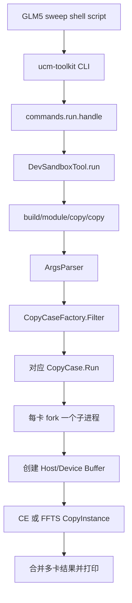
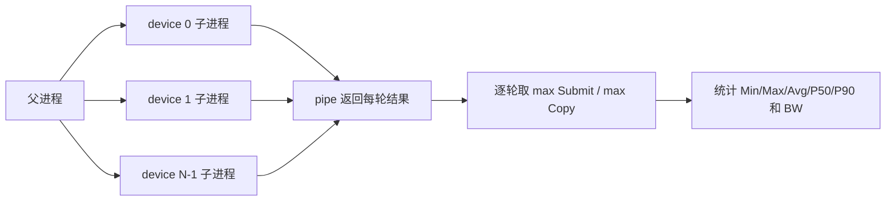
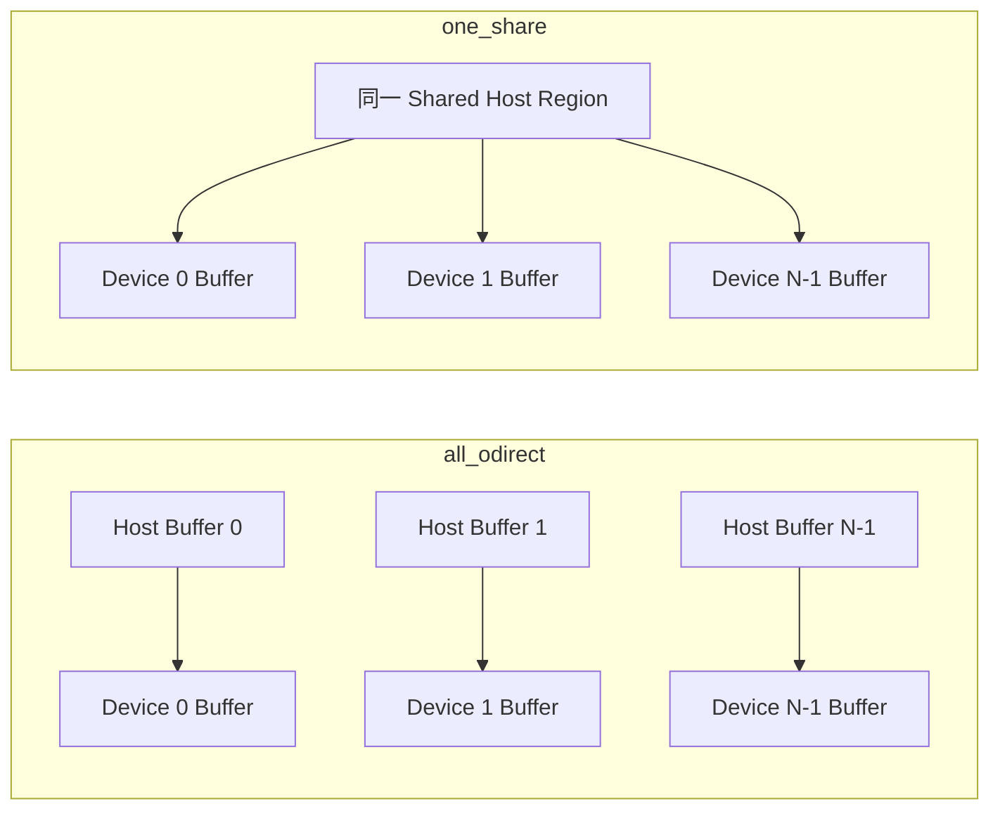

# Ascend H2D Toolkit 测试 Case 代码路径说明

## 1. 文档范围

本文只梳理 GLM5 IO/Stream 扫描脚本覆盖的四个 Ascend H2D case，不展开性能结论：

| Host 内存拓扑 | CE 路径 | FFTS Direct H2D 路径 |
|---|---|---|
| 每卡独立 Host Buffer | `all_odirect_host_to_all_device_ce_multi_stream` | `all_odirect_host_to_all_device_ffts_direct_h2d` |
| 多卡共享同一 Host Buffer | `one_share_host_to_all_device_ce_multi_stream` | `one_share_host_to_all_device_ffts_direct_h2d` |

四个 case 的共同目标是：准备一组 32K Host IO，将它们复制到每张卡各自的 Device Buffer，并统计 Host 下发时间、Device 侧完成时延和聚合带宽。

## 2. 测试脚本如何生成参数

测试入口脚本为：

`toolkit/scripts/run_ascend_h2d_glm5_io_stream_sweep.sh`

脚本固定以下参数：

- 单个物理 IO 为 32K。
- 每个 shard 对应 128 token。
- 每个 shard 对应 3 个 32K IO。
- 每个配置执行 128 次正式迭代。
- 设备数扫描 1、8。
- Stream 数扫描 1、4、8、16、32、64、128。

序列长度到 IO 数量的换算如下：

| 序列长度 | shard 数 | 每卡物理 32K IO 数 | CE 参数 | FFTS 参数 |
|---|---:|---:|---|---|
| 8K | 64 | 192 | `-n 192` | `-n 64 -f 3` |
| 64K | 512 | 1536 | `-n 1536` | `-n 512 -f 3` |
| 128K | 1024 | 3072 | `-n 3072` | `-n 1024 -f 3` |

CE 中，一个 `-n` 直接表示一个 32K copy。FFTS 中，一个 `-n` 表示一个独立调度 task，`-f 3` 表示该 task 内含 3 个 32K fragment。因此两条路径搬运的物理 IO 数和数据量一致，只是组织和下发方式不同。

脚本最终执行的命令形态为：

```text
ucm-toolkit run dev-sandbox copy \
  -t <case> -s 32K -n <count> -i 128 -d <devices> -S <streams> [-f 3]
```

## 3. 从脚本到 native case 的公共入口



对应代码职责如下：

| 层次 | 文件 | 主要职责 |
|---|---|---|
| Shell 测试入口 | `toolkit/scripts/run_ascend_h2d_glm5_io_stream_sweep.sh` | 计算 IO 数，扫描 case、卡数、序列长度和 Stream 数，保存日志 |
| Toolkit CLI | `toolkit/ucm_toolkit/cli.py` | 识别 `run` 命令并初始化工具注册表 |
| Run 分发 | `toolkit/ucm_toolkit/commands/run.py` | 找到 `dev-sandbox` adapter，透传后续参数 |
| Dev Sandbox adapter | `toolkit/ucm_toolkit/tools/dev_sandbox/adapter.py` | 将 `copy` 映射到已编译的 native 可执行文件 |
| Native 参数解析 | `toolkit/src/dev-sandbox/module/copy/copy_main.cc` | 解析 `-t/-s/-n/-f/-S/-i/-d`，按名称选择 case |
| Case 注册 | `toolkit/src/dev-sandbox/module/copy/copy_case.h` | 通过静态 Registrar 将各 case 注册到 `CopyCaseFactory` |

四个 case 都使用 `DEFINE_COPY_CASE_NO_RUNTIME`。因此父进程不先初始化 ACL Runtime，而是在 fork 之后由每个设备子进程分别创建 `CopyRuntime`，执行 `aclInit`；子进程结束前再执行 `aclFinalize`。这样避免了在已经初始化 Runtime 的进程上直接 fork。

## 4. 多卡执行模型

多卡公共执行逻辑位于：

`toolkit/src/dev-sandbox/module/copy/ascend/forked_copy_runner_ascend.h`

执行过程为：

1. 父进程按照 `-d`，为每张卡创建一个 pipe 并 fork 一个子进程。
2. 第 `device` 个子进程只设置和操作对应的 Device。
3. 子进程创建自己的 ACL Runtime、Host Buffer、Device Buffer、Stream 和 Event。
4. 子进程完成 3 次预热和 128 次正式测试，将每轮 Submit/Copy 数组通过 pipe 返回父进程。
5. 父进程等待所有子进程结束，再逐轮取所有卡中的最大 Submit 和最大 Copy，作为该轮多卡耗时。
6. 结果中的 `Count` 为所有卡 IO 数之和；带宽使用聚合数据量除以最慢卡完成时间。



## 5. Host Buffer 与 Device Buffer

### 5.1 `all_odirect`：每卡独立 Host Buffer

CE case 使用 `ODirectHostCopyBuffer`，FFTS case 使用 `FftsODirectMappedHostCopyBuffer`。

两者都在各设备子进程中独立创建匿名 mmap 内存，优先尝试 HugeTLB，失败后回退到 Transparent Huge Page，再将内存注册为 mapped/pinned Host 内存。因此 8 卡场景下有 8 份相互独立的 Host backing，每张卡读取自己的那一份。

这里的 `ODirect` 表示模拟 UCM O_DIRECT 风格的页对齐、大页 Host Buffer。该 case 本身没有 `open/pread` 文件读取，也没有循环读取存储后端；计时阶段只重复搬运已经准备好的 Host 内存。

FFTS 还会调用 `aclrtHostGetDevicePointer`，得到 FFTS SDMA context 可使用的 Host 映射地址。

### 5.2 `one_share`：多卡共享同一 Host Buffer

CE case 使用 `SharedHostRegion` 和 `SharedHostCopyBuffer`，FFTS case 使用 `FftsMappedSharedHostRegion` 和 `FftsMappedSharedHostCopyBuffer`。

父进程在 fork 前只创建一个 POSIX shared-memory object。每个设备子进程通过相同的 shm name 打开并完整映射这块区域，然后针对自己的 Device 做 Host Register。

所以多卡读取的是同一份 shared-memory backing，而且每张卡都从相同的 fragment offset 开始读；不是把 shared memory 切成多卡互斥的分片。各卡的目标 `DeviceCopyBuffer` 仍然彼此独立。



Host Buffer 相关实现位于：

- `toolkit/src/dev-sandbox/module/copy/ascend/copy_buffer_ascend.h`
- `toolkit/src/dev-sandbox/module/copy/ascend/ffts_direct_h2d/mapped_host_buffer_ffts_direct_h2d_ascend.h`

Device 侧统一使用 `DeviceCopyBuffer`，通过 `aclrtMalloc` 为每张卡分配独立 HBM Buffer。

## 6. CE Multi-Stream 代码路径

CE case 定义位于：

`toolkit/src/dev-sandbox/module/copy/ascend/copy_case_ascend.cc`

### 6.1 `all_odirect_host_to_all_device_ce_multi_stream`

```text
AllODirectHost2AllDeviceCEMultiStreamCase::Run
  -> RunForkedCopyBatch
    -> 每卡子进程创建 CopyRuntime
      -> ODirectHostCopyBuffer
      -> DeviceCopyBuffer
      -> H2DCEMultiStreamCopyInstance::DoCopy
        -> CopyInstance::DoCopyBatch
          -> H2DCEMultiStreamCopyInstance::Prepare
          -> 3 次 warmup
          -> 128 次 DoCopyOnce
            -> aclrtMemcpyAsync
          -> Cleanup
    -> MergeForkedResults
  -> CopyResult::Show
```

### 6.2 `one_share_host_to_all_device_ce_multi_stream`

```text
OneShareHost2AllDeviceCEMultiStreamCase::Run
  -> 父进程创建一个 SharedHostRegion
  -> RunForkedCopyBatch
    -> 每卡子进程创建 CopyRuntime
      -> SharedHostCopyBuffer 映射同一 shm
      -> DeviceCopyBuffer
      -> H2DCEMultiStreamCopyInstance::DoCopy
        -> CopyInstance::DoCopyBatch
          -> Prepare
          -> 3 次 warmup
          -> 128 次 DoCopyOnce
            -> aclrtMemcpyAsync
          -> Cleanup
    -> MergeForkedResults
  -> CopyResult::Show
```

### 6.3 CE 如何分配 Stream

CE 的实际 copy 实现位于：

`toolkit/src/dev-sandbox/module/copy/ascend/copy_instance_ascend.h`

`Prepare` 将全部 32K IO 尽量均匀地切成连续区间，并为每个非空区间创建一个 Stream。例如 10 个 IO、4 个 Stream 的分配为 `3/3/2/2`，每个 Stream 负责一段连续地址。

每轮 `DoCopyOnce` 的执行边界是：

1. 在第一个 Stream 上记录总开始 Event。
2. 其他 Stream 等待总开始 Event。
3. CPU 按 Stream 顺序遍历全部 IO，每个 IO 调用一次 `aclrtMemcpyAsync`。
4. Host Submit 计时在最后一次异步 API 返回时结束。
5. 第一个 Stream 等待其他 Stream 的结束 Event。
6. 同步第一个 Stream，并用 ACL Event 计算全部 Stream 完成的 Copy 时延。

因此 CE 的 Stream 数改变的是“同一批 IO 被分到多少条异步队列”，并不会改变 `aclrtMemcpyAsync` 调用总数。

## 7. FFTS Direct H2D 代码路径

FFTS case 定义位于：

`toolkit/src/dev-sandbox/module/copy/ascend/ffts_direct_h2d/copy_case_ffts_direct_h2d_ascend.cc`

### 7.1 `all_odirect_host_to_all_device_ffts_direct_h2d`

```text
AllODirectHost2AllDeviceFftsDirectH2DCase::Run
  -> FftsDirectTotalFragments: total = -n * -f
  -> RunForkedCopyBatch
    -> 每卡子进程创建 CopyRuntime
      -> FftsODirectMappedHostCopyBuffer
      -> DeviceCopyBuffer
      -> 初始化 Host pattern 并清零 Device Buffer
      -> FftsDirectH2DCopyInstance::DoCopy
        -> CopyInstance::DoCopyBatch
          -> FftsDirectH2DCopyInstance::Prepare
          -> 3 次 warmup
          -> 128 次 DoCopyOnce
            -> FftsD2DDispatcher::BuildCopies
            -> FftsD2DDispatcher::Launch
              -> rtFftsPlusTaskLaunchWithFlag
          -> Cleanup
    -> MergeForkedResults
  -> CopyResult::Show
```

### 7.2 `one_share_host_to_all_device_ffts_direct_h2d`

```text
OneShareHost2AllDeviceFftsDirectH2DCase::Run
  -> FftsDirectTotalFragments: total = -n * -f
  -> 父进程创建一个 FftsMappedSharedHostRegion
  -> 父进程初始化一次 Host pattern
  -> RunForkedCopyBatch
    -> 每卡子进程创建 CopyRuntime
      -> FftsMappedSharedHostCopyBuffer 映射同一 shm
      -> DeviceCopyBuffer
      -> FftsDirectH2DCopyInstance::DoCopy
        -> CopyInstance::DoCopyBatch
          -> Prepare
          -> 3 次 warmup
          -> 128 次 DoCopyOnce
            -> BuildCopies
            -> Launch
              -> rtFftsPlusTaskLaunchWithFlag
          -> Cleanup
    -> MergeForkedResults
  -> CopyResult::Show
```

### 7.3 FFTS 如何组织 task 和 Stream

FFTS CopyInstance 位于：

`toolkit/src/dev-sandbox/module/copy/ascend/ffts_direct_h2d/copy_instance_ffts_direct_h2d_ascend.h`

本次测试固定 `-f 3`，所以每个 task 包含 3 个连续的 32K copy spec。`Prepare` 先计算 task 数，再令实际 Stream 数为：

```text
active_streams = min(requested_streams, task_count)
```

随后按 task 轮转分配 Stream，即第 `taskIndex` 个 task 分配到 `taskIndex % active_streams`。这一点与 CE 的连续区间分配不同。

每个 task 下发时，`FftsD2DDispatcher` 为 3 个 fragment 分别构造 SDMA context，将可并发 ready lane 数限制在 task copy 数和 `FFTS_MAX_READY_LANES` 之间，默认最大为 8。最后调用 `rtFftsPlusTaskLaunchWithFlag`，把整个 FFTS task 提交到对应 ACL Stream。

FFTS Dispatcher 位于：

`toolkit/src/dev-sandbox/module/copy/ascend/h2d_ffts_pipeline/ffts_d2d_dispatcher_ascend.h`

因此在相同物理 IO 数下：

- CE 下发次数等于 32K IO 数，每次调用一次 `aclrtMemcpyAsync`。
- FFTS 下发次数等于 shard/task 数，每次下发携带 3 个 SDMA context。

## 8. 重复执行的内存访问模式

公共迭代框架位于：

`toolkit/src/dev-sandbox/module/copy/copy_instance.h`

每个 case 都只在 `Prepare` 前创建并初始化一次 Host/Device Buffer。之后执行 3 次预热和 128 次正式迭代，反复提交同一组 Host 地址到同一组 Device 地址。

所以这里确实存在测试迭代循环，但循环的是同一批内存 copy，并不是每轮重新从文件、CacheStore 或后端读取数据。该设计用于隔离 H2D 下发和搬运能力，不能单独代表 UCM 端到端的“存储读取 + 调度 + H2D”完整路径。

## 9. 指标生成路径

结果统计位于：

- `toolkit/src/dev-sandbox/module/copy/ascend/forked_copy_runner_ascend.h`
- `toolkit/src/dev-sandbox/module/copy/copy_result.h`

指标语义为：

| 指标 | 代码中的计时范围 |
|---|---|
| Submit | CPU 从进入本轮下发循环，到各 Stream 的提交函数返回；CE 主要覆盖逐 IO 的异步 memcpy 调用，FFTS 还包含 SDMA context 构建、task launch 和结束 Event 记录 |
| Copy | 第一个总开始 Event 到所有 Stream 工作完成后的总结束 Event |
| BW | 所有卡总数据量除以逐轮最慢卡 Copy 时间，再对结果统计 |

日志中的带宽列虽然标为 `GB/s`，计算公式使用 `1024^3`，数值口径实际更接近 `GiB/s`。

## 10. 四个 case 的差异汇总

| Case | Host backing | 多卡是否读同一份数据 | Stream 内工作分配 | 最底层下发 API |
|---|---|---|---|---|
| `all_odirect_host_to_all_device_ce_multi_stream` | 每卡独立匿名 mmap | 否 | 32K IO 连续分段 | `aclrtMemcpyAsync` |
| `one_share_host_to_all_device_ce_multi_stream` | 一个 POSIX shm | 是，相同 offset | 32K IO 连续分段 | `aclrtMemcpyAsync` |
| `all_odirect_host_to_all_device_ffts_direct_h2d` | 每卡独立匿名 mmap + mapped address | 否 | 3 个 IO 组成 task，task 轮转 | `rtFftsPlusTaskLaunchWithFlag` |
| `one_share_host_to_all_device_ffts_direct_h2d` | 一个 POSIX shm + mapped address | 是，相同 offset | 3 个 IO 组成 task，task 轮转 | `rtFftsPlusTaskLaunchWithFlag` |

## 11. 编译边界

构建入口位于：

`toolkit/src/dev-sandbox/module/copy/CMakeLists.txt`

CE case 在 Ascend backend 下直接编译。FFTS Direct H2D case 只有在 CMake 检测到 FFTS headers 和 Ascend `libruntime`、设置 `HAVE_ASCEND_FFTS_RUNTIME` 后才会加入 `copy` 可执行文件。缺少这些依赖时，FFTS case 不会注册，运行时也无法按 case 名选择到它。

## 12. 能力边界

这四个 toolkit case 能验证：

- 独立 Host Buffer 与共享 Host Buffer 两种内存拓扑下的 H2D 行为。
- CE 和 FFTS 两种下发路径的 Host Submit、Copy 时延与聚合带宽。
- 单卡和多卡并发、不同 Stream 数对 copy 阶段的影响。

这四个 toolkit case 不包含：

- UCM CacheStore 的请求队列和调度流程。
- Cache Fake 或真实后端的数据读取。
- vLLM/推理服务的 request、KV load 和 TTFT。

因此它们属于端到端根因分析中的“纯 H2D toolkit 基线层”，后续仍需分别用 Cache Fake 和真实服务测试衔接上层路径。
