# UCM Cache Buffer 管理：布局、元数据与淘汰

本文解释 CacheStore 中 `TransBuffer` 的内存缓存管理。重点回答三个问题：

1. 一块固定容量的 Cache Buffer 在内存中怎样布局；
2. `(blockId, shardIndex)` 怎样通过元数据找到 payload；
3. 容量用满后，Clock 算法怎样选择可以复用的槽位。

文中的 `node` 表示一个固定大小的缓存槽位，大小等于 `shardSize`。它不是 NUMA node。
`segment` 是 rank-striped 布局中的一组连续缓存槽位，NUMA node 是物理内存节点。

## 1. 先建立整体模型

`TransBuffer` 是 Store backend 与设备 KV Cache 之间的固定容量主机内存缓存：

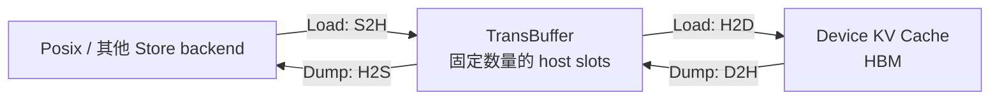

`TransBuffer` 不负责磁盘 I/O，也不保存设备侧 KV Cache。它提供三类能力：

- 按 `(blockId, shardIndex)` 查找缓存；
- 返回可用于 S2H、H2D 或 D2H 的 host 地址；
- 在固定容量中分配和淘汰 slot。

## 2. 主要类及职责

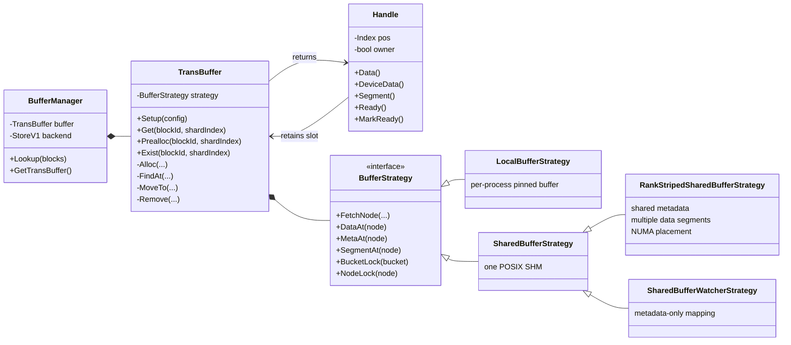

配置决定使用哪种 Strategy：

| 配置/角色 | Strategy | payload 位置 |
|---|---|---|
| `share_buffer_enable: false` | `LocalBufferStrategy` | 当前进程的 pinned host buffer |
| 共享开启、rank-striped 关闭 | `SharedBufferStrategy` | 一个 POSIX SHM 文件 |
| 共享开启、rank-striped 开启 | `RankStripedSharedBufferStrategy` | 多个 POSIX SHM data segment |
| `deviceId < 0` 的 watcher | `SharedBufferWatcherStrategy` | 只映射共享元数据 |

Strategy 改变物理存储和候选 slot 的选择方式。哈希查找、引用计数、状态机和哈希链表由
`TransBuffer` 统一管理。

## 3. 固定 slot 池

初始化时先计算：

```text
nNode = bufferCapacity / shardSize
```

例如 `bufferCapacity = 32 GiB`、`shardSize = 2 MiB`：

```text
nNode = 32 GiB / 2 MiB = 16384 slots
```

每个 slot 由同一个全局 `iNode` 标识，并在逻辑上分成三部分：

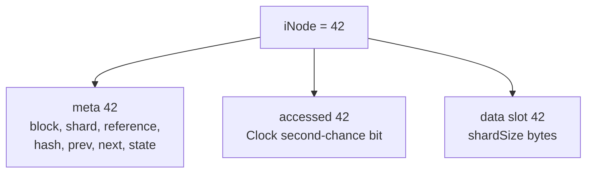

元数据与 payload 是平行数组。`BufferMetaNode[42]` 描述 `data slot 42` 中存放的对象。

## 4. 普通共享 SHM 的内存布局

普通共享模式把元数据和完整 payload 放在同一个 POSIX SHM 对象中：

```text
/dev/shm/uc_shm_cache_<uuid>

┌────────────────────────────────────────────┐
│ BufferHeader                               │
│   magic / nNode / layout                   │
│   buckets[16411]                           │
│   bucketLocks[16411]                       │
├────────────────────────────────────────────┤
│ nodeLocks[nNode]                           │
├────────────────────────────────────────────┤
│ accessed[nNode]                            │
├────────────────────────────────────────────┤
│ segmentCursors[1] / segmentReady[1]        │
├────────────────────────────────────────────┤
│ BufferMetaNode[nNode]                      │
├────────────────────────────────────────────┤
│ page alignment                             │
├────────────────────────────────────────────┤
│ data[0] │ data[1] │ ... │ data[nNode - 1] │
└────────────────────────────────────────────┘
```

所有 worker `mmap` 同一个 SHM，因此看到相同的哈希表、引用计数、状态和 payload。
每个 worker 仍需为自己的 device 执行 Host Register，得到当前设备可使用的地址。

## 5. rank-striped 的内存布局

rank-striped 把共享元数据与大容量 payload 分开：

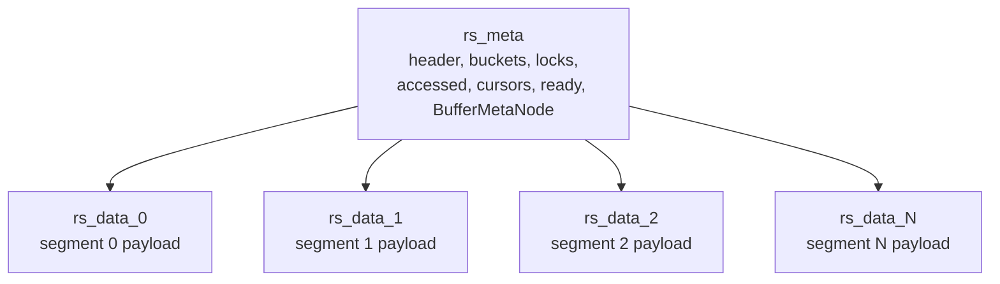

文件名为：

```text
uc_shm_cache_<uuid>_rs_meta
uc_shm_cache_<uuid>_rs_data_0
uc_shm_cache_<uuid>_rs_data_1
...
```

### 5.1 逻辑 node 到 segment 地址的转换

```text
segment = iNode / nodesPerSegment
local   = iNode % nodesPerSegment
address = dataBases[segment] + local * nodeSize
```

例如每个 segment 有 1000 个 slots：

```text
iNode = 2345
segment = 2
local slot = 345
address = dataBases[2] + 345 * shardSize
```

上层仍然只使用全局 `iNode`，不需要知道 payload 分布在多个文件中。

### 5.2 TP16、8 个 NUMA node 的示例

32 GiB 被分成 16 个约 2 GiB 的 segment：

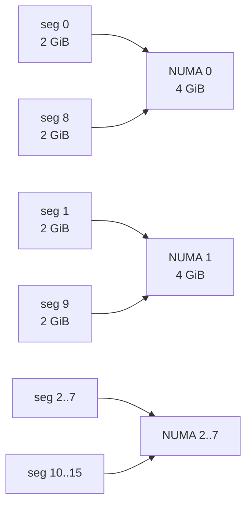

每个数据段的创建者执行：

```text
shm_open + ftruncate
        ↓
mmap，不使用 MAP_POPULATE
        ↓
mbind：先设置 NUMA policy
        ↓
memset：首次触页并分配物理页
        ↓
move_pages：查询并验证实际 NUMA
        ↓
segmentReady = 1
```

所有 rank 等待所有 segment ready，然后映射并注册全部 segment。因此 segment 是物理布局和
分配偏好的边界，不是访问权限边界；任何 rank 都可以访问全部缓存数据。

## 6. 元数据怎样把 key 映射到 slot

缓存 key 是：

```text
(blockId, shardIndex)
```

代码先计算：

```text
iBucket = Hash(blockId, shardIndex) % 16411
```

不同 key 可能进入同一个 bucket，所以每个 bucket 保存一条由 node index 连接的双向链表：

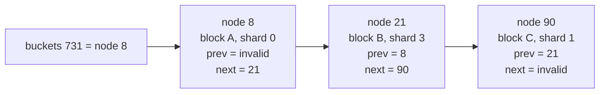

这是“固定 bucket 数组 + 侵入式链表”：`prev`、`next` 和所属 `hash` 直接放在
`BufferMetaNode` 中，没有为链表节点额外分配内存。

### 6.1 `BufferMetaNode` 字段

| 字段 | 含义 |
|---|---|
| `block` | 当前 slot 保存的 block ID |
| `shard` | block 内的 shard index |
| `reference` | 当前存活的 `Handle` 数量 |
| `hash` | slot 当前属于哪个 bucket |
| `prev/next` | bucket 链表中的前后 node index |
| `state` | `LOADING`、`READY` 或 `FAILED` |
| `errorCode` | 后端读取失败时保存错误码 |

### 6.2 三种锁/原子变量

| 机制 | 保护内容 |
|---|---|
| `bucketLocks[iBucket]` | 一个 key 只创建一个缓存条目；保护该 bucket 的链表 |
| `nodeLocks[iNode]` | `reference` 以及 node 被复用时的元数据修改 |
| `state/errorCode/accessed` 原子变量 | 跨线程、跨进程发布状态和访问标记 |

锁只存在于元数据操作。大块 payload 拷贝通过 `Handle` 的引用计数保持 slot 不被淘汰。

## 7. `Get()`：命中和未命中

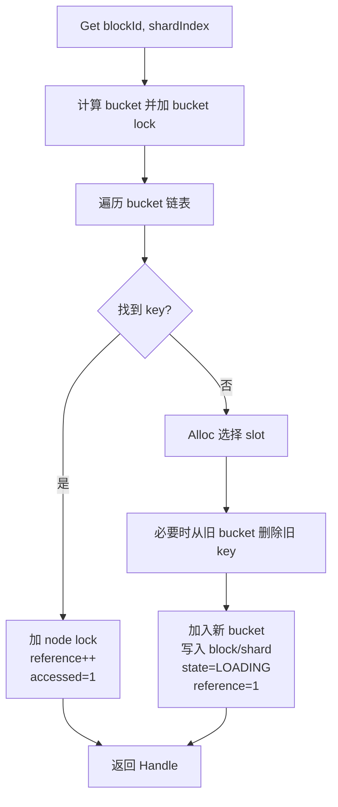

### 7.1 `owner` 的含义

`Handle::Owner()` 不是“这个 segment 属于哪个 rank”。它表示当前调用者是否负责尚未完成的
数据填充：

```text
新创建 slot                 → owner = true
找到已有 slot，reference=0  → owner = true
找到已有 slot，reference>0  → owner = false
```

LoadQueue 只有在下面两个条件同时满足时才向 backend 提交 S2H：

```text
handle.Owner() == true
handle.Ready() == false
```

其他 rank 拿到同一个未完成 slot 时持有非 owner Handle，等待 owner 将状态发布为 `READY`。

### 7.2 Handle 为什么重要

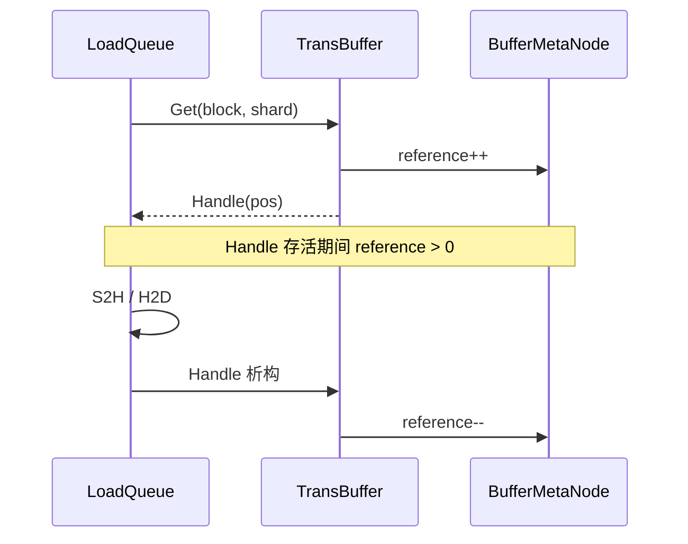

只要 Handle 仍然存活，Clock 即使扫描到该 slot，`Alloc()` 也会因为 `reference > 0` 放弃淘汰。

## 8. 状态机

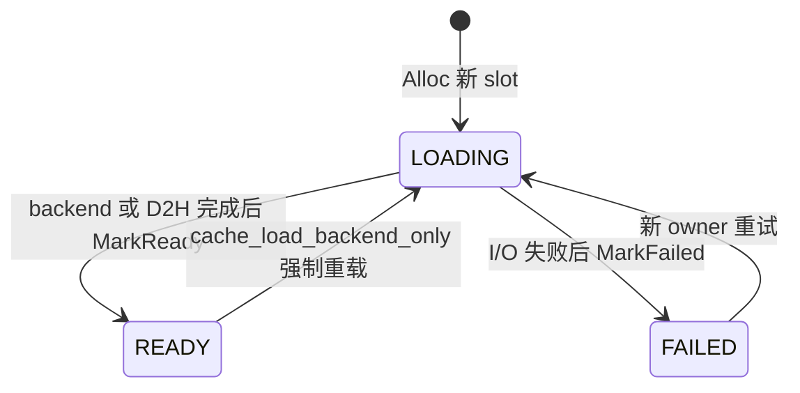

状态含义：

- `LOADING`：key 已经进入哈希表，但 payload 仍在填充；
- `READY`：payload 可以执行 H2D 或写入后端；
- `FAILED`：填充失败，等待者读取 `errorCode`。

先把 `LOADING` 条目放进哈希表，可以让并发 rank 找到同一个 slot，避免为相同 key 重复分配空间。

## 9. Clock 淘汰策略

TransBuffer 容量固定。缓存未命中且没有空闲扩容空间时，`Alloc()` 必须复用一个旧 slot。
Clock 使用两个信号：

| 信号 | 作用 |
|---|---|
| `reference` | 正确性保护；大于 0 时绝对不能复用 |
| `accessed` | 热度提示；等于 1 时获得一次 second chance |

### 9.1 一次扫描

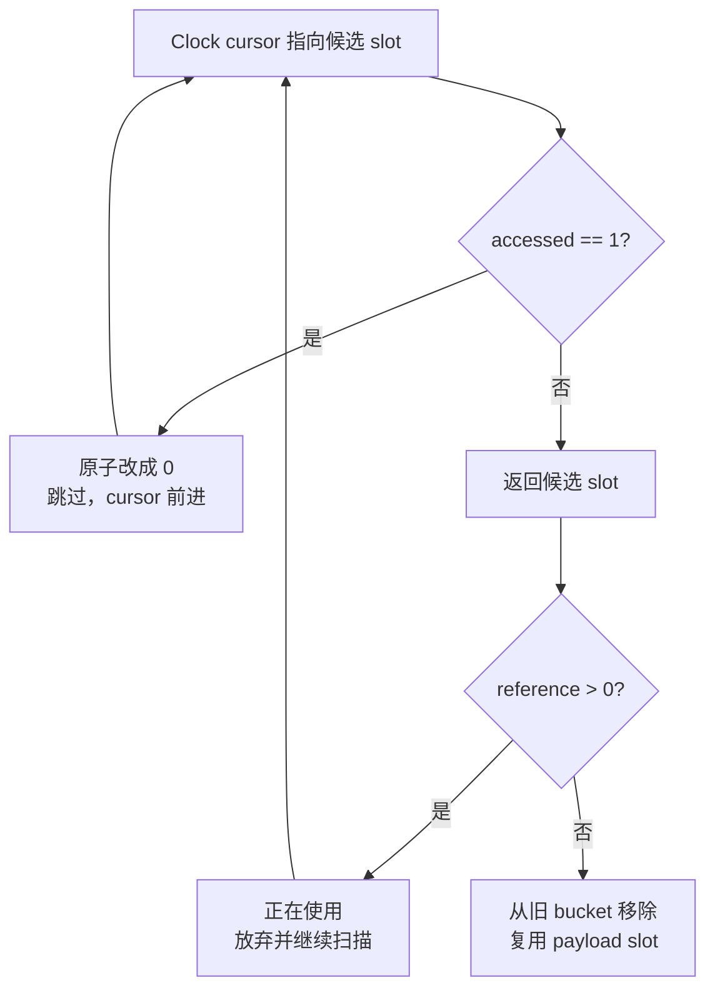

### 9.2 四个 slots 的例子

开始时所有条目最近都被访问过：

```text
cursor
  ↓
┌──────────┬──────────┬──────────┬──────────┐
│ node 0 A │ node 1 B │ node 2 C │ node 3 D │
│ access=1 │ access=1 │ access=1 │ access=1 │
│ ref=0    │ ref=0    │ ref=0    │ ref=0    │
└──────────┴──────────┴──────────┴──────────┘
```

要分配 E 时，Clock 第一圈把 `accessed` 从 1 清成 0，并给 A/B/C/D 第二次机会：

```text
第一圈：A 1→0，B 1→0，C 1→0，D 1→0

第二圈回到 A：accessed=0 且 reference=0
                   ↓
                 淘汰 A
                   ↓
                node 0 保存 E
```

如果第一圈之后 C 又被命中：

```text
C 的 accessed 被重新写成 1
Clock 下次经过 C 时再次跳过它
```

Clock 不记录时间戳，也不维护严格 LRU 链表。它用一个 bit 和循环指针近似保留热点，元数据开销和
锁竞争都更低。

### 9.3 真正复用 slot 的步骤

假设 node 0 原来保存 A，现在要保存 E：

```text
FetchNode 选中 node 0
        ↓
加 node 0 锁，确认 reference == 0
        ↓
从 hash(A) 的链表 Remove(node 0)
        ↓
加入 hash(E) 的链表 MoveTo(node 0)
        ↓
meta.block = E
meta.shard = 新 shard index
meta.state = LOADING
meta.reference = 1
        ↓
返回 owner Handle，开始填充 payload
```

如果旧 bucket 与新 bucket 不同，代码使用 `BucketTryLock(oldBucket)`。拿不到旧 bucket 锁时放弃
当前候选并继续扫描，避免在持有新 bucket 锁的情况下阻塞等待旧 bucket，形成相反的锁顺序。

## 10. rank-striped 如何改变 Clock

普通 SHM 只有一个全局 cursor：

```text
nodeCursor: 0 → 1 → 2 → ... → nNode-1 → 0
```

rank-striped 为每个 segment 保存一个共享 cursor：

```text
segment 0: cursor[0] → 本段 slots
segment 1: cursor[1] → 本段 slots
...
segment N: cursor[N] → 本段 slots
```


LoadQueue 和 DumpQueue 使用原始 shard 位置计算：

```text
preferredSegment = originalIndex % localRankSize
```

以一层 512 个 shards、TP16 为例：

```text
shard 0,16,32,...,496  → preferred segment 0，共 32 个
shard 1,17,33,...,497  → preferred segment 1，共 32 个
...
shard 15,31,...,511    → preferred segment 15，共 32 个
```

首次分配时，各 segment 理论上获得相同数量的 slots。已有 key 命中时继续使用原来的实际 segment，
不会搬迁 payload。

当前实现只用 segment 影响物理 slot 分配。`Get()` 完成后，ShardTask 仍按
`RearrangeIndex()` 的遍历顺序直接进入 `running_`，不会再按实际 segment 二次分桶或重排。

## 11. Prealloc 做什么

处理 shard `k` 后，LoadQueue 会为同一 block 的 `k+1` 调用 `Prealloc()`。

```text
Prealloc
  ├─ key 已存在：不做任何事
  └─ key 不存在：提前占一个 slot，随后立即 Release Handle
```

Prealloc 只准备哈希条目和 slot 元数据，不提交 backend I/O，也不会把状态改成 `READY`。
rank-striped 模式会把当前 shard 的实际 segment 作为下一 shard 的分配提示。

## 12. Lookup、Load 和 Dump 的关系

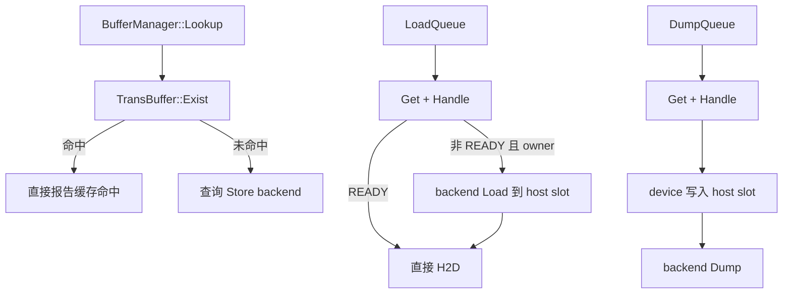

## 13. 生命周期

当前分支按 vLLM TP 进程组整体启停的模型处理 SHM：

```text
任意 rank 失败
    ↓
整个 vLLM 服务终止
    ↓
各 rank 析构 TransBuffer
    ↓
UnregisterHostBuffer
    ↓
munmap data/meta
    ↓
shm_unlink rs_data_* 和 rs_meta
```

每个 rank 都可以重复调用 `shm_unlink`。第一个调用删除文件名，其他 rank 已建立的映射会保持到
各自退出；最后一个映射消失后，内核释放物理页。

`SIGKILL` 不执行 C++ 析构。整组进程被强杀时，遗留 SHM 由容器生命周期或外部启动清理负责，
这一点与 develop 的普通 SHM 路径采用相同假设。

## 14. 读代码时建议抓住的主线

```text
BufferManager::Setup
  → TransBuffer::Setup
  → 选择 BufferStrategy

LoadQueue / DumpQueue
  → TransBuffer::Get
  → FindAt（命中）或 Alloc（未命中）
  → FetchNode（Clock 选择候选）
  → Handle 保持 reference
  → Data / DeviceData 提供拷贝地址
  → MarkReady / MarkFailed 发布结果
```

主要源码位置：

- `ucm/store/cache/cc/buffer_manager.h`：Buffer 与 backend 的组合及 Lookup；
- `ucm/store/cache/cc/trans_buffer.h`：`TransBuffer::Handle` 对外契约；
- `ucm/store/cache/cc/trans_buffer.cc`：布局、哈希、引用计数、Clock 和 Strategy；
- `ucm/store/cache/cc/load_queue.cc`：backend Load、等待 READY 和 H2D；
- `ucm/store/cache/cc/dump_queue.cc`：D2H 与 backend Dump；
- `ucm/store/cache/cc/shm_numa.h`：rank-striped 的绑定、触页和验证；
- `ucm/store/cache/cc/shm_numa_layout.h`：segment 到 NUMA node 的映射规划。

把整套结构压缩成一句话：

> 哈希表负责从 key 找到固定 slot，Handle/reference 保护正在使用的 slot，状态机协调数据填充，
> Clock 在容量用满时选择冷 slot，Strategy 决定这些 slot 的 payload 实际放在哪里。
