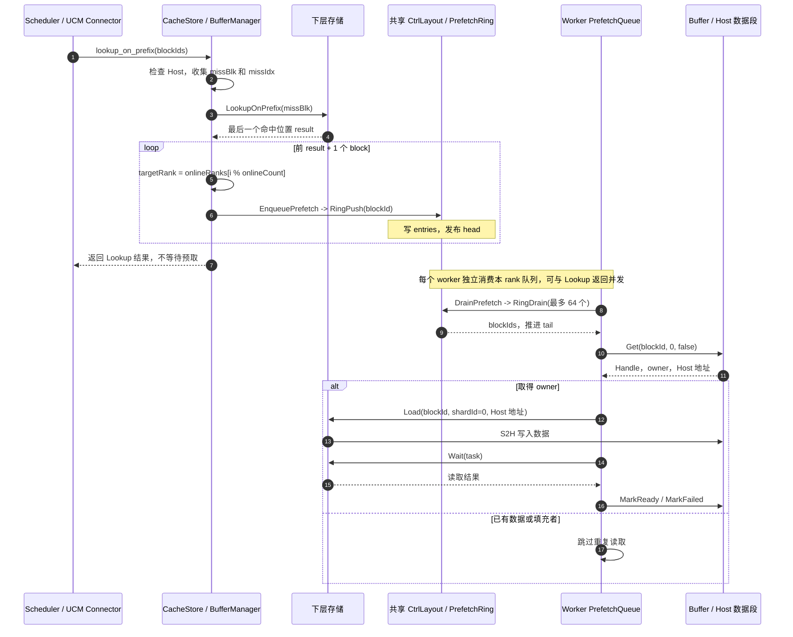
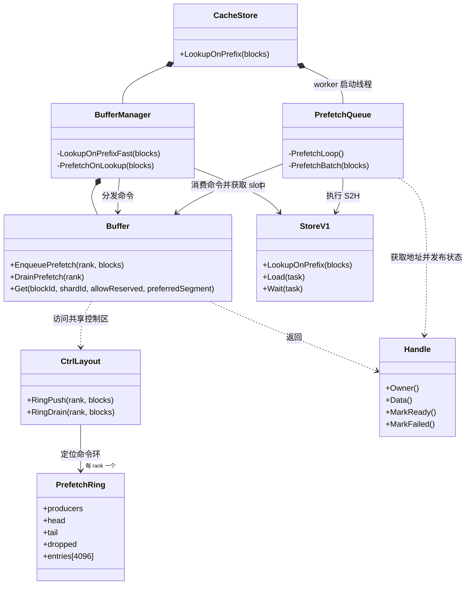

# Cache 内存按 Rank 划分、NUMA 绑定与 Lookup 首层预取

## 1. 背景

H2D KV Cache 传输时延是影响 UCM 性能的重要因素。我们先后探索了 A2 循环提交小 I/O PCIe 拷贝、A2 I/O 聚合和 A3 SDMA Direct。通过聚合小 I/O 并使用 SDMA，以 GLM-5.1 为例，单卡加载一层 KV Cache 的带宽已从约 4 GB/s 提升到约 30 GB/s。

但在实际业务中，多卡需要同时从一块共享内存读取同一份 KV Cache。早期版本的单机聚合带宽只有约 100 GB/s，平均单卡约 7 GB/s。继续增加拷贝 stream 不仅没有提升带宽，有时还会出现异常劣化，说明瓶颈已经从拷贝接口转移到 Host 内存侧。

加入 `MAP_POPULATE` 后，多进程并发预取共享页面，使部分物理页无意中分散到不同 NUMA 节点，性能有所提升。但这种分布受进程调度和页面预取时序影响，随机且不均匀，导致带宽波动，也无法稳定达到预期的 350 GB/s 以上。结合内存控制器监控，我们确认多卡流量仍集中在少数 NUMA 节点，并触及单个 NUMA 节点约 100 GB/s 的带宽上限。

此外，按层加载虽然可以让后续层的数据传输与前序层计算重叠，第一层却没有这样的重叠窗口。如果 Lookup 只确认下层存储命中，正式 Load 第一层时仍要等待“下层存储到 Host Cache”的读取，这段等待会进入 TTFT 关键路径。

因此，本方案包含两项互补优化：

- 将共享数据区按 rank 分段，并将不同数据段精确放置到不同 NUMA 节点，突破单个内存控制器的带宽瓶颈；
- 在 `LookupOnPrefix` 确认下层存储命中后，后台预取每个 block 的首个 shard，利用 Lookup 到正式 Load 之间的时间隐藏下层读取时延。

## 2. 控制区与按 Rank 分段的数据区

### 2.1 内存布局

对外仍然提供一个逻辑 Cache，内部由一个共享控制区和多个 rank 数据段组成。控制区不是独立的控制进程，而是所有参与进程共同映射的一块共享元数据区。它不存放 KV 数据，主要负责：

- 将 `(blockId, shardIndex)` 映射到 `globalSlot`；
- 维护每个 slot 的 `Loading / Ready / Failed` 状态、引用计数和 CLOCK 访问标记；
- 记录各数据段的初始化状态，避免访问尚未就绪的数据段；
- 保存 slot 大小、数据段数量和 NUMA 节点列表，校验各参与进程使用相同布局；
- 保存每个在线 rank 的有界预取命令环。

KV 数据按本机参与共享的 rank 数切分到多个独立数据段。每个 rank 负责创建、初始化并注册自己的数据段，然后发布就绪状态。其他 worker 在数据段就绪后映射它，从而在每个进程中都能解析任意全局 slot。

~~~text
逻辑 Cache
  ├─ 共享控制区：全局索引、slot 生命周期、rank 状态、预取命令环
  ├─ Rank 0 数据段：KV payload -> 指定 NUMA 节点或节点组
  ├─ Rank 1 数据段：KV payload -> 指定 NUMA 节点或节点组
  ├─ Rank 2 数据段：KV payload -> 指定 NUMA 节点或节点组
  └─ Rank N 数据段：KV payload -> 指定 NUMA 节点或节点组
~~~

全局 slot 编号覆盖所有数据段，并可稳定解析为实际数据段和段内位置：

~~~text
segment = globalSlot / slotsPerSegment
localSlot = globalSlot % slotsPerSegment
~~~

共享控制区不保存进程相关的虚拟地址。各进程把 `globalSlot` 解析为自己的 Host 地址或 Device 可访问地址，因此不同进程可以使用不同虚拟地址访问同一个物理数据段，同时共享一致的 Cache 索引和状态。

### 2.2 KV 放置与并行加载

- MLA：由 worker 0 执行 Dump 时，按任务中分片的原始位置 `originalIndex % segmentCount` 选择优先数据段。同一层不同 block 的 KV 会分散存放，避免全部写入 rank 0 数据段。
- 已缓存的 `(blockId, shardIndex)` 始终使用当前实际位置，不因后续请求来自不同 rank 而迁移。
- 目标数据段没有可回收 slot 时，允许按段顺序回退到其他已就绪数据段；实际位置仍以 `globalSlot` 为准。

`LoadQueue` 在处理任务前根据当前 rank 重排分片顺序。对于 `segmentCount` 个数据段，rank 0 优先处理序号为 `0, segmentCount, 2 * segmentCount...` 的分片，rank 1 优先处理序号为 `1, segmentCount + 1...` 的分片，以此类推。重排只改变读取顺序，不改变数据位置，也不表示 rank 之间存在同步屏障。

以 4 个 rank、4 个数据段为例：

| 加载阶段 | Rank 0 优先读取 | Rank 1 优先读取 | Rank 2 优先读取 | Rank 3 优先读取 |
|---|---|---|---|---|
| 0 | 数据段 0 | 数据段 1 | 数据段 2 | 数据段 3 |
| 1 | 数据段 1 | 数据段 2 | 数据段 3 | 数据段 0 |
| 2 | 数据段 2 | 数据段 3 | 数据段 0 | 数据段 1 |
| 3 | 数据段 3 | 数据段 0 | 数据段 1 | 数据段 2 |

这样可以让多个 NUMA 节点在同一阶段并行供数。结合异步传输和多 stream，可同时利用多 NUMA 聚合带宽与 SDMA 并行传输能力。

### 2.3 分段 CLOCK 淘汰

每个数据段维护独立的 CLOCK 指针。分配新 slot 时，优先在目标数据段内扫描：近期访问过的 slot 获得一次保留机会，仍被 Handle 引用的 slot 不允许淘汰。

如果目标数据段经过两轮扫描仍找不到可回收 slot，则继续扫描其他已就绪数据段。该策略优先在目标 NUMA 数据段内完成淘汰和复用，同时在局部容量不足时允许跨段回退，避免单个数据段耗尽导致 Cache 分配失败。

## 3. NUMA 绑定

### 3.1 节点选择策略

最新实现不再只依赖进程运行在哪个 CPU 上触发 first-touch，而是先确定 Host 数据区应该使用的 NUMA 节点。选择顺序如下：

1. vLLM worker 通过 `npu-smi info -t topo` 获取 NPU 的 CPU Affinity，再用 `lscpu -e=cpu,node` 将这些 CPU 映射到 NUMA 节点。只有所有亲和 CPU 唯一落在同一 NUMA 节点时，才生成内部的设备亲和节点提示。该提示优先级最高，同时适用于 MLA 的共享 rank 数据段和 GQA 的私有 Buffer。
2. 无法得到唯一设备亲和节点时，共享 Buffer 使用 `share_buffer_numa_nodes`。配置为空时，程序取“有内存的在线节点”与当前进程 `Mems_allowed_list` 的交集。节点按数据段数分组，同一组中的页面在节点间均匀划分；rank、数据段与 NUMA 节点不要求一一对应。
3. 对没有可靠拓扑信息的 NPU GQA 私有 Buffer，按 TP rank 在当前允许使用的内存节点之间轮转，避免所有私有 Buffer 都依赖同一个 first-touch 节点。
4. 以上信息都不可用时，保留普通 first-touch 作为兜底。

拓扑探测只在 worker 进行。由连接器生成的设备亲和节点和 TP rank 回退提示属于内部策略，不作为用户配置项。显式节点若不在当前进程的 `Mems_allowed_list` 中，会在初始化阶段报错，而不是静默退回到随机放置。

### 3.2 绑定、触页与验证

每个 rank 创建本地数据段后，严格按以下顺序初始化：

1. 按系统页大小规划地址范围；一个数据段对应多个 NUMA 节点时，完整页面在节点间均分，页数差不超过一页。
2. 在任何页面被触碰前，对每个地址范围调用 `mbind(MPOL_BIND | MPOL_F_STATIC_NODES)`。数据映射不能提前使用 `MAP_POPULATE`，否则物理页可能在策略生效前已经分配。
3. 调用 `memset` 触发物理页分配。
4. 分批调用 `move_pages` 查询每个页面的实际节点；任一页面不在预期节点都视为初始化失败。
5. NUMA 校验成功后注册 Host Buffer，最后把本 rank 数据段发布为 Ready。其他 rank 只映射 Ready 的数据段。

日志中的 `SHM NUMA bind` 给出文件、偏移、长度和目标节点，`SHM NUMA verify` 给出期望节点、实际节点、页数和 mismatch 数。验证失败的数据段会发布失败状态，其他参与者不会把它当作可用数据段继续运行。

## 4. Lookup 首层预取

### 4.1 背景：把第一层 S2H 提前到 Lookup 之后

LayerWise 模式下，第一层 KV 到 `start_load_kv` 才开始加载。后续层可以利用上一层的计算时间准备数据，第一层却要直接等待 S2H（下层存储到 Host Cache），这段等待会增加 TTFT。

其实在更早的 `get_num_new_matched_tokens` 阶段，UCM 已经生成了 blockId，并通过 Lookup 确认下层存储是否命中。此时再给定首层 shardId，worker 就能通过 `Buffer::Get(blockId, shardId)` 查找或分配 Host slot，用 `Handle::Data()` 得到本进程的 Host 地址。因此可以在 Lookup 后立即启动首层 S2H，利用它与 `start_load_kv` 之间的调度时间提前准备数据，不需要等待设备端地址就绪。

scheduler 只提交预取命令；Host slot 和地址由消费命令的 worker 获取。预取完成后，正式访问复用同一个 `(blockId, shardId)`，省去重复的 S2H。这里预取的只是 Host 数据，不执行 H2D。

普通 `UCMLayerWiseConnector` 继承 `UCMDirectConnector.get_num_new_matched_tokens`，两者都会走 Lookup。当前预取固定使用 `shardId = 0`：LayerWise 下是模型第 0 层，Direct 下是包含所有层的整块 KV。PP 非首 stage 的本地首层可能不为 0；覆盖该场景需要传入实际 `first_layer_id`。

### 4.2 Lookup 如何写入共享队列

调用链如下：

~~~text
vLLM Scheduler
  -> UCMConnector.get_num_new_matched_tokens
  -> UCMDirectConnector.get_num_new_matched_tokens（LayerWise 继承）
  -> RankConsistencyManager.lookup_on_prefix
  -> store.lookup_on_prefix
  -> CacheStore::LookupOnPrefix
  -> BufferManager::LookupOnPrefixFast
~~~

这里讨论 scheduler 和 worker 共享 Buffer 的路径。没有 Buffer 或启用 `cacheLoadBackendOnly` 时，Lookup 直接查询下层，不产生这类预取。

1. `LookupOnPrefixFast` 检查 Host Cache，收集未命中的 `missBlk`，并用 `missIdx` 保留它们在输入列表中的位置。
2. 对 `missBlk` 调用下层 `LookupOnPrefix`。返回值是最后一个命中位置，因此前 `result + 1` 个 block 交给 `PrefetchOnLookup`。
3. `PrefetchOnLookup` 选择目标 rank，调用 `Buffer::EnqueuePrefetch -> CtrlLayout::RingPush`，把 blockId 写入共享控制区内该 rank 的 `PrefetchRing`。当前队列只存 blockId，shardId 由消费端固定为 0，不传递 Host 指针。
4. 入队后 Lookup 正常返回，scheduler 不等待 S2H 完成。

每个 rank 的环容量为 4096，支持多个生产者、一个消费者。`RingPush` 尝试获取生产者锁，写入 `entries` 后以 release 发布 `head`；消费者以 acquire 读取 `head`，保证看到完整命令。锁竞争或队列已满时跳过相应命令并增加 `dropped`，避免阻塞 Lookup。

### 4.3 Prefetch 线程如何消费

每个 worker 在 CacheStore 初始化时启动一个 `PrefetchQueue` 线程，只消费自己的 rank 队列：

1. `PrefetchLoop -> Buffer::DrainPrefetch -> CtrlLayout::RingDrain`，每批最多取 64 个 block。取出后推进 `tail`，释放队列空间；空队列时休眠 1 ms 再检查。
2. `PrefetchBatch` 对每个 block 调用 `Buffer::Get(blockId, 0, false)`。已有 slot 就复用；没有则分配。默认优先从消费 worker 的数据段分配，段内容量不足时允许回退到其他 Ready 段。
3. 只有取得 owner 的 Handle 才负责读取。用 `Handle::Data()` 构造目标 Host 地址，将 blockId、shardId 和地址组成下层 `Load` 任务，批量提交并 `Wait`。
4. 成功发布 `Ready`，失败发布 `Failed`。已就绪或已有填充者的 slot 跳过重复读取；失败后可由后续访问重试。`allowReserved = false` 保留正式加载专用 slot。

共享索引负责去重，Handle 引用防止正在填充的 slot 被淘汰。预取命令丢弃或读取失败时，后续仍可按需读取。

### 4.4 Rank 分配与分块 SHM 对齐

#### 当前实现：按过滤后的位置分配

`PrefetchOnLookup` 收集 Ready rank，按下面的规则分发：

~~~text
targetRank = onlineRanks[i % onlineCount]
~~~

`i` 是本次待预取列表中的位置，每次调用从 0 开始。在不丢命令时，一批命令分到各在线 rank 的数量最多相差 1；这不保证各 rank 的实际 I/O 耗时相同，也不保证多次短请求累计均匀。

worker 默认优先在自己的段分配新 slot，因此当前分发已能把新预取数据分散到多个 SHM 段。但过滤 Host 命中后，`i` 会重新编号，可能与正式任务使用的 `originalIndex % segmentCount` 不一致。

#### 建议方案：按原始位置绑定 rank 和数据段（尚未实现）

对于第 2 节的共享分块模式，建议让预取沿用同一条放置规则：

~~~text
preferredSegment = originalIndex % segmentCount
targetRank = preferredSegment
~~~

例如有 4 个段，原任务中只有位置 1、4、6 的 block 需要预取：

| 原始位置 | 当前按过滤后位置分配 | 建议按原始位置分配 |
|---|---|---|
| 1 | rank 0 / 优先段 0 | rank 1 / 优先段 1 |
| 4 | rank 1 / 优先段 1 | rank 0 / 优先段 0 |
| 6 | rank 2 / 优先段 2 | rank 2 / 优先段 2 |

这样，预取由目标段对应的 worker 执行，并优先把数据放入该段，与分块 SHM 的访问顺序对齐。落地时需要：

- 保留与正式任务相同定义的 `originalIndex`。现有 `missIdx` 只保留 Lookup 输入位置；上层切掉 HBM 前缀或拆分任务后，还需统一索引基准，不能直接用过滤后的 `i`。
- 建议命令携带 `blockId、shardId、preferredSegment`，消费时显式传入 `Buffer::Get`。目标 rank 尚未 Ready 时可跳过本次预取；已有 slot 仍复用实际位置，容量不足仍允许跨段回退。
- 完整连续任务按取余近似均分；过滤后的缺失集合可能集中在少数段。这项改进优先保证预取与 SHM 放置一致，不承诺任意缺失集合都均分，也不把 block 永久绑定到某个段。

当前策略和建议策略都使用取余，区别在于索引基准和是否绑定数据段。后台线程检查空队列的轮询是另一件事，调整 rank 分配规则不会取消它。

### 4.5 预取时序图

下图对应当前实现；原始索引分段方案见 4.4。

## 5. 预取类图

仅保留共享队列的生产、消费和 Host slot 管理关系。图中 Buffer 对 CtrlLayout 的访问经过内部控制区封装，省略中间类。

## 6. 测试方法

### 6.1 历史自测数据

历史自测使用 GLM-5.1、64K 输入、并发 32 和 100% 命中，结果如下。

| 版本 | HBM PC TTFT | Cache TTFT | Cache 单层 Load | Posix TTFT | Posix 单层 Load |
|---|---:|---:|---:|---:|---:|
| 优化前 | 600 ms | 975 ms | Avg 7.46 ms，P99 18.6 ms | 1380 ms | Avg 13.6 ms，P99 40 ms |
| 优化后 | 570 ms | 740 ms | Avg 3.1 ms，P99 4.35 ms | 1350 ms | Avg 13.3 ms，P99 40 ms |

### 6.2 NUMA 验收

使用至少包含两个 NUMA 内存节点的服务器，固定模型、输入、总 Cache 容量、rank 数、并发和 stream 数。初始化后检查：

- 每个数据段的 `SHM NUMA verify` 记录均为 `mismatches=0`；
- 各数据段已用 slot 大致均衡，多个内存控制器同时产生有效读带宽；
- 与流量集中在单节点的基线相比，`ucm:cache_load_duration_ms` 均值和 P99 下降；
- Posix 命中的 TTFT 与单层 Load 不出现稳定劣化。

建议使用 A3、MLA 模型、长序列高命中（100%）负载，同时比较 HBM PC、Cache 和 Posix 三条命中路径。预期 Cache 命中的 `ucm:cache_load_duration_ms` 相对单块共享内存版本降低 20% 以上，并体现为 TTFT 下降。

### 6.3 首层预取验收

测试数据应满足“下层存储已有 block、Host Cache 尚未缓存”。在模型、block 数、数据大小以及 Lookup 到正式访问的调度间隔一致时，对比不触发预取和先执行 `LookupOnPrefix` 两组流程：

- Lookup 结果与未启用预取时一致；
- 共享 Buffer 路径下，Direct 和 LayerWise Connector 都通过 `lookup_on_prefix` 产生预取命令；
- Direct 模式的 `shard 0` 包含整块 KV，LayerWise 模式的 `shard 0` 只包含模型第 0 层，正式请求前均不发生 H2D；
- 非流水线并行的 LayerWise 模式中，预取完成后第 0 层不再创建重复的下层读取，首层 backend wait 接近 0；
- pipeline parallel 的非首 stage 应单独验证并记录当前 `shard 0` 与 `first_layer_id` 不一致的行为；在预取命令携带 shard id 前，不应把它计为本地首层预取命中；
- 预取尚未完成时，同一 slot 不发生重复的下层读取；命令环溢出或预取失败后，后续访问仍能按需成功；
- 覆盖多生产者入队、FIFO 消费、锁竞争和队列满时的 dropped 计数；无丢弃时，当前策略每批分给各在线 rank 的命令数最多相差 1。

4.4 的原始索引分段方案实现后，再检查过滤 Host 命中后的位置对应、目标 rank 未就绪、已有 slot 复用及跨段回退，确认预取与正式任务采用相同索引基准。

绝对耗时受存储介质和数据大小影响，不建议设置统一的毫秒阈值；应在相同环境下比较第一层 backend wait、`ucm:cache_load_duration_ms` 和 TTFT 的分布。
