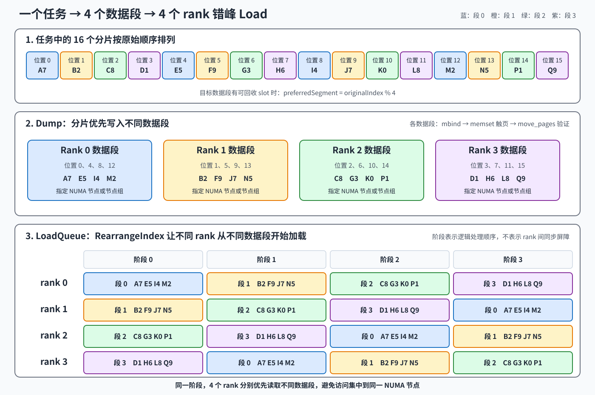

# Cache 内存按 Rank 划分，突破单 NUMA 节点带宽瓶颈

## 1. 背景

H2D KV Cache 传输时延是影响 UCM 性能的重要因素。我们先后探索了 A2 循环提交小 I/O PCIe 拷贝、A2 I/O 聚合和 A3 SDMA Direct。通过聚合小 I/O 并使用 SDMA，以 GLM-5.1 为例，单卡加载一层 KV Cache 的带宽已从约 4 GB/s 提升到约 30 GB/s。

但在实际业务中，多卡需要同时从一块共享内存读取同一份 KV Cache。早期版本的单机聚合带宽只有约 100 GB/s，平均单卡约 7 GB/s。继续增加拷贝 stream 不仅没有提升带宽，有时还会出现异常劣化，说明瓶颈已经从拷贝接口转移到 Host 内存侧。

加入 `MAP_POPULATE` 后，多进程并发预取共享页面，使部分物理页无意中分散到不同 NUMA 节点，性能有所提升。但这种分布受进程调度和页面预取时序影响，随机且不均匀，导致带宽波动，也无法稳定达到预期的 350 GB/s 以上。结合内存控制器监控，我们确认多卡流量仍集中在少数 NUMA 节点，并触及单个 NUMA 节点约 100 GB/s 的带宽上限。

因此，本方案将共享内存数据区分段，并把不同数据段均匀、精确且可验证地放置到不同 NUMA 节点，首先突破单个内存控制器的带宽瓶颈。在此基础上，再增加拷贝 stream，使多个 stream 并行读取不同 NUMA 节点上的数据，进一步发挥多 NUMA 聚合带宽和 SDMA 并行传输能力。

## 2. 实现

### 2.1 内存布局

对外仍然提供一个逻辑 Cache，内部由一个共享控制区和多个 rank 数据段组成。控制区不是独立的控制进程，而是所有参与进程共同映射的一块共享元数据区。它不存放 KV 数据，主要负责维护 Cache 的全局目录并协调多进程并发访问：将 `(blockId, shardIndex)` 映射到 `globalSlot`；维护每个 slot 的 `Loading / Ready / Failed` 状态、引用计数和访问标记，用于确定数据由谁填充、其他进程是等待还是复用，以及 slot 何时可以安全回收；同时记录各数据段的初始化状态，避免访问尚未就绪的数据段。控制区还保存 slot 大小、数据段数量和 NUMA 节点列表等布局信息，用于保证所有进程使用一致的 Cache 布局。

KV 数据则按本机参与共享的 rank 数切分到多个独立数据段。简单来说，控制区回答“数据在哪里、现在能不能用、谁正在使用”，数据区才真正保存 KV payload。

每个 rank 负责创建、初始化并注册对应的数据段，再将就绪状态发布到共享控制区。数据段根据配置和硬件拓扑放置到指定 NUMA 节点或节点组；rank、数据段与 NUMA 节点不要求一一对应。

~~~text
逻辑 Cache
  ├─ 共享控制区：全局索引、slot 生命周期和多进程并发协调
  ├─ Rank 0 数据段：KV payload -> 指定 NUMA 节点或节点组
  ├─ Rank 1 数据段：KV payload -> 指定 NUMA 节点或节点组
  ├─ Rank 2 数据段：KV payload -> 指定 NUMA 节点或节点组
  └─ Rank N 数据段：KV payload -> 指定 NUMA 节点或节点组
~~~

全局 slot 编号覆盖所有数据段，并可稳定解析为实际数据段和段内位置：

~~~text
segment = globalSlot / slotsPerSegment
localSlot = globalSlot % slotsPerSegment
~~~

共享控制区以 `(blockId, shardIndex)` 为键保存 `globalSlot`，不保存进程相关的虚拟地址。各 worker 在启动阶段映射并注册所有数据段；访问 KV 数据时，再将 `globalSlot` 解析为当前进程中的 Host 地址或 Device 可访问地址。因此，各进程可以使用不同的虚拟地址访问同一个物理数据段，同时对外保持统一的 Cache 索引和状态。

### 2.2 NUMA 绑定

每个 rank 创建自己的数据段后，根据 `share_buffer_numa_nodes` 和数据段数量，确定该数据段对应的 NUMA 节点或节点组。程序在首次写入前通过 `mbind` 为不同地址范围设置 NUMA 内存策略，再通过 `memset` 触发物理页分配。初始化完成后，使用 `move_pages` 查询并验证物理页的实际位置；只有页面全部位于预期 NUMA 节点，才将该数据段标记为就绪，供其他 rank 映射和访问。

### 2.3 KV 放置策略

- MLA：由 worker 0 执行 Dump 时，按任务中分片的原始位置 `originalIndex % segmentCount` 选择优先数据段。同一层不同 block 的 KV 分散存放，避免全部写入 rank 0。
- 已缓存的 `(blockId, shardIndex)` 使用当前实际位置，不因后续请求来自不同 rank 而迁移。

### 2.4 并行加载

`LoadQueue` 在处理任务前调用 `RearrangeIndex`，根据当前 rank 对任务中的分片顺序进行重排。对于 `segmentCount` 个数据段，rank 0 优先处理序号为 `0, segmentCount, 2 * segmentCount...` 的分片，rank 1 优先处理序号为 `1, segmentCount + 1...` 的分片，以此类推。

在数据按照 `originalIndex % segmentCount` 分布的情况下，这种重排使不同 rank 从不同数据段开始加载，从而错开对 NUMA 节点的访问。例如，同一任务中的分片 A、B 分别位于数据段 0、1，rank 0 先读取 A，rank 1 先读取 B，再继续读取其余分片。结合异步传输与多 stream，可以使多个 NUMA 节点同时供数。

### 2.5 分段 CLOCK 淘汰

Cache 分块后，每个数据段维护独立的 CLOCK 指针，淘汰操作不再从整个 Cache 的所有 slot 中统一选择。分配新 slot 时，优先在指定数据段内扫描：近期访问过的 slot 获得一次保留机会，仍被 Handle 引用的 slot 不允许淘汰。

如果目标数据段经过两轮扫描仍找不到可回收 slot，则按数据段顺序继续扫描其他已就绪的数据段。最终分配位置以 `globalSlot` 记录。因此，该策略优先在目标 NUMA 数据段内完成淘汰和复用，同时在局部容量不足时允许跨数据段回退，避免单个数据段耗尽导致 Cache 分配失败。

### 2.6 类图

类图表示需求设计中的职责关系，接口按职责简化。PlacementPolicy 表示放置策略，RankDataSegment 表示共享数据段；各进程分别维护数据段的本地映射。

~~~mermaid
classDiagram
    class Buffer {
        <<索引与 slot 分配>>
        +Get(key, preferredSegment)
    }
    class CtrlStrategy {
        <<创建或连接共享控制区>>
        +Setup(config)
    }
    class CtrlLayout {
        <<共享控制区内存布局>>
        +Hdr()
        +Buckets()
        +SlotMetaArr()
    }
    class PlacementPolicy {
        <<新 slot 放置策略>>
        +PreferredSegment(originalIndex, rank)
    }
    class DataStrategy {
        <<NUMA 初始化与地址解析>>
        +SetupSegments()
        +DataAt(globalSlot)
        +DeviceDataAt(globalSlot)
    }
    class RankDataSegment {
        <<共享 KV 数据段>>
        +creatorRank
        +numaNode
        +slotRange
    }
    class Handle {
        <<实际位置与引用>>
        +GlobalSlot()
        +Segment()
        +Data()
        +DeviceData()
    }
    class LoadQueue {
        <<错序读取与 H2D>>
        +Submit(task)
    }
    class DumpQueue {
        <<分段写入与 D2H>>
        +Submit(task)
    }

    LoadQueue ..> PlacementPolicy
    DumpQueue ..> PlacementPolicy
    LoadQueue --> Buffer
    DumpQueue --> Buffer
    Buffer *-- CtrlStrategy : 持有
    CtrlStrategy *-- CtrlLayout : 持有布局视图
    Buffer *-- DataStrategy : 持有本地映射
    DataStrategy --> "1..N" RankDataSegment : 创建本段并映射各段
    Buffer ..> Handle : 返回实际位置
    Handle --> Buffer : 析构时释放引用
~~~

### 2.7 错峰加载示例

以下以 4 个 rank、4 个数据段和 16 个分片为例，展示分片放置与 `RearrangeIndex` 重排后的加载顺序。图中的阶段表示各 rank 的逻辑处理顺序，不表示 rank 之间存在同步屏障。

## 3. 测试方法

### 3.1 历史自测数据

历史自测使用 GLM-5.1、64K 输入、并发 32 和 100% 命中，结果如下。

| 版本 | HBM PC TTFT | Cache TTFT | Cache 单层 Load | Posix TTFT | Posix 单层 Load |
|---|---:|---:|---:|---:|---:|
| 优化前 | 600 ms | 975 ms | Avg 7.46 ms，P99 18.6 ms | 1380 ms | Avg 13.6 ms，P99 40 ms |
| 优化后 | 570 ms | 740 ms | Avg 3.1 ms，P99 4.35 ms | 1350 ms | Avg 13.3 ms，P99 40 ms |

### 3.2 验收方法

建议测试用例为 A3 + MLA 模型 + 长序列高命中（100%），观察 TTFT 收益。

分别测试 HBM PC 命中、Cache 命中和 Posix 命中。固定模型、输入、并行配置、Cache 容量和 stream 数，完成预热后重复执行相同请求，观察：

- TTFT：比较三种命中路径的端到端首 token 时延。
- `ucm:cache_load_duration_ms`：比较 Cache 命中和 Posix 命中时的单层 Cache Load 耗时。

与单块共享内存版本相比，预期 Cache 命中的 `ucm:cache_load_duration_ms` 降低 20% 以上，并体现为 TTFT 下降；Posix 命中的 TTFT 和 `ucm:cache_load_duration_ms` 不出现稳定劣化。
