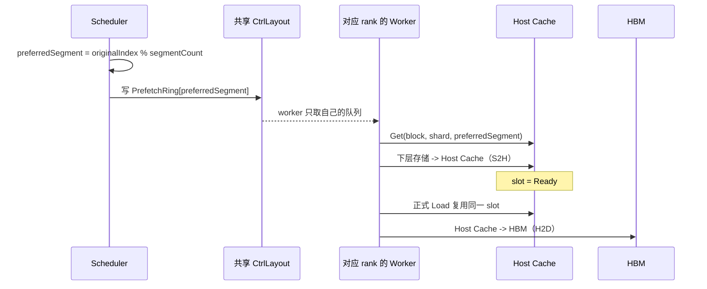
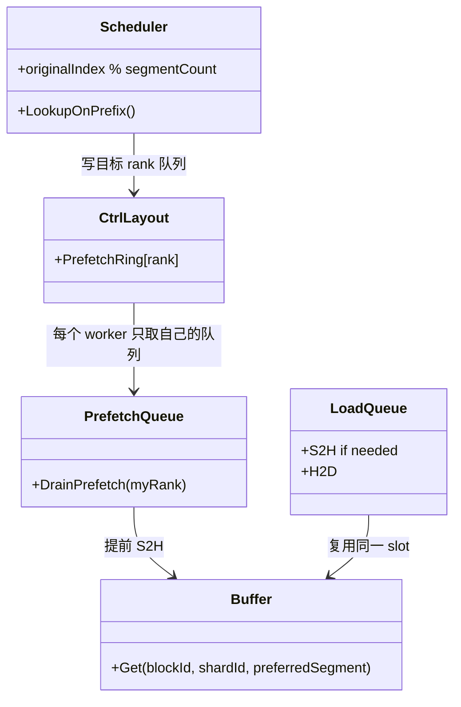

# Cache 内存按 Rank 划分、NUMA 绑定与 Lookup 首层预取

## 1. 背景

H2D KV Cache 传输时延是影响 UCM 性能的重要因素。我们先后探索了 A2 循环提交小 I/O PCIe 拷贝、A2 I/O 聚合和 A3 SDMA Direct。通过聚合小 I/O 并使用 SDMA，以 GLM-5.1 为例，单卡加载一层 KV Cache 的带宽已从约 4 GB/s 提升到约 30 GB/s。

但在实际业务中，多卡需要同时从一块共享内存读取同一份 KV Cache。早期版本的单机聚合带宽只有约 100 GB/s，平均单卡约 7 GB/s。继续增加拷贝 stream 不仅没有提升带宽，有时还会出现异常劣化，说明瓶颈已经从拷贝接口转移到 Host 内存侧。

加入 `MAP_POPULATE` 后，多进程并发预取共享页面，使部分物理页无意中分散到不同 NUMA 节点，性能有所提升。但这种分布受进程调度和页面预取时序影响，随机且不均匀，导致带宽波动，也无法稳定达到预期的 350 GB/s 以上。结合内存控制器监控，我们确认多卡流量仍集中在少数 NUMA 节点，并触及单个 NUMA 节点约 100 GB/s 的带宽上限。

此外，按层加载虽然可以让后续层的数据传输与前序层计算重叠，第一层却没有这样的重叠窗口。如果 Lookup 只确认下层存储命中，正式 Load 第一层时仍要等待“下层存储到 Host Cache”的读取，这段等待会进入 TTFT 关键路径。

因此，本方案包含两项互补优化：

- 将共享数据区按 rank 分段，并将不同数据段精确放置到不同 NUMA 节点，突破单个内存控制器的带宽瓶颈；
- 在 `LookupOnPrefix` 确认下层存储命中后，后台预取每个 block 的 `shard 0`，利用 Lookup 到正式 Load 之间的时间隐藏下层读取时延。

## 2. 控制区与按 Rank 分段的数据区

### 2.1 内存布局

对外仍然提供一个逻辑 Cache，内部由一个共享控制区和多个 rank 数据段组成。控制区不是独立的控制进程，而是所有参与进程共同映射的一块共享元数据区。它不存放 KV 数据，主要负责：

- 将 `(blockId, shardIndex)` 映射到 `globalSlot`；
- 维护每个 slot 的 `Loading / Ready / Failed` 状态、引用计数和 CLOCK 访问标记；
- 记录各数据段的初始化状态，避免访问尚未就绪的数据段；
- 保存 slot 大小、数据段数量和 NUMA 节点列表，校验各参与进程使用相同布局；
- 保存每个在线 rank 的有界预取命令环。

KV 数据按本机参与共享的 rank 数切分到多个独立数据段。每个 rank 负责创建、初始化并注册自己的数据段，然后发布就绪状态。其他 worker 在数据段就绪后映射它，从而在每个进程中都能解析任意全局 slot。

~~~text
逻辑 Cache
  ├─ 共享控制区：全局索引、slot 生命周期、rank 状态、预取命令环
  ├─ Rank 0 数据段：KV payload -> 指定 NUMA 节点或节点组
  ├─ Rank 1 数据段：KV payload -> 指定 NUMA 节点或节点组
  ├─ Rank 2 数据段：KV payload -> 指定 NUMA 节点或节点组
  └─ Rank N 数据段：KV payload -> 指定 NUMA 节点或节点组
~~~

全局 slot 编号覆盖所有数据段，并可稳定解析为实际数据段和段内位置：

~~~text
segment = globalSlot / slotsPerSegment
localSlot = globalSlot % slotsPerSegment
~~~

共享控制区不保存进程相关的虚拟地址。各进程把 `globalSlot` 解析为自己的 Host 地址或 Device 可访问地址，因此不同进程可以使用不同虚拟地址访问同一个物理数据段，同时共享一致的 Cache 索引和状态。

### 2.2 KV 放置与并行加载

- MLA：由 worker 0 执行 Dump 时，按任务中分片的原始位置 `originalIndex % segmentCount` 选择优先数据段。同一层不同 block 的 KV 会分散存放，避免全部写入 rank 0 数据段。
- 已缓存的 `(blockId, shardIndex)` 始终使用当前实际位置，不因后续请求来自不同 rank 而迁移。
- 目标数据段没有可回收 slot 时，允许按段顺序回退到其他已就绪数据段；实际位置仍以 `globalSlot` 为准。

`LoadQueue` 在处理任务前根据当前 rank 重排分片顺序。对于 `segmentCount` 个数据段，rank 0 优先处理序号为 `0, segmentCount, 2 * segmentCount...` 的分片，rank 1 优先处理序号为 `1, segmentCount + 1...` 的分片，以此类推。重排只改变读取顺序，不改变数据位置，也不表示 rank 之间存在同步屏障。

以 4 个 rank、4 个数据段为例：

| 加载阶段 | Rank 0 优先读取 | Rank 1 优先读取 | Rank 2 优先读取 | Rank 3 优先读取 |
|---|---|---|---|---|
| 0 | 数据段 0 | 数据段 1 | 数据段 2 | 数据段 3 |
| 1 | 数据段 1 | 数据段 2 | 数据段 3 | 数据段 0 |
| 2 | 数据段 2 | 数据段 3 | 数据段 0 | 数据段 1 |
| 3 | 数据段 3 | 数据段 0 | 数据段 1 | 数据段 2 |

这样可以让多个 NUMA 节点在同一阶段并行供数。结合异步传输和多 stream，可同时利用多 NUMA 聚合带宽与 SDMA 并行传输能力。

### 2.3 分段 CLOCK 淘汰

每个数据段维护独立的 CLOCK 指针。分配新 slot 时，优先在目标数据段内扫描：近期访问过的 slot 获得一次保留机会，仍被 Handle 引用的 slot 不允许淘汰。

如果目标数据段经过两轮扫描仍找不到可回收 slot，则继续扫描其他已就绪数据段。该策略优先在目标 NUMA 数据段内完成淘汰和复用，同时在局部容量不足时允许跨段回退，避免单个数据段耗尽导致 Cache 分配失败。

## 3. NUMA 绑定

### 3.1 节点选择策略

最新实现不再只依赖进程运行在哪个 CPU 上触发 first-touch，而是先确定 Host 数据区应该使用的 NUMA 节点。选择顺序如下：

1. vLLM worker 通过 `npu-smi info -t topo` 获取 NPU 的 CPU Affinity，再用 `lscpu -e=cpu,node` 将这些 CPU 映射到 NUMA 节点。只有所有亲和 CPU 唯一落在同一 NUMA 节点时，才生成内部的设备亲和节点提示。该提示优先级最高，同时适用于 MLA 的共享 rank 数据段和 GQA 的私有 Buffer。
2. 无法得到唯一设备亲和节点时，共享 Buffer 使用 `share_buffer_numa_nodes`。配置为空时，程序取“有内存的在线节点”与当前进程 `Mems_allowed_list` 的交集。多个数据段按段数对节点分组，同一组中的页面在节点间均匀划分；只有一个数据段时，该段固定放在节点列表的第一个 NUMA 上，不再依赖 first-touch。
3. 对没有可靠拓扑信息的 NPU GQA 私有 Buffer，按本机 worker 的 `DP × PP × TP` 位置生成回退序号，再在当前允许使用的内存节点之间轮转。这样 DP rank 和 TP rank 都参与分配，不会在每个 DP 域内重新从 TP rank 0 开始。
4. 以上信息都不可用时，保留普通 first-touch 作为兜底。

拓扑探测只在 worker 进行。由连接器生成的设备亲和节点和 worker 回退序号属于内部策略，不作为用户配置项。显式节点若不在当前进程的 `Mems_allowed_list` 中，会在初始化阶段报错，而不是静默退回到随机放置。

### 3.2 GQA 与 MLA 在 DP 场景下的差异

GQA 默认关闭共享 Buffer，每个 worker 拥有一块完整的私有 Host Buffer。因此在无法获取设备亲和拓扑的 A3 上，NUMA 分配范围需要覆盖本机所有 GQA worker，而不能只看 TP rank。回退序号按下面的逻辑计算：

~~~text
fallbackRank = localDpRank * (ppSize * tpSize) + modelParallelRank
targetNuma = allowedNumaNodes[fallbackRank % allowedNumaNodeCount]
~~~

MLA 默认共享 Buffer。不同 DP 中相同 TP rank 的 worker 加入同一个 Cache 域，并竞争同一逻辑数据段的创建权；只有一个进程实际创建、初始化和发布该数据段，其他进程映射已经发布的数据段。因此 MLA 的物理数据段数量由 TP 决定，不随 DP 数量增加。

| 场景 | GQA | MLA |
|---|---|---|
| A3，DP8 TP1 | 8 个私有 Buffer，回退序号为 0～7；存在至少 8 个可用 NUMA 时分别落在 8 个节点 | 8 个 DP 共享 rank 0 的一个数据段；该段放在一个 NUMA，其他 DP 映射同一份物理页 |
| A3，DP2 TP8 | 16 个私有 Buffer，按 0～15 在可用 NUMA 上轮转 | 两个 DP 共享 8 个 TP 数据段，每个逻辑段只创建一次 |
| A2，有有效 topo | 每个私有 Buffer 优先跟随本 worker 的设备亲和 NUMA | 每个共享数据段优先跟随实际创建者的设备亲和 NUMA，其他 DP 映射该段 |

以 A3、DP8 TP1 为例，GQA 的目标是利用 8 个独立私有 Buffer 并行使用 8 个 NUMA；MLA 的目标则是让 8 个 DP 复用同一个共享数据段，避免为相同 KV 创建 8 份 Host Cache。这里所说的“一个共享数据段”不包含控制区；控制区仍是独立的共享元数据映射。

### 3.3 绑定、触页与验证

每个 rank 创建本地数据段后，严格按以下顺序初始化：

1. 按系统页大小规划地址范围；一个数据段对应多个 NUMA 节点时，完整页面在节点间均分，页数差不超过一页。
2. 在任何页面被触碰前，对每个地址范围调用 `mbind(MPOL_BIND | MPOL_F_STATIC_NODES)`。数据映射不能提前使用 `MAP_POPULATE`，否则物理页可能在策略生效前已经分配。
3. 调用 `memset` 触发物理页分配。
4. 分批调用 `move_pages` 查询每个页面的实际节点；任一页面不在预期节点都视为初始化失败。
5. NUMA 校验成功后注册 Host Buffer，最后把本 rank 数据段发布为 Ready。其他 rank 只映射 Ready 的数据段。

日志中的 `SHM NUMA bind` 给出文件、偏移、长度和目标节点，`SHM NUMA verify` 给出期望节点、实际节点、页数和 mismatch 数。验证失败的数据段会发布失败状态，其他参与者不会把它当作可用数据段继续运行。

## 4. Lookup 首层预取

### 4.1 整体思路

预取只把下层存储中的 KV 提前读到 Host Cache，也就是提前做 S2H；它不做 H2D。正式 Load 到来后复用同一个 Host slot，再把数据拷到请求对应的 HBM 地址。

可以把当前实现理解成下面四步：

1. scheduler 确定哪些 block 在下层存储命中；
2. scheduler 按 `originalIndex % segmentCount` 把预取命令写入共享控制区中对应 rank 的队列；
3. 所有 worker 都映射共享控制区，但每个 worker 只消费自己 rank 的队列；
4. worker 执行 S2H，正式 Load 复用结果并执行 H2D。

当前预取命令使用 `shardId = 0`。Direct 模式下它表示包含全部本地层的唯一 shard；LayerWise 模式下表示第 0 层。PP 非首 stage 的本地第一层不一定是 0，该场景仍需后续把实际 `first_layer_id` 传给 scheduler。

### 4.2 Scheduler 如何写控制区

在当前 Direct 和 PP1 LayerWise 路径中，vLLM 在 Lookup 前已经去掉 HBM 命中的前缀；之后正式 Load 使用的也是这段 external block 列表。因此，`LookupOnPrefixFast` 记录的 `missIdx` 与正式 Load 的 `originalIndex` 使用同一个索引起点。

对下层存储确认命中的每个 Host Cache miss，scheduler 按下面的规则选择目标：

~~~text
preferredSegment = originalIndex % segmentCount
targetRank = preferredSegment
~~~

随后把一条 `PrefetchCommand` 写入共享 `CtrlLayout` 中的 `PrefetchRing[targetRank]`：

~~~text
PrefetchCommand = {blockId, shardId, preferredSegment}
~~~

如果目标 rank 尚未 Ready、队列竞争或队列已满，本次预取提示可以跳过；Lookup 不会等待预取完成，后续正式 Load 仍能按需读取。

### 4.3 Worker 如何执行

共享控制区为每个 rank 保存一个预取队列。所有 worker 都能看到控制区，但 worker 0 只取 `PrefetchRing[0]`，worker 1 只取 `PrefetchRing[1]`，依此类推。

每个 worker 的 `PrefetchQueue` 每批最多取 64 条命令，并执行：

~~~text
Buffer::Get(blockId, shardId, allowReserved=false, preferredSegment)
~~~

如果 slot 不存在，Buffer 优先从 `preferredSegment` 分配；如果 slot 已存在，则直接复用它的实际位置，不迁移数据。目标段没有可回收 slot 时，仍允许按与正式 Load 相同的规则回退到其他 Ready 段。

只有取得 `Owner` 的 worker 才调用下层 `Load` 做 S2H，并在完成后发布 `Ready`；其他 worker 或正式 Load 看到同一个 `(blockId, shardId)` 时不会重复读取。

### 4.4 与正式 Load 的关系

在当前 `shardId = 0` 适用的 Direct、PP1 LayerWise 场景中，预取和正式 Load 使用相同的三项信息：

- 相同的 `(blockId, shardId)`，因此命中同一个 Cache slot；
- 相同的 `originalIndex % segmentCount`，因此使用相同的优先数据段；
- 相同的下层 `StoreV1::Load` 接口完成 S2H。

区别只有时机和目标地址：预取提前把数据读到 Host Cache；正式 Load 带有请求的 HBM 地址。正式 Load 到达时，如果 slot 已经 `Ready`，就跳过 S2H、直接做 H2D；如果预取仍在 `Loading`，正式 Load 等待它完成；如果正式 Load 先取得 `Owner`，则由正式 Load 完成 S2H。

以 4 个数据段为例，连续 8 个 block 的分配为：

| `originalIndex` | 0 | 1 | 2 | 3 | 4 | 5 | 6 | 7 |
|---|---:|---:|---:|---:|---:|---:|---:|---:|
| 目标队列/优先段 | 0 | 1 | 2 | 3 | 0 | 1 | 2 | 3 |

连续任务会自然均分。如果过滤后只有原始位置 1、4、6 需要预取，它们仍分别写入队列 1、0、2；此时优先保证与正式 Load 的 SHM 放置一致，不保证任意缺失集合的任务数完全均匀。

### 4.5 时序图

## 5. 预取类图

## 6. 测试方法

### 6.1 历史自测数据

历史自测使用 GLM-5.1、64K 输入、并发 32 和 100% 命中，结果如下。

| 版本 | HBM PC TTFT | Cache TTFT | Cache 单层 Load | Posix TTFT | Posix 单层 Load |
|---|---:|---:|---:|---:|---:|
| 优化前 | 600 ms | 975 ms | Avg 7.46 ms，P99 18.6 ms | 1380 ms | Avg 13.6 ms，P99 40 ms |
| 优化后 | 570 ms | 740 ms | Avg 3.1 ms，P99 4.35 ms | 1350 ms | Avg 13.3 ms，P99 40 ms |

### 6.2 NUMA 验收

使用至少包含两个 NUMA 内存节点的服务器，固定模型、输入、总 Cache 容量、rank 数、并发和 stream 数。初始化后检查：

- 每个数据段的 `SHM NUMA verify` 记录均为 `mismatches=0`；
- 各数据段已用 slot 大致均衡，多个内存控制器同时产生有效读带宽；
- 与流量集中在单节点的基线相比，`ucm:cache_load_duration_ms` 均值和 P99 下降；
- Posix 命中的 TTFT 与单层 Load 不出现稳定劣化。

在 A3 上还应分别检查 DP8 TP1：GQA 的 `FallbackNumaRank` 应覆盖 0～7，并出现 8 组私有 Buffer 绑定记录；MLA 应只有 rank 0 数据段的一组 `SHM NUMA bind/verify`，其他 DP 只映射该段。可以先运行 `python test/cache_numa_topology_live.py --devices 0-7 --verify-pages` 检查当前机器的预期矩阵和实际页面绑定能力。

建议使用 A3、MLA 模型、长序列高命中（100%）负载，同时比较 HBM PC、Cache 和 Posix 三条命中路径。预期 Cache 命中的 `ucm:cache_load_duration_ms` 相对单块共享内存版本降低 20% 以上，并体现为 TTFT 下降。

### 6.3 首层预取验收

测试数据应满足“下层存储已有 block、Host Cache 尚未缓存”。在模型、block 数、数据大小以及 Lookup 到正式 Load 的间隔一致时，重点检查：

- Lookup 结果不变，预取阶段只发生 S2H，不发生 H2D；
- Host Cache 部分命中时，剩余任务仍按原始位置的 `originalIndex % segmentCount` 进入对应 rank 队列；
- 正式 Load 复用同一 slot：预取已完成时不重复 S2H，预取进行中时等待同一任务，预取失败或被丢弃时仍能按需加载；
- 命令环保持 FIFO，且 `blockId`、`shardId`、`preferredSegment` 能完整传到 worker；
- PP 非首 stage 单独记录当前 `shardId = 0` 与实际 `first_layer_id` 不一致的限制。

绝对耗时受存储介质和数据大小影响，不建议设置统一的毫秒阈值；应在相同环境下比较第一层 backend wait、`ucm:cache_load_duration_ms` 和 TTFT 的分布。
