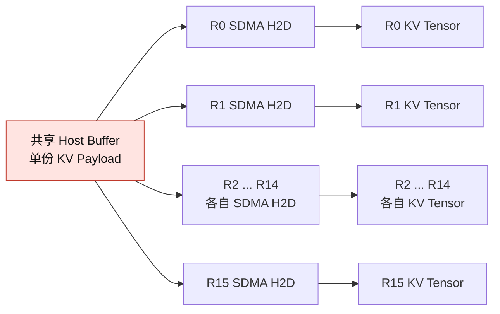
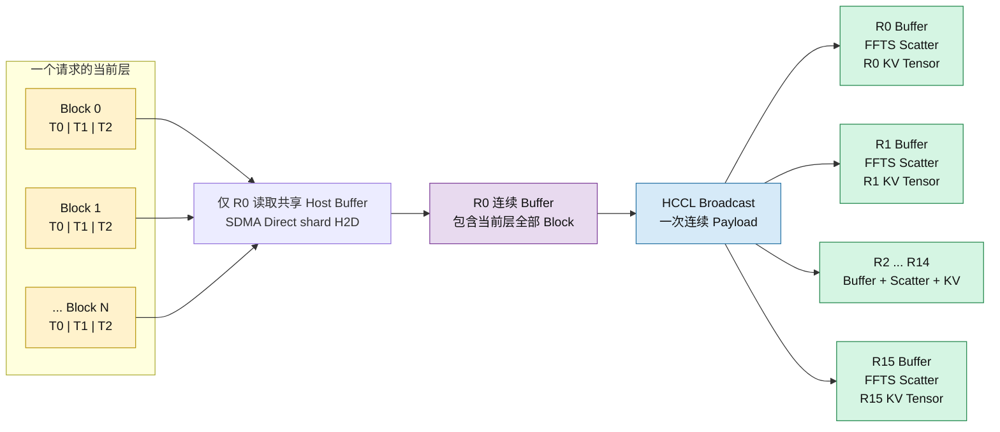
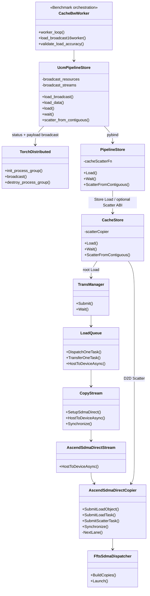
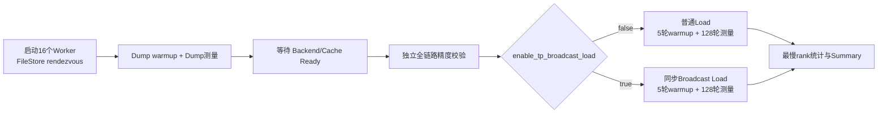
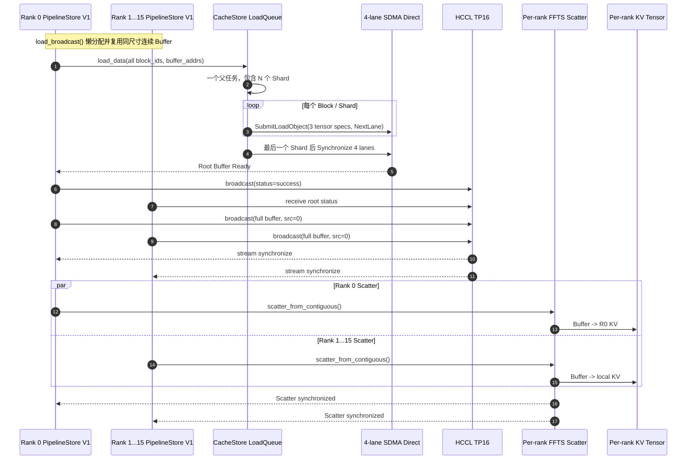

# UCM Ascend A3 TP16 Broadcast Load 设计与实现

## 1. 文档状态

本文描述当前 `codex/sdma-4-stream` 分支已经实现的 TP16 Broadcast Load 数据面，以及尚未进入当前实现的后续工作。

当前实现范围：

- GLM-5.1；
- Ascend A3；
- MLA；
- `use_layerwise=true/false` 的同步整块 Payload；
- TP16；
- PipelineStore V1 同步 `load_broadcast`；
- `cache_fake_bw.py` 和 `cache_posix_bw.py` 性能与精度验证；
- Root CacheStore Load；
- HCCL Broadcast；
- C++ FFTS SDMA D2D Scatter；
- SDMA Direct 4-lane、shard 级 H2D 提交。

当前实现不包含 vLLM 生产 Connector 开关。`enable_tp_broadcast_load` 目前只是两个 E2E Benchmark 的选择开关；生产 Connector 接入、跨层流水和计算流 Event 依赖仍属于后续工作。

## 2. 背景与目标

共享 MLA 场景中，CacheStore 只保留一份 Host KV Payload，但普通 TP16 Load 仍由 16 个 Worker 分别从同一片共享 Host Buffer 执行 H2D。

实测表现为：

- 单 Worker H2D 带宽正常；
- 16 个 Worker 同时读取共享内存时，最慢 rank 带宽明显下降；
- 共享内存形态难以改变；
- 性能劣化可能与 NUMA、内存控制器、Host 注册映射或并发访问竞争有关。

Broadcast Load 的目标是将共享 Host Buffer 的读取者从 16 个减少为 1 个：

1. TP rank 0 作为 Root；
2. Root 将当前层全部有效 Block 加载到本卡连续 NPU Buffer；
3. HCCL 将该连续 Buffer 广播到其余 15 张卡；
4. 每张卡使用 FFTS SDMA D2D Scatter 写入本卡真实 KV Tensor。

## 3. 总体数据路径

### 3.1 普通 TP16 Load



该路径只有一份 Host Payload，但产生 16 路 Host 读取和 H2D。

### 3.2 当前 Broadcast Load



当前实现不先把 Root 数据写入真实 KV Tensor，也不使用 `torch.stack` Gather。CacheStore H2D 的目标地址直接指向连续 Buffer，从而避免 Root 上额外的 D2D Gather。

## 4. 连续 Buffer 布局与大小

### 4.1 内存布局

GLM-5.1 Layerwise 模式下，每个 Block 包含 3 个 Tensor。连续 Buffer 使用 Block-major、Tensor-minor 布局：

```text
[B0.T0][B0.T1][B0.T2]
[B1.T0][B1.T1][B1.T2]
...
[BN.T0][BN.T1][BN.T2]
```

地址矩阵形状为 `[block_number, 3]`：

```text
buffer_base
    + block_index * bytes_per_block
    + prefix_sum(tensor_size_list, tensor_index)
```

Root 使用该地址矩阵调用 `load_data`。Broadcast 完成后，Scatter 使用相同的 Block 起始偏移和每张卡真实 KV 地址矩阵恢复离散布局。

### 4.2 大小公式

```text
bytes_per_block = sum(tensor_size_list)
bytes_per_epoch = bytes_per_block * block_number
broadcast_buffer_bytes_per_rank = bytes_per_epoch
```

GLM-5.1 当前层的 3 个 Tensor 为：

```text
131072 + 16384 + 32768
= 180224 bytes
= 176 KiB / Block
```

示例：

| Block 数 | 每张 NPU 的 Broadcast Buffer |
| ---: | ---: |
| 100 | 17.1875 MiB |
| 460 | 79.0625 MiB |

每个 Worker 第一次调用 `UcmPipelineStore.load_broadcast` 时按目标 Tensor 形状懒分配一块 Broadcast Buffer，随后在精度阶段、warmup 和全部测量 epoch 中复用。当前实现不是每个 Block 分配一块 Buffer，也不会每个 epoch 重复分配 Broadcast Buffer。

性能阶段还会创建同等 Payload 大小的目标 KV Tensor。精度阶段还会临时创建独立 Expected Tensor，因此峰值 Device 内存高于单独的 Broadcast Buffer 大小。

## 5. Root H2D 的真实执行粒度

“一次加载当前层全部 Block”需要区分 UCM 任务粒度和 SDMA 物理提交粒度。

### 5.1 Python 和 UCM 任务粒度

所有 rank 对当前 Payload 调用一次：

```python
stats = worker.load_broadcast(
    block_ids,
    shard_indexes,
    destination_tensors,
    src_rank=0,
)
```

其中：

- `block_ids` 包含当前 epoch 的全部 Block；
- `shard_indexes` 长度等于 Block 数；
- `destination_tensors` 形状为 `[block_number, tensor_number]`。

`UcmPipelineStore` 根据目标 Tensor 形状创建连续 Buffer 和 `[block_number, tensor_number]` 地址矩阵。Root 内部调用 `load_data` 和 `wait`；PipelineStore 将地址矩阵的每一行转换为一个 `Shard`。因此一个 Python Load 对应一个父任务，父任务包含 N 个 Shard。

### 5.2 当前 shard 级 SDMA Direct

Benchmark 明确配置：

```python
cache_sdma_direct_launch_granularity = "shard"
```

因此 LoadQueue 为每个 Shard 分别执行一次 H2D 提交：

```text
Shard 0 / Block 0 -> SubmitLoadObject -> 3 个 FFTS Copy Specs -> lane 0
Shard 1 / Block 1 -> SubmitLoadObject -> 3 个 FFTS Copy Specs -> lane 1
Shard 2 / Block 2 -> SubmitLoadObject -> 3 个 FFTS Copy Specs -> lane 2
Shard 3 / Block 3 -> SubmitLoadObject -> 3 个 FFTS Copy Specs -> lane 3
Shard 4 / Block 4 -> SubmitLoadObject -> 3 个 FFTS Copy Specs -> lane 0
...
```

中间 Shard 只提交、不立即同步。最后一个 Shard 才触发 `Synchronize`，等待 4 条 lane 全部完成，随后 `worker.wait(task)` 返回。

所以当前实际语义是：

- 一个 UCM 父任务包含当前层全部 Block；
- 每个 Block 是一次独立的 SDMA Direct H2D 提交；
- 每次提交包含该 Block 的 3 个 Tensor Copy Specs；
- Block 提交在 4 条 lane 上轮转；
- 全部 Block H2D 完成后，才开始整块 HCCL Broadcast。

如果配置为 `task` 粒度，才会把多个 Shard 合成 `SubmitLoadTask`。当前 Benchmark 不使用该路径。

## 6. 当前类与调用关系



职责划分：

- `cache_fake_bw.py` 和 `cache_posix_bw.py`：多进程编排、精度门禁和统计；
- `UcmPipelineStore`：复用连续 Buffer，执行 Root Load 状态同步、HCCL Broadcast 和 Scatter，并将 Block ID、Shard Index 和地址矩阵传给 pybind；
- `PipelineStore`：构建 C++ TaskDesc，调用普通 Store Load，并通过可选 ABI 调用 CacheStore Scatter；
- `CacheStore`：管理 LoadQueue 和专用 Scatter Copier；
- `LoadQueue`：把父任务拆成 Shard，等待 Host Payload Ready，提交 H2D；
- `AscendSdmaDirectCopier`：生成 FFTS Copy Specs、选择 lane 并提交；
- `TorchDistributed`：在 NPU 上通过 HCCL 执行 Broadcast。

## 7. 重要接口

### 7.1 Benchmark 配置

```python
enable_tp_broadcast_load = False
accuracy_check_enable = True
cache_sdma_direct = True
```

`enable_tp_broadcast_load=False` 使用普通 `load + wait`；设置为 `True` 后，Cache|Fake 和 Cache|Posix 都通过 `UcmPipelineStore.load_broadcast` 执行同步 Broadcast Load。

Worker Store 内部配置：

```python
cache_stream_number = 4
cache_sdma_direct_launch_granularity = "shard"
cache_tp_broadcast_scatter = True
```

`cache_tp_broadcast_scatter` 只为 CacheStore 启用本地 D2D Scatter 扩展，不是生产用户配置。

`cache_stream_number=4` 不控制 SDMA Direct lane 数量。当前分支的 4 条 SDMA Direct lane 由 `AscendSdmaDirectCopier` 内部固定配置；`cache_stream_number` 仍属于普通 CopyStream 配置。

### 7.2 PipelineStore V1 同步 Broadcast Load

```python
stats = store.load_broadcast(
    block_ids,
    shard_indices,
    destination_tensors,
    src_rank=0,
)
```

该接口在每个 rank 上同步返回，执行顺序固定为：

1. Root H2D 到连续 Buffer；
2. Root Load 状态 Broadcast；
3. 整块 Payload HCCL Broadcast；
4. 每个 rank 同步 FFTS Scatter。

返回值包含 Root H2D、HCCL、Scatter 和端到端耗时。当前没有 Chunk、双 Buffer 或异步 Scatter。

### 7.3 连续地址 Load

```python
store.load_data(
    block_ids,
    shard_indices,
    destination_addrs,
)
```

该接口仍走现有 `PipelineStore.Load` 和 `StoreV1::Load`，没有增加新的 Load 基类接口。

Broadcast 路径中，Root 的 `destination_addrs` 指向连续 Buffer 切片；普通 SDMA 路径则指向真实 KV Tensor。

### 7.4 HCCL Broadcast

```python
store.load_broadcast(...)
```

`UcmPipelineStore` 内部先广播一个 Device Status Tensor。Root Load 失败时，所有 rank 统一跳过 Payload Broadcast 并报错；成功时，再在专用通信 Stream 上对整块连续 Tensor 调用一次 HCCL Broadcast，并同步等待完成。

### 7.5 C++ FFTS Scatter

```python
store.scatter_from_contiguous(
    source_addr,
    source_offsets,
    destination_addrs,
)
```

参数：

| 参数 | 形状 | 说明 |
| --- | --- | --- |
| `source_addr` | 标量 | 本卡连续 Broadcast Buffer 首地址 |
| `source_offsets` | `[N]` | 每个 Block 在连续 Buffer 中的起始偏移 |
| `destination_addrs` | `[N, M]` | 每个 Block 的 M 个真实 KV Tensor 地址 |

Scatter 不加入 `StoreV1` 基类。PipelineStore 通过 CacheStore 动态库导出的可选 C ABI 调用真实 CacheStore 对象。

Scatter 为同步接口：

1. 构造全部 D2D Copy Specs；
2. 调用一次 `FftsSdmaDispatcher::BuildCopies`；
3. 在 `NextLane()` 选择的一条 lane 上 Launch；
4. `Synchronize()` 等待 Scatter 完成后返回。

当前一个整层 Scatter Task 不强制拆到 4 条 lane。

### 7.6 分布式 Rendezvous

Parent 使用每轮唯一的 FileStore 路径：

```text
file:///tmp/ucm_cache_fake_<unique_id>.rdzv
```

所有 16 个 Worker 使用相同 `init_method` 初始化 HCCL Process Group。Worker 退出后，Parent 清理 rendezvous 文件。

该设计避免了“先探测随机 TCP 端口、关闭 socket、rank 0 稍后重新监听”造成的 `EADDRINUSE` 竞争窗口。FileStore 只替代 PyTorch rendezvous；HCCL 自身通信端口配置仍由 HCCL 环境变量管理。

## 8. 当前时序

### 8.1 整体 Benchmark 顺序



精度校验位于 Dump 测量之后、Load 性能测试之前。精度失败时，不执行后续 Load 性能测试，也不打印最终 Summary；已经完成的 Dump 测量不会回滚。

### 8.2 单轮 Broadcast Load



当前 Root H2D、HCCL 和 Scatter 完全串行，没有实现 Chunk Pipeline 或 Event overlap。

## 9. 精度校验

`accuracy_check_enable=True` 时，脚本使用固定 CPU Seed 生成 0 到 250 的整数 Payload，再转换为 BF16。该范围在 BF16 中可精确表达，因此复制链路使用 `torch.equal` 做全量精确比较，不使用误差容忍。

精度阶段根据 `enable_tp_broadcast_load` 选择普通 Load 或同步 Broadcast Load，并对每个 rank 的全部目标 KV Tensor 做最终全量校验。Root 连续 Buffer、HCCL 和 Scatter 的中间步骤由同一个 `load_broadcast` 接口封装，不再由 Benchmark 分阶段读取。

Expected Tensor 独立生成，不以 Root Load 结果作为期望值，因此能够识别 Root Load 本身的数据错误。

任一阶段失败都会报告：

- 阶段名称；
- Worker/rank；
- Block；
- Tensor。

所有精度比较都位于性能计时之外，不写入 latency 或 bandwidth record。成功时由 rank 0 打印：

```text
accuracy check passed: enable_tp_broadcast_load=True, record_idx=0, bytes=...
```

## 10. 性能统计口径

### 10.1 最慢 rank

对带有 `slowest rank` 的指标，每个 epoch 先从 16 个 rank 中取耗时最大值：

```text
epoch_cost = max(rank_0_cost, rank_1_cost, ..., rank_15_cost)
```

随后对 128 个 epoch cost 计算 avg、min、p50、p90、p99 和 max。

适用指标：

- `sdma16worker slowest rank`；
- `broadcast16worker slowest rank`；
- `broadcast HCCL slowest rank`；
- `broadcast FFTS scatter slowest rank`。

`broadcast root H2D` 只统计 rank 0。

各阶段的最慢 rank 可能不同，因此不能严格用“Root H2D 最慢值 + HCCL 最慢值 + Scatter 最慢值”推导 Broadcast Total。

### 10.2 带宽与加速比

每个样本的有效带宽：

```text
bandwidth = bytes_per_epoch / sample_cost
```

Summary 中的平均带宽是所有样本带宽的平均值，不等于 `bytes_per_epoch / 平均延迟`。

每个 epoch 的加速比：

```text
speedup[epoch] =
    sdma_slowest_cost[epoch] / broadcast_slowest_cost[epoch]
```

最终 speedup 统计来自 128 个逐 epoch 比值。

## 11. 当前实测结果

最近一次 A3 TP16 运行结果：

该表记录当次运行的 Summary；Payload 大小和 Block 数量应以同一次运行启动日志中的 `bytes_per_epoch`、`block_number` 为准。不同 Payload 大小的结果不能直接横向比较。

| 指标 | 平均延迟 | 平均有效带宽 |
| --- | ---: | ---: |
| SDMA 16-worker 最慢 rank | 11.744 ms | 7.156 GB/s |
| Broadcast 端到端最慢 rank | 7.409 ms | 11.701 GB/s |
| Root H2D | 2.856 ms | 29.590 GB/s |
| HCCL 最慢 rank | 1.764 ms | 47.541 GB/s |
| FFTS Scatter 最慢 rank | 1.219 ms | 68.542 GB/s |

逐 epoch 平均加速比为 `1.660x`。

该结果说明：

- 单 Root H2D 恢复到接近单卡正常带宽，验证了减少共享 Host 并发读取的方向；
- 连续 Buffer + FFTS Scatter 不是主要瓶颈；
- HCCL 与串行阶段累加决定当前端到端上限；
- 当前方案有效，但尚未实现 H2D、HCCL、Scatter overlap。

## 12. 当前边界与后续方向

当前已经实现：

- 单机 TP16 Benchmark；
- PipelineStore V1 同步 `load_broadcast`；
- Cache|Fake 和 Cache|Posix 可选 Broadcast 开关；
- Root 连续 Buffer Load；
- Root Load 状态在 Benchmark Process Group 内统一广播；
- shard 级 4-lane SDMA Direct H2D；
- 一次整层 HCCL Broadcast；
- C++ FFTS D2D Scatter；
- FileStore rendezvous；
- 全 Payload 精度门禁；
- 最慢 rank 性能统计。

当前尚未实现：

- vLLM `UCMLayerWiseConnector` 生产接入；
- vLLM 用户侧 `enable_tp_broadcast_load` 配置；
- 多请求切片与失败请求过滤；
- 单 Block Buffer；
- 多 Block Chunk Buffer；
- 双 Buffer 或三 Buffer Pipeline；
- H2D、HCCL、Scatter、Forward 的 Event overlap；
- 跨 PP Stage 或跨 DP Group Broadcast；
- GQA、非 MLA 和 GLM-5.2 Shared Indexer。

如果后续需要降低 Buffer 内存或增加阶段重叠，推荐采用“多 Block Chunk + 双 Buffer”，而不是直接退化为一个 Block 一次 HCCL：

```text
Buffer A: HCCL chunk N / Scatter chunk N
Buffer B: Root H2D chunk N+1
```

真正实现该流水还需要：

- Chunk 级 Block/地址切片；
- 所有 rank 保持完全相同的 HCCL collective 顺序；
- Scatter 异步提交或 Event 接口；
- 防止 Buffer 在 Scatter 完成前被下一轮 H2D 覆盖；
- 单独评估小 Payload HCCL 启动开销。
