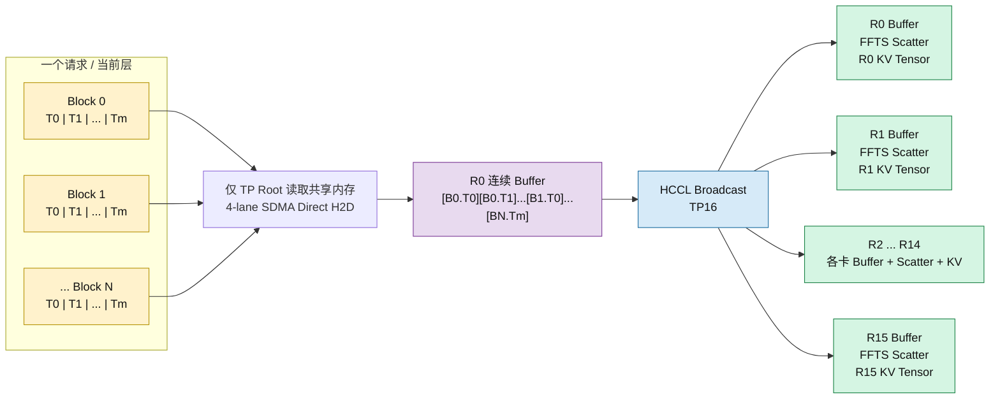
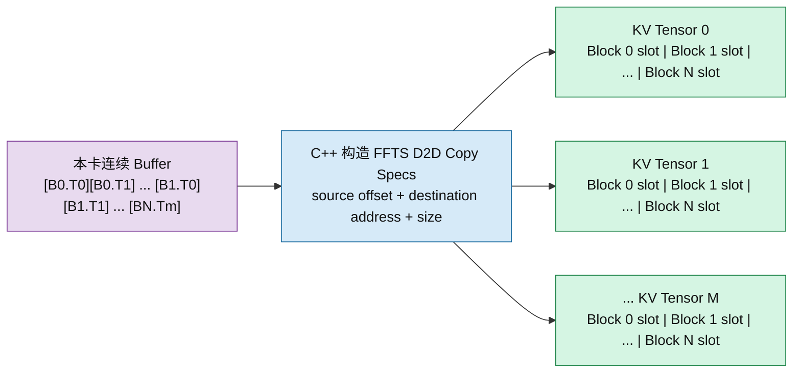
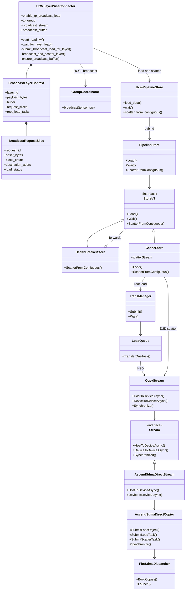

# UCM Ascend A3 TP16 Broadcast Load 设计方案

## 1. 目标与范围

本文设计用于 GLM-5.1 在 Ascend A3、MLA、`use_layerwise=true`、TP16 场景下的 KV Cache Load 加速。

当前共享内存方案中，CacheStore 只从后端加载一次数据到共享 Host Buffer，但 16 个 Worker 仍会分别从同一片共享内存执行 H2D。单卡读取带宽正常，16 卡并发读取时可能受到 NUMA、内存控制器或共享内存访问竞争影响，导致单 Worker 带宽明显下降。

本方案将数据路径调整为：

1. 每个 TP Group 选择组内 rank 0 作为 Root Worker。
2. Root Worker 通过现有 CacheStore Load 和 SDMA Direct，将一层 KV 数据直接加载到连续 NPU Broadcast Buffer。
3. HCCL 将连续 Buffer 广播到同一 TP Group 的其他 15 张卡。
4. 每张卡使用 C++ FFTS SDMA D2D Scatter，将连续 Buffer 写入本卡真实 KV Tensor。
5. Python 只负责任务编排、HCCL 调用和生命周期管理，不承担 KV 数据拷贝。

本阶段不考虑 GLM-5.2 Shared Indexer、不规则 Tensor 布局、GQA 和非 Layerwise 模式。

## 2. 方案决策

最终采用“连续 Buffer 优先”的数据路径：

```text
共享 Host Buffer
    -> Root SDMA Direct H2D
    -> Root 连续 NPU Broadcast Buffer
    -> HCCL Broadcast
    -> 每卡连续 NPU Broadcast Buffer
    -> 每卡 FFTS SDMA D2D Scatter
    -> 每卡真实 KV Tensor
```

不采用“Root 先加载到 KV Tensor，再 Gather 到连续 Buffer”的原因是该路径会在 Root 上增加一次额外 D2D Gather，同时延长 HCCL 开始前的串行路径。

Root 和非 Root 最终都执行相同的 Scatter。这样 Root 不需要特殊的 KV 写入路径，各 rank 的 Broadcast 后处理完全一致。

## 3. TP16 Load 示意图

### 3.1 当前基线：16 个 Worker 分别从共享内存执行 H2D


基线路径虽然只发生一次 Backend 到共享 Host Buffer 的加载，但会产生 16 路并发 Host 读取和 H2D，竞争点仍然集中在共享内存及其底层 NUMA/内存通路。

### 3.2 Broadcast 方案：Root H2D、TP16 HCCL、每卡本地 Scatter



方案只保留一路共享内存读取。HCCL 负责卡间分发，FFTS Scatter 只访问各卡本地 HBM，不再让 15 个非 Root Worker 读取共享 Host Buffer。

图中的核心数据变换是：一个请求在当前层包含多个 Block；Root 将这些 Block 的 Tensor 分片直接拷入一个连续 Buffer；HCCL 一次广播这段连续 Payload；每张卡再根据源偏移和本卡 KV 地址矩阵，把各个 Block 拆回真实 KV Tensor。

如果一台机器上存在多个 TP Group，则每个 TP Group 分别选择自己的组内 rank 0。不同 DP Group 之间不执行 Broadcast，也不使用全局 rank 0 作为唯一 Root。

## 4. 连续 Buffer 布局

GLM-5.1 Layerwise KV 布局按每层固定 Tensor 数量和固定单 Block Tensor 大小处理。连续 Buffer 按请求、Block、Tensor 的顺序排列：

```text
Request 0:
  Block 0: Tensor 0 | Tensor 1 | ... | Tensor M-1
  Block 1: Tensor 0 | Tensor 1 | ... | Tensor M-1
  ...

Request 1:
  Block 0: Tensor 0 | Tensor 1 | ... | Tensor M-1
  ...
```

Broadcast 完成后，每张卡都对自己的连续 Buffer 执行同样的本地拆分：



其中：

- 每个 Block 的字节数等于当前层 `tensor_size_list` 之和。
- Root Load 使用现有二维目标地址矩阵，但矩阵中的地址指向连续 Broadcast Buffer 的各个切片。
- HCCL 将整层有效 Payload 作为一个连续 Tensor 广播。
- Scatter 使用源偏移和真实 KV 地址矩阵恢复每个 Block 的 Tensor 分布。
- Broadcast Buffer 按需扩容并跨层复用，不在每层或每个请求重复申请。

## 5. 类图



类职责划分如下：

- `UCMLayerWiseConnector`：决定 Root、构造连续 Buffer 地址、调用 HCCL、触发 Scatter。
- `GroupCoordinator`：复用 vLLM 已建立的 TP Process Group；Ascend 后端实际执行 HCCL Broadcast。
- `UcmPipelineStore` 和 `PipelineStore`：提供 Python 到 C++ 的薄封装，不处理数据拷贝。
- `StoreV1`：增加通用 Scatter 能力入口；默认实现返回 Unsupported。
- `HealthBreakerStore`：透明转发 Scatter，保证启用健康检查时接口仍能到达 CacheStore。
- `CacheStore`：校验 Scatter 参数，调用专用 SDMA Direct CopyStream，并在返回前完成同步。
- `AscendSdmaDirectCopier`：将连续源地址和离散 KV 目标地址转换为 FFTS D2D Copy Specs。
- `FftsSdmaDispatcher`：构建并提交真正的 D2D Scatter 任务。

## 6. 关键接口说明

### 6.1 配置接口

新增顶层实验开关：

```yaml
enable_tp_broadcast_load: true
```

默认值为 `false`，以便在同一个 SDMA 4-stream 分支上完成 A/B 对比。

启用条件：

- Ascend A3；
- MLA；
- `use_layerwise=true`；
- TP Size 大于 1；
- 使用 CacheStore Pipeline；
- `cache_sdma_direct=true`。

任一条件不满足时应在初始化阶段明确报错，不进行静默降级，避免性能实验误用普通路径。

Connector 在创建 Worker Store 时，将内部配置 `cache_tp_broadcast_scatter=true` 传给 CacheStore。该内部配置不要求用户重复填写。

### 6.2 Root 连续 Buffer Load

复用现有接口，不新增 H2D Load API：

```python
store.load_data(block_ids, shard_indices, destination_addrs)
```

区别仅在 `destination_addrs`：

- 基线路径指向真实 KV Tensor；
- Broadcast 路径在 Root 上指向连续 Broadcast Buffer 的各 Tensor 切片；
- 非 Root 不调用 `load_data`。

因此无需调用当前不支持的 SDMA Direct 单指针 H2D 接口。LoadQueue 仍通过已有的多地址、可变 Size 接口构造 H2D Copy Specs，SDMA 4-lane 行为也保持不变。

### 6.3 Python Scatter 接口

新增：

```python
store.scatter_from_contiguous(
    source_addr,
    source_offsets,
    destination_addrs,
)
```

参数语义：

| 参数 | 类型 | 形状 | 说明 |
| --- | --- | --- | --- |
| `source_addr` | `int` | 标量 | 连续 NPU Broadcast Buffer 首地址 |
| `source_offsets` | `numpy.uint64` | `[N]` | N 个有效 Block 在连续 Buffer 中的起始偏移 |
| `destination_addrs` | `numpy.uint64` | `[N, M]` | N 个 Block、每个 Block M 个真实 KV Tensor 地址 |

该接口为同步接口。返回成功时，本卡真实 KV Tensor 已经可以被后续 Forward 使用。

### 6.4 StoreV1 Scatter 描述

建议新增独立描述结构，避免把 Broadcast/Scatter 语义塞入普通 Load Task：

```cpp
struct ScatterShard {
    size_t sourceOffset;
    std::vector<void*> destinationAddrs;
};

struct ScatterDesc {
    const void* source;
    std::vector<ScatterShard> shards;
};
```

Store 接口：

```cpp
virtual Status ScatterFromContiguous(ScatterDesc desc);
```

接口约束：

- `source` 必须是当前 Device 上的有效地址；
- 每个 `destinationAddrs` 的数量必须与 CacheStore 的 `tensor_size_list` 一致；
- 源偏移和每个 Tensor 的 Size 都以字节为单位；
- CacheStore 以同步方式完成 Scatter；
- 非 CacheStore 实现默认返回 Unsupported；
- HealthBreakerStore 直接转发给被包装的 Store。

### 6.5 SDMA Direct D2D 接口

`CopyStream` 和 `Stream` 增加 D2D Scatter 入口：

```cpp
Status DeviceToDeviceAsync(
    const void* source,
    const std::vector<size_t>& sourceOffsets,
    const std::vector<void**>& destinations,
    const std::vector<size_t>& tensorSizes);
```

`AscendSdmaDirectCopier` 增加：

```cpp
Status SubmitScatterTask(
    const void* source,
    const std::vector<size_t>& sourceOffsets,
    const std::vector<void**>& destinations,
    const std::vector<size_t>& tensorSizes);
```

对第 `i` 个 Block、第 `j` 个 Tensor，FFTS Copy Spec 为：

```text
source + sourceOffsets[i] + prefixSum(tensorSizes, j)
    -> destinations[i][j]
copy bytes = tensorSizes[j]
```

同一层的所有有效 Copy Specs 合并后交给一次 `FftsSdmaDispatcher::BuildCopies` 和 `Launch`，减少逐 Tensor 提交开销。

当前 SDMA 4-stream 分支中的四条 lane 用于不同提交之间的轮转；单个聚合 Scatter Task 由一条 lane 提交，其内部并行度由 FFTS Ready Context 控制。第一版不额外把一个 Layer Scatter 强制拆成四个任务，避免增加同步与 Launch 开销。

## 7. 调用与同步顺序

每层执行顺序固定如下：

1. 所有 rank 根据相同的 Layer Metadata 准备等长连续 Buffer 和目标地址信息。
2. 仅 TP Root 提交 UCM Load；H2D 目标地址指向 Root 连续 Buffer。
3. TP Root 等待本层所有 Load Task 完成。
4. Root 生成每个请求的 Load 状态向量。
5. 所有 rank 在专用 NPU Broadcast Stream 上，按固定顺序调用状态 Broadcast 和 Payload Broadcast。
6. Broadcast Stream 同步，确保 HCCL 已完成对本卡连续 Buffer 的写入。
7. 所有 rank 调用 C++ `scatter_from_contiguous`。
8. C++ FFTS Scatter Stream 完成 D2D 并同步。
9. `wait_for_layer_load` 返回，模型开始使用本层 KV Tensor。
10. Connector 复用同一连续 Buffer，异步提交下一层 Root Load。

状态和 Payload 始终保持相同 collective 顺序，防止部分 rank 因 Root Load 失败而跳过 collective 导致死锁。Payload 可以无条件广播；Scatter 只处理状态成功的请求切片。失败请求在所有 TP rank 上统一标记为 Load 失败。

第一版使用明确的同步边界保证正确性。性能数据稳定后，再评估使用 ACL Event 串联 Root H2D、HCCL Stream、FFTS Scatter Stream 和计算 Stream。

## 8. A/B 对比与指标

在同一个 SDMA 4-stream 分支、相同模型、相同 Block 数量和相同 TP16 拓扑下，仅切换 `enable_tp_broadcast_load`：

| 模式 | Root H2D | 非 Root H2D | 卡间通信 | KV 写入 |
| --- | --- | --- | --- | --- |
| 基线 | 共享内存到本卡 KV | 15 路共享内存到本卡 KV | 无 | H2D 直接写 KV |
| Broadcast | 共享内存到连续 Buffer | 无 | HCCL Broadcast | 每卡 FFTS D2D Scatter |

至少记录以下耗时：

- Root Load/H2D 完成时间；
- HCCL Broadcast 时间；
- FFTS Scatter 时间；
- 单层 Broadcast Load 总时间；
- Payload 字节数；
- 按最慢 rank 计算的有效带宽；
- 相对当前 16 卡并发共享内存 Load 的加速比。

总路径收益条件为：

```text
Root H2D 时间 + HCCL Broadcast 时间 + FFTS Scatter 时间
    < 16 卡并发共享内存 Load 的最慢 rank 时间
```

性能判断必须使用 TP Group 最慢 rank，不能只观察 Root 或单卡平均值。

## 9. 实现边界

本方案第一阶段只包含：

- GLM-5.1 固定 Layerwise KV 布局；
- 单个 PP Stage 内的 TP Group Broadcast；
- Root 连续 Buffer Load；
- HCCL Broadcast；
- C++ FFTS SDMA D2D Scatter；
- 同步正确性路径和分段性能指标。

以下内容不进入第一阶段：

- GLM-5.2 Shared Indexer 或 Ghost Slot；
- GQA 和非 MLA 模型；
- 非 Layerwise 模式；
- 跨 DP Group 或跨 PP Stage Broadcast；
- Python `torch.stack`、`copy_`、`foreach_copy_` 数据搬运；
- Root KV Tensor 到连续 Buffer 的额外 Gather；
- HCCL Communicator 的 C++ 生命周期管理；
- H2D、HCCL、Scatter、Forward 的全异步 Event Pipeline。
