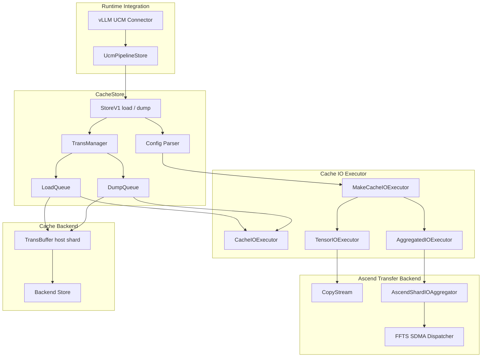

# UCM Cache IO Aggregation Design

## 摘要

Cache IO Aggregation 是 CacheStore transfer plane 中的一个可选数据搬运能力。它面向 shard 内包含大量 KV tensor entry 的场景，将原本多次小粒度 H2D / D2H copy 聚合为以 CacheStore shard 为单位的对象搬运，从而降低小 IO 的提交、调度和同步开销。

该能力对上层 StoreV1 API、vLLM connector、backend store 语义保持透明。用户只需要通过 `cache_io_aggregation` 控制是否启用。开启后，load 和 dump 使用同一套聚合策略：一个 CacheStore shard 对应一个 aggregation object。

## 目标

- 用一个清晰的用户开关同时覆盖 load 和 dump 的 IO 聚合。
- 保持 CacheStore 对外语义不变，避免把 Ascend FFTS 细节暴露给 vLLM connector 或业务配置。
- 将 IO 策略封装在 executor 层，避免 `LoadQueue` 和 `DumpQueue` 感知具体实现。
- 保持默认行为稳定，未显式开启时继续走逐 tensor 搬运路径。
- 在构建能力缺失时 fail fast，不做静默降级。
- 日志只保留每个 rank 的 load / dump summary，避免逐 tensor 或逐 object 日志刷屏。

## 非目标

- 不引入 object target bytes、动态 object size 选择或运行时自动策略切换。
- 不改变 CacheStore shard、TransBuffer、backend dump / load 的数据语义。
- 不改变上层 connector 的 block hash、hit / miss、request 生命周期逻辑。
- 不把 FFTS 作为用户可见的运行时模式名称。

## 用户配置

正式配置项只有一个：

```yaml
cache_io_aggregation: false
```

默认值为 `false`。

| 配置值 | 行为 |
| --- | --- |
| `false` | 不开启 IO 聚合，load / dump 都按 tensor entry 分段搬运 |
| `true` | 开启 IO 聚合，load / dump 都按 CacheStore shard 聚合搬运 |

为了兼容旧配置，当前实现仍会识别 `cache_h2d_transport: ffts_pipeline`。如果没有显式配置 `cache_io_aggregation`，旧配置会被归一化为 `cache_io_aggregation: true`。新配置和新文档只建议使用 `cache_io_aggregation`。

## 架构



### 分层职责

| 层级 | 职责 |
| --- | --- |
| vLLM UCM Connector | 生成 load / dump block 计划，提交给 UCM Store |
| UcmPipelineStore | 保持 StoreV1 API，透传 load / dump task |
| CacheStore | 管理 TransBuffer、任务队列、backend 读写和 wait 语义 |
| LoadQueue / DumpQueue | 负责任务调度、buffer 生命周期、failure propagation |
| CacheIOExecutor | 抽象 host shard 与 device tensor entries 之间的数据搬运 |
| TensorIOExecutor | 默认路径，按 tensor entry 分段 H2D / D2H |
| AggregatedIOExecutor | 聚合路径，按 CacheStore shard 执行对象级搬运 |
| AscendShardIOAggregator | Ascend 下的 staging buffer、event、stream 和 FFTS SDMA 编排 |

## 数据模型

CacheStore 的一个 shard 对应一个连续 host cache buffer。该 shard 内部由 `tensor_size_list` 描述为多个 tensor entry。无论是否开启 IO 聚合，逻辑数据模型不变：

```text
CacheStore shard
  host: one contiguous cache buffer
  device: multiple KV tensor entries
  sizes: tensor_size_list
```

IO 聚合只改变搬运方式，不改变 shard 内容、tensor entry 顺序、backend 可见的数据格式或 StoreV1 task 描述。

## Load 路径

未开启 IO 聚合时，load 逐 tensor entry 搬运：

```text
backend / host shard
  -> host cache buffer
  -> H2D per tensor entry
  -> device KV tensor entries
```

开启 IO 聚合后，load 以 shard 为对象搬运：

```text
backend / host shard
  -> host cache buffer
  -> one H2D staging copy
  -> device staging buffer
  -> device-side scatter
  -> device KV tensor entries
```

LoadQueue 只调用 `CacheIOExecutor::HostToDevice`，不感知底层是逐 tensor copy 还是聚合 object copy。

## Dump 路径

未开启 IO 聚合时，dump 逐 tensor entry 搬运：

```text
device KV tensor entries
  -> D2H per tensor entry
  -> host cache buffer
  -> backend / host shard
```

开启 IO 聚合后，dump 以 shard 为对象搬运：

```text
device KV tensor entries
  -> device-side gather
  -> device staging buffer
  -> one D2H staging copy
  -> host cache buffer
  -> backend / host shard
```

DumpQueue 只调用 `CacheIOExecutor::DeviceToHost`，不感知底层是逐 tensor copy 还是聚合 object copy。backend dump 仍然只看到完整的 contiguous host cache buffer。

## Executor 选择

`MakeCacheIOExecutor` 根据归一化后的 `cache_io_aggregation` 选择执行器：

```text
cache_io_aggregation = false
  -> TensorIOExecutor

cache_io_aggregation = true
  -> AggregatedIOExecutor
```

如果运行时开启 `cache_io_aggregation`，但构建产物没有启用 Ascend IO aggregation 能力，CacheStore setup 会直接失败：

```text
Cache IO aggregation is not compiled
```

这类错误应当在服务启动阶段暴露，不能静默 fallback 到默认路径。静默 fallback 会让性能测试和线上配置产生语义漂移。

## 构建开关

Ascend IO 聚合能力由构建开关控制：

```text
UCM_ENABLE_ASCEND_IO_AGGREGATION=ON
```

默认开启。开启后，Ascend transfer 组件会检查 FFTS 相关 header 和 runtime library，并编译聚合搬运所需的 Ascend 实现。关闭后，默认逐 tensor 路径仍可构建和运行，但运行时不能启用 `cache_io_aggregation`。

构建开关表示“能力是否被编译进二进制”，运行时配置表示“本次 CacheStore 是否使用该能力”。二者必须同时满足，聚合路径才会生效。

## 可靠性设计

### 默认关闭

`cache_io_aggregation` 默认关闭，确保未改配置的服务继续使用原有逐 tensor copy 路径。

### Fail Fast

以下情况应在 setup 阶段直接失败：

- 运行时开启 `cache_io_aggregation`，但构建产物未包含聚合能力。
- Ascend runtime、FFTS header 或 runtime library 缺失。
- `cache_io_aggregation_pipeline_depth` 或 `cache_io_aggregation_max_ready_lanes` 非法。

### 生命周期保持

IO 聚合不改变 TransBuffer handle 生命周期。load 必须等 host buffer 数据完成搬运后才能释放相关引用；dump 必须等 device gather 和 D2H 完成后才能 `MarkReady` 并提交 backend dump。

### 失败传播

LoadQueue 和 DumpQueue 继续维护现有 failure set 和 waiter 语义。executor 返回失败后，队列负责标记 task failure 并唤醒等待方。

### 队列隔离

LoadQueue 和 DumpQueue 各自创建自己的 `CacheIOExecutor` 实例。load / dump 不共享聚合器运行时对象，避免跨方向队列引入额外锁和生命周期耦合。

## 观测和日志

服务运行时只保留 rank 级 summary：

```text
[UCM_LOAD_PY] step=<n> rank_id=<rank> ... mode=<direct|fawa> total_ms=<ms> speed_gbps=<gbps>
[UCM_DUMP_PY] step=<n> rank_id=<rank> ... mode=<direct|fawa> total_ms=<ms> speed_gbps=<gbps>
```

推荐开关：

```bash
UCM_LOAD_TRACE=1
UCM_DUMP_TRACE=1
```

不建议默认打印每个 tensor、每个 object、每个 staging slot 或每个 FFTS descriptor 的详细耗时。这些信息适合作为临时调试日志，不适合作为服务常态日志。

## 使用示例

默认关闭：

```yaml
ucm_connectors:
  - ucm_connector_name: UcmPipelineStore
    ucm_connector_config:
      store_pipeline: Cache|Posix
      storage_backends: /mnt/cache
      cache_io_aggregation: false
```

开启 IO 聚合：

```yaml
ucm_connectors:
  - ucm_connector_name: UcmPipelineStore
    ucm_connector_config:
      store_pipeline: Cache|Posix
      storage_backends: /mnt/cache
      cache_io_aggregation: true
      cache_io_aggregation_pipeline_depth: 2
      cache_io_aggregation_max_ready_lanes: 8
```

`cache_io_aggregation_pipeline_depth` 和 `cache_io_aggregation_max_ready_lanes` 是底层 Ascend 聚合实现参数。正常服务配置只需要显式设置 `cache_io_aggregation`，其余参数使用默认值即可。

## 验证建议

正式验证至少覆盖以下场景：

| 场景 | 目的 |
| --- | --- |
| aggregation off load | 确认默认路径行为不变 |
| aggregation off dump | 确认默认 dump 行为不变 |
| aggregation on load | 确认聚合 load 数据正确 |
| aggregation on dump | 确认聚合 dump 数据正确 |
| dump then load | 确认 dump 后可被后续 load 正确读取 |
| FAWA / DeepSeek-V4 | 覆盖 shard 内 tensor entry 多的主要收益场景 |
| multi-rank summary | 确认每个 rank 输出 load / dump summary |
| build flag off | 确认开启运行时配置时 setup fail fast |

性能验证应同时比较：

```text
cache_io_aggregation: false
cache_io_aggregation: true
```

指标以每个 rank 的 load / dump wall time 和带宽 summary 为准。多 rank 场景下，端到端收益应重点观察慢 rank 的完成时间，而不是简单累加各 rank 带宽。

## 结论

Cache IO Aggregation 是 CacheStore transfer plane 的内部优化能力。它用一个用户可理解的配置项控制 load 和 dump 两个方向的聚合搬运，将 Ascend FFTS 相关细节收敛在 `AggregatedIOExecutor` 和 `AscendShardIOAggregator` 内部。

正式方案固定采用：

```text
one CacheStore shard = one aggregation object
```

这种设计保持了 StoreV1、CacheStore、backend 和 connector 的现有边界，同时让小 IO 优化具备明确的配置语义、构建边界、失败行为和可观测性。
