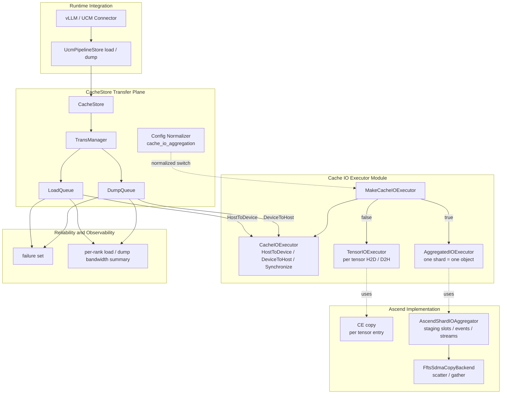

# UCM Cache IO Aggregation

## 背景

CacheStore 的 load 和 dump 都会在 host cache buffer 与 device KV tensor entries 之间搬运数据。

不开启 IO 聚合时，一个 CacheStore shard 内的每个 tensor entry 会分别发起一次 H2D 或 D2H copy。对于 DeepSeek-V4 / FAWA 这类 shard 内 tensor entry 较多的场景，小 IO 的提交和同步开销会比较明显。

Cache IO Aggregation 的目标是把一个 CacheStore shard 作为一个聚合对象：

```text
load: host cache buffer -> one H2D object -> device-side scatter -> device KV tensor entries
dump: device KV tensor entries -> device-side gather -> one D2H object -> host cache buffer
```

对用户来说，这不是 FFTS 功能，也不是 CE 模式切换，而是 CacheStore 的 IO 聚合开关。

## 用户配置

正式配置只有一个：

```text
cache_io_aggregation = false | true
```

默认值：

```text
cache_io_aggregation = false
```

配置语义：

| 配置值 | 行为 |
| --- | --- |
| `false` | 不开启 IO 聚合，load / dump 都按 tensor entry 分段搬运 |
| `true` | 开启 IO 聚合，load / dump 都按 CacheStore shard 聚合搬运 |

兼容旧配置：

```text
cache_h2d_transport = ffts_pipeline
```

如果没有显式配置 `cache_io_aggregation`，旧配置 `cache_h2d_transport = ffts_pipeline` 会被归一化为：

```text
cache_io_aggregation = true
```

新启动模板和新文档只建议使用 `cache_io_aggregation`。

## 架构图



## 实现方案

### 配置归一化

`CacheStore::ParseConfig` 读取 `cache_io_aggregation`，并兼容旧的 H2D 配置。

内部配置字段：

```text
cacheIOAggregation
```

启动日志只打印归一化后的新语义：

```text
CacheIOAggregation = false
```

或：

```text
CacheIOAggregation = true
AggregationObject = CacheStoreShard
```

### Executor 抽象

IO 聚合策略不放在 `LoadQueue` 或 `DumpQueue` 里。两条队列只依赖统一接口：

```text
CacheIOExecutor
  Setup(config)
  WaitEvent(event)
  HostToDevice(host, devices)
  DeviceToHost(devices, host)
  Synchronize()
```

具体实现：

| 实现 | 行为 |
| --- | --- |
| `TensorIOExecutor` | 当前默认路径，按 tensor entry 分别 H2D / D2H |
| `AggregatedIOExecutor` | 聚合路径，按 CacheStore shard 做一个聚合 object |

`LoadQueue` 只调用：

```text
executor->HostToDevice(handle.Data(), shard.addrs.data())
```

`DumpQueue` 只调用：

```text
executor->DeviceToHost(shard.addrs.data(), handle.Data())
```

这样 Queue 继续只负责任务生命周期、waiter、failure set、TransBuffer ready 语义和 backend 提交，不直接感知 tensor 路径或聚合路径。

### Load 路径

不开启聚合：

```text
host cache buffer
  -> H2D per tensor entry
  -> device KV tensor entries
```

开启聚合：

```text
host cache buffer
  -> one large H2D copy
  -> device staging buffer
  -> FFTS SDMA scatter
  -> device KV tensor entries
```

聚合对象固定为：

```text
one CacheStore shard = one load aggregation object
```

### Dump 路径

不开启聚合：

```text
device KV tensor entries
  -> D2H per tensor entry
  -> host cache buffer
```

开启聚合：

```text
device KV tensor entries
  -> FFTS SDMA gather
  -> device staging buffer
  -> one large D2H copy
  -> host cache buffer
```

聚合对象固定为：

```text
one CacheStore shard = one dump aggregation object
```

Dump 路径不改变 backend 语义。Backend dump 仍然只看到原来的 contiguous host cache buffer。`TransBuffer::Handle::MarkReady` 仍然必须等 device gather 和 D2H 都完成后再执行。

### Ascend 聚合器

Ascend 聚合实现由 `AscendShardIOAggregator` 承接：

```text
AscendShardIOAggregator
  SubmitLoadObject(host, devices, sizes)
  SubmitDumpObject(devices, host, sizes)
  Synchronize()
```

Load 和 Dump 共用同一套代码模型：

```text
staging buffer pool
copy stream
FFTS stream
slot ready / free events
FFTS SDMA descriptor backend
```

但两个队列各自创建自己的 `CacheIOExecutor` 实例，不共享运行时对象，避免新增跨队列锁和生命周期耦合。

## 代码结构

Store 层：

```text
ucm/store/cache/cc/cache_io_executor.h
ucm/store/cache/cc/cache_io_executor.cc
ucm/store/cache/cc/load_queue.cc
ucm/store/cache/cc/dump_queue.cc
ucm/store/cache/cc/cache_store.cc
ucm/store/cache/cc/global_config.h
```

Ascend trans 层：

```text
ucm/shared/trans/ascend/ascend_shard_io_aggregator.h
ucm/shared/trans/ascend/ascend_shard_io_aggregator.cc
ucm/shared/trans/ascend/ffts_d2d_dispatcher.h
ucm/shared/trans/ascend/ffts_d2d_dispatcher.cc
```

构建接入：

```text
ucm/shared/trans/ascend/CMakeLists.txt
```

## 如何使用

### 默认关闭

不配置时默认关闭：

```text
cache_io_aggregation = false
```

等价于当前按 tensor entry 分段搬运的路径。

### 开启 IO 聚合

在 CacheStore 配置中增加：

```text
cache_io_aggregation = true
```

示例：

```python
config = {
    "store_backend": backend,
    "unique_id": unique_id,
    "device_id": device_id,
    "shard_size": shard_size,
    "block_size": block_size,
    "tensor_size_list": tensor_size_list,
    "cache_io_aggregation": True,
}
```

开启后，load 和 dump 同时走 Cache IO 聚合。

### 构建要求

开启 `cache_io_aggregation = true` 需要构建时启用 Ascend FFTS 支持：

```text
UCM_ENABLE_ASCEND_IO_AGGREGATION = ON
```

运行环境需要可用的 Ascend runtime 和 FFTS Plus 相关头文件 / runtime library。

如果显式开启聚合但构建或运行环境不支持，CacheStore setup 会 fail fast，不做静默回退。

### 显式回退

如果需要回退到默认路径，显式配置：

```text
cache_io_aggregation = false
```

## 日志和观测

启动阶段应看到归一化后的配置：

```text
CacheIOAggregation = true
AggregationObject = CacheStoreShard
```

运行阶段只保留每个 rank 的 summary。Load 和 Dump 分别打印耗时和带宽：

```text
rank=0 load_ms=37.8 load_bandwidth_gbps=132.2
rank=0 dump_ms=42.1 dump_bandwidth_gbps=118.7
```

不建议打印每个 object、每个 stage、每个 tensor entry 的 timing，避免服务日志被小 IO 明细刷屏。

## 验证建议

建议最小验证矩阵：

```text
cache_io_aggregation = false
cache_io_aggregation = true
```

覆盖场景：

```text
load correctness
dump correctness
dump after load
load after dump
FAWA / DSV4
multi-rank summary
backend wait failure propagation
explicit aggregation off fallback
```

正式方案不引入 object target bytes，不做 object size sweep，不做运行时自动策略选择。load 和 dump 都固定为：

```text
one CacheStore shard = one aggregation object
```
